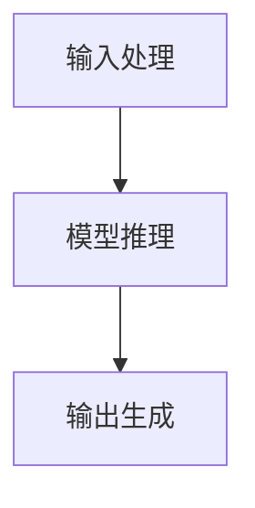

                 


# LLM大模型简介与应用

**关键词**：大语言模型、自然语言处理、深度学习、人工智能、机器学习、文本生成、问答系统

**摘要**：  
本文全面介绍大语言模型（LLM）的基本概念、技术原理及其在自然语言处理中的广泛应用。通过详细分析其核心算法、系统架构和应用场景，探讨LLM的优势与挑战，并展望其未来发展方向。文章内容包括模型概述、技术基础、应用场景、系统架构和项目实战，旨在为读者提供深入的技术洞察和实践指导。

---

## 第1章: LLM大模型概述

### 1.1 LLM大模型的背景与概念

#### 1.1.1 大语言模型的起源与发展
大语言模型（Large Language Model, LLM）起源于自然语言处理领域，旨在通过深度学习技术理解和生成人类语言。自2018年以来，随着计算能力的提升和大数据的广泛应用，LLM经历了从词嵌入模型到序列模型的演进，最终发展为基于Transformer架构的预训练模型。

#### 1.1.2 LLM的核心概念与定义
LLM是一种基于深度学习的模型，通过大量文本数据的预训练，能够理解上下文并生成连贯的文本。其核心在于使用Transformer架构，通过自注意力机制捕捉语言中的长距离依赖关系。

#### 1.1.3 LLM与传统NLP模型的对比
| 特性 | LLM | 传统NLP模型 |
|------|------|--------------|
| 模型结构 | 基于Transformer | 基于RNN/LSTM |
| 参数规模 | 大型或超大规模 | 中小规模 |
| 上下文处理能力 | 强大 | 较弱 |

### 1.2 LLM的原理与技术基础

#### 1.2.1 变压器架构的简介
Transformer由编码器和解码器组成，编码器负责将输入序列编码为向量，解码器负责根据编码结果生成输出序列。其核心在于多头注意力机制，通过并行计算捕捉全局上下文信息。

#### 1.2.2 注意力机制的数学模型
注意力机制的计算公式如下：
$$
\text{Attention}(Q, K, V) = \text{softmax}\left(\frac{QK^T}{\sqrt{d_k}}\right)V
$$
其中，$Q$、$K$、$V$分别为查询、键和值矩阵，$d_k$为键的维度。

#### 1.2.3 深度学习的基本原理
深度学习通过多层神经网络提取数据的高层次特征，LLM利用这些特征进行文本的理解和生成。

### 1.3 LLM的应用场景与潜力

#### 1.3.1 自然语言处理的典型应用
LLM广泛应用于文本生成、机器翻译、问答系统等领域，能够处理复杂的语言任务。

#### 1.3.2 LLM在企业级应用中的优势
LLM能够提升企业内部沟通效率，优化客户服务，提供智能支持。

#### 1.3.3 LLM的未来发展趋势
随着模型规模的扩大和算法的优化，LLM将具备更强的理解和生成能力，应用场景也将进一步扩展。

## 第2章: LLM的模型架构与训练方法

### 2.1 模型架构的详细分析

#### 2.1.1 变压器模型的结构分解
Transformer模型由编码器和解码器组成，每个部分包含多个层，每层包括多头注意力和前馈网络。

#### 2.1.2 编码器与解码器的工作原理
编码器将输入序列转换为上下文向量，解码器根据这些向量生成输出序列。

#### 2.1.3 多头注意力机制的实现细节
多头注意力机制通过并行处理多个子空间的注意力，提升模型的表达能力。

### 2.2 LLM的训练过程与优化策略

#### 2.2.1 预训练的目标函数
预训练目标通常是最小化生成概率的负对数似然：
$$
\mathcal{L} = -\sum_{i=1}^{N}\log p(\text{token}_i)
$$

#### 2.2.2 优化算法的选择与调整
常用的优化算法包括Adam、SGD等，选择合适的参数设置和学习率调度策略能够提升训练效果。

#### 2.2.3 模型压缩与推理优化
通过模型剪枝、知识蒸馏等技术，可以在保持性能的同时减少模型体积，提升推理速度。

### 2.3 LLM的评估与基准测试

#### 2.3.1 常用的评估指标
- 分词准确率（Word Accuracy）
- 生成文本的BLEU分数
- ROUGE评分

#### 2.3.2 基准测试的流程与方法
通过标准化测试集评估模型的性能，常用的数据集包括GLUE、SQuAD等。

#### 2.3.3 模型性能的提升策略
通过调整模型结构、优化训练策略和增加数据多样性，可以提升模型的性能。

## 第3章: LLM在自然语言处理中的应用

### 3.1 文本生成与内容创作

#### 3.1.1 基于LLM的文本生成流程
输入种子文本，模型生成后续内容，适用于新闻报道、文学创作等场景。

#### 3.1.2 内容创作的优化策略
通过调优模型参数和设定约束条件，可以生成符合特定风格的内容。

#### 3.1.3 应用案例分析
例如，使用LLM生成技术文档，提升内容创作效率。

### 3.2 问答系统与对话生成

#### 3.2.1 基于LLM的问答系统设计
模型能够理解问题并生成准确的回答，适用于智能客服等领域。

#### 3.2.2 对话生成的实现细节
通过维护对话上下文，模型能够生成连贯的对话内容。

#### 3.2.3 实际应用中的挑战与解决方案
解决长对话中的信息遗忘问题，可以通过引入记忆机制或更大规模的模型来提升表现。

### 3.3 情感分析与文本分类

#### 3.3.1 LLM在情感分析中的应用
模型能够分析文本情感，应用于社交媒体监控等领域。

#### 3.3.2 文本分类的实现流程
通过特征提取和分类器训练，模型能够准确分类文本内容。

#### 3.3.3 案例分析与效果评估
例如，分析电影评论的情感倾向，并评估分类效果。

## 第4章: LLM大模型的系统架构与实现

### 4.1 系统设计的总体思路

#### 4.1.1 系统模块划分
- 输入处理模块
- 模型推理模块
- 输出生成模块

#### 4.1.2 各模块之间的交互关系
输入文本经过处理后，模型生成输出，实现端到端的处理流程。

### 4.2 系统架构设计

#### 4.2.1 系统架构的ER实体关系图


#### 4.2.2 系统架构的流程图


#### 4.2.3 系统接口设计
- 输入接口：接收文本输入
- 输出接口：返回生成文本或结果

### 4.3 系统实现细节

#### 4.3.1 环境安装
安装必要的库，如TensorFlow、PyTorch等。

#### 4.3.2 核心实现代码
```python
import torch
from transformers import AutoModelForMaskedLM, AutoTokenizer

model_name = 'bert-base-chinese'
model = AutoModelForMaskedLM.from_pretrained(model_name)
tokenizer = AutoTokenizer.from_pretrained(model_name)

def generate_text(prompt):
    inputs = tokenizer.encode_plus(prompt, return_tensors='pt', max_length=50, truncation=True)
    outputs = model.generate(inputs.input_ids, max_length=50)
    return tokenizer.decode(outputs[0].tolist())

print(generate_text("这是一个测试"))
```

## 第5章: 项目实战

### 5.1 环境配置与安装

#### 5.1.1 安装必要的库
```bash
pip install transformers torch
```

### 5.2 核心实现代码

#### 5.2.1 文本生成代码
```python
from transformers import GPT2LMHeadModel, GPT2Tokenizer

model_name = 'gpt2'
tokenizer = GPT2Tokenizer.from_pretrained(model_name)
model = GPT2LMHeadModel.from_pretrained(model_name)

def generate_text(prompt):
    inputs = tokenizer.encode(prompt, return_tensors='pt')
    outputs = model.generate(inputs, max_length=50, temperature=0.7)
    return tokenizer.decode(outputs[0], skip_special_tokens=True)

print(generate_text("告诉我一个故事。"))
```

### 5.3 案例分析与代码解读

#### 5.3.1 生成结果分析
通过调整温度参数，可以控制生成文本的创造性与稳定性。

#### 5.3.2 案例小结
通过实现简单的文本生成任务，验证LLM的基本功能和应用潜力。

## 第6章: 总结与展望

### 6.1 本章总结
本文全面介绍了LLM的基本概念、技术原理和应用场景，通过具体案例展示了其强大的生成能力。

### 6.2 未来发展方向
- 模型优化与压缩
- 多模态能力的增强
- 更高效推理算法的研究

### 6.3 最佳实践 Tips
- 合理选择模型规模与参数
- 根据需求调整超参数
- 重视数据质量和多样性

---

**作者：AI天才研究院/AI Genius Institute & 禅与计算机程序设计艺术 /Zen And The Art of Computer Programming**

