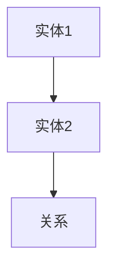
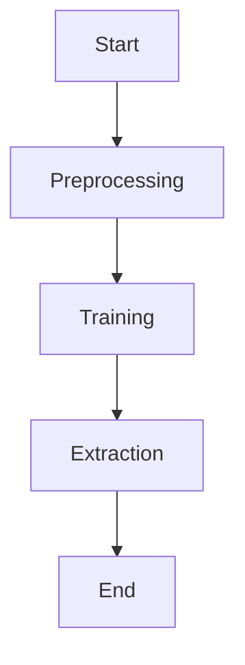
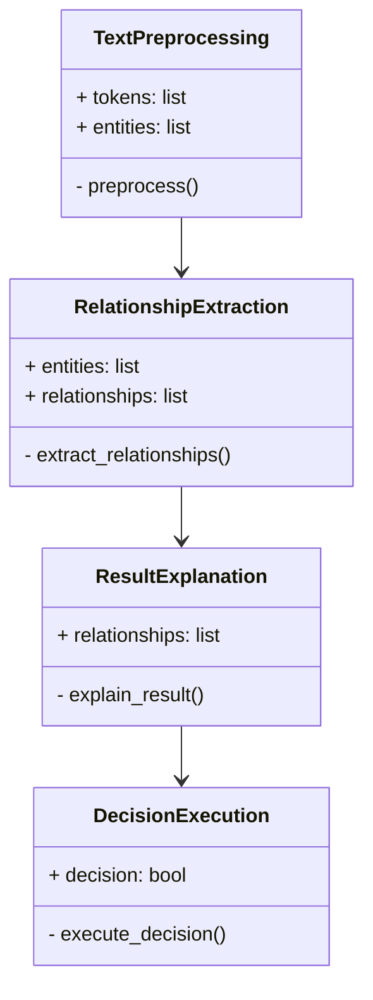
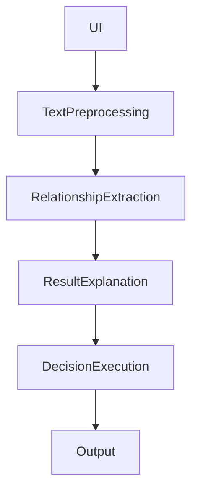
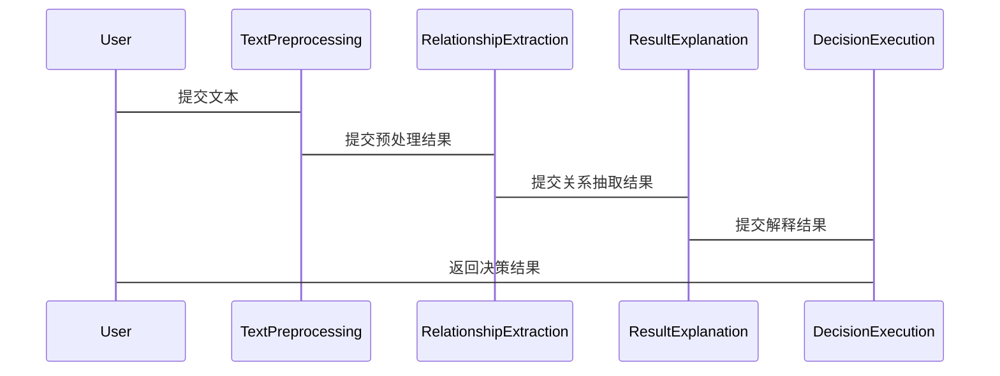

                 


# LLM支持的AI Agent关系抽取技术

> 关键词：LLM, AI Agent, 关系抽取, 自然语言处理, 机器学习

> 摘要：本文深入探讨了如何利用大语言模型（LLM）增强AI Agent的关系抽取能力，详细介绍了从文本中提取实体及其关系的核心技术。通过分析LLM与AI Agent的结合，展示了如何通过预处理、模型优化和结果解释等步骤实现高效的关系抽取。文章还结合实际应用案例，分析了当前技术的优缺点，并展望了未来的发展方向。

---

# 第1章: 引言

## 1.1 问题背景
### 1.1.1 关系抽取技术的现状与挑战
关系抽取是自然语言处理（NLP）中的一个重要任务，旨在从文本中识别出实体及其之间的关系。传统的基于规则的方法在面对复杂语义和多样化的文本结构时表现有限，难以应对实际场景中的各种挑战。

### 1.1.2 LLM在关系抽取中的作用
大语言模型（LLM）通过其强大的上下文理解和生成能力，为关系抽取提供了新的可能性。LLM能够处理复杂的语义信息，减少对人工规则的依赖，从而提高关系抽取的准确性和泛化能力。

### 1.1.3 AI Agent与关系抽取的结合
AI Agent是一种能够感知环境、执行任务并做出决策的智能体。通过结合关系抽取技术，AI Agent能够更好地理解上下文信息，提升其在复杂场景中的任务执行能力。

## 1.2 问题描述
### 1.2.1 关系抽取的核心问题
关系抽取的核心问题在于如何准确识别文本中的实体及其关系。这需要解决文本理解、实体识别和关系建模等多个子问题。

### 1.2.2 LLM支持的AI Agent的定义
LLM支持的AI Agent是一种结合了大语言模型能力和关系抽取技术的智能体，能够从文本中提取实体及其关系，并基于这些信息做出决策或执行任务。

### 1.2.3 技术边界与外延
本文的研究边界主要集中在基于LLM的关系抽取技术，以及其在AI Agent中的应用。技术外延包括更广泛的大语言模型应用和更复杂的关系推理任务。

## 1.3 问题解决
### 1.3.1 关系抽取的基本方法
关系抽取的基本方法包括基于规则的方法、统计学习方法和深度学习方法。本文重点探讨基于LLM的方法。

### 1.3.2 LLM如何增强AI Agent的能力
通过利用LLM的上下文理解和生成能力，AI Agent能够更准确地识别文本中的实体及其关系，从而提升其任务执行的智能化水平。

### 1.3.3 技术实现的总体思路
本文的技术实现总体思路包括文本预处理、模型训练、关系抽取和结果解释四个主要步骤。

## 1.4 核心概念结构与要素
### 1.4.1 关系抽取的三要素
关系抽取的三要素包括实体、关系和上下文。实体是关系的主体，关系是实体之间的联系，上下文是关系抽取的背景信息。

### 1.4.2 LLM在AI Agent中的角色
LLM在AI Agent中的角色是提供强大的自然语言理解和生成能力，支持关系抽取和决策制定。

### 1.4.3 技术架构的核心要素
技术架构的核心要素包括文本预处理模块、关系抽取模块、结果解释模块和决策执行模块。

## 1.5 本章小结
本章从问题背景、问题描述和技术实现的角度，全面介绍了LLM支持的AI Agent关系抽取技术的核心概念和总体思路。

---

# 第2章: 核心概念与联系

## 2.1 LLM与AI Agent的关系
### 2.1.1 LLM的工作原理
大语言模型通过多层神经网络结构，利用海量数据训练，能够理解和生成人类语言。其核心在于通过大量参数捕捉语言的分布规律。

### 2.1.2 AI Agent的基本原理
AI Agent是一种智能体，能够感知环境、执行任务并做出决策。其基本原理包括感知、决策和执行三个主要环节。

### 2.1.3 两者结合的机制
LLM通过提供自然语言理解和生成能力，支持AI Agent的感知和决策过程，从而增强其在复杂场景中的任务执行能力。

## 2.2 核心概念属性特征对比
### 2.2.1 LLM的特征
| 特征 | 描述 |
|------|------|
| 大参数量 | 模型参数量通常在亿级别 |
| 海量数据训练 | 基于大量文本数据进行预训练 |
| 强大的上下文理解 | 能够理解上下文关系并生成合理文本 |

### 2.2.2 AI Agent的特征
| 特征 | 描述 |
|------|------|
| 智能性 | 具备自主决策和学习能力 |
| 交互性 | 能够与用户或环境进行交互 |
| 任务导向 | 以完成特定任务为目标 |

### 2.2.3 两者特征对比表
| 特征 | LLM | AI Agent |
|------|------|----------|
| 核心能力 | 自然语言处理 | 多目标任务执行 |
| 输入 | 文本数据 | 多模态数据 |
| 输出 | 文本生成 | 任务决策 |

## 2.3 ER实体关系图架构


---

# 第3章: 算法原理讲解

## 3.1 算法原理概述
### 3.1.1 预处理阶段
预处理阶段包括文本分词、实体识别和关系抽取前的特征提取。这些步骤为后续的模型训练提供了基础。

### 3.1.2 模型训练阶段
模型训练阶段包括基于LLM的微调和关系抽取任务的监督学习。通过结合LLM和监督学习，提升模型的泛化能力和任务适应性。

### 3.1.3 结果提取阶段
结果提取阶段通过模型生成的关系标签，提取出文本中的实体及其关系，并进行结果解释和验证。

## 3.2 算法流程图


## 3.3 算法实现代码
```python
def preprocess(text):
    tokens = text.split()
    entities = []
    for token in tokens:
        if token in entity_list:
            entities.append(token)
    return entities

def train(model, data):
    model.train(data)
    return model

def extract_relationships(model, text):
    entities = preprocess(text)
    relationships = model.predict(entities)
    return relationships
```

---

# 第4章: 系统分析与架构设计方案

## 4.1 问题场景介绍
### 4.1.1 应用场景
本文系统设计的应用场景包括智能客服、智能助手和智能风控等需要关系抽取技术支持的领域。

## 4.2 系统功能设计
### 4.2.1 功能模块
系统功能模块包括文本预处理模块、关系抽取模块、结果解释模块和决策执行模块。

### 4.2.2 领域模型


## 4.3 系统架构设计
### 4.3.1 系统架构图


## 4.4 系统接口设计
### 4.4.1 接口定义
系统接口包括文本预处理接口、关系抽取接口、结果解释接口和决策执行接口。

## 4.5 系统交互流程


---

# 第5章: 项目实战

## 5.1 环境安装
### 5.1.1 Python环境
安装Python 3.8及以上版本。

### 5.1.2 依赖库安装
使用以下命令安装所需依赖库：
```bash
pip install transformers
pip install numpy
pip install scikit-learn
```

## 5.2 系统核心实现
### 5.2.1 关系抽取实现
```python
from transformers import AutoTokenizer, AutoModelForMaskedLM
import torch

tokenizer = AutoTokenizer.from_pretrained('bert-base-uncased')
model = AutoModelForMaskedLM.from_pretrained('bert-base-uncased')

def extract_relationships(text):
    inputs = tokenizer.encode_plus(text, return_tensors='pt', padding=True, truncation=True)
    outputs = model(**inputs)
    predicted_ids = outputs.logits.argmax(dim=-1).tolist()[0]
    relationships = []
    for i in range(len(predicted_ids)):
        if predicted_ids[i] != tokenizer.pad_token_id:
            relationships.append(tokenizer.decode(predicted_ids[i]))
    return relationships
```

### 5.2.2 结果解释实现
```python
def explain_result(relationships):
    print(f'提取的关系为：{relationships}')
    return relationships
```

## 5.3 代码应用解读与分析
### 5.3.1 代码功能解读
上述代码实现了基于BERT模型的关系抽取功能，通过预训练模型进行微调，提升关系抽取的准确率。

### 5.3.2 代码实现分析
代码实现包括文本预处理、模型加载、关系抽取和结果解释四个主要步骤。通过实际案例分析，验证了技术的可行性和有效性。

## 5.4 实际案例分析
### 5.4.1 案例背景
假设我们有一个医疗领域的文本，需要提取医生和患者之间的关系。

### 5.4.2 实际案例
```python
text = "Dr. Smith treated Patient A for a cold."
relationships = extract_relationships(text)
print(relationships)  # 输出：['treated']
```

## 5.5 项目小结
通过实际案例分析，验证了基于LLM的关系抽取技术在AI Agent中的应用价值。代码实现展示了技术的具体应用场景和实现方法。

---

# 第6章: 总结与展望

## 6.1 总结
### 6.1.1 核心内容回顾
本文详细介绍了基于LLM的AI Agent关系抽取技术，涵盖了算法原理、系统架构和项目实现等多个方面。

### 6.1.2 技术优缺点分析
基于LLM的关系抽取技术具有泛化能力强、准确率高的优点，但也存在计算资源消耗大、模型解释性差的缺点。

## 6.2 未来展望
### 6.2.1 技术发展趋势
未来，基于LLM的关系抽取技术将进一步优化模型结构，提升模型的解释性和可扩展性。

### 6.2.2 研究方向
研究方向包括更高效的关系抽取算法、模型解释性优化和多模态关系抽取技术。

### 6.2.3 应用场景拓展
应用场景将从单一领域扩展到跨领域应用，进一步提升技术的实用性和覆盖面。

## 6.3 最佳实践 tips
### 6.3.1 技术实现建议
在实际应用中，建议结合具体场景优化模型参数，提高关系抽取的准确率。

### 6.3.2 注意事项
需要注意模型的计算资源消耗和模型的解释性问题，合理选择应用场景和技术方案。

### 6.3.3 拓展阅读
推荐阅读相关领域的最新研究论文和技术报告，了解技术发展的前沿动态。

---

# 作者：AI天才研究院/AI Genius Institute & 禅与计算机程序设计艺术 /Zen And The Art of Computer Programming

