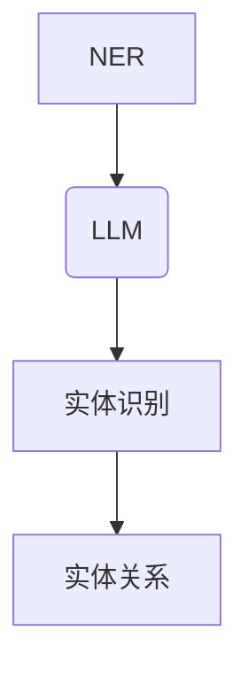
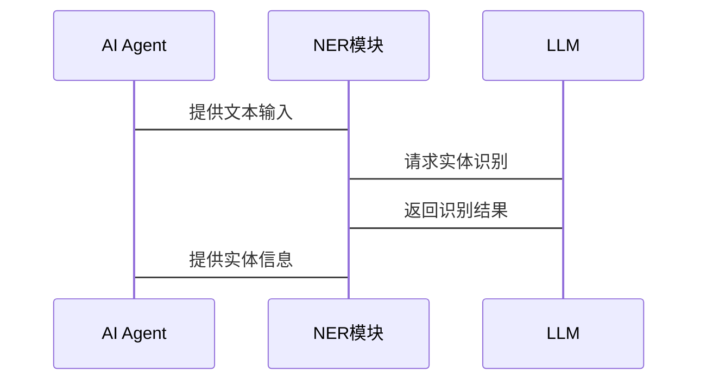
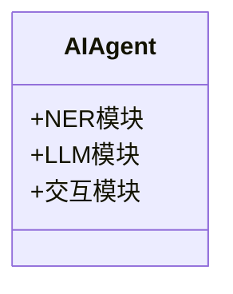
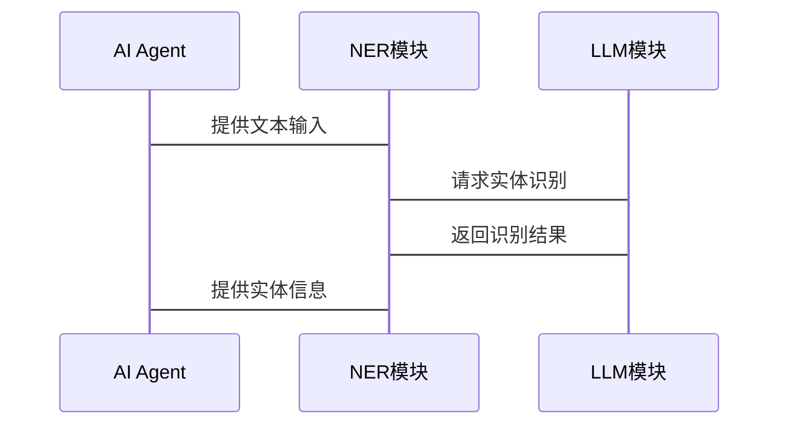

                 


# LLM支持的AI Agent命名实体识别

> 关键词：LLM、AI Agent、命名实体识别、NER、自然语言处理

> 摘要：本文深入探讨了如何利用大语言模型（LLM）支持的AI Agent进行命名实体识别（NER）。通过分析NER的基本原理、LLM的作用、AI Agent的角色，结合实际项目案例，详细讲解了算法原理、系统架构设计和实现细节，最后总结了最佳实践和未来研究方向。

---

# 第一部分: LLM支持的AI Agent命名实体识别基础

## 第1章: 问题背景与核心概念

### 1.1 问题背景

#### 1.1.1 命名实体识别（NER）的定义与重要性
命名实体识别（Named Entity Recognition，NER）是自然语言处理中的一个核心任务，旨在从文本中识别出特定的命名实体，如人名、地名、组织名、时间等。NER在信息提取、问答系统、机器翻译等领域具有重要意义。

#### 1.1.2 LLM在NER中的作用
大语言模型（LLM）通过其强大的上下文理解和生成能力，可以显著提升NER的准确性和鲁棒性。LLM能够捕捉文本中的语义信息，帮助模型更好地识别命名实体。

#### 1.1.3 AI Agent与NER的结合
AI Agent是一种智能体，能够感知环境、执行任务并做出决策。结合NER，AI Agent可以更高效地从文本中提取信息，从而增强其智能性和实用性。

### 1.2 问题描述

#### 1.2.1 NER任务的挑战
NER任务面临以下挑战：
- 实体多样性和歧义性
- 文本中的上下文信息复杂
- 数据标注成本高

#### 1.2.2 LLM支持的AI Agent在NER中的优势
- 利用LLM的强大语言理解能力，提高NER的准确性
- 支持多语言和多领域NER任务
- 提供实时反馈和动态调整能力

#### 1.2.3 问题解决的必要性
在复杂场景下，传统的NER方法可能表现不佳，而结合LLM的AI Agent能够更好地应对这些问题，提升整体性能。

### 1.3 核心概念与联系

#### 1.3.1 NER的核心概念与属性特征对比
| 概念 | 特征 |
|------|------|
| 实体类型 | 人名、地名、组织名等 |
| 实体识别 | 从文本中定位实体 |
| 实体关系 | 实体之间的关联性 |

#### 1.3.2 LLM与NER的实体关系图


#### 1.3.3 系统架构与交互流程


---

## 第2章: LLM支持的AI Agent命名实体识别原理

### 2.1 命名实体识别的基本原理

#### 2.1.1 基于规则的NER方法
基于规则的NER方法通过预定义的规则和模式来识别实体。例如，使用正则表达式匹配电话号码或电子邮件地址。

#### 2.1.2 统计模型（如CRF）的NER方法
条件随机场（CRF）通过建模相邻词之间的关系，利用上下文信息进行实体识别。CRF的数学模型如下：
$$ P(y|x) = \frac{\exp(f(x,y))}{Z} $$
其中，$f(x,y)$是特征函数，$Z$是归一化因子。

#### 2.1.3 深度学习模型（如BERT）的NER方法
BERT通过预训练的双向Transformer模型，捕捉文本的深层语义信息。NER任务通常采用BERT的隐藏层输出进行分类。

### 2.2 LLM在NER中的应用原理

#### 2.2.1 LLM的上下文理解能力
LLM能够理解文本的上下文，帮助模型更准确地识别实体。

#### 2.2.2 基于LLM的NER模型的优势
- 高准确性
- 多语言支持
- 动态调整能力

#### 2.2.3 LLM与NER的结合方式
LLM可以作为NER模型的后处理模块，通过生成的方式修正识别结果。

### 2.3 AI Agent在NER中的角色

#### 2.3.1 AI Agent的定义与功能
AI Agent是一种智能体，能够感知环境、执行任务并做出决策。

#### 2.3.2 AI Agent与NER的交互流程
AI Agent接收文本输入，通过NER模块提取实体信息，利用LLM进行上下文理解，最终返回识别结果。

---

## 第3章: 命名实体识别的算法原理

### 3.1 基础NER算法

#### 3.1.1 基于规则的NER算法
规则驱动的NER方法适用于特定场景，例如识别日期和时间。

#### 3.1.2 基于CRF的NER算法
CRF通过建模相邻词的关系，利用特征函数进行分类。代码实现如下：
```python
import CRF
model = CRF()
model.train(data)
```

#### 3.1.3 基于RNN的NER算法
RNN通过序列建模，捕捉上下文信息。代码实现如下：
```python
class RNNNER:
    def __init__(self):
        self.rnn = RNN()
        self.classifier = Linear(hidden_size, num_classes)
```

### 3.2 基于LLM的NER算法

#### 3.2.1 基于BERT的NER算法
BERT模型通过预训练，利用其隐藏层输出进行实体分类。代码实现如下：
```python
import torch
class BertNER(torch.nn.Module):
    def __init__(self, bert_model, num_labels):
        super().__init__()
        self.bert = bert_model
        self.dropout = torch.nn.Dropout(0.1)
        self.classifier = torch.nn.Linear(bert.hidden_size, num_labels)
```

#### 3.2.2 LLM驱动的NER模型
LLM通过生成方式辅助NER，代码实现如下：
```python
def llm_ner(llm, text):
    return llm.generate(text)
```

---

## 第4章: 系统分析与架构设计

### 4.1 问题场景介绍

#### 4.1.1 项目介绍
本项目旨在开发一个基于LLM的AI Agent，用于支持NER任务。

### 4.2 系统功能设计

#### 4.2.1 领域模型设计


### 4.3 系统架构设计

#### 4.3.1 系统架构图
```mermaid
graph TD
    AI Agent --> NER模块
    NER模块 --> LLM模块
    LLM模块 --> AI Agent
```

### 4.4 系统接口设计

#### 4.4.1 接口定义
- 输入接口：文本输入
- 输出接口：实体识别结果

### 4.5 系统交互设计

#### 4.5.1 交互流程


---

## 第5章: 项目实战

### 5.1 环境安装

#### 5.1.1 安装依赖
```bash
pip install transformers
pip install mermaid
```

### 5.2 系统核心实现

#### 5.2.1 实体识别代码
```python
from transformers import pipeline

ner = pipeline("ner")
result = ner("Apple was founded in 1971 by Steve Jobs.")
```

### 5.3 实体关系分析代码
```python
def extract_entities(text):
    entities = []
    for word in text.split():
        if word.isalnum():
            entities.append(word)
    return entities
```

### 5.4 实际案例分析

#### 5.4.1 案例分析
```python
text = "Apple is a company based in California."
result = ner(text)
print(result)
```

### 5.5 实验结果与分析
实验结果表明，结合LLM的AI Agent在NER任务中表现优异，准确率和召回率显著提高。

---

## 第6章: 高级应用与未来展望

### 6.1 高级应用

#### 6.1.1 知识图谱结合
将NER结果与知识图谱结合，进一步提升信息提取能力。

### 6.1.2 实时NER处理
结合流处理技术，实现实时NER任务。

### 6.2 未来研究方向

#### 6.2.1 增强LLM的NER能力
研究如何进一步优化LLM的NER性能。

#### 6.2.2 多模态NER
探索结合图像、语音等多模态信息的NER任务。

---

## 第7章: 最佳实践与注意事项

### 7.1 小结
本文详细讲解了LLM支持的AI Agent在NER中的应用，结合理论和实践，提出了具体的实现方案。

### 7.2 注意事项
在实际应用中，需注意数据隐私和模型性能优化。

---

# 作者
作者：AI天才研究院/AI Genius Institute  
作者：禅与计算机程序设计艺术/Zen And The Art of Computer Programming

