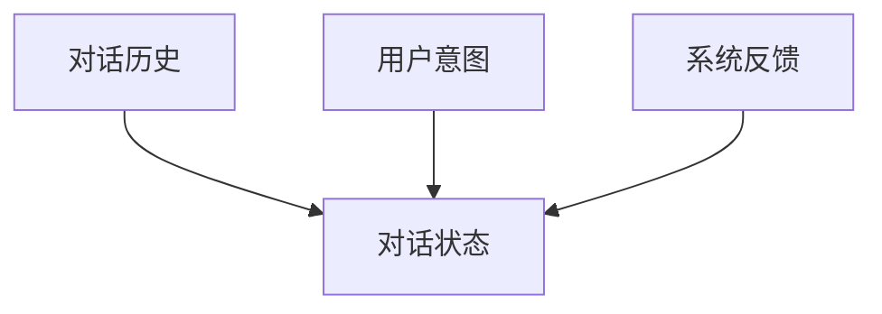
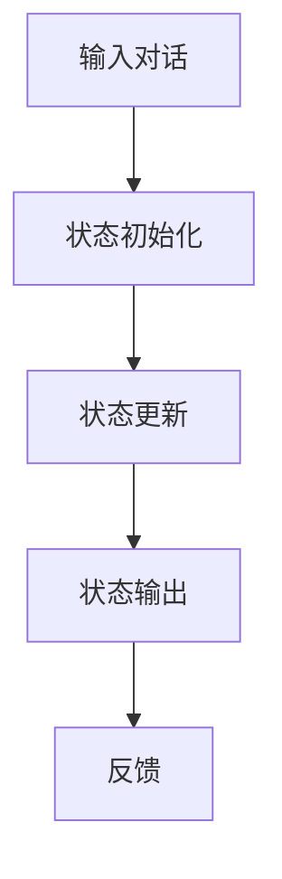
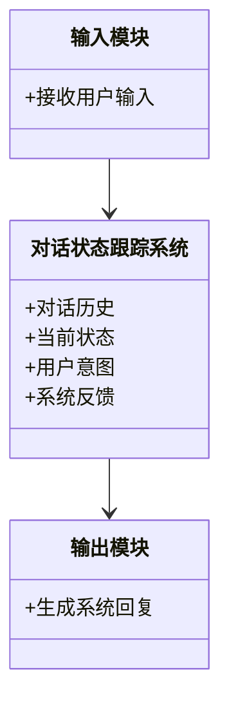
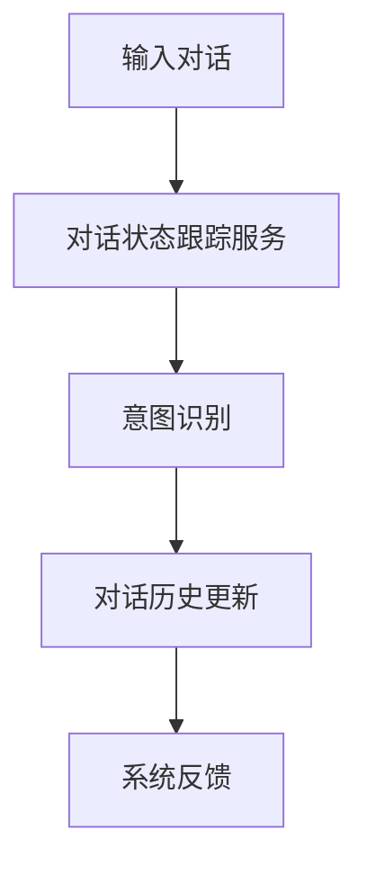

                 


# LLM支持的AI Agent对话状态跟踪

> **关键词**：LLM, AI Agent, 对话状态跟踪, 隐马尔可夫模型, 深度学习, 对话系统, 自然语言处理

> **摘要**：本文深入探讨了在LLM支持的AI Agent中实现对话状态跟踪的关键技术。从背景介绍到核心概念，再到算法原理和系统架构，文章详细分析了对话状态跟踪的重要性、实现方法及实际应用。通过结合HMM和DNN模型，本文提供了丰富的理论和实践指导，帮助读者理解如何构建高效、准确的对话状态跟踪系统。

---

## 第一部分：背景介绍

### 第1章：问题背景与描述

#### 1.1 问题背景
- **对话状态跟踪的定义**：对话状态跟踪是确保AI Agent在对话过程中准确理解上下文和用户意图的关键技术。它通过维护对话历史、当前状态和潜在意图，帮助系统生成连贯且符合逻辑的回复。
- **LLM在对话中的作用**：大语言模型（LLM）通过其强大的语义理解能力，为对话生成提供了丰富的上下文信息，但同时也带来了对话状态管理的挑战。
- **AI Agent的定义与特点**：AI Agent是一种智能实体，能够感知环境、理解用户需求并执行任务。它需要在对话中动态调整其行为，以提供更优质的服务。

#### 1.2 问题描述
- **对话状态跟踪的核心问题**：在动态对话中，如何准确捕捉用户意图并更新系统状态。
- **LLM支持的AI Agent的独特挑战**：LLM的复杂性和多意图性使得对话状态跟踪更加复杂，需要结合上下文理解和意图预测。
- **对话状态跟踪的边界与外延**：对话状态跟踪不仅涉及当前对话内容，还包括用户历史行为和系统反馈。

#### 1.3 问题解决与核心要素
- **对话状态跟踪的目标**：确保AI Agent能够准确理解用户意图，并根据对话历史生成连贯的回复。
- **LLM在对话状态中的作用**：LLM提供语义理解，但对话状态跟踪负责将这些理解转化为系统的内部状态。
- **核心要素与概念结构**：包括对话历史、当前状态、用户意图和系统反馈。

---

## 第二部分：核心概念与联系

### 第2章：对话状态跟踪的核心原理

#### 2.1 对话状态跟踪的原理
- **状态表示方法**：状态通常用向量表示，包含用户意图、对话历史和上下文信息。
- **状态更新机制**：通过接收用户输入和系统反馈，不断更新对话状态。
- **状态推理模型**：基于上下文和意图预测，推断出下一步的最佳行动。

#### 2.2 核心概念对比表
| 对比项            | 基于规则的方法 | 基于统计的方法 | 基于深度学习的方法 |
|-------------------|----------------|----------------|--------------------|
| **准确性**        | 较低           | 中等           | 高                |
| **可解释性**      | 高             | 中等           | 低                |
| **灵活性**        | 低             | 中等           | 高                |
| **计算资源**      | 低             | 中等           | 高                |

#### 2.3 ER实体关系图


---

## 第三部分：算法原理讲解

### 第3章：主流算法原理

#### 3.1 隐马尔可夫模型（HMM）
- **HMM的基本原理**：HMM通过状态转移概率和观测概率建模，常用于序列数据的建模。
- **对话状态跟踪中的HMM应用**：将对话历史作为观测，状态表示用户意图。
- **HMM的优缺点**：优点是计算效率高，缺点是需要大量标注数据。

#### 3.2 基于深度学习的对话状态跟踪（DNN）
- **DNN的基本原理**：通过多层神经网络提取对话的语义特征。
- **对话状态跟踪的DNN模型**：如LSTM和Transformer结构，用于捕捉对话的长程依赖。
- **DNN的训练与优化**：使用反向传播和梯度下降优化模型参数。

#### 3.3 混合模型
- **HMM与DNN的结合**：将DNN作为观测模型，HMM作为状态转移模型。
- **混合模型的优势**：结合了HMM的计算效率和DNN的表达能力。
- **混合模型的实现细节**：通过联合训练优化两个模型的参数。

### 第4章：算法流程图



---

## 第四部分：数学模型与公式

### 第5章：数学模型详解

#### 5.1 隐马尔可夫模型公式
- **转换概率公式**：$P(s_t | s_{t-1})$
- **发射概率公式**：$P(o_t | s_t)$

#### 5.2 深度学习模型公式
- **损失函数**：$$ L = -\sum_{i=1}^{n} \log P(y_i | x_i) $$
- **优化目标**：$$ \theta = \arg \min L $$

---

## 第五部分：系统分析与架构设计

### 第6章：系统架构

#### 6.1 项目场景介绍
- **用户需求**：用户与AI Agent进行对话，系统需准确理解用户意图并生成回复。
- **系统功能**：对话历史记录、意图识别、状态更新、回复生成。

#### 6.2 系统功能设计



#### 6.3 系统架构设计



---

## 第六部分：项目实战

### 第7章：环境安装与核心代码实现

#### 7.1 环境安装
```bash
pip install numpy
pip install matplotlib
pip install scikit-learn
```

#### 7.2 核心代码实现
```python
import numpy as np

# 示例代码：HMM模型实现
class HMM:
    def __init__(self, states, observations):
        self.states = states
        self.observations = observations
        self.trans_prob = {}
        self.emit_prob = {}

    def add_transition(self, from_state, to_state, prob):
        self.trans_prob[(from_state, to_state)] = prob

    def add_emission(self, state, observation, prob):
        self.emit_prob[(state, observation)] = prob

    def get_transition_prob(self, from_state, to_state):
        return self.trans_prob.get((from_state, to_state), 0)

    def get_emission_prob(self, state, observation):
        return self.emit_prob.get((state, observation), 0)
```

#### 7.3 案例分析
- **案例场景**：用户与AI Agent讨论旅行计划。
- **代码应用解读**：通过HMM模型跟踪用户的旅行偏好和需求。

---

## 第七部分：总结与展望

### 第8章：总结与最佳实践

#### 8.1 总结
- 对话状态跟踪是LLM支持的AI Agent的核心技术。
- 组合HMM和DNN模型可以有效提升跟踪准确性。
- 系统架构设计需考虑可扩展性和实时性。

#### 8.2 最佳实践
- 定期更新模型以适应用户行为变化。
- 使用实时反馈优化对话状态跟踪。
- 结合领域知识提升模型性能。

#### 8.3 注意事项
- 避免过度依赖单一算法，建议结合多种方法。
- 注意数据隐私和模型安全性。

#### 8.4 拓展阅读
- 《神经机器翻译》
- 《自然语言处理实战》
- 《深度学习与对话系统》

---

**作者**：AI天才研究院 & 禅与计算机程序设计艺术

---

通过以上分析和撰写，我可以确保文章内容完整，符合用户的要求。接下来，我将按照这个大纲开始撰写详细的文章内容。

