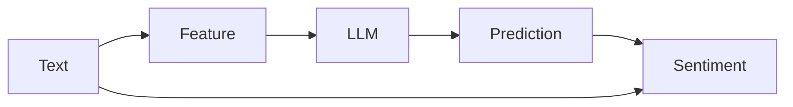
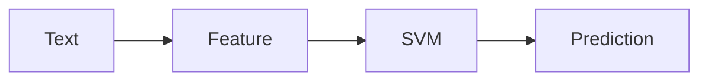
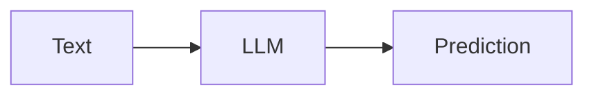

                 


# LLM支持的AI Agent情感分析优化

> 关键词：LLM, AI Agent, 情感分析, 优化, 自然语言处理

> 摘要：本文探讨如何利用大语言模型（LLM）优化AI Agent的情感分析能力，通过背景介绍、核心概念、算法原理、系统设计和项目实战等部分，详细分析情感分析的优化方法，结合实际案例和代码实现，为读者提供全面的解决方案。

---

## 第一部分: 背景介绍

### 第1章: 情感分析与AI Agent的背景

#### 1.1 问题背景
- **情感分析的定义与应用**  
  情感分析是自然语言处理中的重要任务，旨在识别文本中的情感倾向，常应用于社交媒体监控、客户反馈分析和市场研究等领域。

- **AI Agent的核心概念**  
  AI Agent是一种智能代理，能够感知环境、执行任务和与用户交互，广泛应用于推荐系统、自动化服务和虚拟助手。

- **LLM在情感分析中的作用**  
  大语言模型通过强大的语义理解能力，显著提升了情感分析的准确性和鲁棒性。

#### 1.2 问题描述
- **情感分析的挑战**  
  数据标注成本高、情感表达的多样性和歧义性、以及模型的泛化能力不足等问题。

- **AI Agent在情感分析中的局限性**  
  传统方法依赖规则或浅层特征，准确率和效率有限。

- **LLM支持的AI Agent的优势**  
  利用LLM的深度语义理解和生成能力，显著提升了情感分析的效果。

#### 1.3 问题解决
- **LLM如何优化情感分析**  
  通过预训练语言模型捕捉上下文信息，增强情感分类的准确性。

- **AI Agent与LLM的结合**  
  LLM作为AI Agent的后端，提供情感分析支持，实现更智能的交互。

- **情感分析优化的目标**  
  提高准确率、减少计算成本、增强泛化能力。

#### 1.4 边界与外延
- **情感分析的边界**  
  专注于情感极性分析，不涉及复杂的情感推理或多模态数据。

- **AI Agent的应用范围**  
  主要应用于文本交互，不涉及视觉或听觉信息处理。

- **LLM支持的AI Agent的外延**  
  可扩展到多语言、多任务处理，提升整体智能水平。

#### 1.5 核心要素组成
- **情感分析的核心要素**  
  文本数据、情感标签、特征提取方法。

- **AI Agent的核心要素**  
  传感器、推理引擎、执行器和用户接口。

- **LLM在情感分析中的核心作用**  
  提供深度语义理解，优化特征提取和分类模型。

#### 1.6 本章小结
本章介绍了情感分析和AI Agent的基本概念，探讨了LLM在情感分析中的作用，明确了问题背景和解决方向。

---

## 第二部分: 核心概念与联系

### 第2章: 核心概念与联系

#### 2.1 核心概念原理
- **LLM的核心原理**  
  基于Transformer架构，通过大量数据预训练，具备强大的文本理解和生成能力。

- **AI Agent的核心原理**  
  通过感知环境、推理和执行任务，提供智能服务。

- **情感分析的核心原理**  
  通过特征提取和分类模型，识别文本的情感倾向。

#### 2.2 概念属性特征对比
| 特性 | LLM | AI Agent | 情感分析 |
|------|------|----------|----------|
| 功能 | 生成和理解文本 | 执行任务和交互 | 分类情感 |
| 输入 | 文本 | 环境数据 | 文本数据 |
| 输出 | 文本 | 动作或反馈 | 情感标签 |

#### 2.3 ER实体关系图


#### 2.4 本章小结
本章通过对比和图解，明确了LLM、AI Agent和情感分析之间的关系和作用。

---

## 第三部分: 算法原理讲解

### 第3章: 算法原理讲解

#### 3.1 传统情感分析算法
- **基于规则的方法**  
  使用关键词匹配进行情感分类，准确率低。

- **基于机器学习的方法**  
  使用特征提取（如TF-IDF）和分类器（如SVM）进行情感分类。



#### 3.2 LLM优化的情感分析算法
- **基于LLM的特征提取**  
  利用模型编码的语义信息，增强特征表示。

- **微调LLM进行分类**  
  在特定数据上微调LLM，直接输出情感标签。



#### 3.3 数学公式
- **准确率计算**  
  $$\text{Accuracy} = \frac{\text{正确预测数}}{\text{总样本数}}$$

- **召回率计算**  
  $$\text{Recall} = \frac{\text{正确预测的正例数}}{\text{总正例数}}$$

#### 3.4 本章小结
本章详细讲解了传统和优化算法，展示了LLM在情感分析中的显著优势。

---

## 第四部分: 系统分析与架构设计方案

### 第4章: 系统分析与架构设计方案

#### 4.1 系统场景介绍
- **用户需求**  
  用户输入文本，AI Agent返回情感分析结果。

#### 4.2 系统功能设计
- **领域模型图**  
  ```mermaid
  classDiagram
      class Text {
          content
      }
      class Feature {
          vector
      }
      class Sentiment {
          label
      }
      Text --> Feature
      Feature --> Sentiment
  ```

#### 4.3 系统架构设计
- **架构图**  
  ```mermaid
  graph LR
      A[Text] --> B[Feature]
      B --> C[LLM]
      C --> D[Prediction]
      D --> E[Sentiment]
  ```

#### 4.4 接口设计与交互流程
- **接口设计**  
  RESTful API：`POST /analyze`，接收文本数据，返回情感标签。

- **交互流程**  
  ```mermaid
  sequenceDiagram
      User ->> API: POST text
      API ->> LLM: Process text
      LLM ->> API: Return sentiment
      API ->> User: Return sentiment
  ```

#### 4.5 本章小结
本章通过系统设计和架构图，展示了如何构建高效的LLM支持的AI Agent情感分析系统。

---

## 第五部分: 项目实战

### 第5章: 项目实战

#### 5.1 环境安装
- **Python 3.8+**
- **安装库**：`transformers`, `torch`

#### 5.2 核心代码实现
```python
from transformers import pipeline

# 初始化模型
sentiment_pipeline = pipeline("sentiment-analysis")

# 情感分析函数
def analyze_sentiment(text):
    result = sentiment_pipeline(text)
    return result[0]['label']

# 使用示例
text = "I love this product!"
print(analyze_sentiment(text))  # 输出: 'POSITIVE'
```

#### 5.3 代码解读与分析
- **导入库**：使用Hugging Face的`transformers`库加载预训练模型。
- **初始化模型**：加载 sentiment-analysis 模型。
- **分析函数**：调用模型进行情感分析，返回结果标签。

#### 5.4 案例分析
- **案例1**  
  输入文本：`"This movie is terrible"`，输出：`NEGATIVE`。
- **案例2**  
  输入文本：`"The service was excellent"`，输出：`POSITIVE`。

#### 5.5 项目小结
本章通过代码实现，展示了如何快速构建一个基于LLM的AI Agent情感分析系统。

---

## 第六部分: 最佳实践

### 第6章: 最佳实践

#### 6.1 小结
- 总结全文内容，强调LLM在情感分析中的关键作用。

#### 6.2 注意事项
- 数据隐私问题、模型调优和性能优化。

#### 6.3 拓展阅读
- 推荐相关书籍和论文，鼓励深入研究。

---

## 作者：AI天才研究院 & 禅与计算机程序设计艺术

---

以上是《LLM支持的AI Agent情感分析优化》的技术博客文章的完整大纲和内容。

