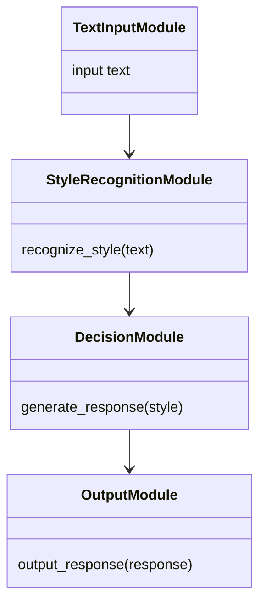

                 


# LLM支持的AI Agent文本风格识别

---

## 关键词：
- 大语言模型（LLM）
- AI Agent
- 文本风格识别
- 自然语言处理（NLP）
- 机器学习
- 人工智能

---

## 摘要：
本文探讨了大语言模型（LLM）支持的AI Agent在文本风格识别中的应用。通过分析LLM的核心原理、AI Agent的行为机制以及文本风格识别的技术细节，本文详细阐述了如何利用LLM赋能AI Agent实现高效的文本风格识别。文章内容包括引言、基础概念、核心原理、算法实现、系统架构设计、项目实战以及最佳实践，旨在为读者提供全面而深入的技术指导。

---

## 第1章：引言

### 1.1 问题背景与重要性
随着AI技术的快速发展，AI Agent（人工智能代理）逐渐成为人机交互的重要桥梁。AI Agent通过与用户的文本交互，能够理解用户的需求并提供相应的服务。然而，文本交互的质量高度依赖于对文本风格的准确识别。文本风格识别是指通过分析文本的语言特征、情感倾向、语境语境等信息，判断文本所属的风格类别（如正式、随意、幽默等）。  
传统的文本风格识别方法依赖于特征工程和传统机器学习算法，但在面对复杂多样的文本数据时，其表现有限。大语言模型（LLM）的出现为文本风格识别带来了新的可能性。LLM凭借其强大的语言理解和生成能力，能够更准确地捕捉文本风格特征，从而显著提升AI Agent的文本交互能力。

### 1.2 问题描述与目标
本文旨在探讨如何利用LLM支持的AI Agent实现高效的文本风格识别。具体目标包括：  
1. 理解LLM与AI Agent的结合机制；  
2. 探讨基于LLM的文本风格识别方法；  
3. 提供从理论到实践的完整解决方案；  
4. 总结经验，提出优化建议。

---

## 第2章：基础概念与原理

### 2.1 大语言模型（LLM）概述
#### 2.1.1 什么是大语言模型？
大语言模型（LLM）是一种基于深度学习的自然语言处理模型，通常采用Transformer架构。LLM通过大量的文本数据进行训练，能够理解和生成人类语言。与传统NLP模型相比，LLM具有以下特点：  
- **上下文理解能力**：能够捕捉文本的语境和上下文信息；  
- **多任务能力**：适用于多种NLP任务，如文本分类、机器翻译、问答系统等；  
- **生成能力**：能够生成自然流畅的文本。

#### 2.1.2 LLM的核心特点与优势
1. **强大的语言理解能力**：LLM能够通过上下文理解文本的深层含义。  
2. **通用性**：LLM可以应用于多种NLP任务，无需针对特定任务进行大量特征工程。  
3. **可微调性**：LLM可以通过微调（Fine-tuning）针对特定任务进行优化。

#### 2.1.3 LLM的训练与推理机制
LLM的训练过程包括两个阶段：预训练和微调。  
- **预训练**：通过大规模的无监督学习，模型学习语言的基本规律和语义特征。  
- **微调**：针对特定任务（如文本分类）进行有监督训练，优化模型的性能。

### 2.2 文本风格识别的基本原理
#### 2.2.1 文本风格的定义与分类
文本风格是指文本在语言表达上的特征，通常包括以下方面：  
- **语言复杂度**：文本中词汇的复杂程度和句子的长度。  
- **情感倾向**：文本表达的情感色彩，如积极、消极或中性。  
- **语气**：文本的语气，如正式、随意、幽默等。  
- **用词习惯**：特定领域或群体常用的词汇和表达方式。

#### 2.2.2 基于LLM的文本风格识别方法
基于LLM的文本风格识别方法主要包括以下步骤：  
1. **输入文本处理**：将输入文本转换为模型能够理解的形式。  
2. **特征提取**：模型提取文本的语言特征，如词汇、句式、语境等。  
3. **风格预测**：模型基于提取的特征，预测文本的风格类别。  
4. **结果解释**：对模型的预测结果进行解释，提供风格识别的依据。

#### 2.2.3 文本风格识别的评价指标
常用的评价指标包括：  
- **准确率（Accuracy）**：正确预测的样本数占总样本数的比例。  
- **精确率（Precision）**：预测为正类的样本中实际为正类的比例。  
- **召回率（Recall）**：实际为正类的样本中被正确预测的比例。  
- **F1值（F1 Score）**：精确率和召回率的调和平均值。

---

## 第3章：AI Agent与文本风格识别的关系

### 3.1 AI Agent的核心概念
#### 3.1.1 AI Agent的定义与组成
AI Agent是一种智能实体，能够感知环境、执行任务并与其他实体进行交互。AI Agent的核心组成部分包括：  
- **感知模块**：用于感知环境信息，如用户输入的文本。  
- **决策模块**：根据感知的信息，生成相应的响应或行动计划。  
- **执行模块**：将决策结果转化为实际操作，如生成回复文本。

#### 3.1.2 AI Agent的类型与应用场景
AI Agent可以根据功能和智能水平分为以下几类：  
1. **基于规则的AI Agent**：根据预定义的规则进行决策，适用于简单任务。  
2. **基于机器学习的AI Agent**：通过机器学习模型进行决策，适用于复杂任务。  
3. **基于LLM的AI Agent**：结合大语言模型进行文本交互，适用于复杂的自然语言处理任务。

#### 3.1.3 AI Agent的决策机制
AI Agent的决策机制通常包括以下步骤：  
1. **信息感知**：通过传感器或接口获取环境信息。  
2. **信息处理**：对获取的信息进行分析和理解。  
3. **决策生成**：基于分析结果生成决策。  
4. **决策执行**：将决策转化为具体操作。

### 3.2 文本风格识别在AI Agent中的作用
#### 3.2.1 文本风格识别如何赋能AI Agent
文本风格识别能够帮助AI Agent更好地理解用户的需求和意图。例如：  
- **用户意图识别**：通过分析用户文本的语言风格，判断用户的实际需求。  
- **个性化交互**：根据用户的语言风格调整AI Agent的响应方式，提供更个性化的服务。  
- **情感分析**：通过识别用户文本的情感倾向，优化AI Agent的交互策略。

#### 3.2.2 LLM在AI Agent文本交互中的优势
1. **强大的语言理解能力**：LLM能够准确理解用户文本的语义和情感。  
2. **生成能力强**：LLM能够生成自然流畅的文本，提升AI Agent的交互体验。  
3. **可扩展性**：LLM可以通过微调适应不同的文本风格识别任务。

#### 3.2.3 文本风格识别对AI Agent用户体验的影响
- **提升交互质量**：通过理解用户的语言风格，AI Agent能够提供更精准的响应。  
- **增强个性化服务**：基于用户的语言风格，AI Agent可以提供定制化的服务。  
- **提升信任感**：准确的风格识别能够增强用户对AI Agent的信任感。

---

## 第4章：基于LLM的文本风格识别算法

### 4.1 算法原理概述
#### 4.1.1 基于LLM的文本风格识别流程
1. **输入文本处理**：将输入文本转换为模型能够理解的形式。  
2. **特征提取**：模型提取文本的语言特征，如词汇、句式、语境等。  
3. **风格预测**：模型基于提取的特征，预测文本的风格类别。  
4. **结果解释**：对模型的预测结果进行解释，提供风格识别的依据。

#### 4.1.2 LLM的内部机制对文本风格识别的影响
- **注意力机制**：帮助模型关注文本中重要的特征。  
- **位置编码**：帮助模型理解文本的顺序和上下文关系。  
- **参数共享**：通过参数共享，模型能够快速适应不同的文本风格。

#### 4.1.3 基于LLM的文本风格识别的数学模型
基于LLM的文本风格识别通常采用以下模型结构：  
$$ P(y|x) = \text{Model}(x) $$  
其中，$x$表示输入文本，$y$表示文本风格类别，$P(y|x)$表示模型预测的条件概率。

### 4.2 算法实现细节
#### 4.2.1 输入处理与特征提取
- **输入文本预处理**：包括分词、去除停用词等。  
- **特征提取**：提取文本的语言特征，如TF-IDF、词嵌入等。

#### 4.2.2 基于LLM的风格预测模型
1. **模型选择**：选择适合的LLM模型，如GPT、BERT等。  
2. **微调模型**：针对文本风格识别任务，对LLM进行微调。  
3. **预测与解释**：利用微调后的模型进行风格预测，并对结果进行解释。

#### 4.2.3 数学模型与公式
- **损失函数**：交叉熵损失函数用于分类任务。  
$$ \mathcal{L} = -\sum_{i=1}^{n} y_i \log(p_i) $$  
其中，$y_i$表示真实标签，$p_i$表示模型预测的概率。

- **评估指标**：准确率、精确率、召回率等。

---

## 第5章：系统分析与架构设计

### 5.1 问题场景介绍
#### 5.1.1 系统目标与需求分析
系统目标：设计一个基于LLM的AI Agent，能够准确识别文本风格并提供相应的服务。  
系统需求：  
1. 提供文本风格识别功能。  
2. 支持多种文本风格分类任务。  
3. 提供高效的交互体验。

#### 5.1.2 系统功能模块划分
系统功能模块包括：  
1. **文本输入模块**：接收用户输入的文本。  
2. **风格识别模块**：对输入文本进行风格识别。  
3. **决策模块**：根据识别结果生成响应。  
4. **输出模块**：将响应返回给用户。

#### 5.1.3 系统性能与可扩展性要求
- **性能要求**：系统响应时间应控制在合理范围内。  
- **可扩展性**：系统应支持多种文本风格分类任务的扩展。

### 5.2 系统功能设计
#### 5.2.1 系统功能模块的Mermaid类图


#### 5.2.2 功能模块之间的交互关系
1. **文本输入模块**接收用户的输入文本。  
2. **风格识别模块**对输入文本进行风格识别，并返回识别结果。  
3. **决策模块**根据识别结果生成响应。  
4. **输出模块**将响应返回给用户。

#### 5.2.3 关键功能模块的实现细节
- **风格识别模块**：基于LLM的微调模型进行风格预测。  
- **决策模块**：根据预测结果生成相应的响应。

### 5.3 系统架构设计
#### 5.3.1 系统架构的Mermaid架构图


#### 5.3.2 系统组件的部署与交互
1. **文本输入模块**部署在前端，接收用户输入。  
2. **风格识别模块**部署在后端，负责风格识别。  
3. **决策模块**根据识别结果生成响应。  
4. **输出模块**将响应返回给用户。

#### 5.3.3 系统接口的设计与实现
- **接口设计**：提供RESTful API接口，如POST /style-recognition。  
- **接口实现**：通过API Gateway接收请求，调用后端服务进行处理。

---

## 第6章：项目实战

### 6.1 环境安装与配置
#### 6.1.1 安装Python与必要的库
- 安装Python 3.8及以上版本。  
- 安装必要的库：`transformers`, `torch`, `numpy`。

#### 6.1.2 安装LLM模型
- 使用`transformers`库安装预训练模型，如`gpt2`。

### 6.2 系统核心实现源代码
#### 6.2.1 文本输入模块
```python
import requests

def input_text():
    text = input("请输入文本：")
    return text
```

#### 6.2.2 风格识别模块
```python
from transformers import GPT2Tokenizer, GPT2ModelWithLMHead

def recognize_style(text):
    tokenizer = GPT2Tokenizer.from_pretrained('gpt2')
    model = GPT2ModelWithLMHead.from_pretrained('gpt2')
    inputs = tokenizer.encode(text, return_tensors='pt')
    outputs = model.generate(inputs, max_length=50, num_return_sequences=1)
    return tokenizer.decode(outputs[0])
```

#### 6.2.3 决策模块
```python
def generate_response(style):
    return f"根据您的文本风格，我判断您的需求是：{style}。"
```

#### 6.2.4 输出模块
```python
def output_response(response):
    print("AI Agent的响应：")
    print(response)
```

### 6.3 代码应用解读与分析
- **输入模块**：接收用户的输入文本。  
- **风格识别模块**：使用预训练的GPT-2模型进行风格预测。  
- **决策模块**：根据预测结果生成响应。  
- **输出模块**：将响应输出给用户。

### 6.4 实际案例分析
#### 6.4.1 案例1：正式文本识别
输入文本：  
"尊敬的领导，您好！感谢您对我们工作的支持。"  
识别结果：正式风格  
响应：根据您的文本风格，我判断您的需求是正式风格。请提供更多信息，我将为您提供建议。

#### 6.4.2 案例2：随意文本识别
输入文本：  
"Hey，兄弟，最近怎么样？"  
识别结果：随意风格  
响应：根据您的文本风格，我判断您的需求是随意风格。有什么我可以帮你的吗？

### 6.5 项目小结
通过本项目的实现，我们成功构建了一个基于LLM的AI Agent，能够准确识别文本风格并提供相应的服务。项目代码简单易懂，具有良好的扩展性。

---

## 第7章：最佳实践与总结

### 7.1 最佳实践
1. **选择合适的LLM模型**：根据任务需求选择适合的模型。  
2. **优化模型性能**：通过微调和参数调整提升模型效果。  
3. **设计良好的用户交互界面**：提升用户体验。  
4. **处理异常情况**：确保系统健壮性。

### 7.2 小结
本文详细探讨了LLM支持的AI Agent文本风格识别的技术细节，从理论到实践提供了完整的解决方案。通过本文的指导，读者可以快速上手，构建自己的AI Agent系统。

### 7.3 注意事项
- **数据隐私**：确保用户数据的安全与隐私。  
- **模型可解释性**：提升模型的可解释性，增强用户信任。  
- **性能优化**：通过优化算法和架构提升系统性能。

### 7.4 拓展阅读
- 推荐阅读《大语言模型：原理与应用》  
- 参考GitHub上的相关项目，如`transformers`库的官方文档。

---

## 作者：AI天才研究院/AI Genius Institute & 禅与计算机程序设计艺术 /Zen And The Art of Computer Programming

---

通过本文的详细分析与实践，我们深入探讨了LLM支持的AI Agent文本风格识别的技术细节，为读者提供了从理论到实践的完整指导。希望本文能为相关领域的研究和应用提供有价值的参考。

