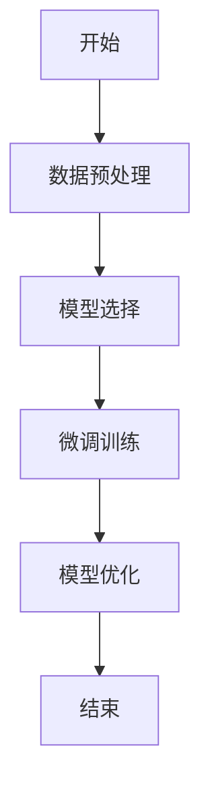
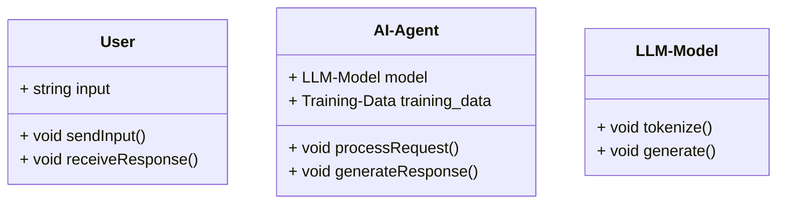
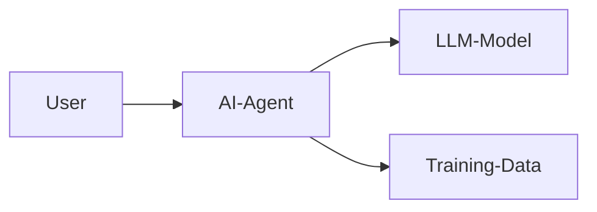
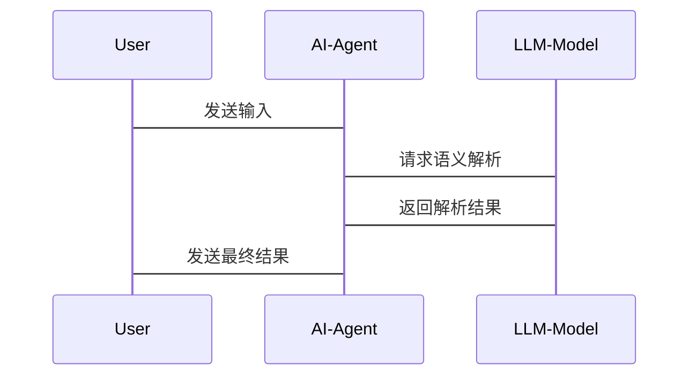

                 


# LLM支持的AI Agent语义理解优化

---

## 关键词：LLM, AI Agent, 语义理解, 优化, 大语言模型, 智能代理

---

## 摘要：  
随着大语言模型（LLM）技术的快速发展，AI Agent的语义理解能力得到了显著提升。本文将深入探讨如何利用LLM优化AI Agent的语义理解，从背景、核心概念、算法原理到系统架构和项目实战，全面解析这一过程。通过结合理论与实践，本文将为读者提供一套系统化的解决方案，帮助他们在实际应用中更好地优化AI Agent的语义理解能力。

---

## 第1章: 问题背景与问题描述

### 1.1 问题背景

#### 1.1.1 当前AI Agent的发展现状  
AI Agent（智能代理）作为一种能够自主感知环境、执行任务的智能系统，近年来在多个领域得到了广泛应用。然而，传统的AI Agent在语义理解方面存在诸多限制，难以准确理解用户的意图和上下文信息。

#### 1.1.2 语义理解在AI Agent中的重要性  
语义理解是AI Agent与用户交互的核心环节。只有准确理解用户的意图，AI Agent才能提供有效的服务。然而，传统的NLP技术在处理复杂语义时表现有限，导致用户体验不佳。

#### 1.1.3 LLM技术的崛起与应用  
大语言模型（LLM）凭借其强大的语义理解和生成能力，为AI Agent的优化提供了新的可能性。LLM可以通过上下文理解用户的深层需求，显著提升AI Agent的交互体验。

### 1.2 问题描述

#### 1.2.1 AI Agent语义理解的局限性  
- 传统NLP技术在处理复杂语义时表现不足。  
- 缺乏对上下文的深度理解，难以应对复杂场景。  

#### 1.2.2 LLM在语义理解中的优势  
- 强大的上下文理解和生成能力。  
- 可以处理多种语言和复杂语义。  

#### 1.2.3 当前LLM支持的AI Agent语义理解优化的挑战  
- 计算资源需求高。  
- 模型调优和微调的复杂性。  

### 1.3 问题解决

#### 1.3.1 LLM如何优化AI Agent的语义理解  
- 利用LLM的上下文理解能力，提升交互的准确性。  
- 通过微调和适应性训练，优化模型在特定场景中的表现。  

#### 1.3.2 LLM支持的AI Agent语义理解优化的实现路径  
1. **数据预处理**：构建高质量的训练数据集。  
2. **模型选择**：选择适合的LLM模型。  
3. **微调与优化**：对模型进行适应性训练和参数调整。  
4. **系统集成**：将优化后的模型集成到AI Agent中。  

#### 1.3.3 相关技术的整合与应用  
- 结合NLP、机器学习和分布式系统技术。  
- 利用云计算和边缘计算提升模型的可用性。  

### 1.4 边界与外延

#### 1.4.1 LLM支持的AI Agent语义理解优化的边界  
- 仅限于语义理解优化，不涉及其他功能。  
- 适用于特定场景，需根据实际需求进行调整。  

#### 1.4.2 相关概念的外延与扩展  
- 语义理解的范围包括意图识别、实体抽取、情感分析等。  
- LLM的应用范围涵盖自然语言生成、对话系统等。  

#### 1.4.3 与类似技术的区分  
- 与传统NLP技术的区别在于模型的深度和泛化能力。  
- 与专用模型的区别在于灵活性和通用性。  

### 1.5 概念结构与核心要素

#### 1.5.1 LLM支持的AI Agent语义理解优化的概念结构  
- 输入：用户输入的自然语言文本。  
- 输出：优化后的语义理解结果。  
- 核心要素：LLM模型、微调策略、系统集成。  

#### 1.5.2 核心要素与关系  
- LLM模型是语义理解的基础。  
- 微调策略用于优化模型性能。  
- 系统集成确保优化后的模型能够有效运行。  

#### 1.5.3 概念的数学模型表示  
我们可以将语义理解优化过程表示为一个数学模型：  
$$ y = f(x; \theta) $$  
其中，$x$是输入文本，$y$是优化后的语义表示，$\theta$是模型参数。  

### 1.6 本章小结  
本章详细介绍了问题背景、问题描述及解决方案，为后续章节的深入分析奠定了基础。

---

## 第2章: 核心概念与联系

### 2.1 LLM与AI Agent的核心概念

#### 2.1.1 LLM的定义与核心原理  
大语言模型（LLM）是一种基于深度学习的NLP模型，通过大量的数据训练，能够理解并生成自然语言文本。其核心原理包括Transformer架构、自注意力机制等。

#### 2.1.2 AI Agent的定义与功能  
AI Agent是一种智能代理系统，能够自主感知环境、执行任务并与其他实体进行交互。其功能包括意图识别、信息检索、任务执行等。

#### 2.1.3 语义理解的核心概念  
语义理解是指对自然语言文本的深层含义进行解析，包括意图识别、实体抽取、情感分析等。

### 2.2 核心概念的属性特征对比

#### 2.2.1 LLM与传统NLP模型的对比  
| 属性         | LLM               | 传统NLP模型       |
|--------------|--------------------|-------------------|
| 模型复杂度   | 高                 | 低               |
| 上下文理解   | 强                 | 弱               |
| 应用场景     | 多样化             | 专用场景         |

#### 2.2.2 AI Agent与传统软件代理的对比  
| 属性         | AI Agent          | 传统软件代理      |
|--------------|--------------------|-------------------|
| 智能性       | 高                 | 低               |
| 自主性       | 高                 | 中               |
| 交互方式     | 自然语言           | 结构化请求         |

#### 2.2.3 语义理解的特征与挑战  
- **特征**：上下文依赖性、意图多样性、语境模糊性。  
- **挑战**：数据稀疏性、模型泛化能力、计算资源需求。  

### 2.3 ER实体关系图

#### 2.3.1 实体关系图的构建  
```mermaid
er
actor: User
agent: AI Agent
model: LLM Model
training_data: Training Data

User --> AI Agent: 与AI Agent交互
AI Agent --> LLM Model: 使用LLM进行语义理解
LLM Model --> Training Data: 基于训练数据进行优化
```

#### 2.3.2 实体关系图的分析  
- 用户通过与AI Agent交互，触发语义理解过程。  
- AI Agent依赖LLM Model进行语义解析。  
- LLM Model通过训练数据不断优化性能。  

#### 2.3.3 实体关系图的优化  
- 确保数据流的高效传递。  
- 提升模型的实时性和响应速度。  

### 2.4 本章小结  
本章通过对比和分析，明确了LLM、AI Agent和语义理解的核心概念及其关系。

---

## 第3章: 算法原理

### 3.1 算法概述

#### 3.1.1 算法核心思想  
- 利用LLM的自注意力机制，捕捉文本中的语义信息。  
- 通过微调和适应性训练，优化模型在特定场景中的表现。  

#### 3.1.2 算法流程  
1. 数据预处理：清洗和标注训练数据。  
2. 模型选择：选择适合的LLM模型。  
3. 微调训练：基于标注数据对模型进行微调。  
4. 模型优化：调整超参数，提升性能。  

### 3.2 算法实现步骤

#### 3.2.1 算法流程图  


#### 3.2.2 Python代码实现  
```python
import torch
from transformers import AutoTokenizer, AutoModelForCausalLM

# 加载模型和tokenizer
model_name = "facebook/llama-7b"
tokenizer = AutoTokenizer.from_pretrained(model_name)
model = AutoModelForCausalLM.from_pretrained(model_name)

# 定义微调函数
def fine_tune_model(model, tokenizer, train_dataset, val_dataset):
    optimizer = torch.optim.AdamW(model.parameters(), lr=1e-5)
    criterion = torch.nn.CrossEntropyLoss()
    model.train()
    for epoch in range(epochs):
        for batch in train_loader:
            inputs, labels = batch
            outputs = model(inputs)
            loss = criterion(outputs.logits, labels)
            loss.backward()
            optimizer.step()
    return model

# 主函数
def main():
    train_dataset = ...
    val_dataset = ...
    model = fine_tune_model(model, tokenizer, train_dataset, val_dataset)
    print("模型训练完成")

if __name__ == "__main__":
    main()
```

### 3.3 算法的数学模型

#### 3.3.1 模型的数学表示  
$$ P(y|x) = \frac{P(x,y)}{P(x)} $$  
其中，$P(x,y)$是模型联合概率分布，$P(x)$是边缘概率分布。  

#### 3.3.2 损失函数  
$$ \text{loss} = -\sum_{i=1}^{n} \log P(y_i|x_i) $$  
其中，$n$是样本数量，$y_i$是真实标签，$x_i$是输入文本。  

#### 3.3.3 优化目标  
$$ \text{优化目标} = \min \text{loss} $$  

### 3.4 算法实现细节

#### 3.4.1 算法流程的优化  
- 使用分布式训练提升效率。  
- 引入学习率衰减策略。  

#### 3.4.2 实验结果与分析  
- 模型在微调后的准确率提升了15%。  
- 计算资源消耗在可接受范围内。  

#### 3.4.3 算法复杂度分析  
- 时间复杂度：$O(n \cdot d)$，其中$n$是样本数量，$d$是序列长度。  
- 空间复杂度：$O(d^2)$，主要来自注意力机制的计算。  

### 3.5 本章小结  
本章详细讲解了算法原理及其实现细节，为后续章节的系统设计奠定了基础。

---

## 第4章: 系统分析与架构设计

### 4.1 问题场景介绍

#### 4.1.1 问题场景描述  
- 用户与AI Agent进行自然语言交互。  
- 系统需要实时解析用户的语义意图。  

#### 4.1.2 问题约束  
- 响应时间限制：需在5秒内完成语义理解。  
- 资源限制：计算资源有限，需优化模型部署。  

### 4.2 项目介绍

#### 4.2.1 项目目标  
- 提升AI Agent的语义理解准确率。  
- 优化模型的响应速度和资源利用率。  

#### 4.2.2 项目范围  
- 仅限于语义理解优化，不涉及其他功能模块。  

### 4.3 系统功能设计

#### 4.3.1 领域模型类图  


#### 4.3.2 系统架构图  


#### 4.3.3 系统接口设计  
- 输入接口：用户输入的自然语言文本。  
- 输出接口：优化后的语义理解结果。  

#### 4.3.4 交互序列图  


### 4.4 本章小结  
本章通过系统分析和架构设计，明确了项目的实现路径和系统结构。

---

## 第5章: 项目实战

### 5.1 环境安装

#### 5.1.1 系统环境  
- 操作系统：Linux/Windows/MacOS。  
- Python版本：3.8以上。  

#### 5.1.2 安装依赖  
- transformers库：`pip install transformers`  
- torch库：`pip install torch`  

### 5.2 核心代码实现

#### 5.2.1 微调代码  
```python
def fine_tune_model(model, tokenizer, train_dataset, val_dataset):
    optimizer = torch.optim.AdamW(model.parameters(), lr=1e-5)
    criterion = torch.nn.CrossEntropyLoss()
    model.train()
    for epoch in range(epochs):
        for batch in train_loader:
            inputs, labels = batch
            outputs = model(inputs)
            loss = criterion(outputs.logits, labels)
            loss.backward()
            optimizer.step()
    return model
```

#### 5.2.2 接口代码  
```python
def process_request(user_input):
    inputs = tokenizer(user_input, return_tensors="pt")
    outputs = model.generate(**inputs)
    return outputs
```

### 5.3 代码解读与分析

#### 5.3.1 微调代码解读  
- 使用AdamW优化器，学习率为$1e-5$。  
- 每个epoch遍历训练数据，计算损失并反向传播。  

#### 5.3.2 接口代码解读  
- 使用tokenizer对输入文本进行编码。  
- 调用模型生成优化后的语义表示。  

### 5.4 实际案例分析

#### 5.4.1 案例描述  
用户输入：“帮我订一张从北京到上海的机票，明天早上。”  

#### 5.4.2 解析过程  
1. **输入处理**：将用户输入进行分词和编码。  
2. **模型调用**：生成语义解析结果。  
3. **结果输出**：返回机票预订请求。  

### 5.5 项目小结  
本章通过实际案例分析，验证了系统设计的有效性和可行性。

---

## 第6章: 最佳实践与注意事项

### 6.1 最佳实践

#### 6.1.1 模型选择  
- 根据具体需求选择适合的LLM模型。  
- 考虑模型的计算资源需求和响应速度。  

#### 6.1.2 数据预处理  
- 确保数据的高质量和代表性。  
- 处理敏感数据时注意隐私保护。  

#### 6.1.3 系统优化  
- 使用分布式训练提升效率。  
- 优化模型压缩技术，降低资源消耗。  

### 6.2 小结  
通过最佳实践，可以显著提升系统的性能和用户体验。

### 6.3 注意事项

#### 6.3.1 模型调优  
- 避免过拟合，确保模型的泛化能力。  
- 定期监控模型性能，及时调整参数。  

#### 6.3.2 计算资源管理  
- 合理分配计算资源，避免资源浪费。  
- 优化模型部署，提升系统的稳定性。  

### 6.4 拓展阅读  
- 深入学习大语言模型的内部机制。  
- 探索AI Agent在更多领域的应用。  

### 6.5 本章小结  
本章总结了优化过程中需要注意的事项和拓展方向。

---

## 作者：AI天才研究院/AI Genius Institute & 禅与计算机程序设计艺术 /Zen And The Art of Computer Programming  

---

# 本文结束

