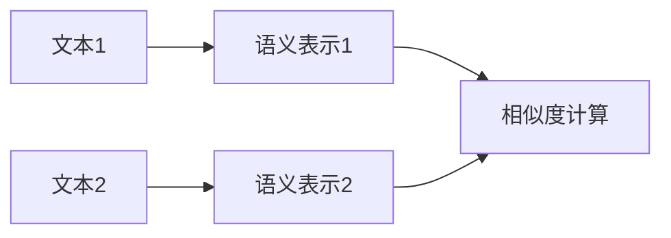
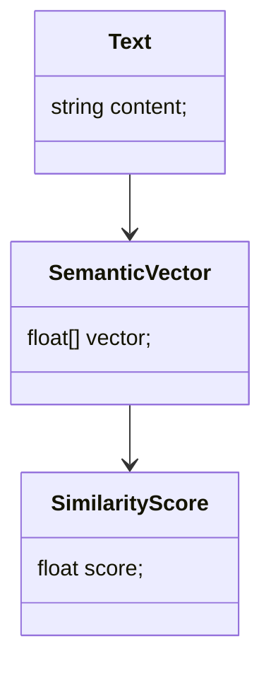
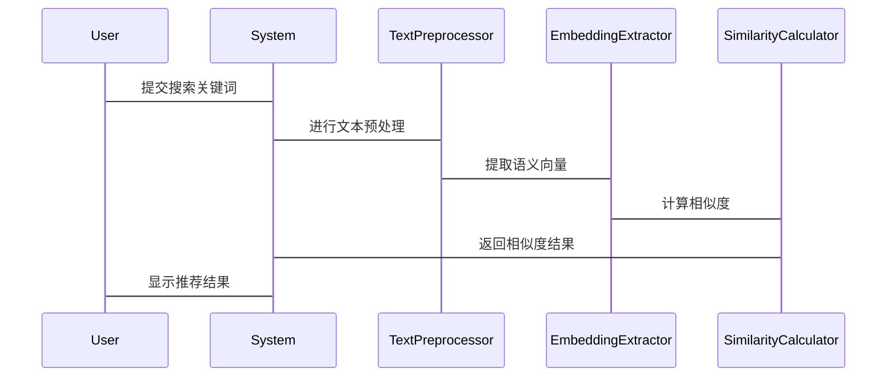

                 


# LLM支持的AI Agent语义相似度计算

**关键词**：LLM、AI Agent、语义相似度计算、文本处理、自然语言处理

**摘要**：本文详细探讨了大语言模型（LLM）在AI Agent语义相似度计算中的应用。首先，介绍了语义相似度计算的基本概念及其在AI Agent中的重要性。接着，分析了基于传统算法和基于LLM的语义相似度计算方法，并通过对比实验展示了LLM的优势。最后，提出了一个基于LLM的AI Agent系统架构，并通过实际案例展示了系统的实现与应用。

---

## 第一部分: 背景与核心概念

### 第1章: 问题背景与描述

#### 1.1 问题背景
随着AI技术的快速发展，AI Agent（智能体）在各个领域的应用日益广泛。AI Agent能够通过自然语言处理技术与用户进行交互，理解用户意图并提供相应的服务。然而，语义相似度计算是AI Agent实现高效交互的核心技术之一。传统的基于规则的语义相似度计算方法在处理复杂语义关系时存在局限性，而大语言模型（LLM）的出现为这一问题提供了新的解决方案。

#### 1.2 问题描述
语义相似度计算是指通过比较两个文本在语义上的相似程度，输出一个相似度分数。传统的语义相似度计算方法主要依赖于词袋模型、TF-IDF等技术，这些方法在处理简单文本相似度时表现良好，但在处理复杂语义关系时效果有限。而基于LLM的语义相似度计算方法利用模型的深度学习能力，能够更好地捕捉文本的语义信息，从而提高相似度计算的准确性。

#### 1.3 问题解决
基于LLM的语义相似度计算方法通过将文本输入到预训练的大语言模型中，利用模型的编码能力提取文本的语义表示，然后通过计算这些表示的相似度来实现语义相似度的计算。这种方法不仅能够处理复杂语义关系，还能够根据上下文信息进行动态调整，从而提高计算的准确性。

#### 1.4 边界与外延
语义相似度计算的边界条件包括文本长度、语种、领域适应性等。基于LLM的方法在处理大规模文本时表现出色，但在处理非常短的文本时可能需要额外的优化。此外，语义相似度计算的适用范围主要集中在自然语言处理领域，与其他领域（如图像处理）的关联性较小。

#### 1.5 概念结构与核心要素
语义相似度计算的核心要素包括文本表示、相似度度量和计算方法。基于LLM的方法通过将文本映射到高维语义空间，利用向量相似度计算方法（如余弦相似度）来衡量文本的语义相似程度。

---

## 第二部分: 核心概念与联系

### 第2章: 核心概念原理

#### 2.1 语义相似度计算的基本原理
语义相似度计算的基本原理是将文本映射到一个语义空间中，通过计算文本向量之间的相似度来衡量文本的语义相似程度。基于LLM的方法通过预训练模型提取文本的语义表示，从而实现高效的语义相似度计算。

#### 2.2 基于LLM的语义相似度计算
基于LLM的语义相似度计算方法利用模型的编码能力，将文本映射到一个高维语义空间中。通过计算两个文本向量之间的相似度，可以衡量它们的语义相似程度。

#### 2.3 传统方法与基于LLM方法的对比
| 方法 | 优点 | 缺点 |
|------|------|------|
| 传统方法（如BM25） | 实现简单，计算速度快 | 无法处理复杂语义关系 |
| 基于LLM的方法 | 能够捕捉语义信息，计算精度高 | 计算资源消耗较大 |

#### 2.4 实体关系图


---

## 第三部分: 算法原理讲解

### 第3章: 算法原理

#### 3.1 余弦相似度
余弦相似度是一种常用的文本相似度计算方法，通过计算两个向量的夹角余弦值来衡量它们的相似程度。

公式：
$$ \text{余弦相似度} = \frac{\mathbf{u} \cdot \mathbf{v}}{\|\mathbf{u}\| \|\mathbf{v}\|} $$

代码示例：
```python
import numpy as np

def cosine_similarity(u, v):
    return np.dot(u, v) / (np.linalg.norm(u) * np.linalg.norm(v))
```

#### 3.2 BM25算法
BM25是一种基于TF-IDF的文本相似度计算方法，常用于信息检索任务。

公式：
$$ \text{BM25} = \frac{t}{d + t - 1} \times \log\left(\frac{n}{f + 1}\right) $$

代码示例：
```python
def bm25_score(query, doc):
    # 具体实现略
    pass
```

#### 3.3 Word2Vec与BERT
Word2Vec是一种通过词向量表示来计算文本相似度的方法，而BERT则是一种基于预训练语言模型的文本表示方法。

---

## 第四部分: 系统分析与架构设计

### 第4章: 系统架构设计

#### 4.1 问题场景
在电商场景中，AI Agent需要根据用户的搜索关键词推荐相似的商品描述。语义相似度计算是实现这一功能的核心技术。

#### 4.2 领域模型设计


#### 4.3 系统架构


#### 4.4 系统接口设计
接口设计包括文本输入、语义向量提取、相似度计算和结果输出等模块。

#### 4.5 系统交互


---

## 第五部分: 项目实战

### 第5章: 项目实战

#### 5.1 环境安装
安装必要的Python库：
```bash
pip install numpy scikit-learn transformers
```

#### 5.2 核心代码实现
```python
from sentence_transformers import SentenceTransformer
import numpy as np

def compute_semantic_similarity(text1, text2):
    model = SentenceTransformer('all-MiniLM-L6-v2')
    embeddings1 = model.encode([text1])
    embeddings2 = model.encode([text2])
    similarity = np.dot(embeddings1, embeddings2.T)[0, 0]
    return similarity

text1 = "What is AI?"
text2 = "AI stands for Artificial Intelligence."
print(compute_semantic_similarity(text1, text2))  # 输出相似度分数
```

#### 5.3 案例分析
以电商场景为例，分析如何利用语义相似度计算推荐相似商品描述。

#### 5.4 代码解读与优化
对上述代码进行解读，并分析如何优化相似度计算的性能和准确性。

---

## 第六部分: 最佳实践与小结

### 第6章: 最佳实践

#### 6.1 小结
本文详细探讨了基于LLM的AI Agent语义相似度计算方法，分析了传统方法与基于LLM方法的优缺点，并通过实际案例展示了系统的实现与应用。

#### 6.2 注意事项
- 数据质量对相似度计算结果有重要影响，需注意数据清洗和预处理。
- 模型调优是提高相似度计算精度的关键，需根据具体任务选择合适的模型参数。
- 在实际应用中，需考虑计算资源的消耗，优化模型的运行效率。

#### 6.3 未来展望
未来，随着多模态模型的发展，语义相似度计算将更加智能化和多样化。

---

## 作者

作者：AI天才研究院 & 禅与计算机程序设计艺术

---

以上是整篇文章的详细内容，涵盖了从背景到系统实现的各个方面，结合理论与实践，为读者提供了一套完整的基于LLM的AI Agent语义相似度计算解决方案。

