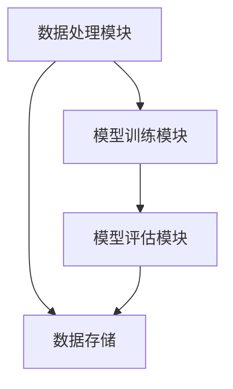

                 


# LLM模型训练实践：从预训练到微调的全流程

> 关键词：LLM模型训练、预训练、微调、大语言模型、NLP、机器学习

> 摘要：本文系统地介绍了大语言模型（LLM）从预训练到微调的全流程，涵盖背景、核心概念、算法原理、系统设计、项目实战及最佳实践。通过详细讲解，帮助读者掌握LLM模型训练的关键步骤和技术要点，从理论到实践全面提升对LLM模型的理解与应用能力。

---

## 第1章: LLM模型训练背景与概述

### 1.1 什么是LLM模型

#### 1.1.1 大语言模型的定义
大语言模型（Large Language Model, LLM）是指基于深度学习技术构建的大型神经网络模型，能够理解和生成人类语言。这类模型通常使用Transformer架构，具备处理长文本、捕捉上下文关系的能力，是自然语言处理（NLP）领域的重大突破。

#### 1.1.2 LLM模型的核心特点
- **大规模参数量**：通常包含 billions 量级的参数，如GPT-3拥有1750亿个参数。
- **自注意力机制**：通过自注意力机制捕捉长距离依赖关系，理解上下文。
- **生成能力**：能够生成连贯且有意义的文本，应用于对话、写作、翻译等领域。
- **零样本学习**：在特定任务上经过微调后，能够处理从未见过的数据。

#### 1.1.3 LLM模型的应用领域
- **自然语言处理**：文本生成、问答系统、机器翻译。
- **内容创作**：辅助写作、代码生成、商业文案创作。
- **数据分析**：信息抽取、情感分析、实体识别。
- **人机交互**：智能对话系统、虚拟助手。

### 1.2 LLM模型训练的背景

#### 1.2.1 从传统NLP到大模型的演进
传统的NLP方法依赖于特征工程，而深度学习的兴起使得端到端模型成为可能。从词袋模型到词嵌入（如Word2Vec），再到Transformer架构，NLP技术不断进步，推动了大语言模型的发展。

#### 1.2.2 预训练与微调的必要性
预训练（Pre-training）通过在大规模通用数据上训练模型，使其掌握语言的基本规律。微调（Fine-tuning）则在特定任务的数据上进一步优化模型，使其适应具体应用场景。

#### 1.2.3 当前LLM模型训练的挑战与机遇
- **计算资源需求高**：训练大型模型需要大量GPU资源。
- **数据多样性**：需要多样化高质量的数据来提升模型泛化能力。
- **模型压缩与优化**：如何在资源受限的场景下部署高效模型。

---

## 第2章: LLM模型的核心概念与原理

### 2.1 LLM模型的基本结构

#### 2.1.1 变压器架构的介绍
Transformer由编码器和解码器组成，编码器负责将输入序列编码为语义向量，解码器根据编码结果生成输出序列。其核心在于自注意力机制，能够捕捉序列中任意位置的依赖关系。

#### 2.1.2 自注意力机制的原理
自注意力机制计算每个词对其他词的注意力权重，公式如下：
$$
\text{Attention}(Q, K, V) = \text{softmax}\left(\frac{QK^T}{\sqrt{d_k}}\right)V
$$
其中，$Q$、$K$、$V$分别是查询、键、值向量，$d_k$是向量的维度。

#### 2.1.3 前馈网络的作用
每个编码器和解码器块都包含多层感知机（MLP）层，用于非线性变换，增强模型的表达能力。

### 2.2 预训练与微调的概念

#### 2.2.1 预训练的目标
预训练的目标是让模型学习语言的基本规律，通常采用掩码语言模型（如Bert）或生成模型（如GPT）的训练方式。

#### 2.2.2 微调的定义与作用
微调是指在预训练的基础上，使用特定任务的数据对模型进行进一步训练，使模型适应具体任务。

#### 2.2.3 预训练与微调的关系
预训练提供通用语言能力，微调则针对特定任务优化模型。这种两阶段训练方法平衡了通用性和任务专用性。

### 2.3 LLM模型的训练流程

#### 2.3.1 数据准备阶段
- 数据清洗：去除无效数据，处理噪声。
- 数据分块：将数据划分为合适的块大小，便于并行训练。
- 数据增强：通过同义词替换、数据扩增等方法提升数据多样性。

#### 2.3.2 模型初始化阶段
- 参数初始化：通常采用Xavier初始化或He初始化。
- 模型结构选择：选择Transformer架构，确定参数规模。

#### 2.3.3 模型训练阶段
- 优化器选择：常用Adam优化器，设置合适的学习率。
- 损失函数定义：交叉熵损失函数用于分类任务。
- 训练策略：采用分布式训练、学习率衰减等方法。

#### 2.3.4 模型评估与优化阶段
- 评估指标：准确率、困惑度（Perplexity）等。
- 模型优化：通过早停法防止过拟合，采用Dropout技术提升泛化能力。

---

## 第3章: LLM模型的预训练过程

### 3.1 预训练的目标与方法

#### 3.1.1 预训练的通用目标
预训练的目标是让模型学习语言的分布，理解词语之间的关系。

#### 3.1.2 掩码语言模型的原理
在输入序列中随机遮蔽部分词，模型通过上下文推断被遮蔽词，如Bert的Masked LM任务。

#### 3.1.3 语言模型的损失函数
交叉熵损失函数用于衡量模型预测与真实标签的差异：
$$
\text{Loss} = -\sum_{i=1}^{n} \text{log}(p(y_i|x_i))
$$

### 3.2 预训练的实现细节

#### 3.2.1 输入数据的处理
- 词表构建：建立词表，处理OOV（Out-of-Vocabulary）问题。
- 文本分块：将文本按长度分块，确保训练效率。

#### 3.2.2 模型并行与分布式训练
- 数据并行：将数据分片到不同GPU，模型参数共享。
- 模型并行：将模型分片，参数分布在不同GPU上。

#### 3.2.3 优化策略
- 学习率调度：采用余弦衰减或板凳调度器。
- 梯度裁剪：防止梯度爆炸。

---

## 第4章: LLM模型的微调过程

### 4.1 微调的目标与方法

#### 4.1.1 微调的定义
微调是指在预训练模型的基础上，使用特定任务的数据进行训练，调整模型参数以适应具体任务。

#### 4.1.2 微调的适用场景
- 任务特定性：当任务数据量较小时，微调能够提升模型性能。
- 任务多样性：针对不同任务（如分类、生成）进行微调。

#### 4.1.3 微调的训练策略
- 冻结部分层：通常冻结预训练模型的底层，仅微调顶层。
- 学习率调整：微调阶段通常使用较小的学习率。

### 4.2 微调的具体实现

#### 4.2.1 数据准备
- 数据清洗：处理特定任务的数据，去除无效样本。
- 数据标注：为监督学习任务进行标注。

#### 4.2.2 模型结构调整
- 添加任务特定层：如在NLP任务中添加分类层。
- 参数冻结：冻结预训练模型的大部分参数，仅微调特定层。

#### 4.2.3 优化与训练
- 使用相同或不同的优化器：如继续使用Adam，但调整学习率。
- 定期评估：在验证集上评估模型性能，防止过拟合。

---

## 第5章: LLM模型的系统设计与优化

### 5.1 系统架构设计

#### 5.1.1 系统功能模块
- 数据处理模块：负责数据清洗、分块。
- 模型训练模块：实现预训练和微调。
- 模型评估模块：计算评估指标，优化模型。

#### 5.1.2 系统架构图


### 5.2 系统优化策略

#### 5.2.1 并行计算优化
- 数据并行：使用多个GPU同时处理不同数据块。
- 模型并行：将模型分片，提高计算效率。

#### 5.2.2 内存优化
- 使用张量并行：减少内存占用。
- 优化数据结构：选择合适的数据结构，减少内存开销。

#### 5.2.3 硬件加速
- 使用GPU加速：通过CUDA优化计算。
- 使用TPU：利用Google的张量处理单元加速训练。

---

## 第6章: 项目实战与案例分析

### 6.1 项目背景

#### 6.1.1 项目目标
训练一个小型的LLM模型，用于文本摘要任务。

#### 6.1.2 项目需求
- 使用公开数据集（如维基百科）进行预训练。
- 在特定领域（如科技新闻）进行微调。

### 6.2 环境安装

```bash
pip install torch transformers
```

### 6.3 核心代码实现

#### 6.3.1 数据处理代码
```python
def process_data(file_path):
    with open(file_path, 'r', encoding='utf-8') as f:
        text = f.read()
    tokens = tokenizer.encode_plus(text, max_length=512, truncation=True, padding='max_length', return_tensors='pt')
    return tokens['input_ids'], tokens['attention_mask']
```

#### 6.3.2 模型微调代码
```python
class CustomModel(torch.nn.Module):
    def __init__(self, model_name):
        super().__init__()
        self.model = AutoModelForMaskedLM.from_pretrained(model_name)
        self.dropout = torch.nn.Dropout(0.1)
        self.classifier = torch.nn.Linear(self.model.config.hidden_size, num_classes)
    
    def forward(self, input_ids, attention_mask):
        outputs = self.model(input_ids=input_ids, attention_mask=attention_mask)
        pooled_output = outputs.last_hidden_state[:, 0, :]
        output = self.dropout(pooled_output)
        output = self.classifier(output)
        return output
```

### 6.4 案例分析

#### 6.4.1 训练过程分析
- 预训练阶段：使用大规模数据，训练通用语言模型。
- 微调阶段：在特定任务数据上优化模型。

#### 6.4.2 模型性能评估
- 训练损失：逐步下降，验证模型收敛性。
- 验证准确率：评估模型性能，优化超参数。

---

## 第7章: 最佳实践与小结

### 7.1 最佳实践

#### 7.1.1 数据处理
- 数据清洗：去除无效数据，处理噪声。
- 数据增强：通过同义词替换等方法提升数据多样性。

#### 7.1.2 模型优化
- 参数调整：合理设置学习率、批量大小等超参数。
- 模型压缩：使用剪枝、蒸馏等技术减少模型规模。

#### 7.1.3 训练技巧
- 早期终止：防止过拟合，提升泛化能力。
- 混合精度训练：提升训练速度，降低内存消耗。

### 7.2 小结

通过本文的系统介绍，读者可以全面了解从预训练到微调的整个LLM模型训练流程。从理论到实践，逐步掌握模型训练的关键步骤和技术要点。未来，随着技术的不断发展，LLM模型将在更多领域发挥重要作用。

---

作者：AI天才研究院/AI Genius Institute & 禅与计算机程序设计艺术 /Zen And The Art of Computer Programming

