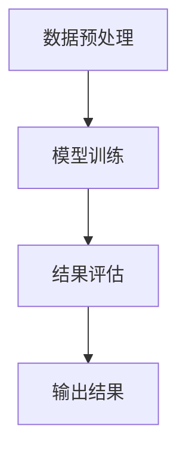

                 


# LLM的微调与适应：针对特定用户群优化

## 关键词：大语言模型，微调，适应，用户群体，LLM优化，自然语言处理

## 摘要：  
本文详细探讨了如何对大语言模型（LLM）进行微调与适应，以满足特定用户群体的需求。通过分析微调与适应的核心原理、算法实现、系统架构以及实际案例，本文为读者提供了从理论到实践的全面指导，帮助他们优化LLM以更好地服务于目标用户。

---

# 目录大纲

---

## 第一部分：背景介绍

### 第1章：LLM的微调与适应概述

#### 1.1 LLM的基本概念
- 1.1.1 大语言模型（LLM）的定义  
  大语言模型（LLM）是指经过大规模训练的自然语言处理模型，能够理解和生成人类语言。  
- 1.1.2 微调与适应的必要性  
  微调与适应是为了使LLM更好地服务于特定用户或场景，弥补通用模型的局限性。  
- 1.1.3 LLM在实际应用中的挑战  
  LLM在实际应用中可能面临数据偏差、模型过拟合等问题，需要通过微调与适应来解决。

#### 1.2 用户需求与问题背景
- 1.2.1 特定用户群体的需求分析  
  不同用户群体可能有不同的语言习惯、专业术语和使用场景，需要定制化的LLM。  
- 1.2.2 微调LLM以满足特定需求的原因  
  微调使LLM能够适应特定领域的语言风格和知识体系。  
- 1.2.3 微调与适应的边界与外延  
  微调是参数调整，而适应是模型行为的改变，两者相辅相成。

#### 1.3 问题描述与解决路径
- 1.3.1 微调LLM的核心问题  
  如何在保持模型通用性的同时，满足特定用户的个性化需求。  
- 1.3.2 解决问题的方法与策略  
  使用小样本数据微调、领域特定预训练等方法。  
- 1.3.3 微调与适应的实现路径  
  从数据准备到模型训练，再到效果评估的完整流程。

---

## 第二部分：核心概念与联系

### 第2章：微调与适应的核心原理

#### 2.1 微调与适应的原理
- 2.1.1 微调的基本概念  
  微调是通过在特定数据集上进行小样本训练，调整模型参数以适应新任务。  
- 2.1.2 适应的定义与作用  
  适应是通过优化模型的行为，使其更好地满足特定场景的需求。  
- 2.1.3 微调与适应的区别与联系  
  微调侧重参数调整，适应侧重行为优化，两者共同实现模型的定制化。

#### 2.2 模型结构与训练策略
- 2.2.1 LLM的内部结构  
  包括编码器和解码器，用于理解和生成语言。  
- 2.2.2 微调的训练策略  
  使用特定领域的数据，采用小样本训练和学习率调整。  
- 2.2.3 适应的训练策略  
  通过对抗训练或任务特定损失函数优化模型行为。

#### 2.3 评估指标与优化目标
- 2.3.1 评估指标的选择  
  使用准确率、BLEU、ROUGE等指标衡量模型性能。  
- 2.3.2 优化目标的设定  
  最小化特定任务的损失函数，同时保持模型的通用性。  
- 2.3.3 优化过程中的权衡  
  在特定任务优化和通用性之间找到平衡点。

---

## 第三部分：算法原理讲解

### 第3章：微调与适应的算法原理

#### 3.1 微调算法的数学模型
- 3.1.1 损失函数的定义  
  使用交叉熵损失函数：  
  $$\mathcal{L}(\theta) = -\frac{1}{N}\sum_{i=1}^{N} \sum_{j=1}^{M} y_{i,j} \log p_{\theta}(y_j|x_i)$$  
  其中，$y_{i,j}$是目标标签，$p_{\theta}(y_j|x_i)$是模型预测的概率。  
- 3.1.2 优化器的选择与作用  
  常用Adam优化器，参数更新公式为：  
  $$\theta_{t+1} = \theta_t - \eta \frac{\partial \mathcal{L}}{\partial \theta_t}$$  
- 3.1.3 模型更新的数学公式  
  参数更新时，学习率$\eta$调整以适应特定任务。

#### 3.2 适应算法的数学模型
- 3.2.1 适应过程中的参数调整  
  通过引入领域特定的损失函数，如：  
  $$\mathcal{L}_{\text{adapt}} = \lambda \mathcal{L}_{\text{task}} + (1-\lambda) \mathcal{L}_{\text{base}}$$  
  其中，$\lambda$是平衡因子。  
- 3.2.2 模型权重的更新策略  
  使用对抗训练或领域特定的梯度下降方法。  
- 3.2.3 适应过程中的数学推导  
  展示如何通过数学推导优化模型权重以适应特定任务。

---

## 第四部分：系统分析与架构设计

### 第4章：微调与适应的系统架构

#### 4.1 系统功能设计
- 4.1.1 系统模块划分  
  包括数据预处理、模型训练、结果评估三个模块。  
- 4.1.2 各模块的功能描述  
  数据预处理模块负责清洗和标注数据，模型训练模块实现微调和适应，结果评估模块衡量模型性能。  
- 4.1.3 系统功能的流程图  
  使用Mermaid绘制系统功能流程图：



#### 4.2 系统架构设计
- 4.2.1 系统架构的选择  
  采用微服务架构，便于模块化开发和部署。  
- 4.2.2 系统组件的交互设计  
  使用API进行模块间通信。  
- 4.2.3 系统架构的优缺点分析  
  微服务架构优点是灵活，缺点是需要处理跨服务通信问题。

---

## 第五部分：项目实战

### 第5章：微调与适应的项目实现

#### 5.1 项目环境配置
- 5.1.1 环境搭建步骤  
  安装Python、TensorFlow、Keras等工具。  
- 5.1.2 工具链的选择与安装  
  使用Anaconda管理虚拟环境。  
- 5.1.3 数据集的准备与预处理  
  下载并清洗特定领域的数据集，进行分词和标注。

#### 5.2 核心代码实现
- 5.2.1 微调代码的编写  
  ```python
  def train_model(model, optimizer, loss_fn, train_loader, epochs=10):
      for epoch in range(epochs):
          for inputs, labels in train_loader:
              outputs = model(inputs)
              loss = loss_fn(outputs, labels)
              optimizer.zero_grad()
              loss.backward()
              optimizer.step()
  ```
- 5.2.2 适应代码的实现  
  ```python
  def adapt_model(model, optimizer, adapt_loss_fn, adapt_loader, epochs=5):
      for epoch in range(epochs):
          for inputs, labels in adapt_loader:
              outputs = model(inputs)
              loss = adapt_loss_fn(outputs, labels)
              optimizer.zero_grad()
              loss.backward()
              optimizer.step()
  ```
- 5.2.3 代码的解读与分析  
  展示如何通过代码实现微调和适应，并解释每一步的作用。

#### 5.3 实际案例分析
- 5.3.1 案例背景介绍  
  以医疗领域为例，说明微调LLM以适应医疗场景的需求。  
- 5.3.2 案例实现与分析  
  展示微调后的模型在医疗咨询任务中的性能提升。  
- 5.3.3 项目小结  
  总结微调与适应的成功经验，为类似项目提供参考。

---

## 第六部分：最佳实践与注意事项

### 第6章：总结与展望

#### 6.1 最佳实践
- 数据准备要充分，尤其是领域特定数据的收集与清洗。  
- 微调时要注意学习率的选择，避免过拟合或欠拟合。  
- 适应过程中要监控模型的行为，及时调整优化策略。  

#### 6.2 小结
- 微调与适应是优化LLM的重要手段，能够显著提升模型的实用性和用户体验。  
- 通过理论与实践的结合，可以更好地理解和应用这些技术。

#### 6.3 注意事项
- 避免过度优化特定任务，影响模型的通用性。  
- 保护用户数据隐私，遵守相关法律法规。  
- 定期更新模型，以应对语言和需求的变化。

---

## 作者：AI天才研究院/AI Genius Institute & 禅与计算机程序设计艺术 /Zen And The Art of Computer Programming

---

通过以上目录大纲，文章将系统地介绍LLM微调与适应的理论、方法和实践，帮助读者全面掌握这一技术的核心内容和应用技巧。

