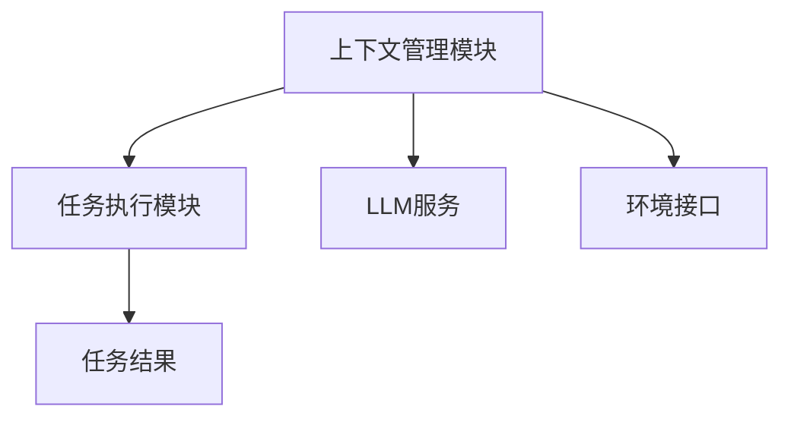
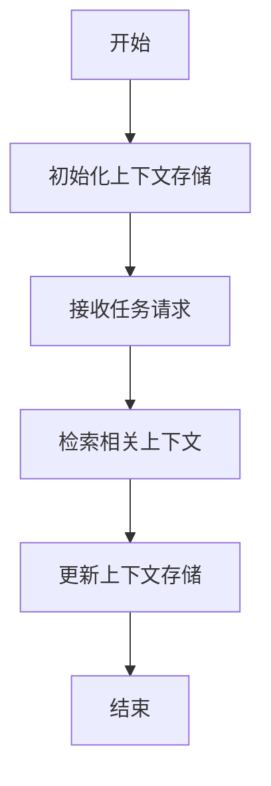
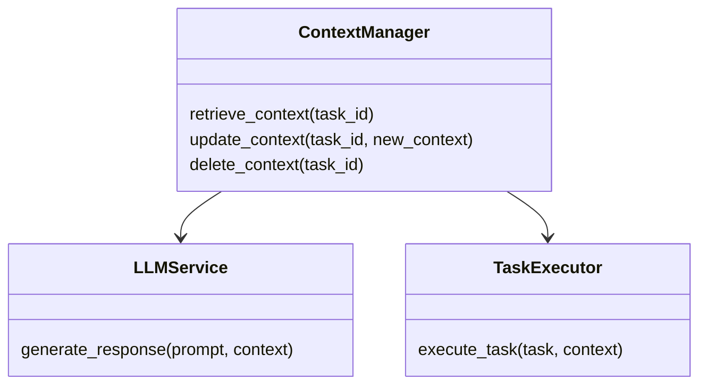
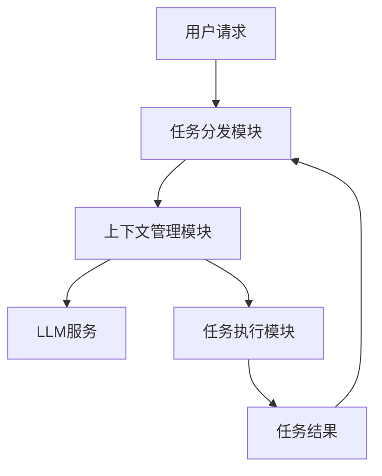
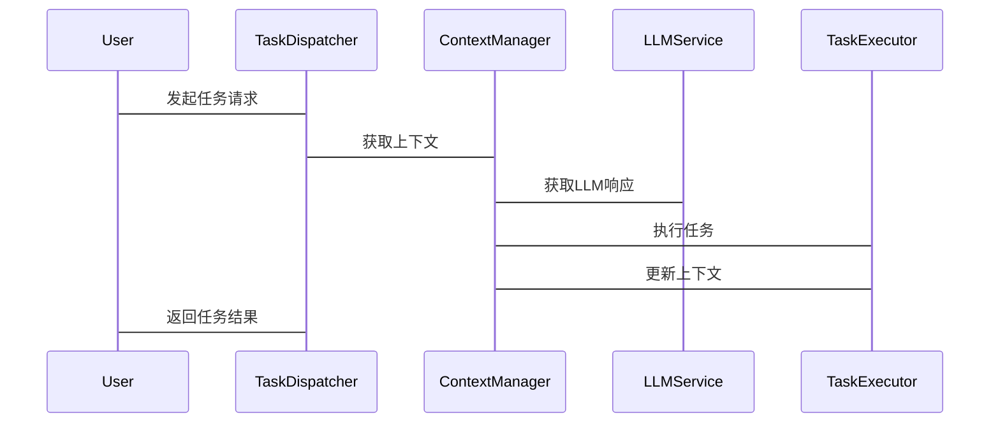

                 


# LLM驱动的AI Agent上下文管理技术

## 关键词
LLM, AI Agent, 上下文管理, 大语言模型, 智能体, 文本上下文, 自然语言处理

## 摘要
LLM驱动的AI Agent上下文管理技术是一种结合大语言模型与人工智能代理的创新方法，旨在通过有效管理和利用上下文信息，提升AI Agent的任务执行效率和准确性。本文系统地探讨了上下文管理的核心概念、算法原理、系统架构及实际应用，提供了从理论到实践的全面指导。

---

# 第一部分: LLM驱动的AI Agent上下文管理技术背景介绍

## 第1章: 问题背景与问题描述

### 1.1 LLM与AI Agent的基本概念

#### 1.1.1 大语言模型（LLM）的定义与特点
大语言模型（LLM）是一种基于深度学习的自然语言处理模型，具有以下特点：
- **大规模训练数据**：通常使用海量文本数据进行训练，涵盖多种语言和领域。
- **强大的上下文理解能力**：能够理解上下文关系，生成连贯的文本。
- **多任务处理能力**：可以通过微调或提示工程技术，适应多种任务需求。

#### 1.1.2 AI Agent的基本概念与功能
AI Agent（智能体）是一种能够感知环境、自主决策并执行任务的智能系统，主要功能包括：
- **感知环境**：通过传感器或接口获取环境信息。
- **决策与推理**：基于获取的信息进行推理和决策。
- **执行任务**：通过执行动作或调用服务完成任务。

#### 1.1.3 LLM驱动的AI Agent的优势与局限性
**优势**：
- **强大的自然语言处理能力**：LLM能够理解并生成自然语言，使AI Agent具备强大的对话和文本处理能力。
- **动态知识更新**：通过LLM的持续学习，AI Agent的知识库可以保持更新。

**局限性**：
- **计算资源需求高**：LLM的运行需要大量的计算资源。
- **上下文管理复杂**：在复杂任务中，上下文信息的管理和维护可能面临挑战。

### 1.2 上下文管理的重要性

#### 1.2.1 上下文在LLM驱动的AI Agent中的作用
上下文信息是AI Agent理解任务需求、执行任务和提供反馈的基础。例如，在对话场景中，上下文决定了对话的连贯性和相关性。

#### 1.2.2 上下文管理的必要性与应用场景
- **任务连贯性**：确保AI Agent在多轮对话中的连贯性。
- **信息整合**：在复杂任务中，整合来自不同来源的信息。

#### 1.2.3 上下文管理与任务效率的关系
有效的上下文管理能够显著提升任务效率，减少重复劳动和错误。

### 1.3 问题解决与边界定义

#### 1.3.1 上下文管理的核心问题
- 如何有效地存储和检索上下文信息。
- 如何动态更新上下文信息以适应任务变化。

#### 1.3.2 上下文管理的边界与外延
上下文管理的边界包括：
- **输入边界**：接收来自LLM和环境的输入。
- **输出边界**：将处理后的信息输出到任务执行模块。

#### 1.3.3 相关技术的对比与选择
| 技术 | 优点 | 缺点 |
|------|------|------|
| 基于规则的上下文管理 | 实现简单 | 灵活性差 |
| 基于知识图谱的上下文管理 | 知识表达能力强 | 构建复杂 |
| 基于LLM的上下文管理 | 灵活性高 | 计算资源需求高 |

### 1.4 概念结构与核心要素

#### 1.4.1 上下文管理的系统架构
上下文管理的系统架构可以分为：
- **输入模块**：接收任务请求和环境信息。
- **处理模块**：存储、更新和检索上下文信息。
- **输出模块**：将处理后的信息传递给任务执行模块。

#### 1.4.2 核心要素的定义与关系
上下文管理的核心要素包括：
- **上下文存储**：用于存储上下文信息。
- **上下文检索**：根据需求检索相关上下文信息。
- **上下文更新**：根据新信息更新上下文存储。

---

## 第2章: 核心概念与联系

### 2.1 上下文管理的原理

#### 2.1.1 上下文存储与检索机制
上下文存储可以采用数据库或知识图谱的形式，检索机制基于关键词或语义相似度。

#### 2.1.2 上下文的动态更新与维护
动态更新可以通过事件驱动或时间驱动的方式实现。

#### 2.1.3 上下文的版本控制
为了防止信息冲突，上下文管理需要支持版本控制。

---

### 2.2 上下文管理的核心要素对比

| 核心要素 | 特性 | 示例 |
|----------|------|------|
| 上下文存储 | 支持持久化存储 | 使用数据库存储上下文信息 |
| 上下文检索 | 支持多条件查询 | 根据关键词和上下文类型检索信息 |
| 上下文更新 | 支持增量更新 | 根据新信息更新部分上下文内容 |

---

### 2.3 实体关系图（ER图）



---

## 第3章: 算法原理

### 3.1 上下文管理的算法步骤



### 3.2 算法实现代码

```python
class ContextManager:
    def __init__(self):
        self.context_store = {}

    def retrieve_context(self, task_id):
        return self.context_store.get(task_id, {})

    def update_context(self, task_id, new_context):
        self.context_store[task_id] = new_context

    def delete_context(self, task_id):
        del self.context_store[task_id]
```

### 3.3 数学模型与公式

$$
P(\text{task success} | \text{context}) = \prod_{i=1}^{n} P(\text{event}_i | \text{context})
$$

---

## 第4章: 系统分析与架构设计方案

### 4.1 问题场景介绍

### 4.2 系统功能设计

#### 4.2.1 领域模型设计



#### 4.2.2 系统架构设计



### 4.3 接口设计与交互

#### 4.3.1 接口设计

| 接口名称 | 输入 | 输出 |
|----------|------|------|
| retrieve_context | task_id | context |
| update_context | task_id, new_context | OK |
| execute_task | task, context | task_result |

#### 4.3.2 交互流程



---

## 第5章: 项目实战

### 5.1 环境安装

```bash
pip install transformers
pip install scikit-learn
pip install matplotlib
```

### 5.2 核心代码实现

```python
from transformers import AutoTokenizer, AutoModelForSeq2Seq
import json

class ContextManager:
    def __init__(self):
        self.context_store = {}

    def retrieve_context(self, task_id):
        return self.context_store.get(task_id, {})

    def update_context(self, task_id, new_context):
        self.context_store[task_id] = new_context

    def delete_context(self, task_id):
        del self.context_store[task_id]

# 示例代码
context_manager = ContextManager()
context_manager.retrieve_context("task1")  # 获取上下文
context_manager.update_context("task1", {"status": "completed"})  # 更新上下文
```

### 5.3 案例分析与详细解读

假设我们有一个客服AI Agent，需要处理客户的投诉任务。通过上下文管理，AI Agent可以记住客户的投诉历史和解决进度，从而提供更高效的解决方案。

---

## 第6章: 总结

### 6.1 核心内容回顾

- LLM驱动的AI Agent上下文管理技术的核心在于高效地存储、检索和更新上下文信息。
- 上下文管理能够显著提升AI Agent的任务执行效率和准确性。

### 6.2 最佳实践 Tips

- 在实际应用中，建议结合具体业务需求选择合适的上下文管理方法。
- 定期优化和更新上下文管理模块，以适应业务变化和技术进步。

### 6.3 小结

通过本文的探讨，读者可以深入了解LLM驱动的AI Agent上下文管理技术的核心概念、算法原理和实际应用。

### 6.4 注意事项

- 在实际应用中，需注意上下文信息的隐私保护和数据安全问题。
- 确保上下文管理模块的性能和稳定性，以支持高并发和复杂任务。

### 6.5 拓展阅读

- 阅读相关论文，深入了解上下文管理的最新研究成果。
- 关注AI Agent领域的技术动态，了解最新的发展趋势。

---

## 作者

作者：AI天才研究院/AI Genius Institute & 禅与计算机程序设计艺术 /Zen And The Art of Computer Programming

