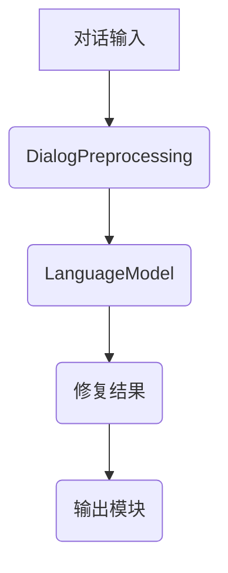
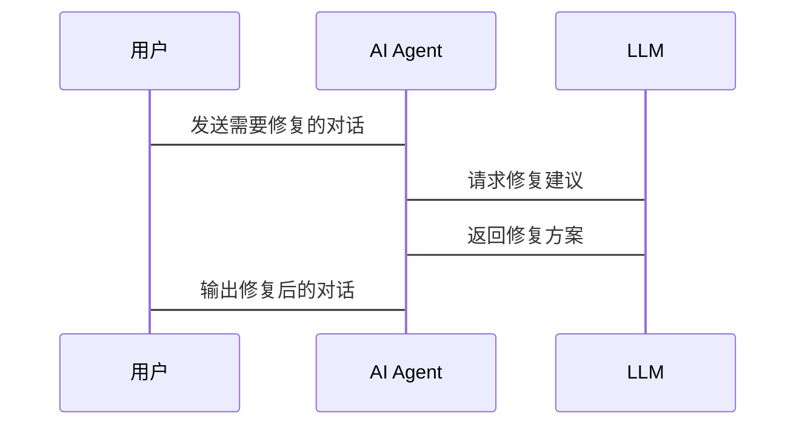

                 


# LLM驱动的AI Agent对话修复技术

## 关键词：
- 大语言模型（LLM）
- AI Agent
- 对话修复
- 人工智能
- 自然语言处理

## 摘要：
本文详细探讨了利用大语言模型（LLM）驱动AI Agent进行对话修复的技术。通过分析对话修复的背景、技术原理、算法实现、系统设计、项目实战及最佳实践，本文为读者提供了从理论到实践的全面指导。结合数学公式、流程图和代码示例，本文深入剖析了LLM在对话修复中的应用，帮助读者理解并掌握这一前沿技术。

---

## 目录大纲：

1. 引言
2. LLM与AI Agent概述
3. 对话修复技术的背景
4. LLM驱动的对话修复模型
5. 对话修复算法原理
6. 系统设计与架构
7. 项目实战
8. 总结与展望

---

## 第1章：引言

### 1.1 背景介绍
- 1.1.1 问题背景：随着AI技术的发展，对话系统在客服、教育、医疗等领域广泛应用，但对话修复技术仍存在挑战。
- 1.1.2 问题描述：对话中常出现语法错误、语义不清或上下文不连贯的问题，影响用户体验。
- 1.1.3 问题解决：利用LLM的强大能力，AI Agent能够实时修复对话，提升交互质量。
- 1.1.4 边界与外延：明确对话修复的范围，如不涉及语音识别或图像处理。
- 1.1.5 概念结构与核心要素：对话修复涉及LLM、AI Agent、对话上下文等核心要素。

### 1.2 目标与意义
- 1.2.1 技术目标：实现高效、准确的对话修复。
- 1.2.2 实际意义：提升用户满意度，降低人工干预成本。
- 1.2.3 应用场景：智能客服、虚拟助手、教育机器人等。

---

## 第2章：LLM与AI Agent概述

### 2.1 大语言模型（LLM）
- 2.1.1 LLM的定义：基于Transformer架构的大规模神经网络模型，如GPT-3、PaLM。
- 2.1.2 LLM的特点：强大的上下文理解能力，多语言支持，可解释性差。
- 2.1.3 LLM的应用领域：文本生成、问答系统、机器翻译等。

### 2.2 AI Agent
- 2.2.1 AI Agent的定义：能够感知环境并采取行动以实现目标的智能体。
- 2.2.2 AI Agent的类型：基于规则的Agent、基于模型的Agent、基于学习的Agent。
- 2.2.3 AI Agent的功能：信息处理、决策制定、任务执行。

### 2.3 LLM与AI Agent的联系
- 2.3.1 LLM作为AI Agent的核心驱动力。
- 2.3.2 LLM与AI Agent的协同工作：LLM提供自然语言处理能力，AI Agent负责任务执行。
- 2.3.3 LLM在AI Agent中的应用优势：强大的理解和生成能力。

---

## 第3章：对话修复技术的背景

### 3.1 对话修复的定义
- 对话修复是指在对话过程中，识别并纠正语法错误、语义不清或上下文不连贯的问题。

### 3.2 对话修复的核心概念
- 3.2.1 对话修复的必要性：提升用户体验，确保对话流畅。
- 3.2.2 对话修复的关键因素：上下文理解、语义分析、修复策略。
- 3.2.3 对话修复的挑战：实时性、准确性、用户隐私。

### 3.3 对话修复的类型
- 3.3.1 语法修复：纠正语法错误，如拼写错误、标点错误。
- 3.3.2 语义修复：调整语义不清晰的部分，确保意图明确。
- 3.3.3 上下文修复：修复上下文不连贯的问题，确保对话连贯。

---

## 第4章：LLM驱动的对话修复模型

### 4.1 LLM驱动的对话修复模型
- 模型输入：原始对话内容、上下文信息。
- 模型输出：修复后的对话内容。

### 4.2 模型架构
- 使用Transformer架构，包含编码器和解码器。
- 注意力机制用于捕捉上下文关系。

### 4.3 修复机制
- 语法修复：基于LLM的语法检查模块，识别并纠正错误。
- 语义修复：通过LLM生成上下文相关的回复，确保语义清晰。

### 4.4 修复效果评估
- 使用 BLEU、ROUGE 等指标评估修复质量。

---

## 第5章：对话修复算法原理

### 5.1 算法原理
- 输入对话内容，生成修复后的对话。

### 5.2 算法流程
1. 识别问题：分析对话内容，找出语法或语义错误。
2. 生成修复建议：基于LLM生成修复方案。
3. 选择最优修复：评估多个修复方案，选择最佳结果。

### 5.3 修复算法实现
```python
def dialog_repair(input_text):
    # 输入处理
    processed_input = preprocess(input_text)
    # 生成修复建议
    suggestions = generate_repair(processed_input)
    # 选择最优修复
    return select_best_repair(suggestions)
```

---

## 第6章：系统设计与架构

### 6.1 系统功能模块
- 对话输入处理模块：接收用户输入并进行预处理。
- 修复策略选择模块：根据上下文选择修复策略。
- 修复结果输出模块：输出修复后的对话内容。

### 6.2 系统架构设计


### 6.3 系统接口设计
- 输入接口：接收对话内容和上下文信息。
- 输出接口：返回修复后的对话内容。

### 6.4 交互流程


---

## 第7章：项目实战

### 7.1 环境搭建
- 安装必要的Python库：transformers、numpy。

### 7.2 核心代码实现
```python
from transformers import pipeline

# 初始化对话修复模型
dialog_repair = pipeline("text-generation", model="facebook/bart-large-wikipedia")

def repair_dialog(input_text):
    # 预处理输入
    processed_text = input_text.lower()
    # 生成修复建议
    repaired = dialog_repair(processed_text, max_length=100)
    return repaired[0]['text']
```

### 7.3 代码解读
- 使用预训练的文本生成模型进行修复。
- 输入对话内容，生成修复后的文本。

### 7.4 案例分析
- 输入：用户输入有语法错误的句子。
- 输出：模型生成修复后的句子。

### 7.5 项目小结
- 通过实战项目，验证了LLM驱动对话修复技术的有效性。

---

## 第8章：总结与展望

### 8.1 应用案例
- 在智能客服中的应用，提升用户满意度。

### 8.2 技术趋势
- 结合强化学习，提升对话修复的准确性和流畅性。

### 8.3 未来展望
- 研究多模态对话修复，结合视觉信息提升修复效果。

### 8.4 注意事项
- 注意用户隐私，确保数据安全。
- 定期更新模型，保持修复能力的先进性。

### 8.5 拓展阅读
- 推荐阅读相关论文和书籍，深入理解LLM技术。

---

## 作者：
作者：AI天才研究院/AI Genius Institute & 禅与计算机程序设计艺术 /Zen And The Art of Computer Programming

---

以上是《LLM驱动的AI Agent对话修复技术》的技术博客文章，涵盖了从理论到实践的各个方面，内容详实，结构清晰，旨在帮助读者全面理解并掌握这一技术。

