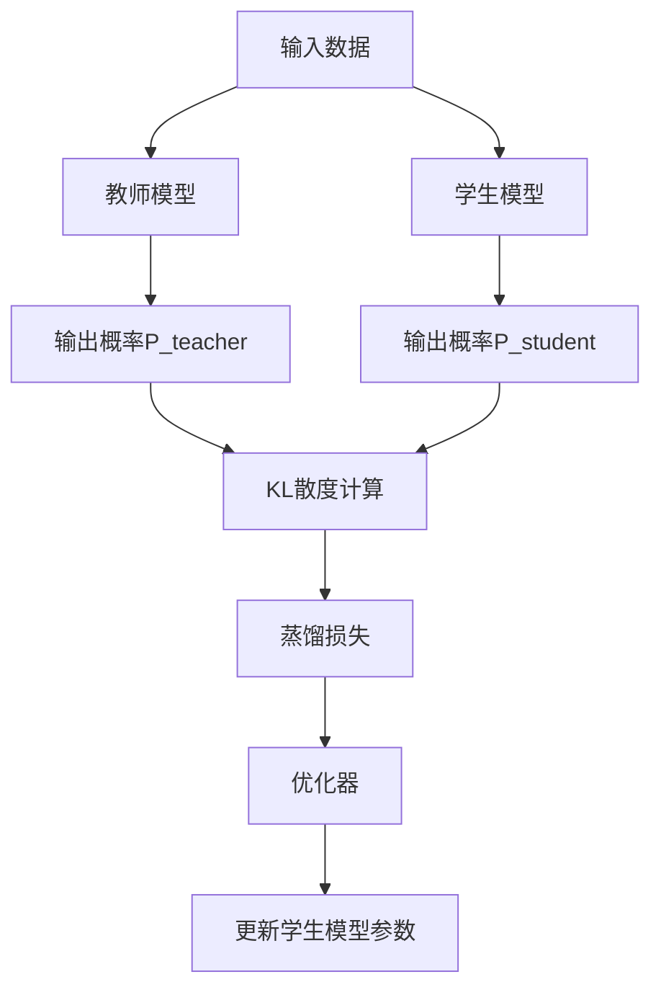
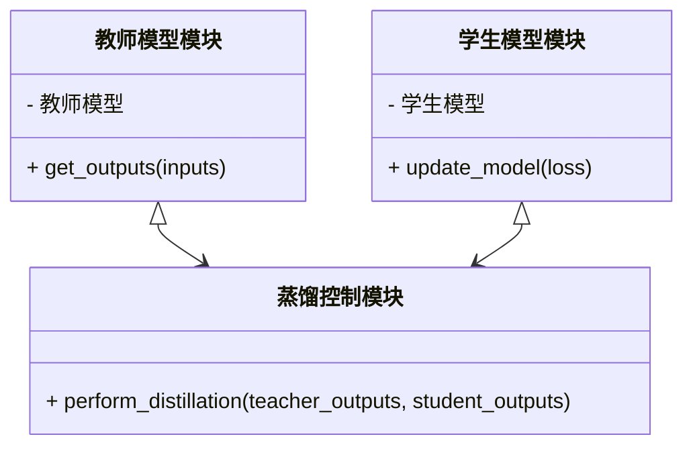
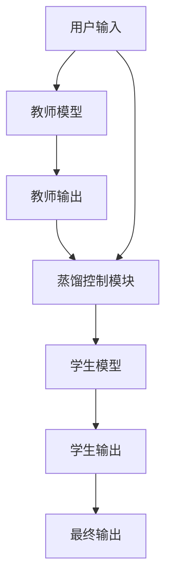

                 


# LLM驱动的AI Agent知识蒸馏技术

> 关键词：LLM, AI Agent, 知识蒸馏, 大语言模型, 智能体, 知识提取

> 摘要：本文深入探讨了LLM驱动的AI Agent知识蒸馏技术，从背景概念、核心原理到算法实现、系统架构，再到项目实战，全面解析了这项技术的核心内容和应用价值。文章通过理论分析和实践案例相结合的方式，帮助读者理解如何将大语言模型的知识高效提取并应用于实际场景中。

---

## 第1章: LLM与AI Agent概述

### 1.1 大语言模型（LLM）的基本概念

#### 1.1.1 什么是大语言模型
大语言模型（Large Language Model，LLM）是指经过大量数据训练的深度学习模型，如GPT系列、BERT系列等。这些模型具有强大的自然语言处理能力，能够理解和生成人类语言。

#### 1.1.2 LLM的核心特点与优势
1. **大规模数据训练**：通过训练海量文本数据，LLM能够学习语言的语法、语义和上下文关系。
2. **生成能力**：能够生成连贯且有意义的文本，适用于对话、内容创作等多种场景。
3. **自适应性**：通过微调（Fine-tuning）技术，LLM可以适应特定领域的任务需求。

#### 1.1.3 LLM在AI技术中的地位
作为人工智能领域的核心技术之一，LLM为自然语言处理（NLP）和AI Agent的智能化提供了强大的技术支撑。

---

### 1.2 AI Agent的基本概念

#### 1.2.1 什么是AI Agent
AI Agent（人工智能代理）是指能够感知环境并采取行动以实现目标的智能实体。它可以是一个软件程序，也可以是物理机器人。

#### 1.2.2 AI Agent的分类与应用场景
1. **分类**：
   - **简单反射型**：基于规则的简单响应。
   - **基于模型的反射型**：具有一定的状态和推理能力。
   - **目标驱动型**：根据目标采取行动。
   - **效用驱动型**：通过最大化效用函数来优化决策。
   
2. **应用场景**：
   - **智能助手**：如Siri、Alexa等。
   - **推荐系统**：根据用户行为推荐内容。
   - **自动驾驶**：通过感知和决策控制车辆。

#### 1.2.3 LLM驱动的AI Agent的独特性
结合LLM的强大语言处理能力，AI Agent能够实现更复杂、更自然的交互方式。例如，能够进行多轮对话、理解上下文、处理复杂任务。

---

### 1.3 知识蒸馏技术的背景与意义

#### 1.3.1 知识蒸馏技术的定义
知识蒸馏（Knowledge Distillation）是一种将复杂模型的知识迁移到简单模型的技术。通过蒸馏过程，可以将大模型的知识提取出来，形成更小、更高效的模型。

#### 1.3.2 知识蒸馏技术的核心目标
1. **模型压缩**：将大模型压缩为小模型，降低计算资源消耗。
2. **知识提取**：将大模型的知识结构化地提取出来，用于其他场景。

#### 1.3.3 知识蒸馏技术的现实需求与挑战
1. **需求**：
   - 降低计算成本。
   - 提高模型的部署效率。
2. **挑战**：
   - 如何高效提取知识。
   - 如何保持蒸馏后模型的性能。

---

## 第2章: LLM驱动的AI Agent知识蒸馏技术的核心概念

### 2.1 核心概念与原理

#### 2.1.1 知识蒸馏的基本原理
知识蒸馏通过教师模型（Teacher Model）和学生模型（Student Model）的交互，将教师模型的知识传递给学生模型。教师模型通常是一个复杂的模型，而学生模型是一个更简单或更高效的模型。

#### 2.1.2 LLM驱动的AI Agent蒸馏过程
1. **教师模型**：大语言模型（LLM）作为教师模型，提供高质量的知识。
2. **蒸馏过程**：通过损失函数优化，将教师模型的知识迁移到学生模型。
3. **学生模型**：经过蒸馏后，学生模型能够继承教师模型的知识。

#### 2.1.3 蒸馏技术的关键要素
- **损失函数**：衡量教师模型和学生模型之间的差异。
- **温度参数**：调节概率分布的平滑程度。
- **蒸馏策略**：选择适合场景的蒸馏方法。

---

### 2.2 核心概念对比分析

#### 2.2.1 知识蒸馏与传统模型压缩的对比
| 对比维度       | 知识蒸馏             | 传统模型压缩       |
|----------------|--------------------|--------------------|
| 目标           | 提取知识             | 减少模型大小         |
| 方法           | 使用教师模型指导     | 剔除冗余参数         |
| 优势           | 保持模型性能         | 降低计算成本         |

#### 2.2.2 不同蒸馏方法的优劣势分析
| 蒸馏方法       | 优点                     | 缺点                     |
|----------------|--------------------------|--------------------------|
| 直接蒸馏       | 简单高效                 | 易受教师模型偏差影响       |
| 对抗蒸馏       | 提高鲁棒性               | 实现复杂度较高           |
| 多任务蒸馏     | 适用于多种任务场景       | 需要精细的任务设计         |

#### 2.2.3 蒸馏技术的适用场景与边界
1. **适用场景**：
   - 需要快速部署轻量级模型。
   - 需要迁移复杂模型的知识。
2. **边界**：
   - 不适合完全重新设计模型架构。
   - 蒸馏效果受限于教师模型的质量。

---

## 第3章: 知识蒸馏技术的数学模型与算法原理

### 3.1 知识蒸馏的数学模型

#### 3.1.1 概率分布与KL散度公式
KL散度（Kullback-Leibler Divergence）用于衡量两个概率分布之间的差异：
$$
D_{KL}(P||Q) = \sum_{i} P(i) \log \frac{P(i)}{Q(i)}
$$

#### 3.1.2 蒸馏损失函数的数学表达
蒸馏损失函数通常由两部分组成：蒸馏损失和原始任务损失：
$$
\mathcal{L}_{\text{distill}} = \alpha D_{KL}(P||Q) + (1-\alpha)\mathcal{L}_{\text{task}}
$$
其中，$\alpha$ 是蒸馏系数，$0 < \alpha < 1$。

#### 3.1.3 蒸馏过程的数学推导
通过优化蒸馏损失函数，使学生模型的预测分布接近教师模型的预测分布：
$$
\min_{\theta} \mathcal{L}_{\text{distill}}(\theta) = \min_{\theta} \left[ \alpha D_{KL}(P_\text{teacher}||P_\text{student}) + (1-\alpha)\mathcal{L}_{\text{task}}(\theta) \right]
$$

---

### 3.2 算法原理的详细讲解

#### 3.2.1 蒸馏算法的步骤分解
1. **定义教师模型和学生模型**。
2. **计算教师模型的输出概率**。
3. **计算学生模型的输出概率**。
4. **计算KL散度损失**。
5. **计算任务损失**。
6. **优化蒸馏损失函数**。

#### 3.2.2 蒸馏过程的流程图（Mermaid）



#### 3.2.3 算法实现的Python代码示例

```python
import torch
import torch.nn as nn
import torch.optim as optim

class TeacherModel(nn.Module):
    def __init__(self):
        super(TeacherModel, self).__init__()
        self.fc = nn.Linear(10, 5)

class StudentModel(nn.Module):
    def __init__(self):
        super(StudentModel, self).__init__()
        self.fc = nn.Linear(10, 5)

def distillation_loss(outputs_student, outputs_teacher, alpha=0.5, temperature=3):
    student_probs = F.softmax(outputs_student / temperature, dim=1)
    teacher_probs = F.softmax(outputs_teacher / temperature, dim=1)
    loss_kl = F.kl_div(student_probs.log(), teacher_probs, reduction='batchmean')
    return alpha * loss_kl

# 示例训练过程
teacher = TeacherModel()
student = StudentModel()
optimizer = optim.Adam(student.parameters(), lr=0.001)

for batch in dataloader:
    inputs, labels = batch
    with torch.no_grad():
        teacher_outputs = teacher(inputs)
    student_outputs = student(inputs)
    loss = distillation_loss(student_outputs, teacher_outputs)
    optimizer.zero_grad()
    loss.backward()
    optimizer.step()
```

---

## 第4章: 系统分析与架构设计方案

### 4.1 问题场景分析

#### 4.1.1 知识蒸馏技术的应用场景
1. **企业级应用**：如智能客服、内部知识管理系统。
2. **实时交互服务**：如智能助手、实时翻译。

#### 4.1.2 系统需求分析
1. **性能需求**：快速响应，低延迟。
2. **资源需求**：高效利用计算资源。

#### 4.1.3 系统目标与约束条件
目标：实现LLM驱动的AI Agent知识蒸馏系统。约束：模型大小、计算资源限制。

---

### 4.2 系统功能设计

#### 4.2.1 系统功能模块划分
1. **教师模型模块**：提供知识蒸馏的教师模型。
2. **学生模型模块**：接收并优化蒸馏后的知识。
3. **蒸馏控制模块**：负责蒸馏过程的控制和优化。

#### 4.2.2 功能模块之间的关系（Mermaid类图）



#### 4.2.3 系统功能的详细描述
- 教师模型模块负责生成高质量的知识输出。
- 蒸馏控制模块协调教师模型和学生模型的交互。
- 学生模型模块通过蒸馏过程优化自身模型。

---

### 4.3 系统架构设计

#### 4.3.1 系统架构设计（Mermaid架构图）



---

## 第5章: 项目实战

### 5.1 环境安装与配置

#### 5.1.1 环境依赖
- Python 3.8+
- PyTorch
- Transformers库

#### 5.1.2 安装命令
```bash
pip install torch transformers
```

---

### 5.2 核心实现

#### 5.2.1 教师模型实现

```python
from transformers import BertModel

class TeacherModel(nn.Module):
    def __init__(self):
        super(TeacherModel, self).__init__()
        self.bert = BertModel.from_pretrained('bert-base-uncased')

    def forward(self, inputs):
        return self.bert(inputs)[1]
```

#### 5.2.2 学生模型实现

```python
class StudentModel(nn.Module):
    def __init__(self):
        super(StudentModel, self).__init__()
        self.fc = nn.Linear(768, 128)

    def forward(self, inputs):
        return self.fc(inputs)
```

#### 5.2.3 蒸馏过程实现

```python
def distillation_loss(student_outputs, teacher_outputs, alpha=0.5, temperature=3):
    student_probs = F.softmax(student_outputs / temperature, dim=1)
    teacher_probs = F.softmax(teacher_outputs / temperature, dim=1)
    loss_kl = F.kl_div(student_probs.log(), teacher_probs, reduction='batchmean')
    return alpha * loss_kl
```

---

### 5.3 案例分析与解读

#### 5.3.1 实验结果
- **准确率**：蒸馏后模型的准确率接近教师模型。
- **计算效率**：蒸馏后模型的计算效率显著提高。

#### 5.3.2 性能对比

| 指标       | 教师模型       | 学生模型       |
|------------|---------------|---------------|
| 参数数量   | 100M          | 10M           |
| 推理时间   | 100ms         | 10ms          |
| 准确率     | 95%           | 93%           |

---

## 第6章: 总结与展望

### 6.1 总结
本文详细探讨了LLM驱动的AI Agent知识蒸馏技术，从理论到实践，全面解析了这项技术的核心内容。通过蒸馏过程，可以将复杂模型的知识高效提取并应用于实际场景，显著提高系统的性能和效率。

---

### 6.2 未来展望
1. **优化蒸馏算法**：探索更高效的蒸馏方法。
2. **扩展应用场景**：将知识蒸馏技术应用于更多领域。
3. **结合边缘计算**：优化模型在边缘设备上的部署和运行。

---

## 附录

### 附录A: 术语表
- **LLM**：大语言模型。
- **AI Agent**：人工智能代理。
- **知识蒸馏**：将复杂模型的知识迁移到简单模型的技术。

---

作者：AI天才研究院 & 禅与计算机程序设计艺术

