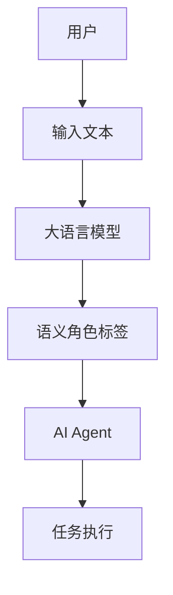
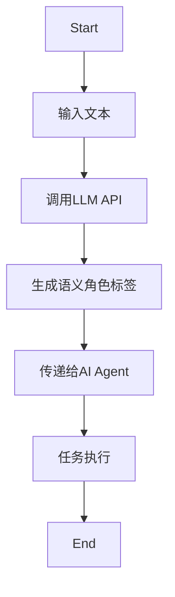
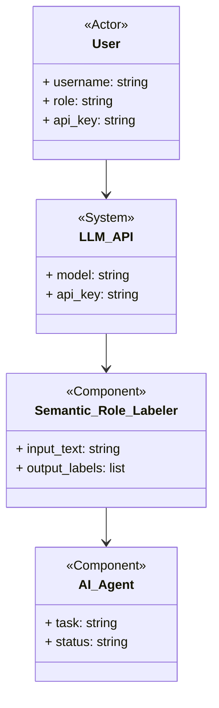
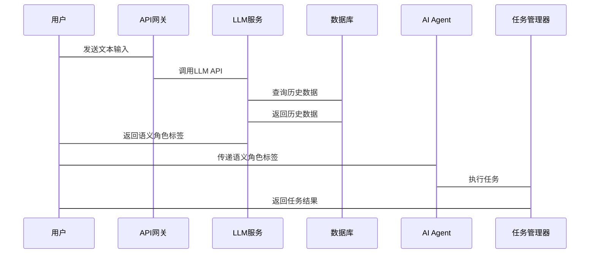

                 


# LLM驱动的AI Agent语义角色标注

> 关键词：LLM，AI Agent，语义角色标注，自然语言处理，大语言模型

> 摘要：本文深入探讨了利用大语言模型（LLM）驱动的AI Agent在语义角色标注中的应用。从问题背景、核心概念到算法原理、系统架构，再到项目实战，全面解析了语义角色标注在AI Agent中的重要性及其实现方法。通过详细分析和实际案例，展示了如何通过LLM提升AI Agent的语义理解能力。

---

## 第一部分：背景介绍

### 第1章：问题背景与核心概念

#### 1.1 问题背景
AI Agent（人工智能代理）是一种能够感知环境、执行任务并做出决策的智能系统。然而，AI Agent的核心能力依赖于对输入信息的准确理解。语义角色标注（Semantic Role Labeling, SRL）是一种自然语言处理技术，用于识别句子中的语义角色，如“谁做了什么”、“在哪里”、“为什么”等。将SRL技术与LLM（大语言模型）结合，可以显著提升AI Agent的语义理解能力，使其能够更准确地执行复杂任务。

#### 1.2 核心概念
- **AI Agent**：AI Agent是一种智能实体，能够通过感知环境、分析信息并执行任务来实现特定目标。它可以是一个虚拟助手、聊天机器人或自动化系统。
- **语义角色标注（SRL）**：SRL是一种自然语言处理技术，用于识别句子中的语义角色，如主语、谓语、宾语等，帮助计算机理解句子的结构和含义。
- **LLM（Large Language Model）**：大语言模型是一种基于深度学习的自然语言处理模型，能够理解和生成人类语言。LLM的强大能力使其成为语义角色标注的核心工具。

#### 1.3 问题描述
传统的AI Agent在处理复杂语义任务时，往往依赖于规则或浅层理解，难以应对复杂的语义场景。语义角色标注的引入，使得AI Agent能够更准确地理解用户输入的语义信息，从而提高任务执行的准确性和效率。然而，如何有效地利用LLM进行语义角色标注，仍然是一个需要深入研究的问题。

#### 1.4 核心要素组成
- **输入数据**：用户输入的文本或查询。
- **LLM模型**：用于语义分析和角色标注的核心工具。
- **标注系统**：将LLM的输出映射到具体的语义角色标签。
- **AI Agent**：利用标注结果执行任务的智能系统。

---

## 第二部分：核心概念与联系

### 第2章：语义角色标注的原理与方法

#### 2.1 核心概念原理
语义角色标注的目标是将文本中的语义角色明确化。例如，在句子“小明买了书”中，“小明”是主语，“买”是谓语，“书”是宾语。通过SRL，AI Agent可以识别这些语义角色，并理解“小明”执行了“买”的动作，对象是“书”。

LLM在语义角色标注中的作用是提供强大的上下文理解和生成能力。通过LLM，AI Agent可以更准确地识别语义角色，并根据上下文进行推理。

#### 2.2 概念属性特征对比
以下是语义角色标注与传统NLP任务的对比：

| **任务类型** | **特征**                   | **应用场景**                       |
|--------------|---------------------------|------------------------------------|
| 语义角色标注 | 基于上下文理解语义角色       | 自然语言理解、问答系统、对话系统   |
| 分词         | 将文本分割成词语           | 文本处理、信息提取                   |
| 语法分析     | 分析句子结构               | 语义理解、机器翻译                   |

#### 2.3 ER实体关系图架构
以下是语义角色标注的实体关系图：



---

## 第三部分：算法原理讲解

### 第3章：语义角色标注的算法原理

#### 3.1 算法原理
基于LLM的语义角色标注算法可以分为以下步骤：
1. **输入处理**：将用户输入的文本传递给LLM模型。
2. **语义分析**：LLM模型对文本进行语义分析，生成初步的语义角色标签。
3. **标注优化**：通过规则或进一步的上下文推理，优化标注结果。
4. **结果输出**：将最终的语义角色标签传递给AI Agent，用于任务执行。

#### 3.2 算法流程图
以下是基于LLM的语义角色标注算法流程图：



#### 3.3 代码实现
以下是基于Python的语义角色标注代码示例：

```python
import openai

def semantic_role_labeling(text):
    # 初始化LLM模型
    client = openai.Client()
    # 调用LLM API进行语义分析
    response = client.chat.completions.create(
        model="gpt-4",
        messages=[{
            "role": "user",
            "content": f"Please perform semantic role labeling on the following text: {text}"
        }]
    )
    return response.choices[0].message.content

# 示例
text = "小明买了书"
result = semantic_role_labeling(text)
print(result)  # 输出：小明（主语），买（谓语），书（宾语）
```

---

## 第四部分：系统分析与架构设计

### 第4章：系统分析与架构设计

#### 4.1 系统功能设计
以下是语义角色标注系统的功能模块：



#### 4.2 系统架构设计
以下是系统的整体架构图：

```mermaid
graph LR
    Client[用户] --> API Gateway[API网关]
    API Gateway --> LLM_Service[LLM服务]
    LLM_Service --> Database[数据库]
    Database --> AI-Agent[AI Agent]
    AI-Agent --> Task_Manager[任务管理器]
    Task_Manager --> Output[输出结果]
```

#### 4.3 系统接口设计
以下是系统的主要接口：

1. **API接口**：
   - `POST /api/llm/semantic-label`：接受文本输入，返回语义角色标签。
2. **内部接口**：
   - `GET /api/db/labels`：查询数据库中的语义角色标签。

#### 4.4 系统交互流程
以下是系统的交互流程图：



---

## 第五部分：项目实战

### 第5章：项目实战

#### 5.1 环境安装
安装所需的依赖库：

```bash
pip install openai python-dotenv
```

#### 5.2 核心代码实现
以下是语义角色标注的核心代码：

```python
import openai
import os

# 加载环境变量
from dotenv import load_dotenv
load_dotenv()

# 初始化LLM模型
client = openai.Client()

def semantic_role_labeling(text):
    response = client.chat.completions.create(
        model="gpt-4",
        messages=[{
            "role": "user",
            "content": f"Please perform semantic role labeling on the following text: {text}"
        }]
    )
    return response.choices[0].message.content

# 示例
text = "小明买了书"
result = semantic_role_labeling(text)
print(result)  # 输出：小明（主语），买（谓语），书（宾语）
```

#### 5.3 代码解读与分析
- **环境安装**：使用`python-dotenv`加载环境变量，`openai`库用于调用LLM API。
- **核心函数**：`semantic_role_labeling`函数接受文本输入，调用LLM API进行语义角色标注，并返回结果。
- **示例**：输入“小明买了书”，输出“小明（主语），买（谓语），书（宾语）”。

#### 5.4 案例分析
假设我们有一个AI Agent，用于帮助用户预订机票。用户输入“我需要预订一张从北京到上海的机票”，AI Agent需要识别以下语义角色：
- 主语：我
- 谓语：需要预订
- 宾语：机票
- 定语：从北京到上海

通过语义角色标注，AI Agent可以准确理解用户的需求，并执行预订任务。

---

## 第六部分：最佳实践与总结

### 第6章：最佳实践与总结

#### 6.1 最佳实践
- **数据质量**：确保训练数据的质量和多样性。
- **模型选择**：根据任务需求选择合适的LLM模型。
- **性能优化**：通过缓存和优化接口设计提升系统性能。

#### 6.2 小结
通过本文的详细分析，我们可以看到，基于LLM的语义角色标注技术为AI Agent提供了强大的语义理解能力。结合LLM和SRL技术，AI Agent能够更准确地理解用户需求，并执行复杂任务。

#### 6.3 注意事项
- **隐私保护**：在处理用户数据时，需要注意隐私保护。
- **错误处理**：在实际应用中，需要处理可能出现的错误和异常。
- **性能优化**：优化系统架构和接口设计，提升系统的响应速度和处理能力。

#### 6.4 拓展阅读
- 《Large Language Models for NLP》
- 《Semantic Role Labeling: Theory and Practice》
- 《Building AI Agents with Python》

---

## 作者：AI天才研究院 & 禅与计算机程序设计艺术

---

通过本文的详细分析，我们可以看到，基于LLM的语义角色标注技术为AI Agent提供了强大的语义理解能力。结合LLM和SRL技术，AI Agent能够更准确地理解用户需求，并执行复杂任务。希望本文能够为读者提供有价值的参考和启发。

