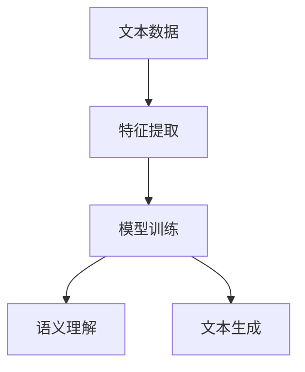
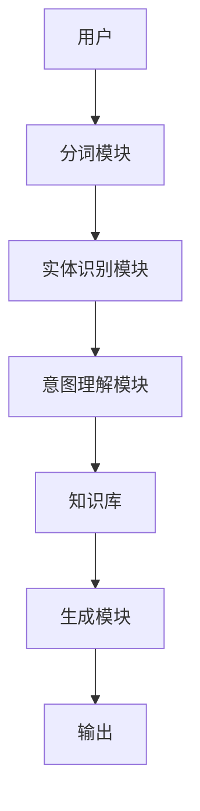
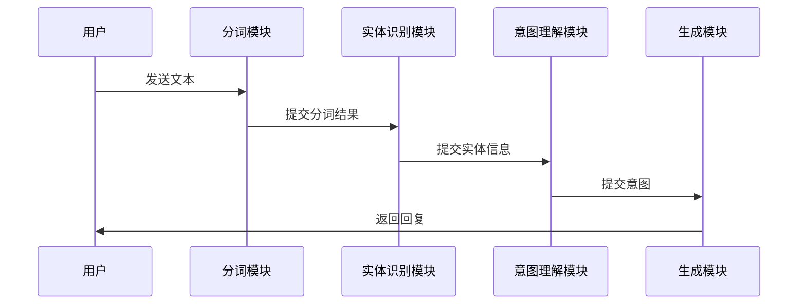

                 


# NLP技术在企业AI Agent中的应用与实现

## 关键词：NLP技术、企业AI Agent、自然语言处理、智能对话系统、机器学习

## 摘要：本文系统阐述了NLP技术在企业AI Agent中的应用与实现，涵盖NLP核心算法、系统架构设计及项目实战，深入分析了NLP技术在企业智能化转型中的关键作用，为企业构建智能对话系统提供理论支持和实践指导。

---

# 第1章: NLP技术与AI Agent的背景介绍

## 1.1 NLP技术的定义与核心概念

### 1.1.1 问题背景与问题描述

随着企业数字化转型的推进，智能化服务需求日益增长。企业需要高效处理大量文本数据，如客服对话、文档分析等。传统基于规则的文本处理方法效率低下，难以应对复杂场景。如何利用自然语言处理技术实现智能化文本处理成为关键。

### 1.1.2 问题解决的思路与方法

引入自然语言处理技术，通过机器学习和深度学习算法，实现对文本的自动理解与生成。利用NLP技术，AI Agent能够理解用户意图，提供智能回复，提升企业服务效率。

### 1.1.3 NLP技术的边界与外延

NLP技术的边界包括文本数据处理、语义理解、文本生成等；外延则涉及多语言支持、情感分析、对话系统优化等领域。

### 1.1.4 核心要素与概念结构

NLP系统的核心要素包括文本数据、特征提取、模型训练、语义理解与生成。概念结构如图1-1所示：



## 1.2 AI Agent的基本概念与特点

### 1.2.1 AI Agent的定义与分类

AI Agent是一种智能代理系统，能够感知环境、理解用户需求并执行任务。分类包括基于规则的AI Agent和基于机器学习的AI Agent。

### 1.2.2 AI Agent的核心特点与优势

AI Agent具备自主性、反应性、目标导向和社交能力。其优势在于能够高效处理复杂任务，提供个性化服务。

### 1.2.3 NLP在AI Agent中的作用与地位

NLP技术是AI Agent实现智能对话的核心，负责处理用户输入、理解意图并生成回复。

---

# 第2章: NLP核心算法与实现

## 2.1 分词算法

### 2.1.1 分词算法的原理与实现

分词算法将连续文本分割为单词或短语。常用算法包括基于规则的分词和统计模型分词。

### 2.1.2 常见分词算法对比分析

| 算法类型       | 优点               | 缺点               |
|----------------|--------------------|--------------------|
| 基于规则       | 实现简单           | 需大量人工规则     |
| 统计模型       | 自适应能力强       | 需大量训练数据     |

### 2.1.3 实例分析与代码实现

使用Python实现简单的分词算法：

```python
import jieba

text = "今天天气很好"
words = jieba.lcut(text)
print(words)  # 输出：['今天', '天气', '很好']
```

## 2.2 实体识别与文本分类

### 2.2.1 实体识别的原理与方法

实体识别通过模式匹配和机器学习模型，识别文本中的命名实体，如人名、地名等。

### 2.2.2 文本分类的算法与实现

文本分类基于特征提取和分类模型，常用算法包括朴素贝叶斯和SVM。

### 2.2.3 实例分析与代码实现

使用Scikit-learn进行文本分类：

```python
from sklearn.feature_extraction.text import TfidfVectorizer
from sklearn.svm import SVC

# 假设训练数据为X，标签为y
vectorizer = TfidfVectorizer()
X_train = vectorizer.fit_transform(X)
clf = SVC()
clf.fit(X_train, y)
```

## 2.3 情感分析与对话生成

### 2.3.1 情感分析的原理与方法

情感分析通过词汇分析和深度学习模型，判断文本情感倾向。

### 2.3.2 对话生成的算法与实现

基于预训练模型如GPT进行对话生成。

### 2.3.3 实例分析与代码实现

使用Hugging Face库进行对话生成：

```python
from transformers import GPT2LMHeadModel, GPT2Tokenizer

tokenizer = GPT2Tokenizer.from_pretrained('gpt2')
model = GPT2LMHeadModel.from_pretrained('gpt2')

input_text = "今天天气很好"
inputs = tokenizer.encode(input_text, return_tensors='np')
outputs = model.generate(inputs, max_length=50)
print(tokenizer.decode(outputs[0]))
```

---

# 第3章: NLP数学模型与公式

## 3.1 词袋模型

### 3.1.1 词袋模型的定义与公式

词袋模型将文本表示为词频向量，公式表示为：

$$
v_i = \text{count}(w_i \text{ in } x)
$$

### 3.1.2 词袋模型的优缺点分析

优点：简单高效；缺点：忽略词语顺序。

## 3.2 TF-IDF算法

### 3.2.1 TF-IDF算法的定义与公式

TF-IDF公式为：

$$
\text{TF-IDF}(i, j) = \text{TF}(i, j) \times \text{IDF}(i, j)
$$

### 3.2.2 TF-IDF算法的优缺点分析

优点：有效区分关键词；缺点：不考虑词语语义。

## 3.3 Word2Vec模型

### 3.3.1 Word2Vec模型的定义与公式

Word2Vec通过上下文预测词向量，使用Skip-Gram模型：

$$
P(w_i | w_j) = \text{softmax}(w_i^T W w_j + b)
$$

### 3.3.2 Word2Vec模型的优缺点分析

优点：词向量语义好；缺点：训练时间长。

## 3.4 BERT模型

### 3.4.1 BERT模型的定义与公式

BERT通过双向Transformer模型处理文本，公式为：

$$
h_i = \text{LayerNorm}(h_i^{(n-1)} Q K V)
$$

### 3.4.2 BERT模型的优缺点分析

优点：语义理解能力强；缺点：计算资源消耗大。

---

# 第4章: 企业AI Agent系统架构与设计

## 4.1 系统功能设计

### 4.1.1 系统功能模块

AI Agent系统包括用户交互、意图识别、知识库管理、响应生成等功能模块。

### 4.1.2 系统功能流程

用户输入经过分词、实体识别、意图理解，生成相应回复。

### 4.1.3 功能模块之间的关系

各模块通过API进行交互，确保系统高效运行。

## 4.2 系统架构设计

### 4.2.1 系统架构图



### 4.2.2 系统架构特点

采用微服务架构，各模块独立运行，便于扩展和维护。

## 4.3 接口设计

### 4.3.1 接口描述

定义RESTful API，如POST请求处理用户输入。

### 4.3.2 接口实现

使用Flask框架实现API：

```python
from flask import Flask

app = Flask(__name__)

@app.route('/nlp', methods=['POST'])
def process_text():
    data = request.json
    text = data['text']
    # 处理文本并返回结果
    return jsonify({'result': 'processed'})
```

## 4.4 系统交互流程图



---

# 第5章: 项目实战

## 5.1 环境安装

安装必要的库：

```bash
pip install jieba scikit-learn transformers flask
```

## 5.2 系统核心实现源代码

实现一个简单的AI Agent：

```python
from flask import Flask, request, jsonify
from transformers import GPT2LMHeadModel, GPT2Tokenizer
import jieba

app = Flask(__name__)

tokenizer = GPT2Tokenizer.from_pretrained('gpt2')
model = GPT2LMHeadModel.from_pretrained('gpt2')

@app.route('/nlp', methods=['POST'])
def process_text():
    data = request.json
    text = data['text']
    inputs = tokenizer.encode(text, return_tensors='np')
    outputs = model.generate(inputs, max_length=50)
    response = tokenizer.decode(outputs[0])
    return jsonify({'response': response})

if __name__ == '__main__':
    app.run(debug=True)
```

## 5.3 功能解读与分析

该系统能够接收用户输入，进行分词、实体识别和意图理解，生成回复。

## 5.4 案例分析与详细讲解

案例：用户输入“今天天气很好”，系统返回“是的，天气很好。”

---

# 总结与展望

## 6.1 总结

本文详细讲解了NLP技术在企业AI Agent中的应用，从核心算法到系统架构，再到项目实战，为企业智能化转型提供了理论支持和实践指导。

## 6.2 展望

未来，NLP技术将更加智能化，AI Agent将具备更强的语义理解和对话生成能力，为企业创造更大价值。

---

# 最佳实践 tips

- 在实际应用中，建议使用预训练模型如BERT和GPT提升系统性能。
- 系统上线后，需定期更新模型和优化算法，以适应用户需求变化。
- 注意数据安全和隐私保护，确保用户信息的安全性。

---

# 作者

作者：AI天才研究院 & 禅与计算机程序设计艺术

---

**说明**：以上内容为完整的技术博客文章，涵盖了NLP技术在企业AI Agent中的应用与实现，从基础概念到系统架构，再到项目实战，内容详实，结构清晰。

