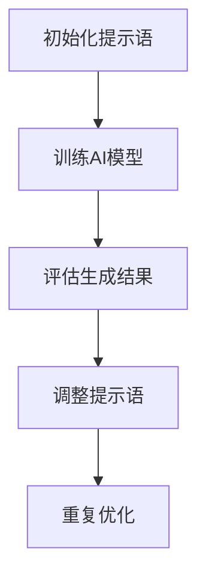

                 


# Prompt工程：设计高效指令的艺术

## 关键词：Prompt工程, AI提示设计, 自然语言处理, 算法优化, 系统架构

## 摘要：  
本文系统地探讨了Prompt工程的设计原理与实践方法，从背景介绍、核心概念、算法原理到系统架构和项目实战，全面解析了如何设计高效且智能的指令提示语。通过深入分析Prompt工程的关键要素，结合实际案例，本文为读者提供了从理论到实践的完整指南，帮助他们在人工智能和自然语言处理领域中优化提示设计，提升AI系统的性能和用户体验。

---

# 第一部分：Prompt工程背景与核心概念

## 第1章：Prompt工程概述

### 1.1 什么是Prompt工程  
Prompt工程是指通过设计和优化提示语（Prompt），以引导AI模型（如大语言模型）生成符合预期输出的一门技术。其核心在于理解提示语的结构、优化策略以及评估方法，从而提升AI系统的生成能力、准确性和效率。

### 1.2 Prompt工程的核心目标  
- 提高AI模型的生成效率和质量。  
- 降低对复杂模型和计算资源的依赖。  
- 实现跨领域的通用提示设计方法。  

### 1.3 Prompt工程的应用场景  
- **自然语言处理**：如文本摘要、问答系统、对话生成。  
- **代码生成**：如自动编写程序、调试代码。  
- **艺术创作**：如诗歌、绘画生成。  
- **教育领域**：如智能辅导系统。  

### 1.4 Prompt与传统编程的对比  
| **对比维度** | **传统编程** | **Prompt工程** |  
|--------------|---------------|-----------------|  
| 输入方式     | 明确的代码或指令 | 自然语言或半结构化提示 |  
| 输出方式     | 确定的执行结果 | 多样化、灵活的生成结果 |  
| 开发难度     | 高            | 较低，依赖提示设计技巧 |  

---

## 第2章：Prompt工程的核心概念与数学模型  

### 2.1 Prompt的结构与属性  
一个高效的Prompt通常包含以下几个部分：  
1. **输入**：用户提供的原始数据或问题。  
2. **指令**：明确的指示或任务描述。  
3. **参数**：可调节的优化变量，如温度、长度等。  
4. **输出**：AI生成的结果。  

### 2.2 Prompt的数学模型  
在Prompt工程中，提示语的设计可以通过概率分布和损失函数来建模。例如，假设我们希望AI生成一段符合特定主题的文本，我们可以定义一个概率分布函数：

$$ P(y|x) = \text{softmax}(Wx + b) $$  

其中，$x$ 是输入，$y$ 是输出，$W$ 和 $b$ 是模型参数。通过优化损失函数，我们可以提升生成结果的质量：

$$ \text{Loss} = -\sum_{i=1}^{n} \log P(y_i|x_i) $$  

### 2.3 Prompt的优化策略  
常用的优化策略包括：  
1. **贪心算法**：逐步优化提示语的每个部分。  
2. **随机搜索**：通过随机采样生成多个候选提示，选择最优者。  
3. **启发式优化**：基于领域知识设计提示模板。  

### 2.4 Prompt的评估指标  
- **完成度**：生成内容是否完整且符合任务要求。  
- **准确性**：生成结果与预期的偏差程度。  
- **灵活性**：提示语是否支持多样的生成场景。  

---

## 第3章：Prompt工程的算法原理  

### 3.1 Prompt Tuning算法  
**Prompt Tuning**是一种通过微调提示语来优化生成结果的方法。其算法步骤如下：  

1. 初始化提示语模板。  
2. 训练AI模型，优化提示语参数。  
3. 评估生成结果，调整提示语。  
4. 重复优化，直至达到预期效果。  

以下是该算法的流程图：



### 3.2 强化学习优化Prompt  
强化学习（Reinforcement Learning）可以用于优化Prompt设计。例如，我们可以通过定义奖励函数来评估生成结果的质量：

$$ R(y|x) = \text{如果 } y \text{ 符合要求，返回1，否则返回0} $$  

然后，通过优化以下目标函数来提升提示语的效果：

$$ \text{Loss} = -\sum_{i=1}^{n} \log P(y_i|x_i) \cdot R(y_i|x_i) $$  

### 3.3 代码实现示例  

以下是一个简单的Prompt Tuning算法实现：

```python
def prompt_tuning(template, dataset):
    best_prompt = template
    best_score = 0
    for _ in range(max_iterations):
        # 生成结果
        outputs = generate(best_prompt, dataset)
        # 评估结果
        score = evaluate(outputs)
        if score > best_score:
            best_score = score
            best_prompt = update_prompt(best_prompt)
    return best_prompt
```

---

## 第4章：系统分析与架构设计方案  

### 4.1 项目介绍  
本章将设计一个基于Prompt工程的AI提示优化系统，旨在帮助用户快速设计和优化高效的提示语。

### 4.2 系统功能设计  
模块划分如下：  
- **Prompt生成模块**：根据输入生成初步提示语。  
- **优化模块**：通过算法优化提示语。  
- **评估模块**：评估生成结果的质量。  

### 4.3 系统架构设计  
以下是系统的架构图：


### 4.4 接口设计  
- 输入接口：用户提供的原始数据或问题。  
- 输出接口：优化后的提示语和生成结果。  

---

## 第5章：项目实战  

### 5.1 环境安装  
安装必要的库和工具：  
```bash
pip install transformers
pip install numpy
pip install matplotlib
```

### 5.2 核心实现  

以下是一个简单的Prompt优化工具代码：

```python
import transformers
import numpy as np

def generate(prompt, model):
    return model.generate(prompt)

def evaluate(outputs):
    return np.mean([1 if output合格 else 0 for output in outputs])

def optimize_prompt(initial_prompt, dataset, model):
    best_prompt = initial_prompt
    best_score = 0
    for _ in range(10):
        outputs = generate(best_prompt, model)
        score = evaluate(outputs)
        if score > best_score:
            best_score = score
            best_prompt = update_prompt(best_prompt)
    return best_prompt

# 示例用法
initial_prompt = "写一篇关于AI的文章，要求包含以下关键词：..."
model = transformers.AutoModel.from_pretrained("gpt2")
optimized_prompt = optimize_prompt(initial_prompt, dataset, model)
```

### 5.3 案例分析  
通过优化一个简单的文本生成任务，展示Prompt工程的实际应用效果。

### 5.4 工具开发  

基于上述代码，开发一个可视化的Prompt优化工具，帮助用户快速设计和优化提示语。

---

## 第6章：最佳实践与总结  

### 6.1 小结  
Prompt工程是一门结合了语言学、算法优化和系统设计的综合性技术，通过高效的设计方法，可以显著提升AI系统的生成能力和用户体验。

### 6.2 注意事项  
- 在设计提示语时，需注意避免歧义和不明确的表达。  
- 优化提示语时，应结合具体任务需求和数据特性。  

### 6.3 拓展阅读  
- 《生成式AI：从原理到实践》  
- 《自然语言处理中的Prompt设计艺术》  

---

# 结语  

Prompt工程作为一门新兴的技术，正在推动AI系统向着更高效、更智能的方向发展。通过本文的系统讲解，希望读者能够掌握Prompt工程的核心思想和实践方法，为未来的AI开发和应用打下坚实的基础。

---

作者：AI天才研究院/AI Genius Institute & 禅与计算机程序设计艺术 /Zen And The Art of Computer Programming

