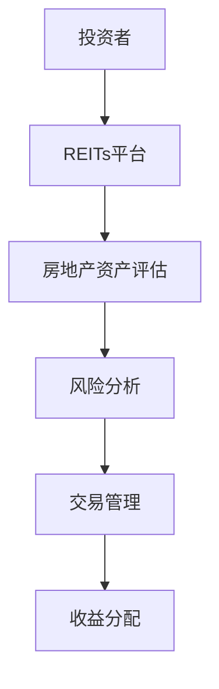

                 


# REITs投资：房地产市场的流动性解决方案

> 关键词：REITs，房地产市场，流动性，投资策略，风险管理，资产证券化

> 摘要：房地产投资信托基金（REITs）通过将房地产资产证券化，为投资者提供了高流动性解决方案，同时优化了房地产市场的资金配置。本文将深入探讨REITs的核心概念、运作机制、投资策略、风险管理及其在现代金融体系中的作用。

---

## 第一部分：背景介绍

### 第1章：REITs的起源与发展

#### 1.1 REITs的定义与特点
- **1.1.1 REITs的基本定义**
  REITs（房地产投资信托基金）是一种通过汇集资金投资于房地产资产（如办公楼、零售物业、酒店等）并通过上市或私募方式向投资者提供定期收益的金融工具。

- **1.1.2 REITs的核心特点**
  - 高流动性：投资者可以轻松买卖REITs份额。
  - 透明度高：定期披露财务信息，便于投资者评估。
  - 分散风险：通过多元化投资降低风险。

- **1.1.3 REITs与传统房地产投资的区别**
  REITs将房地产资产证券化，使中小投资者也能参与房地产投资，而传统房地产投资通常需要大量资金和长期持有。

#### 1.2 REITs的起源与发展历程
- **1.2.1 REITs的起源背景**
  20世纪60年代，美国通过REITs法案，允许REITs在交易所上市，为投资者提供流动性。

- **1.2.2 REITs的发展阶段**
  - 初期：主要在美国发展，集中在商业地产。
  - 成熟期：全球化发展，覆盖住宅、零售等多种地产类型。

- **1.2.3 REITs在全球范围内的发展现状**
  目前，全球多个国家和地区都有REITs市场，规模持续增长。

#### 1.3 REITs的运作机制
- **1.3.1 REITs的基本运作流程**
  1. 投资者购买REITs份额，资金汇集用于购买房地产资产。
  2. REITs管理团队负责运营和管理这些资产。
  3. 收益按比例分配给投资者。

- **1.3.2 REITs的收益来源**
  - 租金收入：主要来自所持物业的租金。
  - 资本增值：物业升值带来的收益。

- **1.3.3 REITs的管理与运营模式**
  REITs通常由专业管理公司运营，确保资产高效管理。

---

## 第二部分：REITs的核心概念与联系

### 第2章：REITs与房地产市场的关系

#### 2.1 房地产市场的流动性问题
- **2.1.1 房地产市场的流动性特点**
  房地产资产通常流动性差，买卖周期长，交易成本高。

- **2.1.2 流动性不足对房地产市场的影响**
  限制了资金的有效配置，影响市场活力。

#### 2.2 REITs作为流动性解决方案的优势
- **2.2.1 REITs如何提高房地产资产的流动性**
  通过证券化，投资者可以轻松买卖REITs份额，提高资产流动性。

- **2.2.2 REITs对投资者和房地产市场双方的益处**
  - 投资者：获得房地产投资机会，分散风险。
  - 市场：优化资金配置，促进市场发展。

### 第2.3 REITs对房地产市场的长期影响
- **2.3.1 REITs对房地产市场结构的优化作用**
  通过引入更多投资者，促进市场竞争和效率提升。

- **2.3.2 REITs对房地产市场发展的推动作用**
  为房地产开发提供更多资金来源，推动市场扩展。

---

## 第三部分：REITs的算法原理

### 第3章：REITs的评估与定价

#### 3.1 REITs的估值方法
- **3.1.1 净现值法（NPV）**
  通过预测未来现金流的现值来评估REITs的内在价值。

  $$ NPV = \sum_{t=1}^{n} \frac{CF_t}{(1 + r)^t} $$

- **3.1.2 内部收益率法（IRR）**
  计算使净现值为零的折现率，衡量投资回报率。

  $$ IRR = r \text{ 使得 } NPV = 0 $$

#### 3.2 REITs的定价模型
- **3.2.1 资本资产定价模型（CAPM）**
  用于评估REITs的预期收益。

  $$ E(R) = R_f + \beta (R_m - R_f) $$

- **3.2.2 风险调整后的收益模型**
  结合资产的风险水平进行定价。

---

## 第四部分：REITs的系统分析与架构设计

### 第4章：REITs的系统架构

#### 4.1 系统功能模块
- **4.1.1 资产评估模块**
  负责评估房地产资产的价值，计算潜在收益。

- **4.1.2 风险分析模块**
  评估投资风险，如市场风险、流动性风险。

- **4.1.3 交易管理模块**
  处理REITs的买卖交易，确保资金流动。

#### 4.2 系统架构图


---

## 第五部分：REITs的项目实战

### 第5章：REITs的实际应用

#### 5.1 环境安装
- 安装Python和相关库（pandas、numpy、matplotlib）用于数据分析。

#### 5.2 核心代码实现
```python
import pandas as pd
import numpy as np

# 示例数据：REITs的现金流和贴现率
cash_flows = [100, 150, 200, 180, 160]
discount_rate = 0.08

# 计算净现值
npv = np.npv(discount_rate, cash_flows)
print(f"净现值：{npv}")
```

#### 5.3 案例分析
分析某REITs项目，计算其NPV和IRR，评估投资可行性。

---

## 第六部分：结论与展望

### 第6章：总结与未来趋势

#### 6.1 结论
REITs作为房地产市场的流动性解决方案，有效解决了资产流动性问题，为投资者提供了新的投资渠道。

#### 6.2 未来展望
随着技术进步和市场需求变化，REITs将在房地产市场中扮演更加重要的角色，推动市场进一步发展。

---

## 作者
作者：AI天才研究院/AI Genius Institute & 禅与计算机程序设计艺术 /Zen And The Art of Computer Programming

---

这篇文章全面探讨了REITs的投资策略、运作机制及其对房地产市场的深远影响，结合了理论分析和实际案例，为读者提供了深入的见解和实用的知识。

