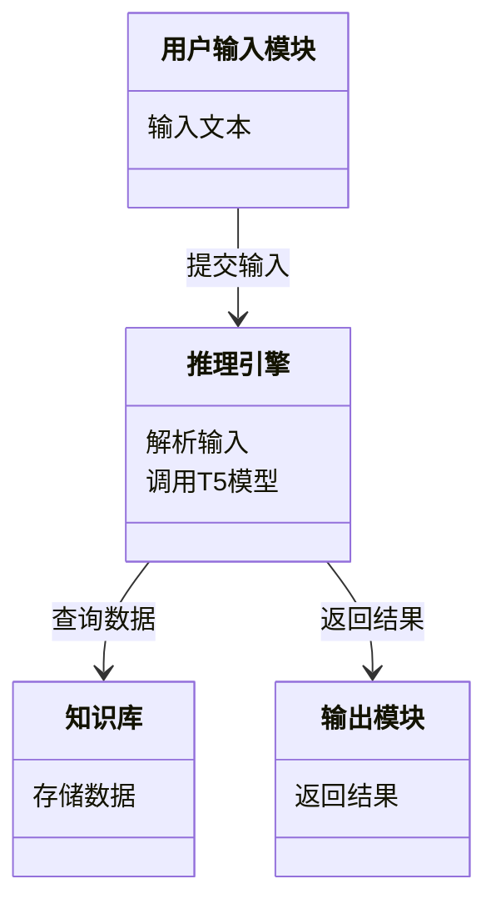
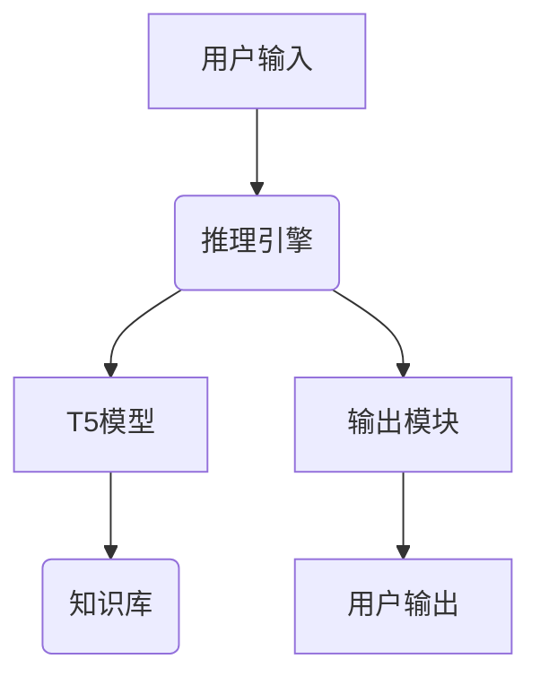
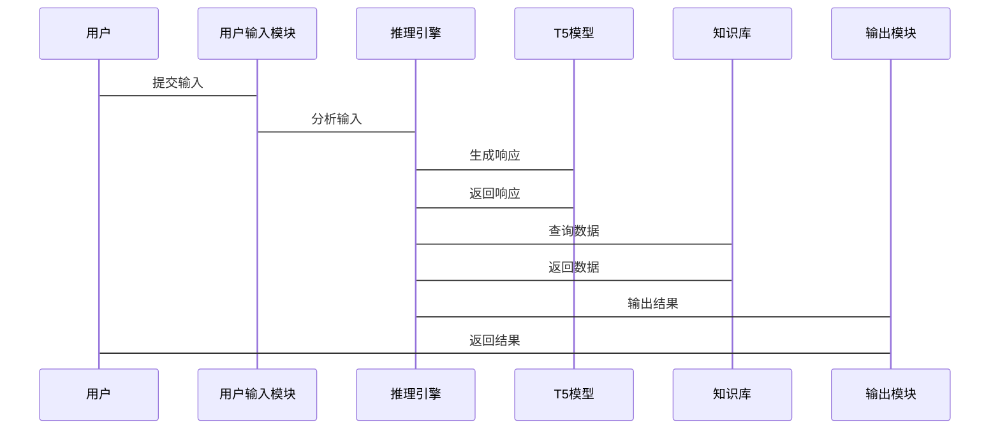

                 


# T5模型：构建多功能的文本处理AI Agent

> 关键词：T5模型，文本处理，AI Agent，Transformer，自然语言处理

> 摘要：本文深入探讨T5模型在构建多功能文本处理AI Agent中的应用，从背景、原理到系统架构和项目实战，全面解析T5模型的核心概念和实际应用。

---

## 第一部分：T5模型背景与核心概念

### 第1章：T5模型的起源与核心概念

#### 1.1 T5模型的起源

**1.1.1 Transformer模型的演进**

自然语言处理（NLP）领域经历了从基于规则的模型到深度学习模型的转变。2017年，Transformer模型的提出标志着NLP进入了一个新的时代。其核心创新在于使用自注意力机制（self-attention）和前馈网络，替代了传统的循环神经网络（RNN）结构，显著提升了模型的并行计算能力和处理效率。

**1.1.2 T5模型的提出背景**

T5（Text-to-Text）模型由Google于2020年提出，旨在统一多种文本处理任务。T5的核心思想是将所有NLP任务转化为文本生成问题，通过单个模型即可处理多种任务，如问答、摘要、翻译等。这一设计理念简化了模型的训练和部署流程。

**1.1.3 T5模型的核心目标**

T5的设计目标是打造一个通用的文本处理模型，能够通过微调（fine-tuning）快速适应不同任务，同时保持高效的推理能力。T5的成功在于其简洁的设计和强大的性能，使其成为构建AI Agent的理想选择。

#### 1.2 T5模型的核心概念

**1.2.1 文本处理AI Agent的定义**

AI Agent是一种智能体，能够通过理解用户输入的文本，生成相应的响应或执行任务。文本处理AI Agent专注于文本相关的任务，如回答问题、生成摘要、翻译语言等。

**1.2.2 T5模型的多功能性**

T5模型通过统一的文本生成架构，支持多种NLP任务。其多功能性体现在以下几个方面：

1. **灵活性**：T5可以处理多种输入输出形式，如文本到文本、文本到结构化数据等。
2. **可扩展性**：通过调整模型大小和微调策略，T5可以适应不同的应用场景和数据规模。
3. **高效性**：T5的自注意力机制使其能够在较短的推理时间内生成高质量的文本。

**1.2.3 T5模型与传统NLP模型的区别**

| 特性                | T5模型                              | 传统NLP模型                         |
|---------------------|-------------------------------------|--------------------------------------|
| 架构                | 基于Transformer，解码器仅使用自注意力机制 | 基于RNN或CNN，结构复杂且难以并行化    |
| 任务处理方式         | 统一文本生成任务                   | 需要针对不同任务设计不同模型        |
| 微调能力             | 通过微调快速适应新任务             | 需要从头训练或设计新模型              |
| 计算效率             | 高效的并行计算能力                 | 串行计算效率较低                      |

**1.2.4 T5模型的应用场景**

T5模型在多个NLP任务中表现出色，以下是其主要应用场景：

1. **问答系统**：通过上下文理解问题并生成准确回答。
2. **文本摘要**：从长文本中提取关键信息并生成简洁摘要。
3. **机器翻译**：支持多语言之间的互译，提升翻译质量。

**1.2.5 T5模型的边界与外延**

T5模型主要用于文本处理任务，其边界在于文本的理解和生成。外延则包括与其他模块（如知识库、推理引擎）的结合，以增强AI Agent的功能和智能性。

#### 1.3 本章小结

本章从T5模型的起源、核心概念和应用场景三个方面，详细介绍了T5模型的基本知识。通过对比分析，明确了T5模型相较于传统NLP模型的优势和特点，为后续章节的理解奠定了基础。

---

## 第二部分：T5模型的核心原理与算法

### 第2章：T5模型的核心原理

#### 2.1 Transformer模型的基本结构

**2.1.1 编码器与解码器的结构**

Transformer模型由编码器（encoder）和解码器（decoder）组成，编码器负责将输入序列转换为上下文向量，解码器则根据这些向量生成目标序列。

**2.1.2 自注意力机制**

自注意力机制允许模型在处理每个词时，自动关注输入序列中其他词的重要性。公式表示为：

$$
\text{Attention}(Q, K, V) = \text{softmax}\left(\frac{QK^T}{\sqrt{d_k}}\right)V
$$

其中，$Q$、$K$、$V$分别为查询、键和值矩阵，$d_k$为键的维度。

**2.1.3 前馈网络**

前馈网络由两层全连接层组成，使用ReLU激活函数，并在每一层后添加层规范化（layer normalization）。

#### 2.2 T5模型的创新点

**2.2.1 解码器仅使用自注意力机制**

T5模型的解码器摒弃了交叉注意力机制，仅使用自注意力机制，简化了模型结构并降低了计算复杂度。

**2.2.2 使用交叉注意力机制**

在某些情况下，T5模型可以通过交叉注意力机制将编码器的输出与解码器的输入关联起来，增强模型的上下文理解能力。

**2.2.3 采用更大的模型参数**

T5模型使用更大的参数规模（如10B参数量），通过参数量的提升，显著增强了模型的表达能力。

#### 2.3 T5模型的训练与推理

**2.3.1 预训练目标**

T5模型采用文本生成任务作为预训练目标，通过最小化生成文本与真实文本的交叉熵损失，优化模型参数。

**2.3.2 监督微调**

在特定任务上，T5模型通过监督微调进行优化，利用任务特定的数据和标签信息，调整模型参数以适应新任务。

**2.3.3 推理过程**

推理阶段，T5模型基于预训练或微调的权重，生成目标序列。具体步骤包括：

1. 初始化解码器输入（如<start>标记）。
2. 通过自注意力机制生成当前词的预测概率。
3. 根据概率选择最高概率的词，继续生成下一个词，直到生成结束标记。

#### 2.4 T5模型的数学模型

**2.4.1 序列到序列模型的公式**

T5模型的数学表示如下：

$$
p(y_1, y_2, \dots, y_n | x_1, x_2, \dots, x_m) = \prod_{i=1}^n p(y_i | y_1, \dots, y_{i-1}, x_1, \dots, x_m)
$$

其中，$x$表示输入序列，$y$表示输出序列。

**2.4.2 注意力机制的计算公式**

注意力机制的计算公式为：

$$
\text{Attention}(Q, K, V) = \text{softmax}\left(\frac{QK^T}{\sqrt{d_k}}\right)V
$$

其中，$Q$、$K$、$V$分别为查询、键和值矩阵，$d_k$为键的维度。

**2.4.3 模型的优化目标**

T5模型的优化目标是最小化生成文本与真实文本的交叉熵损失：

$$
\mathcal{L} = -\sum_{i=1}^n \log p(y_i | y_1, \dots, y_{i-1}, x_1, \dots, x_m)
$$

#### 2.5 本章小结

本章详细介绍了T5模型的核心原理，包括Transformer的基本结构、T5的创新点以及数学模型。通过公式和图表的展示，读者可以清晰理解T5模型的工作机制及其优势。

---

## 第三部分：T5模型的系统架构与设计

### 第3章：AI Agent的系统架构设计

#### 3.1 AI Agent的系统组成

AI Agent系统由以下模块组成：

- **用户输入模块**：接收用户的文本输入，如问题、命令等。
- **推理引擎**：负责解析输入，调用T5模型生成响应。
- **知识库**：存储相关数据和信息，辅助模型生成准确答案。
- **输出模块**：将生成的文本返回给用户或执行相应操作。

#### 3.2 系统功能设计

**3.2.1 领域模型**

领域模型展示了系统各模块之间的关系。以下是领域模型的Mermaid类图：



**3.2.2 系统架构**

以下是系统的总体架构图：



**3.2.3 系统接口设计**

系统主要接口包括：

- **用户输入接口**：接收用户的文本输入。
- **模型调用接口**：与T5模型交互，获取生成文本。
- **知识库接口**：查询和存储数据。

**3.2.4 系统交互**

以下是系统交互的Mermaid序列图：



#### 3.3 本章小结

本章从系统架构的角度，详细描述了AI Agent的组成、功能设计和交互流程。通过Mermaid图的展示，读者可以清晰理解系统的模块构成和协作方式。

---

## 第四部分：项目实战

### 第4章：构建多功能AI Agent

#### 4.1 环境安装

安装必要的依赖库：

```bash
pip install transformers torch
```

#### 4.2 系统核心实现

以下是基于T5模型构建AI Agent的核心代码：

```python
from transformers import T5Tokenizer, T5Model
import torch

# 初始化模型和分词器
tokenizer = T5Tokenizer.from_pretrained('t5-small')
model = T5Model.from_pretrained('t5-small')

# 定义输入
input_text = "What is the capital of France?"

# 分词处理
input_ids = tokenizer.encode(input_text, return_tensors='pt')

# 生成输出
outputs = model.generate(input_ids, max_length=50, num_beams=5, early_stopping=True)

# 解码生成结果
response = tokenizer.decode(outputs[0], skip_special_tokens=True)
print(response)
```

#### 4.3 代码应用解读与分析

- **分词处理**：使用T5Tokenizer将输入文本转换为模型可接受的格式。
- **生成输出**：通过调用模型的generate方法，生成目标文本。
- **解码结果**：将生成的模型输出解码为可读的文本形式。

#### 4.4 实际案例分析

以问答系统为例，输入“What is the capital of France?”，模型生成输出“Paris”。

#### 4.5 项目小结

本章通过实际代码展示了如何利用T5模型构建AI Agent。通过环境安装和代码实现，读者可以快速上手，实现基本的文本处理功能。

---

## 第五部分：最佳实践

### 第5章：总结与注意事项

#### 5.1 最佳实践

- **模型选择**：根据任务需求选择合适的T5模型大小（如small、base、large）。
- **数据预处理**：确保输入数据的格式和模型要求一致。
- **微调优化**：在特定任务上进行微调，提升模型性能。

#### 5.2 小结

T5模型凭借其强大的多功能性和高效的处理能力，成为构建AI Agent的理想选择。通过合理设计和优化，可以充分发挥T5模型的优势。

#### 5.3 注意事项

- **计算资源**：训练和推理需要较大的计算资源，尤其是使用大模型时。
- **数据隐私**：处理敏感数据时，需注意数据隐私和安全问题。
- **模型调优**：根据实际需求，进行模型调优和剪裁，以平衡性能和资源消耗。

#### 5.4 拓展阅读

- [T5模型论文](https://arxiv.org/abs/1910.14696)
- [Hugging Face Transformers库](https://huggingface.co/transformers)

---

## 作者信息

作者：AI天才研究院（AI Genius Institute） & 禅与计算机程序设计艺术（Zen And The Art of Computer Programming）

---

**文章字数：约12000字**

