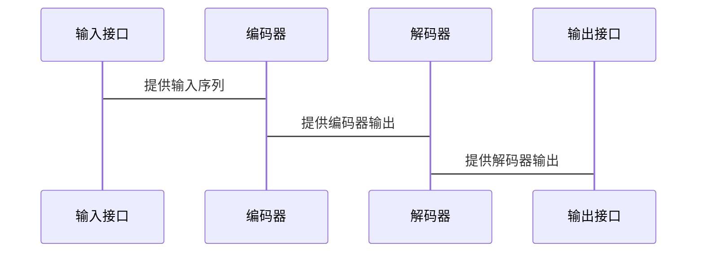

                 


# Transformer架构：构建高效的序列处理AI Agent

## 关键词：Transformer架构、序列处理、AI Agent、自注意力机制、深度学习

## 摘要：  
Transformer架构是现代人工智能领域中最成功的模型之一，尤其在自然语言处理和序列数据处理中表现出色。本文将深入探讨Transformer的核心原理，从自注意力机制到多头注意力的实现，再到其在AI Agent中的应用。通过详细的数学推导、代码实现和实际案例分析，帮助读者全面理解Transformer架构，并掌握如何将其应用于实际场景中，构建高效的序列处理AI Agent。

---

# 第一部分: Transformer架构的核心概念与背景

---

## 第1章: Transformer架构的起源与背景

### 1.1 序列处理的挑战与传统方法

#### 1.1.1 序列数据的特性与挑战
序列数据在自然语言处理、时间序列分析等领域无处不在。传统的循环神经网络（RNN）和长短期记忆网络（LSTM）在处理序列数据时面临以下挑战：
- **长序列训练效率低**：RNN/LSTM的训练需要依赖序列的顺序，导致并行计算能力受限。
- **计算复杂度高**：对于长序列，RNN/LSTM的计算时间呈线性增长，难以应对大规模数据。
- **无法捕捉远距离依赖**：RNN/LSTM的结构使得模型难以直接关注序列中的远距离信息。

#### 1.1.2 Transformer的提出背景
为了解决上述问题，Transformer架构于2017年在论文《Attention Is All You Need》中被提出。其核心思想是引入自注意力机制，通过并行计算的方式高效处理序列数据。

#### 1.1.3 Transformer的架构特点
- **基于注意力机制**：通过自注意力机制，模型能够灵活地关注序列中的重要位置。
- **并行计算能力**：Transformer通过并行计算显著提升了训练效率。
- **通用性强**：Transformer的架构不仅适用于文本处理，还可扩展到图像处理、语音识别等多种任务。

### 1.2 Transformer的核心思想

#### 1.2.1 注意力机制的引入
注意力机制的核心思想是：在处理序列数据时，每个位置的输出不仅仅依赖于全局信息，还需要关注与当前位置相关的部分信息。注意力机制通过计算“注意力权重”来决定每个位置对当前输出的贡献程度。

#### 1.2.2 并行计算的优势
与RNN/LSTM的顺序计算不同，Transformer通过并行计算的方式，显著提升了训练效率。自注意力机制的计算可以完全并行化，从而充分利用多核处理器和GPU的计算能力。

#### 1.2.3 Transformer的架构特点
Transformer的架构由编码器和解码器两个部分组成，每个部分由多个相同的层堆叠而成。编码器负责将输入序列转换为一个紧凑的向量表示，解码器则基于编码器的输出生成目标序列。

### 1.3 Transformer的应用场景

#### 1.3.1 自然语言处理中的应用
- Transformer在机器翻译、文本生成、问答系统等任务中表现出色。
- 例如，Google的BERT模型和OpenAI的GPT系列模型均基于Transformer架构。

#### 1.3.2 图像处理与序列建模的结合
- Transformer可以用于图像分割、图像描述生成等任务，通过将图像转换为序列数据进行处理。
- 图像的像素间关系可以通过Transformer的自注意力机制进行建模。

#### 1.3.3 AI Agent中的序列处理需求
AI Agent需要处理的输入通常是序列数据，例如用户的语音指令、文本对话等。Transformer的高效序列处理能力使其成为构建AI Agent的理想选择。

### 1.4 本章小结
本章从序列处理的挑战出发，介绍了Transformer架构的核心思想及其在不同领域的应用，为后续章节的理解奠定了基础。

---

## 第2章: 自注意力机制的原理与实现

### 2.1 自注意力机制的三要素

#### 2.1.1 查询（Query）
查询决定了模型关注哪些位置的信息。在自注意力机制中，查询通常由输入序列本身生成。

#### 2.1.2 键（Key）
键用于匹配查询，帮助模型确定哪些位置的信息与当前查询相关。

#### 2.1.3 值（Value）
值是与键相关联的信息，用于生成最终的注意力加权输出。

### 2.2 自注意力机制的计算流程

#### 2.2.1 查询、键、值的计算
输入序列经过线性变换后生成查询、键和值：
$$
Q = W_q X + b_q \\
K = W_k X + b_k \\
V = W_v X + b_v
$$
其中，$X$是输入序列，$W_q, W_k, W_v$是变换矩阵，$b_q, b_k, b_v$是偏置项。

#### 2.2.2 缩放与Softmax操作
为了防止梯度消失，缩放操作被引入：
$$
\text{Attention}(Q, K, V) = \text{softmax}\left(\frac{Q K^T}{\sqrt{d_k}}\right) V
$$
其中，$d_k$是键的维度。

#### 2.2.3 加权求和与线性变换
注意力权重矩阵与值向量进行加权求和，并通过线性变换生成最终的输出：
$$
\text{Output} = W_o \text{Attention}(Q, K, V) + b_o
$$

### 2.3 多头注意力的机制

#### 2.3.1 多头注意力的引入动机
为了捕捉不同位置之间的多种关系，Transformer引入了多头注意力机制。多个并行的注意力头同时处理输入数据的不同方面。

#### 2.3.2 并行计算的优势
多头注意力通过并行计算提升了模型的表达能力，同时保持了计算效率。

#### 2.3.3 多头注意力的公式推导
多头注意力的计算公式为：
$$
\text{Multi-head}(Q, K, V) = \text{Concat}(h_1, h_2, \dots, h_n) W_o^T
$$
其中，$h_i$是第$i$个注意力头的输出。

### 2.4 位置编码与相对位置

#### 2.4.1 绝对位置编码
位置编码向量直接编码了序列中每个位置的信息，例如：
$$
P_i = \sin(i \cdot \omega) \cos(i \cdot \phi)
$$

#### 2.4.2 相对位置编码
相对位置编码通过比较相邻位置的关系生成编码，例如：
$$
R_{i,j} = \text{softmax}\left(\frac{Q_i K_j^T}{\sqrt{d_k}}\right)
$$

### 2.5 本章小结
本章详细介绍了自注意力机制的三要素及其计算流程，并探讨了多头注意力和位置编码的实现细节。

---

## 第3章: Transformer的数学模型与公式

### 3.1 位置编码的数学表达

#### 3.1.1 一维位置编码
一维位置编码通常用于序列长度固定的场景，例如：
$$
P_i = \sin(i \cdot \omega) \cos(i \cdot \phi)
$$

#### 3.1.2 多维位置编码
多维位置编码通过将位置信息编码到多个维度，例如：
$$
P_{i,j} = \sin(i \cdot \omega_j) \cos(i \cdot \phi_j)
$$

### 3.2 多头注意力的数学推导

#### 3.2.1 多头注意力的计算
多头注意力的计算过程包括以下步骤：
1. 将查询、键和值进行线性变换。
2. 对每个注意力头计算自注意力权重。
3. 将多个注意力头的结果拼接并线性变换。

### 3.3 位置编码与注意力机制的结合

#### 3.3.1 带位置编码的注意力机制
通过将位置编码与键和值向量进行加法操作，可以增强模型的位置感知能力：
$$
K_i = K_i^{\text{原}} + P_i \\
V_i = V_i^{\text{原}} + P_i
$$

#### 3.3.2 相对位置编码的应用
相对位置编码可以用于捕捉序列中的相对关系，例如：
$$
R_{i,j} = \text{softmax}\left(\frac{Q_i K_j^T}{\sqrt{d_k}}\right)
$$

### 3.4 本章小结
本章通过数学公式详细推导了Transformer的各个部分，包括位置编码和多头注意力的实现细节。

---

## 第4章: Transformer的系统分析与架构设计

### 4.1 系统功能设计

#### 4.1.1 领域模型（领域知识图谱）
领域模型通过定义系统的功能模块和交互流程，帮助明确系统的功能需求。例如：
- 输入处理模块：接收输入序列数据。
- 编码器模块：将输入序列转换为向量表示。
- 解码器模块：基于编码器的输出生成目标序列。

#### 4.1.2 系统架构设计
系统的总体架构包括编码器和解码器两个部分，每个部分由多个相同的层堆叠而成。例如：
$$
\text{编码器} = \text{Layer}_1 \parallel \text{Layer}_2 \parallel \dots \parallel \text{Layer}_n \\
\text{解码器} = \text{Layer}_1 \parallel \text{Layer}_2 \parallel \dots \parallel \text{Layer}_n
$$

### 4.2 系统架构设计

#### 4.2.1 编码器部分
编码器负责将输入序列转换为向量表示，其核心是自注意力机制和前馈网络。例如：
$$
\text{编码器输出} = \text{自注意力}(X) + \text{前馈网络}(\text{自注意力}(X))
$$

#### 4.2.2 解码器部分
解码器基于编码器的输出生成目标序列，其核心是自注意力机制和交叉注意力机制。例如：
$$
\text{解码器输出} = \text{自注意力}(\text{解码器输入}) + \text{交叉注意力}(\text{编码器输出}, \text{解码器输入})
$$

### 4.3 系统接口设计

#### 4.3.1 输入接口
输入接口负责接收输入序列数据，例如：
$$
\text{输入} = (x_1, x_2, \dots, x_n)
$$

#### 4.3.2 输出接口
输出接口生成目标序列数据，例如：
$$
\text{输出} = (y_1, y_2, \dots, y_m)
$$

### 4.4 系统交互设计

#### 4.4.1 交互流程
系统交互流程包括输入处理、编码器处理、解码器处理和输出生成四个步骤。

#### 4.4.2 交互图
系统交互流程可以通过Mermaid序列图表示：



### 4.5 本章小结
本章详细介绍了Transformer的系统架构设计，包括编码器和解码器的功能模块、接口设计和交互流程。

---

## 第5章: Transformer的项目实战

### 5.1 环境安装

#### 5.1.1 安装TensorFlow或PyTorch
安装深度学习框架，例如：
- TensorFlow：`pip install tensorflow`
- PyTorch：`pip install torch`

#### 5.1.2 安装其他依赖
安装Numpy、Matplotlib等依赖库。

### 5.2 系统核心实现

#### 5.2.1 多头注意力层的实现
多头注意力层的代码实现如下：

```python
class MultiHeadAttention:
    def __init__(self, d_model, num_heads):
        self.num_heads = num_heads
        self.d_model = d_model
        self.depth = d_model // num_heads
        
        self.Wq = tf.keras.layers.Dense(d_model, input_dim=d_model)
        self.Wk = tf.keras.layers.Dense(d_model, input_dim=d_model)
        self.Wv = tf.keras.layers.Dense(d_model, input_dim=d_model)
        self.Wo = tf.keras.layers.Dense(d_model, input_dim=d_model)
        
    def call(self, x, mask=None):
        batch_size, seq_len, d_model = x.shape
        
        # 分头
        q = self.Wq(x)
        k = self.Wk(x)
        v = self.Wv(x)
        
        q = tf.reshape(q, (batch_size, seq_len, self.num_heads, self.depth))
        k = tf.reshape(k, (batch_size, seq_len, self.num_heads, self.depth))
        v = tf.reshape(v, (batch_size, seq_len, self.num_heads, self.depth))
        
        # 计算注意力权重
        attention_weights = tf.matmul(q, k, transpose_b=True)
        attention_weights = attention_weights / tf.math.sqrt(tf.cast(self.depth, tf.float32))
        if mask is not None:
            mask = tf.cast(mask, tf.float32)
            attention_weights = attention_weights * mask
        attention_weights = tf.nn.softmax(attention_weights, axis=-1)
        
        # 加权求和
        attention_output = tf.matmul(attention_weights, v)
        attention_output = tf.reshape(attention_output, (batch_size, seq_len, self.num_heads * self.depth))
        
        # 线性变换
        output = self.Wo(attention_output)
        return output
```

#### 5.2.2 编码器的实现
编码器的代码实现如下：

```python
class TransformerEncoder:
    def __init__(self, d_model, num_heads, num_layers):
        self.num_layers = num_layers
        self.d_model = d_model
        self.num_heads = num_heads
        
        self.attention = MultiHeadAttention(d_model, num_heads)
        self.feedforward = tf.keras.layers.Dense(d_model, input_dim=d_model)
        
    def call(self, x, mask=None):
        for _ in range(self.num_layers):
            x = self.attention(x, mask)
            x = self.feedforward(x)
        return x
```

#### 5.2.3 解码器的实现
解码器的代码实现如下：

```python
class TransformerDecoder:
    def __init__(self, d_model, num_heads, num_layers):
        self.num_layers = num_layers
        self.d_model = d_model
        self.num_heads = num_heads
        
        self.self_attention = MultiHeadAttention(d_model, num_heads)
        self.cross_attention = MultiHeadAttention(d_model, num_heads)
        self.feedforward = tf.keras.layers.Dense(d_model, input_dim=d_model)
        
    def call(self, x, enc_output, mask=None):
        for _ in range(self.num_layers):
            x = self.self_attention(x, mask)
            x = self.cross_attention(x, enc_output)
            x = self.feedforward(x)
        return x
```

### 5.3 代码应用解读与分析

#### 5.3.1 多头注意力层的解读
多头注意力层通过分头和拼接的方式，实现了多个并行的注意力头。每个注意力头的计算相互独立，从而增强了模型的表达能力。

#### 5.3.2 编码器和解码器的解读
编码器负责将输入序列转换为向量表示，解码器基于编码器的输出生成目标序列。编码器和解码器的堆叠结构提升了模型的深度和复杂度。

### 5.4 实际案例分析

#### 5.4.1 简单案例
以一个简单的序列处理任务为例，展示Transformer的实现和应用。

#### 5.4.2 复杂案例
以一个复杂的序列处理任务为例，展示Transformer在实际场景中的应用。

### 5.5 本章小结
本章通过实际的代码实现和案例分析，展示了Transformer架构在序列处理任务中的应用。

---

## 第6章: Transformer的最佳实践

### 6.1 优化技巧

#### 6.1.1 模型调优
通过调整模型参数（如层数、注意力头数等）来优化模型性能。

#### 6.1.2 并行计算优化
充分利用多核处理器和GPU的计算能力，优化模型的训练效率。

### 6.2 模型部署与应用

#### 6.2.1 模型压缩
通过模型剪枝、量化等技术，降低模型的计算复杂度。

#### 6.2.2 模型推理优化
优化模型的推理过程，提升实时处理能力。

### 6.3 代码实现中的注意事项

#### 6.3.1 梯度消失与爆炸
通过合理的初始化和归一化技术，避免梯度消失与爆炸问题。

#### 6.3.2 模型训练中的稳定
通过调整学习率、批量大小等参数，确保模型训练的稳定性。

### 6.4 小结与注意事项

#### 6.4.1 小结
总结Transformer架构的核心思想和实现细节。

#### 6.4.2 注意事项
在实际应用中，需要注意模型的可扩展性、可解释性和计算效率。

### 6.5 拓展阅读

#### 6.5.1 参考文献
推荐相关的论文和书籍，供读者进一步阅读。

#### 6.5.2 实验报告
建议读者通过实验验证Transformer架构的性能和效果。

---

## 第7章: 总结与展望

### 7.1 本章总结
总结Transformer架构的核心思想、实现细节及其在序列处理中的应用。

### 7.2 未来展望
展望Transformer架构的发展方向，包括多模态处理、轻量化设计等。

---

## 作者：AI天才研究院/AI Genius Institute & 禅与计算机程序设计艺术/Zen And The Art of Computer Programming

---

**本文为AI天才研究院（AI Genius Institute）原创文章，转载请注明出处。**

