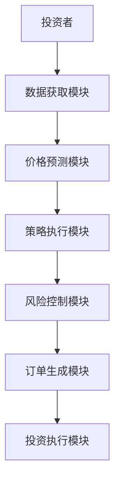

                 


# Dollar-Cost Averaging：在波动市场中的优势

## 关键词
Dollar-Cost Averaging, 投资策略, 市场波动, 平均成本, 股票投资, 数学模型

## 摘要
本文深入探讨了Dollar-Cost Averaging（DCA）策略在波动市场中的优势，通过数学模型和实际案例分析，揭示其如何通过分散投资降低风险，平均成本，并在不同市场环境下表现优异。文章从背景介绍、算法原理、系统设计到项目实战，全面解析DCA的应用及其优化方法。

---

# 第一部分：Dollar-Cost Averaging的背景与基本概念

## 第1章：Dollar-Cost Averaging的概述

### 1.1 DCA的定义与核心原理

Dollar-Cost Averaging（DCA）是一种投资策略，通过定期定额投资，分散市场波动的风险。其核心原理是通过在不同时间点购买相同的资产，平均掉市场波动带来的影响。

#### 核心概念与联系

| 概念       | 描述                                                                 |
|------------|----------------------------------------------------------------------|
| 投资金额   | 每次投资的固定金额，确保在不同价格点上分散投资。                 |
| 时间间隔   | 投资的时间间隔，可以是每周、每月或每季度一次。                  |
| 平均成本    | 投资总额除以购买的总份额，得到的单位成本。                      |
| 波动率      | 资产价格的波动程度，影响DCA策略的效率。                        |

### 1.2 DCA的优势与应用场景

DCA的主要优势在于其风险分散能力。通过定期投资，投资者避免了一次性投入时可能遇到的高价点，同时在市场下跌时逐步建仓，降低了平均成本。

#### DCA与传统投资策略的区别

| 方面       | DCA策略                            | 一次性投资策略                     |
|------------|------------------------------------|------------------------------------|
| 投资方式   | 定期定额投资                        | 一次性投入                        |
| 风险控制   | 分散市场波动风险                   | 集中风险                           |
| 成本平均    | 通过多次投资降低平均成本          | 成本固定，取决于初始投资时的价格  |

---

# 第二部分：Dollar-Cost Averaging的数学模型与算法原理

## 第2章：DCA的数学模型

### 2.1 平均成本计算公式

DCA的平均成本可以通过以下公式计算：

$$ \text{平均成本} = \frac{\text{总投入金额}}{\text{总购买份额}} $$

假设每次投入金额为$W$，投资次数为$n$，每次购买的资产价格分别为$p_1, p_2, \ldots, p_n$，则总投入金额为$W \times n$，总购买份额为$\sum_{i=1}^{n} \frac{W}{p_i}$。

### 2.2 波动率对DCA效果的影响

波动率越高，DCA策略的效果越好，因为资产价格的波动为投资者提供了更多的低位买入机会，从而降低了平均成本。

---

# 第三部分：Dollar-Cost Averaging在不同市场环境中的应用

## 第3章：市场周期与DCA策略

### 3.1 牛市中的DCA表现

在牛市中，DCA策略可能会因为分批买入而错失部分上涨收益，但其分散风险的优势依然显著。

### 3.2 熊市中的DCA表现

在熊市中，DCA策略能够逐步建仓，减少在市场底部一次性投入的风险，从而降低整体成本。

### 3.3 震荡市场中的DCA表现

在震荡市场中，DCA策略能够有效平滑波动，降低投资组合的波动风险。

---

# 第四部分：Dollar-Cost Averaging的系统分析与架构设计

## 第4章：DCA投资系统的构建

### 4.1 系统架构设计



### 4.2 系统功能设计

- 数据获取模块：从数据源获取历史价格数据。
- 策略执行模块：根据DCA策略生成投资计划。
- 风险控制模块：监控市场波动，调整投资策略。

---

# 第五部分：Dollar-Cost Averaging的项目实战

## 第5章：DCA策略的实现

### 5.1 环境安装

- 安装Python和相关库（如pandas、numpy）。
- 数据获取工具：使用Yahoo Finance API获取股票数据。

### 5.2 核心代码实现

```python
import pandas as pd
import numpy as np

# 假设data为股票价格数据
def dollar_cost_averaging(data, investment_amount, period):
    total_investment = 0
    total_shares = 0
    for i in range(len(data) // period):
        price = data.iloc[i * period]
        shares = investment_amount / price
        total_shares += shares
        total_investment += investment_amount
    average_cost = total_investment / total_shares
    return average_cost

# 示例数据
data = pd.DataFrame({'price': [100, 110, 90, 105, 115, 85]})
investment_amount = 1000
period = 2

result = dollar_cost_averaging(data, investment_amount, period)
print(f"Average Cost: {result}")
```

### 5.3 实际案例分析

假设某股票价格波动剧烈，通过DCA策略分批买入，计算每次的平均成本，并与一次性买入进行比较。

---

# 第六部分：Dollar-Cost Averaging的优化与扩展

## 第6章：DCA策略的优化

### 6.1 根据市场情况调整投资频率

在高波动市场中，增加投资频率可以进一步降低平均成本。

### 6.2 结合其他投资策略

将DCA与价值投资或趋势跟踪策略结合，优化整体投资组合的表现。

---

# 第七部分：最佳实践、小结与注意事项

## 第7章：最佳实践与注意事项

### 7.1 投资者注意事项

- 根据自身风险承受能力调整投资频率和金额。
- 定期回顾和调整投资策略，适应市场变化。

### 7.2 小结

Dollar-Cost Averaging是一种有效的投资策略，尤其适合在波动市场中降低风险和平均成本。通过系统设计和实际案例分析，可以更好地理解和应用DCA策略。

### 7.3 拓展阅读

推荐书籍：《The Intelligent Investor》、《投资最重要的简单真理》。

---

# 作者

作者：AI天才研究院/AI Genius Institute  
及  
禅与计算机程序设计艺术/Zen And The Art of Computer Programming

