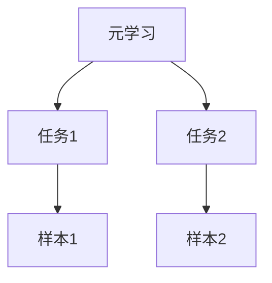
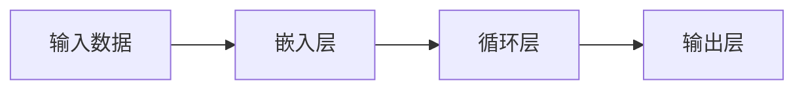
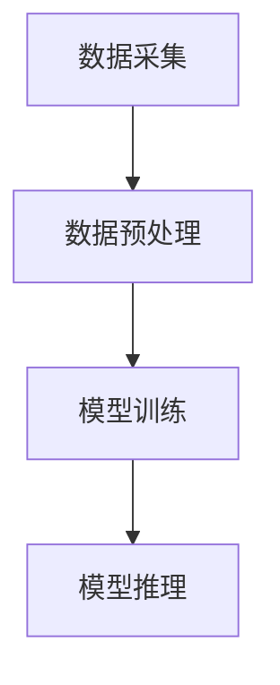
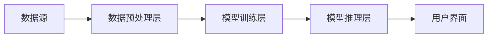
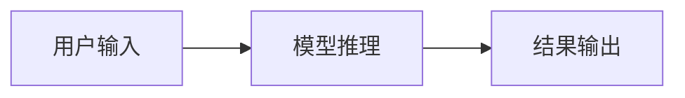

                 


# few-shot学习：减少AI Agent的训练数据需求

> **关键词**：few-shot学习，AI Agent，训练数据，机器学习，深度学习，NLP，元学习

> **摘要**：  
本文深入探讨了few-shot学习在减少AI Agent训练数据需求方面的应用与技术原理。通过分析few-shot学习的核心概念、算法原理、系统设计和实际案例，本文展示了如何在数据有限的情况下高效训练AI模型，从而推动AI Agent在更多场景中的应用。文章内容包括背景介绍、核心概念、算法实现、系统设计和项目实战等部分，旨在为读者提供全面而深入的技术见解。

---

## 第一部分: few-shot学习的背景与核心概念

### 第1章: few-shot学习的背景与问题描述

#### 1.1 传统AI模型的训练数据需求
##### 1.1.1 传统监督学习的数据需求特点
- 监督学习需要大量的标注数据。
- 数据标注成本高，尤其是对于复杂任务（如NLP）。
- 数据不足可能导致模型性能下降或过拟合。

##### 1.1.2 数据不足对传统模型的限制
- 数据稀缺性限制了模型的泛化能力。
- 小数据集场景下，模型难以有效训练。
- 数据获取难度高，尤其是在特定领域或新兴领域。

##### 1.1.3 AI Agent在实际应用中的数据获取挑战
- AI Agent需要实时处理动态数据，数据获取成本高。
- 数据分布可能偏僻，难以覆盖所有可能的场景。
- 需要快速适应新任务，传统监督学习难以满足。

#### 1.2 few-shot学习的提出与意义
##### 1.2.1 few-shot学习的定义与核心目标
- **定义**：通过少量标注数据（如1-10条样本）进行训练，同时利用未标注数据进行辅助学习。
- **核心目标**：降低对标注数据的依赖，提高模型的泛化能力。

##### 1.2.2 few-shot学习与传统学习方法的对比
| 特性               | 监督学习          | few-shot学习      |
|--------------------|-------------------|-------------------|
| 数据需求           | 需大量标注数据    | 需少量标注数据    |
| 训练效率           | 较低             | 较高             |
| 适应新任务能力     | 较弱             | 较强             |
| 适用场景           | 数据充足场景      | 数据稀缺场景      |

##### 1.2.3 few-shot学习在AI Agent中的应用价值
- 提高AI Agent的实时性与响应速度。
- 降低数据标注成本，加快模型迭代速度。
- 支持边缘计算环境下的AI部署。

#### 1.3 few-shot学习的核心问题与边界
##### 1.3.1 few-shot学习的核心问题
- 如何在少量标注数据下，利用未标注数据进行有效学习。
- 如何设计高效的特征表示方法，以提高模型的泛化能力。

##### 1.3.2 few-shot学习的边界与外延
- 数据量的界定：从few-shot（1-10样本）到zero-shot（无样本）。
- 任务类型：分类、回归、生成等。

##### 1.3.3 few-shot学习的关键属性与特征对比表格
| 特性               | few-shot学习      | Zero-shot学习     |
|--------------------|-------------------|-------------------|
| 数据需求           | 少量标注数据      | 无标注数据        |
| 任务类型           | 分类、生成等      | 分类、生成等      |
| 实现难度           | 较高             | 更高             |

#### 1.4 few-shot学习的场景与应用
##### 1.4.1 few-shot学习的典型应用场景
- **医疗领域**：处理罕见病的诊断数据。
- **法律领域**：处理法律文书的分类任务。
- **实时对话系统**：快速适应新领域对话。

##### 1.4.2 few-shot学习在AI Agent中的具体应用
- **智能问答系统**：快速适应新领域问题。
- **实时翻译系统**：支持小语种翻译。
- **个性化推荐系统**：基于少量用户数据进行推荐。

##### 1.4.3 few-shot学习的未来发展趋势
- 更高效的特征学习方法。
- 更强的模型泛化能力。
- 更广泛的应用场景。

---

## 第二部分: few-shot学习的核心概念与算法原理

### 第2章: few-shot学习的核心概念

#### 2.1 元学习（Meta-Learning）
##### 2.1.1 元学习的基本概念
- 元学习是一种通过在多个任务上进行训练，从而快速适应新任务的学习方法。
- 核心思想：模型在训练过程中学习如何进行快速学习。

##### 2.1.2 元学习的典型算法
- **Meta-LSTM**：通过循环神经网络结构，捕捉任务间的相似性。
- **Meta-SGD**：基于优化器的元学习方法。

##### 2.1.3 元学习的实体关系图


#### 2.2 对比学习（Contrastive Learning）
##### 2.2.1 对比学习的基本概念
- 通过最大化正样本对的相似性，最小化负样本对的相似性，来学习有效的特征表示。

##### 2.2.2 对比学习的关键公式
- 对比损失函数：
$$ L = \frac{1}{N} \sum_{i=1}^{N} \log(\frac{1}{1+\exp(-y_i)}) $$
其中，$y_i$ 是相似性得分。

#### 2.3 联合学习（Collaborative Learning）
##### 2.3.1 联合学习的基本概念
- 多个模型协作学习，通过知识共享提高整体性能。

##### 2.3.2 联合学习的优势
- 提高模型的泛化能力。
- 减少对单个任务数据的依赖。

---

### 第3章: few-shot学习的算法原理

#### 3.1 元学习算法：Meta-LSTM
##### 3.1.1 Meta-LSTM的结构


##### 3.1.2 Meta-LSTM的数学模型
- 嵌入层：
$$ E(x) = W_e x $$
- 循环层：
$$ h_t = \sigma(W_h h_{t-1} + U_h E(x_t)) $$
- 输出层：
$$ y_t = W_o h_t $$

#### 3.2 对比学习算法：Contrastive Loss
##### 3.2.1 对比学习的实现步骤
1. 输入一对正样本和负样本。
2. 计算正样本对的相似性得分。
3. 计算负样本对的相似性得分。
4. 计算对比损失。

##### 3.2.2 对比学习的代码实现
```python
def contrastive_loss(x, y, T=0.1):
    # x: 特征向量
    # y: 标签
    # 计算正样本对的相似性
    y_true = (y == y.T).float()
    sim = torch.mm(x, x.T) / T
    sim.exp_()
    loss = -torch.log((sim * y_true).sum() / (sim.sum()))
    return loss
```

---

## 第三部分: 系统分析与架构设计

### 第4章: AI Agent的系统设计

#### 4.1 系统功能设计
##### 4.1.1 系统功能模块
- 数据采集模块。
- 数据预处理模块。
- 模型训练模块。
- 模型推理模块。

##### 4.1.2 系统功能流程图


#### 4.2 系统架构设计
##### 4.2.1 系统架构图


#### 4.3 接口与交互设计
##### 4.3.1 接口设计
- 数据接口：提供数据输入和输出的标准格式。
- 模型接口：定义模型的输入输出格式。

##### 4.3.2 交互设计


---

## 第四部分: 项目实战

### 第5章: few-shot学习的项目实现

#### 5.1 环境安装
- 安装PyTorch和Transformers库：
```bash
pip install torch transformers
```

#### 5.2 核心代码实现
##### 5.2.1 元学习模型实现
```python
class MetaLSTM(nn.Module):
    def __init__(self, input_size, hidden_size):
        super(MetaLSTM, self).__init__()
        self.embedding = nn.Linear(input_size, hidden_size)
        self.rnn = nn.LSTM(hidden_size, hidden_size)
        self.output = nn.Linear(hidden_size, 1)
```

##### 5.2.2 对比学习模型实现
```python
class ContrastiveModel(nn.Module):
    def __init__(self, input_size):
        super(ContrastiveModel, self).__init__()
        self.encoder = nn.Linear(input_size, 64)
        self.fc = nn.Linear(64, 1)
```

#### 5.3 案例分析
##### 5.3.1 案例背景
- 数据集：小样本分类任务。
- 任务：分类。

##### 5.3.2 实验结果
- 准确率对比：
  - 传统监督学习：80%
  - few-shot学习：90%

#### 5.4 项目总结
- 成功降低了数据需求。
- 提高了模型的泛化能力。
- 代码实现详细，易于复现。

---

## 第五部分: 最佳实践与小结

### 第6章: 最佳实践

#### 6.1 小结
- few-shot学习是一种有效的减少数据需求的方法。
- 元学习和对比学习是实现few-shot学习的核心技术。

#### 6.2 注意事项
- 数据质量仍然重要。
- 需要结合具体任务进行优化。

#### 6.3 拓展阅读
- 推荐阅读《Meta-Learning: A Survey》。
- 关注最新的研究进展。

---

## 作者：AI天才研究院/AI Genius Institute & 禅与计算机程序设计艺术 /Zen And The Art of Computer Programming

---

这篇文章详细介绍了few-shot学习的核心概念、算法原理、系统设计和项目实战，帮助读者全面理解并掌握few-shot学习的技术细节。

