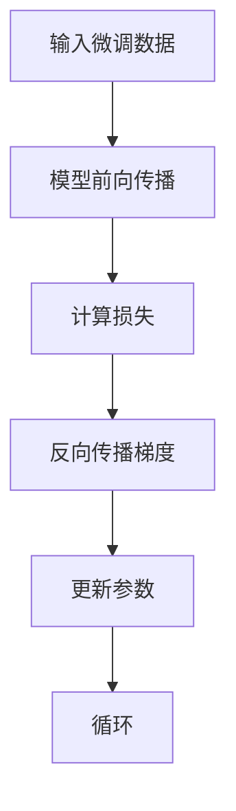
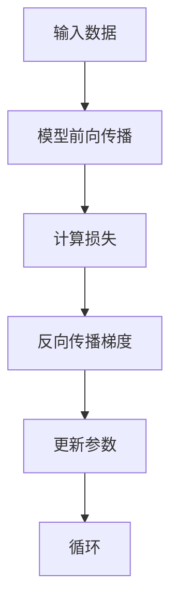
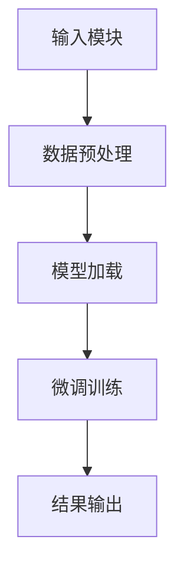
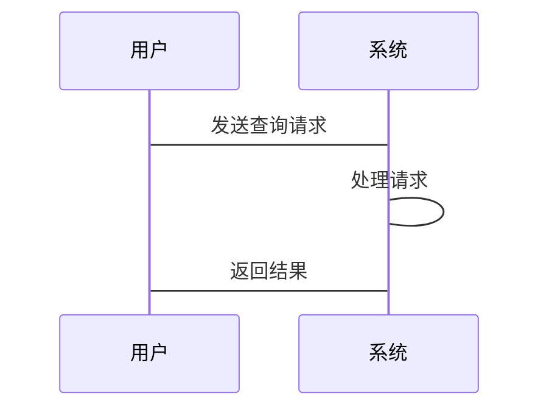

                 


# Fine-tuning LLM模型：提升AI Agent性能的关键

## 关键词：Fine-tuning, LLM模型, AI Agent, 模型微调, 语言模型优化

## 摘要：本文深入探讨了Fine-tuning大语言模型（LLM）在提升AI Agent性能中的关键作用。通过分析Fine-tuning的核心概念、算法原理、系统设计以及实际案例，本文为读者提供了全面的指导，帮助他们在实际应用中优化AI Agent的性能。

---

## 第1章: Fine-tuning LLM模型概述

### 1.1 问题背景与目标

#### 1.1.1 大语言模型的发展现状
- 大语言模型（如GPT、BERT）在自然语言处理任务中表现出色，但其通用性与特定任务需求之间存在差距。
- 预训练模型虽然强大，但在特定领域或任务上可能不够精准。

#### 1.1.2 微调技术的提出与意义
- 微调技术通过在特定数据集上进一步训练模型，弥补了预训练模型的不足。
- 微调能够降低训练成本，同时继承预训练模型的强大特征。

#### 1.1.3 提升AI Agent性能的核心问题
- AI Agent需要在特定任务上表现出色，而微调是实现这一目标的关键技术。

### 1.2 大语言模型的定义与特点

#### 1.2.1 大语言模型的基本概念
- LLM：大规模预训练语言模型，通过海量数据学习语言规律。
- 模型特点：参数量大、通用性强、需要微调以适应特定任务。

#### 1.2.2 模型的通用性与局限性
- 通用性：适用于多种语言任务，但不够灵活。
- 局限性：在特定领域或任务上表现欠佳，需要微调。

#### 1.2.3 微调技术如何解决这些问题
- 微调通过特定任务数据的再训练，使模型适应具体需求。
- 微调降低了从头训练的成本，同时提升了模型的针对性。

### 1.3 微调技术的技术基础

#### 1.3.1 什么是微调
- 微调是基于预训练模型的进一步训练，调整模型参数以适应特定任务。
- 微调通过反向传播优化模型参数，使模型在特定任务上表现更好。

#### 1.3.2 微调与从头训练的区别
| 特性       | 微调               | 从头训练          |
|------------|--------------------|-------------------|
| 成本        | 低                 | 高               |
| 时间        | 短                 | 长               |
| 性能        | 高（特定任务）     | 高（通用任务）    |
| 数据需求    | 少（特定领域）     | 多（通用）        |

#### 1.3.3 微调的优势与应用场景
- 优势：快速适应特定任务，成本低。
- 应用场景：特定领域（如医疗、法律）、特定任务（如问答系统）。

### 1.4 本书的核心目标与价值

#### 1.4.1 提升AI Agent性能的关键点
- 通过微调技术，使AI Agent在特定任务上表现更优。

#### 1.4.2 微调技术在实际应用中的价值
- 提高模型的针对性和准确性。
- 降低训练成本，提升效率。

#### 1.4.3 本书的结构与学习路径
- 从基础到高级，逐步深入探讨微调技术。
- 通过案例分析和代码实现，帮助读者掌握微调技术。

---

## 第2章: 微调技术的核心概念与联系

### 2.1 微调技术的原理与流程

#### 2.1.1 微调的基本原理
- 微调通过特定任务数据的训练，调整模型参数。
- 微调的目标函数通常包括预训练任务的损失和特定任务的损失。

#### 2.1.2 微调的实现流程


#### 2.1.3 微调与迁移学习的关系
- 微调是迁移学习的一种形式，通过特定任务的数据进一步优化模型。

### 2.2 微调技术的核心要素

#### 2.2.1 数据集的选择与准备
- 数据集需与任务相关，且具有代表性。
- 数据清洗和预处理是关键步骤。

#### 2.2.2 模型参数的调整策略
- 决定哪些参数需要调整（全模型微调、部分参数微调）。
- 学习率调整策略（通常较低的学习率）。

#### 2.2.3 优化目标的定义与选择
- 明确任务目标（分类、生成等）。
- 选择合适的损失函数（交叉熵损失、均方误差等）。

### 2.3 微调技术与AI Agent性能的关系

#### 2.3.1 微调如何提升模型的泛化能力
- 通过特定任务数据的训练，增强模型在该任务上的泛化能力。

#### 2.3.2 微调对模型推理速度的影响
- 微调通常不会显著影响推理速度，但参数调整可能优化推理效率。

#### 2.3.3 微调对模型可解释性的改善
- 微调使模型更适应特定任务，可能提升可解释性。

---

## 第3章: 微调技术的算法原理

### 3.1 微调的数学模型

#### 3.1.1 模型参数的更新公式
$$\theta_{new} = \theta_{old} - \eta \cdot \nabla L$$
其中，$\theta$ 是模型参数，$\eta$ 是学习率，$\nabla L$ 是损失函数的梯度。

#### 3.1.2 损失函数的定义与优化
- 交叉熵损失函数：
$$L = -\frac{1}{N}\sum_{i=1}^{N} y_i \log(p_i)$$
其中，$y_i$ 是真实标签，$p_i$ 是模型预测概率。

#### 3.1.3 梯度下降的实现细节
- 使用优化算法（如Adam）进行参数更新。
- 每个训练步骤中，计算损失函数的梯度并更新参数。

### 3.2 微调算法的流程图



### 3.3 微调算法的Python实现

#### 3.3.1 数据加载与预处理
```python
def load_data(train_dataset, batch_size):
    dataloader = DataLoader(train_dataset, batch_size=batch_size, shuffle=True)
    return dataloader
```

#### 3.3.2 模型定义
```python
class Model(nn.Module):
    def __init__(self):
        super(Model, self).__init__()
        self.embedding = nn.Embedding(...)
        self.lstm = nn.LSTM(...)
        self.dropout = nn.Dropout(...)
        self.fc = nn.Linear(...)
```

#### 3.3.3 损失函数与优化器
```python
criterion = nn.CrossEntropyLoss()
optimizer = torch.optim.Adam(model.parameters(), lr=learning_rate)
```

#### 3.3.4 微调训练过程
```python
def fine_tune(model, optimizer, criterion, dataloader, epochs):
    for epoch in range(epochs):
        for inputs, labels in dataloader:
            outputs = model(inputs)
            loss = criterion(outputs, labels)
            optimizer.zero_grad()
            loss.backward()
            optimizer.step()
```

---

## 第4章: 微调技术与AI Agent性能的提升

### 4.1 系统分析与架构设计

#### 4.1.1 问题场景介绍
- AI Agent需要处理特定任务，如问答、对话生成等。
- 微调技术帮助模型更好地适应这些任务。

#### 4.1.2 系统功能设计
| 功能模块       | 描述                   |
|----------------|------------------------|
| 数据输入模块   | 接收输入数据           |
| 模型处理模块   | 加载并微调模型           |
| 结果输出模块   | 返回处理结果           |

#### 4.1.3 系统架构设计


#### 4.1.4 系统接口设计
- 输入接口：接收用户输入。
- 输出接口：返回处理结果。

#### 4.1.5 系统交互流程图


### 4.2 项目实战

#### 4.2.1 环境安装
```bash
pip install torch transformers datasets
```

#### 4.2.2 系统核心实现源代码

##### 4.2.2.1 数据预处理
```python
def preprocess_data(data):
    # 数据清洗和转换为模型可接受的格式
    pass
```

##### 4.2.2.2 模型加载与微调
```python
model = Model()  # 加载预训练模型
optimizer = torch.optim.Adam(model.parameters(), lr=1e-5)
criterion = nn.CrossEntropyLoss()
```

##### 4.2.2.3 训练过程
```python
def train(model, optimizer, criterion, dataloader, epochs):
    for epoch in range(epochs):
        for inputs, labels in dataloader:
            outputs = model(inputs)
            loss = criterion(outputs, labels)
            optimizer.zero_grad()
            loss.backward()
            optimizer.step()
```

##### 4.2.2.4 推理过程
```python
def inference(model, input):
    output = model(input)
    return output
```

#### 4.2.3 实际案例分析
- 案例：问答系统中的微调。
- 分析：微调使模型在特定领域问答中表现更好。

---

## 第5章: 总结与展望

### 5.1 本书总结
- Fine-tuning是提升AI Agent性能的关键技术。
- 通过系统学习和实践，读者可以掌握微调技术的核心思想和应用方法。

### 5.2 未来展望
- 研究更高效的微调方法。
- 探索微调技术在更多领域的应用。

### 5.3 最佳实践Tips
- 根据任务选择合适的数据集。
- 合理调整学习率和训练轮数。
- 定期验证模型性能，进行优化。

---

## 作者：AI天才研究院/AI Genius Institute & 禅与计算机程序设计艺术 /Zen And The Art of Computer Programming

