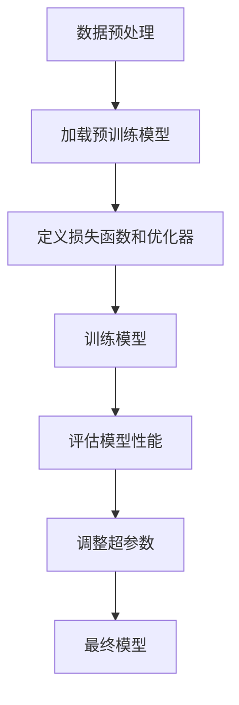
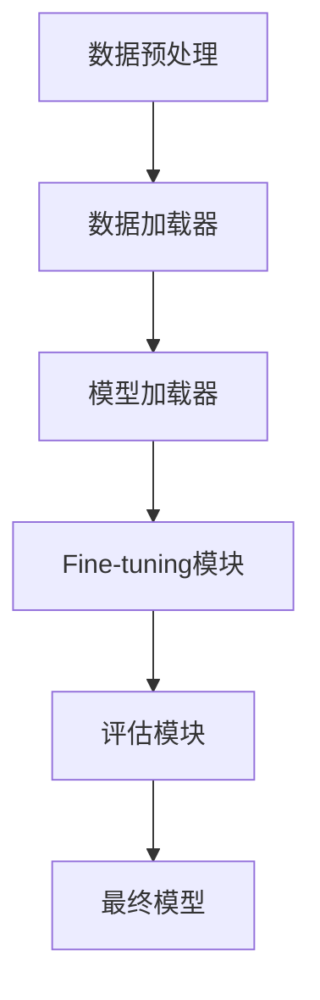

                 


# Fine-tuning技巧：如何让LLM更适应特定任务

> 关键词：Fine-tuning, LLM, 大语言模型, 机器学习, 模型微调, 任务适配

> 摘要：本文深入探讨了如何通过Fine-tuning技术让大语言模型（LLM）更好地适应特定任务。文章从Fine-tuning的背景与重要性入手，详细分析了LLM的基本概念与工作原理，深入讲解了Fine-tuning的核心概念、算法原理、系统架构设计，通过实际项目案例展示了Fine-tuning的实现过程，并总结了最佳实践与未来展望。通过本文，读者将能够全面理解Fine-tuning的技术细节和实际应用。

---

## 第一章: Fine-tuning的背景与重要性

### 1.1 Fine-tuning的定义与核心概念

#### 1.1.1 什么是Fine-tuning
Fine-tuning是一种基于已有预训练模型的微调技术，旨在通过在特定任务或数据集上的进一步训练，使模型更好地适应实际应用场景。与从头训练模型相比，Fine-tuning可以显著降低训练成本，同时提升模型在特定任务上的性能。

#### 1.1.2 Fine-tuning与从头训练的区别
- **从头训练**：从 scratch 开始训练模型，需要大量的计算资源和数据，适用于完全新的任务或领域。
- **Fine-tuning**：基于预训练模型，利用特定任务或领域的数据进行微调，适用于任务特定优化，计算成本低。

#### 1.1.3 Fine-tuning的核心思想
- 利用预训练模型的通用特征表示能力。
- 在特定任务或数据集上进行进一步训练，优化模型在目标场景下的性能。

### 1.2 Fine-tuning在LLM中的应用背景

#### 1.2.1 大语言模型的通用性与局限性
- **通用性**：LLM在各种自然语言处理任务中表现出色，如文本生成、问答系统、翻译等。
- **局限性**：在特定领域或任务上，模型可能不够精准，需要通过Fine-tuning进行优化。

#### 1.2.2 Fine-tuning的必要性与优势
- **必要性**：通过Fine-tuning，可以解决预训练模型在特定任务上的性能不足问题。
- **优势**：
  - 降低训练成本。
  - 提升模型在特定任务或领域的表现。
  - 快速适应新任务或数据集。

#### 1.2.3 Fine-tuning在企业级应用中的价值
- **定制化需求**：企业可能需要特定的输出格式、术语或行业知识。
- **数据隐私**：Fine-tuning可以在企业内部数据上进行，避免隐私泄露问题。
- **快速部署**：通过Fine-tuning可以快速优化模型，满足业务需求。

---

## 第二章: 大语言模型（LLM）基础

### 2.1 LLM的基本概念与工作原理

#### 2.1.1 什么是大语言模型
大语言模型是一种基于深度学习的自然语言处理模型，通常采用Transformer架构，通过大量数据进行预训练，具备强大的语言理解和生成能力。

#### 2.1.2 LLM的训练目标与损失函数
- **训练目标**：最小化预测输出与真实输出之间的差异。
- **损失函数**：交叉熵损失函数，用于衡量模型预测结果与真实结果之间的差距。

#### 2.1.3 LLM的输出机制与生成策略
- **输出机制**：基于概率分布生成最可能的下一个词。
- **生成策略**：采用贪心算法或随机采样方法生成输出。

### 2.2 主流LLM模型

#### 2.2.1 GPT系列模型
- **特点**：基于Transformer解码器，注重生成能力。
- **应用场景**：文本生成、对话系统。

#### 2.2.2 BERT系列模型
- **特点**：基于Transformer编码器，注重理解能力。
- **应用场景**：问答系统、文本摘要。

#### 2.2.3 其他LLM模型
- **T5**：文本到文本的模型，支持多种任务。
- **PaLM**：Google的开源大语言模型。

---

## 第三章: Fine-tuning的核心概念

### 3.1 Fine-tuning的定义与目标

#### 3.1.1 Fine-tuning的目标
- 优化模型在特定任务或数据集上的性能。
- 使模型适应特定领域或行业的需求。

#### 3.1.2 Fine-tuning的实现过程
1. **数据预处理**：清洗、标注、格式转换。
2. **模型加载**：加载预训练模型。
3. **微调训练**：在特定任务数据上进行训练，更新模型参数。
4. **模型评估**：验证模型在目标任务上的表现。

### 3.2 Fine-tuning的核心方法论

#### 3.2.1 数据驱动的Fine-tuning
- **数据增强**：通过数据扩展技术提升模型的泛化能力。
- **数据筛选**：选择与任务相关的高质量数据。

#### 3.2.2 任务驱动的Fine-tuning
- **任务适配**：针对特定任务设计模型的输出结构。
- **任务相关的参数调整**：优化模型在特定任务上的参数。

#### 3.2.3 模型架构优化
- **冻结部分层**：保留预训练模型的特征提取能力，只微调部分层。
- **参数调整**：优化模型的学习率、批量大小等超参数。

### 3.3 Fine-tuning的挑战与解决方案

#### 3.3.1 数据稀疏性问题
- **数据增强**：通过数据生成技术增加数据量。
- **迁移学习**：利用外部知识库提升模型的泛化能力。

#### 3.3.2 模型过拟合问题
- **正则化技术**：通过Dropout等方法防止过拟合。
- **数据多样性**：引入更多样化的数据。

#### 3.3.3 计算资源限制
- **分布式训练**：利用多GPU或分布式计算加速训练。
- **增量式训练**：逐步更新模型参数，减少计算成本。

---

## 第四章: Fine-tuning的算法原理

### 4.1 Fine-tuning的数学模型

#### 4.1.1 损失函数
$$ L = -\sum_{i=1}^{n} y_i \log p(y_i) $$
其中，\( y_i \) 是真实标签的概率分布，\( p(y_i) \) 是模型预测的概率分布。

#### 4.1.2 参数更新
$$ \theta_{new} = \theta_{old} - \eta \cdot \frac{\partial L}{\partial \theta} $$
其中，\( \theta \) 是模型参数，\( \eta \) 是学习率，\( \frac{\partial L}{\partial \theta} \) 是损失函数对参数的梯度。

#### 4.1.3 优化算法
- **Adam优化器**：
  $$ m_t = \beta_1 m_{t-1} + (1-\beta_1)g_t $$
  $$ v_t = \beta_2 v_{t-1} + (1-\beta_2)g_t^2 $$
  $$ \theta_{t} = \theta_{t-1} - \eta \frac{m_t}{\sqrt{v_t + \epsilon}} $$

### 4.2 Fine-tuning的流程图



### 4.3 Fine-tuning的Python实现

```python
def fine_tune_model(model, optimizer, criterion, train_loader, val_loader, num_epochs):
    for epoch in range(num_epochs):
        model.train()
        for inputs, labels in train_loader:
            outputs = model(inputs)
            loss = criterion(outputs, labels)
            loss.backward()
            optimizer.step()
            optimizer.zero_grad()
        model.eval()
        val_loss = 0
        for inputs, labels in val_loader:
            outputs = model(inputs)
            loss = criterion(outputs, labels)
            val_loss += loss.item()
        print(f'Epoch {epoch+1}: Val Loss = {val_loss/len(val_loader)}')
    return model
```

---

## 第五章: Fine-tuning的系统架构设计

### 5.1 系统功能设计

#### 5.1.1 系统功能模块
- 数据处理模块：负责数据预处理和加载。
- 模型加载模块：加载预训练模型。
- Fine-tuning模块：执行微调训练。
- 评估模块：评估模型性能。

#### 5.1.2 系统功能流程
1. 数据预处理：清洗、标注、格式转换。
2. 模型加载：加载预训练模型。
3. 微调训练：在特定任务数据上进行训练。
4. 模型评估：验证模型性能。

### 5.2 系统架构设计



### 5.3 接口设计与交互

#### 5.3.1 系统接口设计
- 数据接口：定义数据加载和预处理的接口。
- 模型接口：定义模型加载和微调的接口。

#### 5.3.2 交互流程
1. 用户输入任务需求。
2. 系统加载预训练模型。
3. 系统执行Fine-tuning训练。
4. 系统输出优化后的模型。

---

## 第六章: Fine-tuning的项目实战

### 6.1 项目背景与目标

#### 6.1.1 项目背景
- 任务：优化LLM在特定领域的文本生成能力。
- 数据：内部业务数据，包含行业术语和特定格式。

#### 6.1.2 项目目标
- 提升模型在特定任务上的生成质量。
- 实现模型的快速部署和应用。

### 6.2 项目实施步骤

#### 6.2.1 环境配置
- 安装必要的库：
  ```bash
  pip install torch transformers
  ```

#### 6.2.2 代码实现

```python
from transformers import AutoTokenizer, AutoModelForCausalLM
import torch

# 加载预训练模型和tokenizer
model_name = "gpt2"
tokenizer = AutoTokenizer.from_pretrained(model_name)
model = AutoModelForCausalLM.from_pretrained(model_name)

# 定义微调函数
def fine_tune(model, tokenizer, train_dataset, val_dataset, num_epochs=3):
    device = torch.device('cuda' if torch.cuda.is_available() else 'cpu')
    model = model.to(device)
    optimizer = torch.optim.Adam(model.parameters(), lr=1e-5)
    criterion = torch.nn.CrossEntropyLoss()

    for epoch in range(num_epochs):
        model.train()
        for batch in train_dataset:
            inputs, labels = batch
            inputs = inputs.to(device)
            labels = labels.to(device)
            outputs = model(inputs)
            loss = criterion(outputs logits, labels)
            loss.backward()
            optimizer.step()
            optimizer.zero_grad()
        model.eval()
        for batch in val_dataset:
            inputs, labels = batch
            inputs = inputs.to(device)
            labels = labels.to(device)
            with torch.no_grad():
                outputs = model(inputs)
                loss_val = criterion(outputs logits, labels)
                print(f'Epoch {epoch+1}: Val Loss = {loss_val.item()}')
    return model
```

#### 6.2.3 案例分析
- **训练数据**：包含行业术语和特定格式的数据。
- **微调结果**：模型在特定任务上的生成质量显著提升。

### 6.3 项目总结

#### 6.3.1 项目成果
- 模型在特定任务上的性能提升显著。
- 实现了快速部署和应用。

#### 6.3.2 项目经验
- 数据预处理是关键步骤。
- 参数调整对模型性能有重要影响。

---

## 第七章: 总结与展望

### 7.1 总结

#### 7.1.1 Fine-tuning的核心要点
- 数据预处理的重要性。
- 模型参数调整的策略。
- 任务适配的关键性。

#### 7.1.2 本文的创新点
- 结合实际案例，详细讲解了Fine-tuning的实现过程。
- 提出了优化模型性能的具体方法。

### 7.2 未来展望

#### 7.2.1 挑战
- 更高效的Fine-tuning方法。
- 模型压缩与轻量化。

#### 7.2.2 展望
- Fine-tuning技术的进一步优化。
- Fine-tuning在更多领域的应用。

---

## 作者：AI天才研究院/AI Genius Institute & 禅与计算机程序设计艺术 /Zen And The Art of Computer Programming

---

以上是文章的完整目录大纲和部分详细内容。

