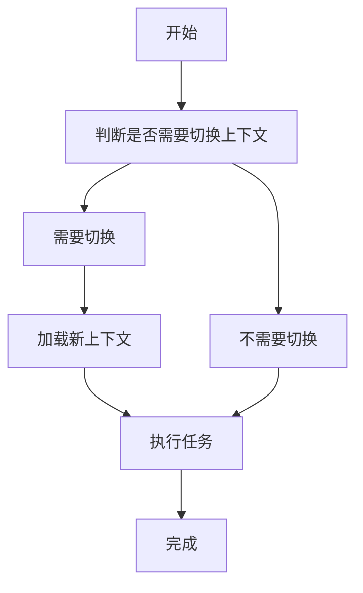
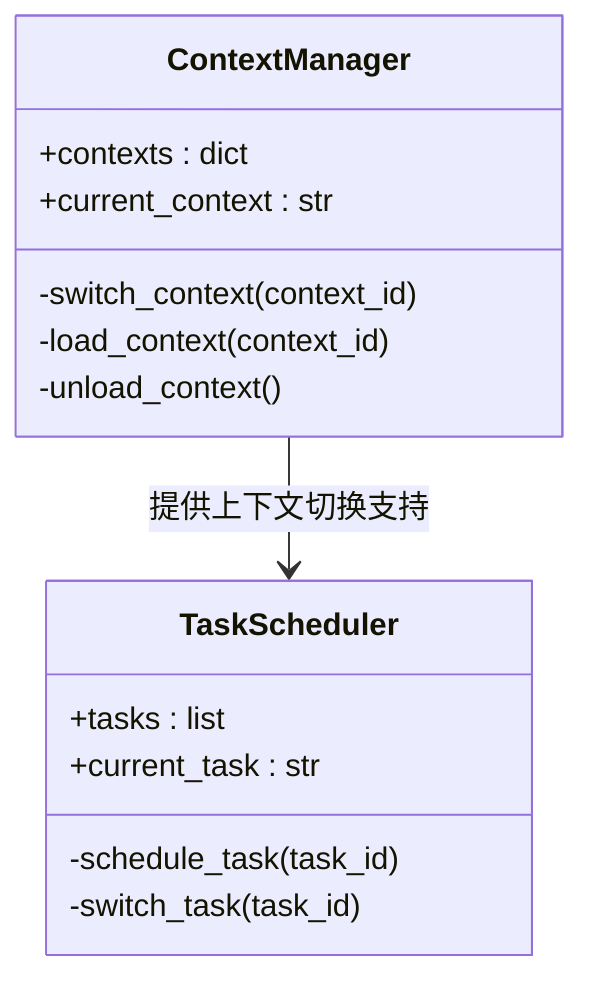
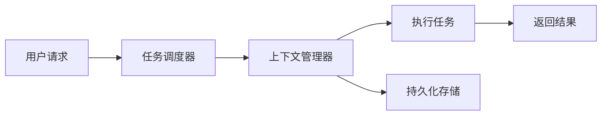
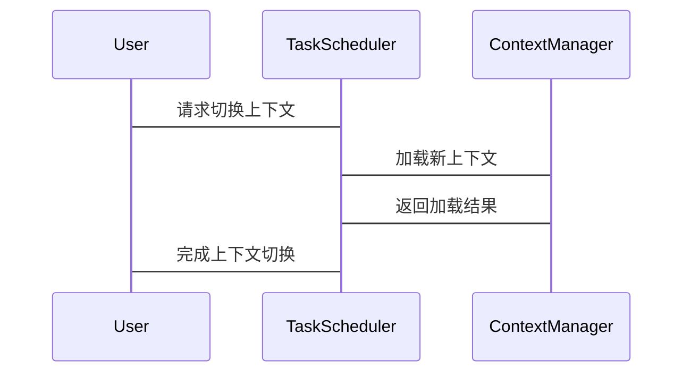

                 


# 上下文切换：让AI Agent更灵活地处理复杂场景

## 关键词：
上下文切换, AI Agent, 多任务处理, 注意力机制, 系统架构设计

## 摘要：
本文深入探讨了上下文切换在AI Agent中的应用，分析了其核心概念、算法原理、系统架构设计，并通过项目实战展示了如何实现高效的上下文切换机制，使AI Agent能够更好地应对复杂场景。文章结合理论与实践，为AI Agent的开发提供了全面的指导。

---

# 目录大纲

## 第一部分：上下文切换的背景与概念

### 第1章：上下文切换的定义与问题背景

#### 1.1 上下文切换的定义
- 1.1.1 上下文的定义
  - 上下文是AI Agent在执行任务时所需的所有相关信息的集合。
  - 包括任务目标、输入数据、执行环境和历史交互记录。
- 1.1.2 上下文切换的定义
  - AI Agent在处理不同任务或场景时，快速调整其上下文的过程。
  - 通过切换上下文，AI Agent能够更灵活地应对多任务处理的需求。

#### 1.2 问题背景与描述
- 1.2.1 多任务处理的需求
  - AI Agent需要在不同的任务之间切换，提高资源利用率。
  - 例如，一个AI Agent可能需要同时处理自然语言理解、图像识别和数据分析任务。
- 1.2.2 AI Agent在复杂场景中的挑战
  - 多任务处理可能导致上下文干扰，影响任务准确性。
  - 例如，处理金融数据分析时，需要切换到股票市场新闻分析任务，必须快速调整上下文。
- 1.2.3 上下文切换的必要性
  - 提高AI Agent的灵活性和适应性。
  - 降低任务切换的开销，提升整体效率。

#### 1.3 上下文切换的边界与外延
- 1.3.1 上下文切换的边界
  - 上下文切换的范围仅限于当前任务所需的信息。
  - 例如，切换到新的任务时，只需加载与新任务相关的数据和模型参数。
- 1.3.2 外延与相关概念
  - 与任务切换、多线程处理和资源管理相关。
  - 例如，上下文切换机制可以与操作系统的任务调度机制结合。

#### 1.4 核心概念与组成要素
- 1.4.1 核心概念结构
  - 上下文：任务相关信息。
  - 切换机制：切换上下文的方法。
  - 切换策略：选择切换时机和方式的策略。
- 1.4.2 组成要素分析
  - 数据：任务相关的输入数据。
  - 状态：任务执行的状态信息。
  - 模型：任务相关的算法模型。

---

## 第二部分：上下文切换的核心概念与联系

### 第2章：上下文切换的核心概念原理

#### 2.1 上下文切换的原理
- 2.1.1 上下文的存储与管理
  - 使用数据结构（如哈希表）存储上下文信息。
  - 通过缓存机制减少上下文加载时间。
- 2.1.2 切换机制的实现
  - 基于任务优先级的切换策略。
  - 例如，优先处理高优先级任务的上下文加载。

#### 2.2 上下文切换的属性特征对比
- 表格：上下文切换的属性特征对比

| 属性 | 特征 |
|------|------|
| 切换方式 | 异步或同步 |
| 切换时间 | 实时或延时 |
| 切换范围 | 全局或局部 |
| 切换粒度 | 精细或粗放 |

#### 2.3 ER实体关系图
- Mermaid流程图：上下文切换的ER实体关系图
```mermaid
erDiagram
    actor User {
        +id : int
        +context : string
    }
    actor System {
        +task : string
        +priority : int
    }
    actor Database {
        +context_data : string
    }
    User --> System : 请求上下文切换
    System --> Database : 加载上下文数据
    Database --> User : 返回上下文数据
```

---

## 第三部分：上下文切换的算法原理讲解

### 第3章：上下文切换算法的实现

#### 3.1 算法原理
- Mermaid流程图：上下文切换算法流程


#### 3.2 Python代码实现
- 核心代码示例
```python
class ContextSwitcher:
    def __init__(self):
        self.contexts = {}
        self.current_context = None

    def switch_context(self, new_context):
        self.current_context = new_context
        return f"Switched to context: {new_context}"

    def load_context(self, context_id):
        if context_id in self.contexts:
            return f"Loaded context: {context_id}"
        else:
            return "Context not found"

    def unload_context(self):
        self.current_context = None
        return "Context unloaded"
```

#### 3.3 数学模型与公式
- 算法复杂度分析
  - 切换时间复杂度：O(1)
  - 上下文加载时间复杂度：O(n)，其中n是上下文数据量。

- 优化公式
  $$C_{switch} = f(C_{current}, C_{target})$$
  其中，$$C_{switch}$$ 表示上下文切换，$$C_{current}$$ 和 $$C_{target}$$ 分别表示当前和目标上下文。

#### 3.4 示例说明
- 示例场景：AI Agent需要从图像识别任务切换到自然语言处理任务。
  - 调用 `switch_context("NLP_task")` 方法。
  - 加载相应的模型和数据。
  - 执行NLP任务。

---

## 第四部分：系统分析与架构设计方案

### 第4章：上下文切换系统的架构设计

#### 4.1 问题场景介绍
- 问题场景：AI Agent需要在多个任务之间快速切换，例如：
  - 从股票数据分析切换到天气预测。
  - 快速响应用户的不同请求。

#### 4.2 系统功能设计
- Mermaid类图：领域模型设计


#### 4.3 系统架构设计
- Mermaid架构图：系统整体架构


#### 4.4 接口设计与交互
- Mermaid序列图：系统交互流程


---

## 第五部分：项目实战

### 第5章：上下文切换系统的实现

#### 5.1 环境安装
- 安装必要的工具与库：
  - Python 3.8+
  - Mermaid CLI
  - matplotlib
  - numpy

#### 5.2 核心代码实现
- 代码示例：上下文切换实现
```python
class ContextSwitcher:
    def __init__(self):
        self.contexts = {}
        self.current_context = None

    def switch_context(self, context_id):
        if context_id in self.contexts:
            self.current_context = context_id
            return True
        else:
            return False

    def load_context(self, context_id):
        self.contexts[context_id] = self._load_context_from_disk(context_id)
        return True

    def _load_context_from_disk(self, context_id):
        # 模拟从磁盘加载上下文数据
        return f"context_{context_id}_data"

# 示例用法
switcher = ContextSwitcher()
switcher.load_context("task1")
switcher.load_context("task2")
switcher.switch_context("task2")
```

#### 5.3 代码解读与分析
- 代码结构：
  - `ContextSwitcher` 类管理上下文的切换和加载。
  - `_load_context_from_disk` 方法模拟从磁盘加载上下文数据。

#### 5.4 案例分析与详细讲解
- 案例场景：AI Agent需要从图像识别任务切换到自然语言处理任务。
  - 加载图像识别任务的上下文。
  - 切换到自然语言处理任务的上下文。
  - 执行自然语言处理任务。

#### 5.5 项目小结
- 通过实现上下文切换系统，AI Agent能够更高效地处理多任务场景。
- 代码实现展示了上下文切换的核心机制和实际应用。

---

## 第六部分：总结与展望

### 第6章：总结与未来展望

#### 6.1 总结
- 本文详细介绍了上下文切换在AI Agent中的重要性。
- 结合理论与实践，展示了如何实现高效的上下文切换机制。

#### 6.2 小结
- 上下文切换是AI Agent处理复杂场景的关键技术。
- 通过合理设计和实现，可以显著提升AI Agent的灵活性和效率。

#### 6.3 注意事项
- 切换上下文时，需要注意数据的一致性和任务的连续性。
- 避免频繁切换导致的性能损耗。

#### 6.4 拓展阅读
- 推荐阅读《多任务学习与AI Agent设计》。
- 探索上下文切换在分布式系统中的应用。

---

## 作者：AI天才研究院 & 禅与计算机程序设计艺术

---

以上是《上下文切换：让AI Agent更灵活地处理复杂场景》的文章目录大纲，文章详细讲解了上下文切换的核心概念、算法原理、系统架构设计和项目实战，结合理论与实践，为AI Agent的开发提供了全面的指导。

