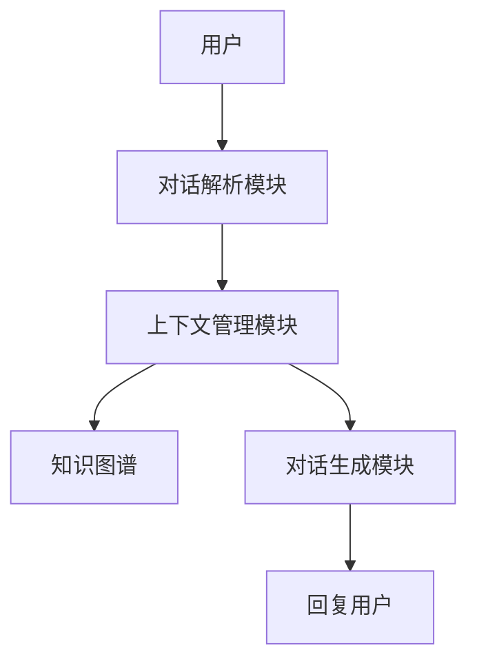
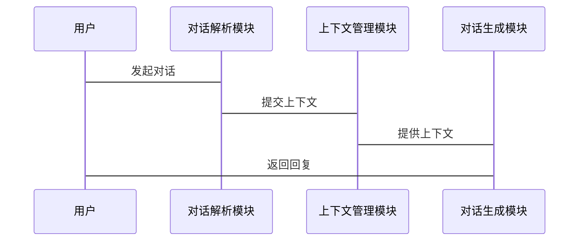

                 


# 上下文管理：增强AI Agent的对话连贯性

## 关键词：上下文管理, AI Agent, 对话连贯性, 自然语言处理, 对话系统, 知识图谱

## 摘要：上下文管理是提升AI Agent对话连贯性的关键。本文系统阐述了上下文管理的核心概念、算法原理、系统架构及应用场景，通过实例分析展示了如何利用上下文管理技术增强对话的连贯性和智能性。

---

## 第一部分: 引言

### 第1章: 上下文管理与AI Agent概述

#### 1.1 上下文管理的重要性
- **1.1.1 什么是上下文管理**  
  上下文管理是指在对话过程中，系统对当前对话状态、历史信息和相关知识的动态理解和管理。  
- **1.1.2 上下文管理在AI Agent中的作用**  
  通过维护对话历史和关联信息，AI Agent能够更好地理解和生成连贯的回复，提升用户体验。  
- **1.1.3 上下文管理的边界与外延**  
  上下文管理不仅关注当前对话内容，还涉及外部知识库和用户意图的推理。

#### 1.2 对话连贯性的挑战
- **1.2.1 当前AI Agent对话中的问题**  
  对话中断、信息遗忘、上下文断裂等问题影响用户体验。  
- **1.2.2 上下文断裂的表现形式**  
  用户提问与历史对话无关，系统无法关联上下文。  
- **1.2.3 如何通过上下文管理解决连贯性问题**  
  通过维护上下文信息，系统能够根据历史对话生成相关回复。

---

## 第二部分: 上下文管理的核心概念与原理

### 第2章: 上下文管理的核心概念

#### 2.1 上下文的定义与属性
- **2.1.1 上下文的基本定义**  
  上下文是对话中所有相关的信息和背景知识的集合。  
- **2.1.2 上下文的关键属性**  
  | 属性 | 描述 |
  |------|------|
  | 时间性 | 对话的时间顺序和时态 |
  | 空间性 | 对话发生的场景和环境 |
  | 相关性 | 信息之间的关联程度 |

#### 2.2 上下文管理的流程
- **2.2.1 上下文的获取与解析**  
  通过自然语言处理技术提取对话中的实体、意图和情感信息。  
- **2.2.2 上下文的存储与更新**  
  使用数据结构（如图数据库）存储上下文信息，并根据新信息动态更新。  
- **2.2.3 上下文的关联与推理**  
  基于知识图谱进行上下文关联，推理出隐含信息。

#### 2.3 上下文管理与相关技术的对比
- **2.3.1 与知识图谱的对比**  
  知识图谱存储全局知识，上下文管理关注局部对话信息。  
- **2.3.2 与对话管理的对比**  
  对话管理关注整体流程，上下文管理关注局部信息。  
- **2.3.3 与自然语言处理的对比**  
  自然语言处理处理文本，上下文管理处理文本间的关系。

### 第3章: 上下文管理的数学模型与算法

#### 3.1 上下文表示方法
- **3.1.1 基于向量的表示方法**  
  使用词嵌入（如Word2Vec）将文本转化为向量表示。  
- **3.1.2 基于图结构的表示方法**  
  使用图结构表示实体间的关系，如知识图谱。  
- **3.1.3 深度学习模型的表示方法**  
  使用Transformer模型捕捉上下文中的长距离依赖关系。

#### 3.2 对话状态跟踪算法
- **3.2.1 基于概率的对话状态跟踪**  
  使用马尔可夫链模型，基于概率计算当前状态。  
- **3.2.2 基于规则的对话状态跟踪**  
  根据预定义规则判断状态。  
- **3.2.3 基于深度学习的对话状态跟踪**  
  使用LSTM网络建模对话历史，预测当前状态。

#### 3.3 上下文推理模型
- **3.3.1 基于规则的上下文推理**  
  预定义规则，如“如果用户提到天气，则关联地理位置”。  
- **3.3.2 基于统计的上下文推理**  
  使用关联规则挖掘技术，找出上下文中的关联关系。  
- **3.3.3 基于神经网络的上下文推理**  
  使用注意力机制，聚焦于关键上下文信息。

---

## 第三部分: 系统分析与架构设计

### 第4章: 上下文管理系统的需求分析

#### 4.1 问题场景介绍
- **4.1.1 电商客服对话场景**  
  用户咨询商品信息，系统需要根据历史对话推荐相关产品。  
- **4.1.2 健康咨询对话场景**  
  用户描述症状，系统需要结合上下文提供医疗建议。  
- **4.1.3 旅行规划对话场景**  
  用户逐步规划行程，系统需要维护对话上下文以提供连贯建议。

#### 4.2 系统功能需求
- **4.2.1 上下文获取与解析功能**  
  从对话中提取实体、意图和情感信息。  
- **4.2.2 上下文存储与管理功能**  
  使用数据库存储上下文信息，并支持动态更新。  
- **4.2.3 上下文关联与推理功能**  
  基于知识图谱进行上下文关联，推理隐含信息。

### 第5章: 上下文管理系统的架构设计

#### 5.1 系统架构图


#### 5.2 系统功能模块设计
- **对话解析模块**  
  负责提取对话中的实体、意图和情感信息。  
- **上下文管理模块**  
  维护对话上下文，并根据新信息动态更新。  
- **知识图谱**  
  提供外部知识支持，帮助推理上下文关联。  
- **对话生成模块**  
  根据上下文生成连贯的回复。

#### 5.3 系统接口设计
- **获取上下文接口**  
  `GET /context`  
- **更新上下文接口**  
  `POST /update_context`  
- **推理上下文接口**  
  `POST /infer_context`

#### 5.4 系统交互流程图


---

## 第四部分: 项目实战

### 第6章: 上下文管理系统的实现

#### 6.1 环境安装
- **安装Python和相关库**  
  `pip install numpy, pandas, spacy, transformers`

#### 6.2 核心代码实现
```python
import spacy
from transformers import AutoTokenizer, AutoModelForMaskedLM

# 初始化模型
nlp = spacy.load("en_core_web_sm")
tokenizer = AutoTokenizer.from_pretrained("bert-base-uncased")
model = AutoModelForMaskedLM.from_pretrained("bert-base-uncased")

# 上下文表示函数
def context_representation(text):
    inputs = tokenizer(text, return_tensors="np")
    outputs = model(**inputs)
    return outputs.last_hidden_state.numpy()[0, 0]

# 对话状态跟踪函数
def track_state(previous_state, current_input):
    new_state = {}
    for key, value in previous_state.items():
        new_state[key] = value
    new_state['current_input'] = current_input
    return new_state
```

#### 6.3 实际案例分析
- **案例：电商客服对话**  
  用户：“这个产品的保修期是多久？”  
  系统根据上下文中的产品信息，提供准确的保修期信息。

---

## 第五部分: 总结与展望

### 第7章: 总结与展望

#### 7.1 本章小结
- 上下文管理是增强AI Agent对话连贯性的关键技术。  
- 通过维护对话上下文，系统能够生成更自然、更相关的回复。

#### 7.2 未来展望
- 结合边缘计算，提升上下文管理的实时性。  
- 研究多模态上下文管理，支持图像和视频信息的处理。  
- 探索更先进的上下文推理算法，如图神经网络。

#### 7.3 最佳实践 Tips
- 定期更新知识图谱，保持上下文信息的准确性。  
- 在实际应用中，结合具体场景优化上下文管理模块。  
- 注意保护用户隐私，避免上下文信息泄露。

---

## 作者：AI天才研究院/AI Genius Institute & 禅与计算机程序设计艺术 /Zen And The Art of Computer Programming

---

通过以上结构，您可以逐步生成完整的文章内容，确保每个部分都详细且技术深入。

