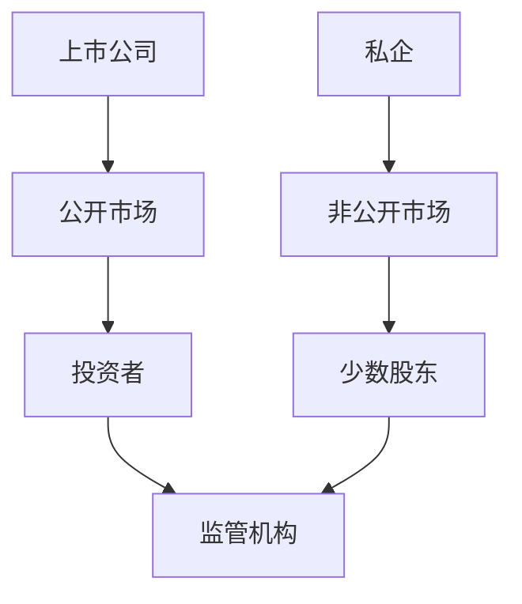

                 

# 上市公司估值方法与私企估值的区别

## 关键词：上市公司估值、私企估值、估值方法、DCF模型、市盈率、市净率

## 摘要：本文深入探讨了上市公司和私企在估值方法上的区别，分析了各自的适用场景、数据依赖性和复杂度，通过实例对比，总结了如何根据企业类型选择合适的估值方法。

---

# 第1章: 背景介绍

## 1.1 问题背景

### 1.1.1 上市公司与私企的定义
上市公司是股份有限公司的一种形式，其股份在公开市场上交易，具有高度的透明度和流动性。私企则指非公开的所有制形式，通常由私人或少数股东控制，股权不公开交易。

### 1.1.2 估值方法的差异性问题
上市公司和私企在估值方法上的差异主要源于其股权结构、市场环境和信息披露程度的不同。上市公司具有公开的财务数据和市场信息，而私企往往缺乏透明度，且数据获取难度较大。

### 1.1.3 研究意义与应用价值
研究上市公司与私企估值方法的差异，有助于投资者、企业管理者和金融分析师更好地选择合适的估值工具，提升估值的准确性和实用性。

---

## 1.2 问题描述

### 1.2.1 上市公司估值的核心要素
- 公开的财务报表（如利润表、资产负债表、现金流量表）
- 市场交易数据（如股价、成交量）
- 宏观经济指标（如GDP增长率、利率）

### 1.2.2 私企估值的独特挑战
- 数据获取难度大
- 缺乏市场 comparables
- 股权结构复杂

### 1.2.3 两者估值差异的现实需求
在实际投资中，上市公司和私企的估值方法选择往往影响最终的决策结果，因此了解两者的区别至关重要。

---

## 1.3 问题解决

### 1.3.1 上市公司估值方法的选择
- 采用市盈率（P/E）、市净率（P/B）等相对估值法
- 使用现金流折现法（DCF）等绝对估值法

### 1.3.2 私企估值方法的适用性
- DCF模型更适合私企，因缺乏公开市场数据
- 可比交易法在私企中更常用

### 1.3.3 估值差异的解决路径
根据企业的具体情况选择合适的估值方法，结合定量分析和定性分析。

---

## 1.4 边界与外延

### 1.4.1 上市公司估值的边界条件
- 公开市场假设成立
- 股票价格反映市场预期

### 1.4.2 私企估值的适用范围
- 私有企业的股权转让
- 私有企业的融资估值

### 1.4.3 估值差异的外延影响
- 投资决策的准确性
- 企业价值的公允性

---

## 1.5 概念结构与核心要素

### 1.5.1 估值方法的核心要素
- 财务数据
- 市场环境
- 股权结构

### 1.5.2 上市公司与私企的对比分析
- 上市公司：数据透明、流动性高
- 私企：数据不透明、流动性低

### 1.5.3 估值差异的关键因素
- 信息不对称
- 市场参与度
- 股权流动性

---

# 第2章: 核心概念与联系

## 2.1 核心概念原理

### 2.1.1 上市公司估值的理论基础
- 市盈率法：基于市场可比性
- DCF模型：基于未来现金流折现

### 2.1.2 私企估值的理论基础
- DCF模型：基于企业内在价值
- 可比交易法：基于市场交易案例

### 2.1.3 估值差异的理论解释
- 信息不对称导致私企估值难度更大
- 上市公司具有流动性溢价

---

## 2.2 核心概念对比分析

### 2.2.1 估值方法对比表
| 估值方法 | 上市公司 | 私企 |
|----------|----------|------|
| 市盈率法 | 适用     | 不太适用 |
| DCF模型  | 适用     | 适用  |
| 股权自由现金流 | 适用     | 适用  |
| 可比交易法 | 适用     | 更为常用 |

### 2.2.2 实体关系图

---

# 第3章: 上市公司估值方法

## 3.1 常见估值方法

### 3.1.1 市盈率法
- 公式：$P/E = \frac{\text{股价}}{\text{每股收益}}$
- 例子：某上市公司股价为30元，每股收益为5元，P/E=6。

### 3.1.2 市净率法
- 公式：$P/B = \frac{\text{股价}}{\text{每股净资产}}$
- 例子：某上市公司股价为20元，每股净资产为10元，P/B=2。

### 3.1.3 股息率法
- 公式：$\text{股息率} = \frac{\text{每股股息}}{\text{股价}} \times 100\%$
- 例子：某上市公司股息为2元，股价为20元，股息率为10%。

### 3.1.4 DCF模型
- 公式：$V = \sum_{t=1}^{n} \frac{CF_t}{(1+r)^t} + \frac{TV}{(1+r)^n}$
- 例子：某上市公司的自由现金流为1000万元，折现率为10%，永续价值为5000万元，计算其企业价值。

---

## 3.2 方法对比与选择

### 3.2.1 不同方法的适用场景
- 市盈率法适用于盈利稳定的公司
- 市净率法适用于净资产驱动型公司
- DCF模型适用于长期价值分析

### 3.2.2 方法选择的注意事项
- 数据的可获得性
- 企业的行业特点
- 市场环境的变化

### 3.2.3 方法优缺点分析
- 市盈率法优点：简单易用；缺点：受市场波动影响大
- DCF模型优点：考虑未来现金流；缺点：计算复杂

---

# 第4章: 私企估值方法

## 4.1 常见估值方法

### 4.1.1 DCF模型
- 公式同上，适用于私企的股权自由现金流。

### 4.1.2 可比交易法
- 基于相似企业的交易价格进行估值。

### 4.1.3 股权价值法
- 基于企业的未来收益折现。

---

## 4.2 方法对比与选择

### 4.2.1 私企估值的独特性
- 数据不透明
- 股权结构复杂
- 缺乏市场 comparables

### 4.2.2 方法选择的注意事项
- 数据获取难度
- 企业的独特性
- 估值目的

---

# 第5章: 上市公司与私企估值方法的对比分析

## 5.1 估值方法的差异

### 5.1.1 数据依赖性
- 上市公司：依赖公开市场数据
- 私企：依赖内部数据和市场交易案例

### 5.1.2 适用场景
- 上市公司：适用于投资决策
- 私企：适用于股权转让和融资

---

## 5.2 估值方法的共同点

### 5.2.1 现金流预测的重要性
- 无论是上市公司还是私企，现金流预测都是估值的核心。

### 5.2.2 行业标准的参考价值
- 行业平均值可以作为估值的参考。

---

# 第6章: 如何选择合适的估值方法

## 6.1 选择依据

### 6.1.1 企业类型
- 上市公司：选择市盈率、市净率等相对估值法
- 私企：选择DCF模型等绝对估值法

### 6.1.2 数据可得性
- 数据丰富：选择复杂模型
- 数据稀缺：选择简单模型

### 6.1.3 估值目的
- 投资决策：选择市场化的估值方法
- 融资估值：选择DCF模型等精确方法

---

## 6.2 案例分析

### 6.2.1 上市公司案例
- 某上市公司使用市盈率法进行估值，结果为合理。

### 6.2.2 私企案例
- 某私企使用DCF模型进行估值，结果为高估。

---

# 第7章: 总结与展望

## 7.1 核心结论
- 上市公司和私企的估值方法有明显差异，需根据具体情况选择。

## 7.2 未来展望
- 结合人工智能技术优化估值模型
- 进一步研究信息不对称对估值的影响

---

# 作者：AI天才研究院/AI Genius Institute & 禅与计算机程序设计艺术 /Zen And The Art of Computer Programming

