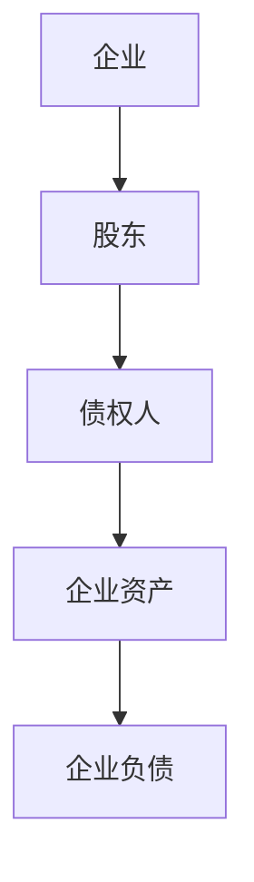
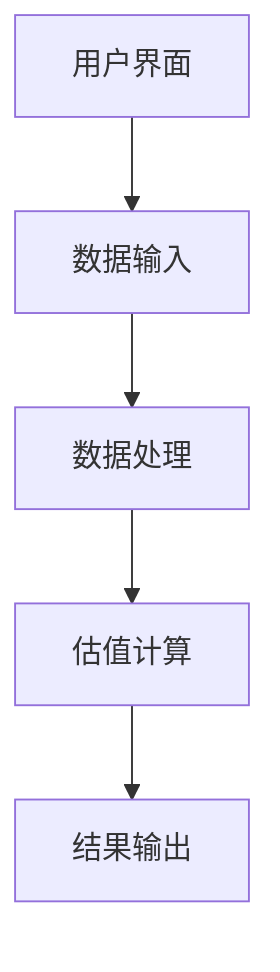

                 


# 不同发展阶段企业的估值策略

## 关键词：企业估值，发展阶段，DCF模型，相对估值法，股权自由现金流

## 摘要：  
企业在不同发展阶段的估值策略需要根据其财务状况、市场竞争力和发展前景进行综合分析。本文从企业估值的背景与核心概念入手，详细讲解了现金流折现模型（DCF）、相对估值法等核心估值方法，并通过实际案例分析，探讨了如何根据不同发展阶段的特点选择合适的估值策略。文章最后总结了企业估值的关键点和未来展望，为读者提供了全面的估值策略指南。

---

## 第一部分: 企业估值背景与核心概念

### 第1章: 企业估值的背景与重要性

#### 1.1 企业估值的定义与作用
企业估值是通过对企业的财务状况、市场竞争力和未来发展前景进行综合评估，确定其在市场上的价值。它是企业融资、并购和投资决策的重要依据。  
企业估值的作用包括：  
1. **融资支持**：帮助企业获得合理的融资价格。  
2. **并购决策**：为企业的并购活动提供价值参考。  
3. **投资决策**：帮助投资者评估企业的投资价值。  
4. **管理决策**：帮助企业制定合理的管理策略。

#### 1.2 企业发展阶段与估值的关系
企业的发展阶段对其估值方式和结果有重要影响。常见的企业阶段包括：  
1. **初创期**：企业规模小，收入不稳定，主要依赖未来增长潜力。  
2. **成长期**：企业收入增长快，市场竞争力逐步增强。  
3. **成熟期**：企业收入稳定，利润增长放缓，估值更注重财务指标。  
4. **衰退期**：企业收入和利润下降，估值需考虑资产清算价值。  

#### 1.3 企业估值的核心要素
企业估值的核心要素包括：  
1. **财务状况分析**：包括收入、利润、现金流等财务指标。  
2. **市场竞争力分析**：包括市场份额、竞争对手分析等。  
3. **未来发展前景评估**：包括行业趋势、技术创新能力等。  

#### 1.4 本章小结
本章介绍了企业估值的定义、作用以及不同发展阶段对企业估值的影响。企业估值是企业管理和决策的重要工具，不同阶段的企业需要采取不同的估值策略。

---

### 第2章: 企业估值的核心概念与联系

#### 2.1 企业估值的核心原理
企业估值的核心原理包括：  
1. **现金流折现模型（DCF）**：通过将未来现金流折现到当前价值来评估企业价值。  
2. **相对估值法**：通过比较类似企业的市场倍数（如市盈率、市净率）来估算企业价值。  
3. **股权自由现金流模型**：通过股权自由现金流的折现来评估企业的股权价值。  

#### 2.2 核心概念对比分析
以下是几种常见估值方法的对比分析：

| 估值方法 | 优点 | 缺点 | 适用场景 |
|----------|------|------|----------|
| DCF模型 | 精确性高，考虑未来现金流 | 计算复杂，依赖假设 | 适用于成长期企业 |
| 相对估值法 | 简单易行，数据来源广泛 | 受市场波动影响大 | 适用于成熟期企业 |
| 股权自由现金流模型 | 考虑股权结构 | 计算复杂，依赖假设 | 适用于股权融资企业 |

#### 2.3 实体关系图


#### 2.4 本章小结
本章详细介绍了企业估值的核心原理和各种估值方法的优缺点，并通过对比分析帮助企业选择合适的估值策略。

---

## 第二部分: 企业估值的算法原理

### 第3章: 企业估值的算法原理

#### 3.1 现金流折现模型（DCF）原理
现金流折现模型（DCF）是企业估值中最常用的绝对估值方法。其公式为：  
$$DCF = \frac{CF_t}{(1 + r)^t}$$  
其中，$CF_t$ 是第 $t$ 年的现金流，$r$ 是折现率。  

#### 3.2 相对估值法原理
相对估值法是基于市场可比企业的平均倍数来估算目标企业的价值。常用的指标包括市盈率（P/E）和市净率（P/B）。公式为：  
$$EV/EBITDA = \frac{EV}{EBITDA}$$  
其中，$EV$ 是企业价值，$EBITDA$ 是息税折旧及摊销前利润。  

#### 3.3 股权自由现金流模型
股权自由现金流模型是将股权视为一个独立的实体进行估值。其公式为：  
$$FCFE = NI + NCC - D&A - Interest*(1-T)$$  
其中，$NI$ 是净利润，$NCC$ 是非现金消耗，$D&A$ 是折旧与摊销，$Interest$ 是利息支出，$T$ 是税率。  

---

## 第三部分: 企业估值的系统分析与架构设计

### 第4章: 企业估值的系统分析与架构设计

#### 4.1 企业估值系统功能设计
企业估值系统需要具备以下功能模块：  
1. **企业信息输入模块**：输入企业的财务数据和市场信息。  
2. **估值模型选择模块**：选择适合的估值模型（如DCF、相对估值法）。  
3. **数据分析与计算模块**：进行数据处理和估值计算。  
4. **结果输出与可视化模块**：输出估值结果并进行可视化展示。  

#### 4.2 企业估值系统架构设计


---

## 第四部分: 企业估值的项目实战

### 第5章: 企业估值的项目实战

#### 5.1 环境安装与数据准备
1. **环境安装**：安装必要的数据处理工具（如Excel、Python）。  
2. **数据准备**：收集企业的财务数据和市场信息。  

#### 5.2 核心实现代码
以下是使用Python实现DCF模型的代码示例：  
```python
import pandas as pd
import numpy as np

# 输入数据
CF_t = [100, 200, 300]
r = 0.1

# 计算DCF
DCF = np.sum([CF / (1 + r)**i for i, CF in enumerate(CF_t)])

print("DCF value:", DCF)
```

#### 5.3 案例分析与结果解读
以一家处于成长期的科技公司为例，使用DCF模型和相对估值法进行估值。通过比较两种方法的结果，选择更合理的估值策略。

#### 5.4 项目小结
本章通过实际案例展示了如何应用理论知识进行企业估值，并分析了不同方法的适用性和优缺点。

---

## 第五部分: 总结与展望

### 第6章: 总结与展望

#### 6.1 本章总结
企业估值是企业发展和管理的重要工具。本文详细讲解了不同发展阶段企业的估值策略，包括DCF模型、相对估值法等核心方法，并通过实际案例展示了如何应用这些方法进行估值。

#### 6.2 未来展望
未来，企业估值将更加依赖于大数据和人工智能技术。通过机器学习算法优化估值模型，结合实时市场数据，提高估值的准确性和实时性。

---

## 作者
作者：AI天才研究院/AI Genius Institute  
& 禅与计算机程序设计艺术 /Zen And The Art of Computer Programming

