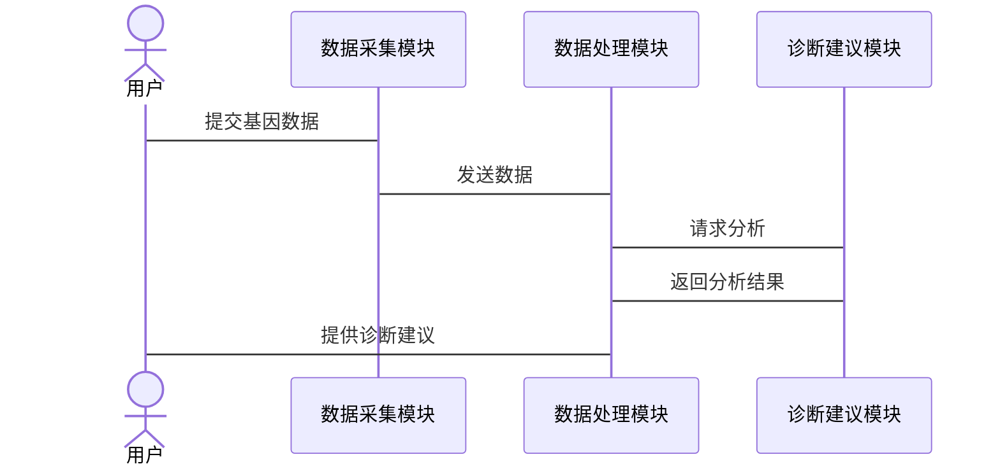

                 


# 个人基因组测序的普及与精准医疗投资

---

## 关键词：
- 个人基因组测序
- 精准医疗
- 生物信息学
- 投资分析
- 系统架构设计

---

## 摘要：
个人基因组测序技术的快速发展推动了精准医疗的普及，但同时也带来了技术、市场和伦理等多方面的挑战。本文从技术基础、市场现状、投资机会与风险、系统架构设计等方面进行深入分析，探讨个人基因组测序在精准医疗中的应用前景，为投资者提供科学的决策依据。

---

# 第一部分: 个人基因组测序的背景与技术基础

## 第1章: 个人基因组测序概述

### 1.1 个人基因组测序的定义与技术基础
#### 1.1.1 基因组学的基本概念
- 基因组：生物体完整的遗传信息集合。
- 基因测序：通过技术手段解析基因组序列信息。

#### 1.1.2 个人基因组测序的技术原理
- **Sanger测序**：通过电泳技术分离DNA片段，读取序列。
- **下一代测序（NGS）**：高通量测序技术，成本低、效率高。

#### 1.1.3 测序技术的发展历程
- **第一代测序**：1970年代，耗时长、成本高。
- **第二代测序**：2000年代，高通量、成本下降。
- **第三代测序**：单分子测序，无需PCR扩增。

### 1.2 精准医疗的核心概念
#### 1.2.1 精准医疗的定义与目标
- 精准医疗：基于个体基因信息，提供个性化治疗方案。
- 目标：提高治疗效果，减少副作用。

#### 1.2.2 精准医疗与传统医疗的区别
| 区别点 | 精准医疗 | 传统医疗 |
|-------|----------|----------|
| 数据基础 | 基因组数据 | 统一诊断标准 |
| 治疗方案 | 个性化 | 标准化 |

#### 1.2.3 精准医疗的实现路径
1. 收集基因组数据。
2. 数据分析与解读。
3. 制定个性化治疗方案。

---

## 第2章: 个人基因组测序的技术原理

### 2.1 测序技术的数学模型
#### 2.1.1 测序数据的生成过程
- 测序数据：碱基序列信息。
- 数据量：通常以Gigabases（Gb）为单位。

#### 2.1.2 测序数据的统计分析方法
- 碱基比：计算每种碱基的比例。
- 序列覆盖度：测序数据覆盖基因组的比例。

#### 2.1.3 测序数据的生物信息学分析
- 比对算法：将测序数据比对到参考基因组。
- 变异检测：发现基因突变。

### 2.2 算法原理与流程
#### 2.2.1 测序数据的预处理流程
1. 去除低质量数据。
2. 去除接头序列（adapters）。
3. 数据格式转换。

#### 2.2.2 测序数据的比对算法
- **BLASR算法**：基于局部相似性进行比对。
- **BWA算法**：高效比对工具。

#### 2.2.3 测序数据的变异检测方法
- **GATK工具**：常用变异检测工具。
- **FreeBayes工具**：基于贝叶斯统计的变异检测。

---

# 第二部分: 个人基因组测序的普及与应用

## 第4章: 个人基因组测序的普及现状

### 4.1 测序成本的下降趋势
#### 4.1.1 测序成本的历史变化
- 1990年代：数亿美元。
- 2010年代：数百万美元。
- 2020年代：数万美元。

#### 4.1.2 成本下降对普及的影响
- 降低成本：让更多人能够负担得起基因测序。
- 推动技术创新：促进测序技术的进一步发展。

#### 4.1.3 测序技术的未来发展趋势
- 精准度提升：减少错误率。
- 成本进一步下降：普及更多应用场景。

---

## 第5章: 精准医疗的投资机会

### 5.1 精准医疗市场的现状与规模
#### 5.1.1 全球精准医疗市场的规模
- 2020年：约900亿美元。
- 2030年：预计超过3000亿美元。

#### 5.1.2 中国市场的发展现状
- 政策支持：政府出台多项支持政策。
- 市场潜力：巨大的人口基数和医疗需求。

#### 5.1.3 市场增长的驱动因素
1. 技术进步：测序技术的快速发展。
2. 个性化医疗需求增加。
3. 投资力度加大。

### 5.2 精准医疗的投资模式
#### 5.2.1 风险投资与精准医疗
- 初创企业融资：早期阶段。
- 技术型公司：研发投入高。

#### 5.2.2 并购与合作模式
- 大型药企收购初创公司。
- 研究院所合作：技术互补。

#### 5.2.3 初创企业的融资策略
- 突出技术创新。
- 突出市场潜力。

---

## 第6章: 精准医疗中的投资风险与挑战

### 6.1 技术风险
#### 6.1.1 测序技术的不确定性
- 新技术可能替代现有技术。
- 技术成熟度影响应用效果。

#### 6.1.2 生物数据的隐私保护问题
- 数据泄露风险。
- 相关法律法规不完善。

#### 6.1.3 技术更新换代的风险
- 投资者需持续投入研发。

### 6.2 市场风险
#### 6.2.1 市场竞争的加剧
- 同质化竞争激烈。
- 利润空间被压缩。

#### 6.2.2 价格压力与成本控制
- 降低成本才能在市场竞争中占据优势。
- 高昂的前期投入。

#### 6.2.3 市场接受度的不确定性
- 患者对基因测序的认知不足。
- 医疗机构的接受度问题。

### 6.3 政策与伦理风险
#### 6.3.1 政策法规的影响
- 相关法律法规不完善。
- 政策变化对市场的影响。

#### 6.3.2 伦理问题的争议
- 基因编辑的伦理问题。
- 基因数据的隐私权问题。

#### 6.3.3 数据监管的挑战
- 数据存储和传输的安全性。
- 数据共享的规范性。

---

# 第三部分: 精准医疗的系统架构与投资策略

## 第7章: 精准医疗系统的架构设计

### 7.1 系统功能设计
#### 7.1.1 数据采集模块
- 数据来源：基因测序仪、数据库。
- 数据类型：基因序列数据、表型数据。

#### 7.1.2 数据处理模块
- 数据清洗：去除低质量数据。
- 数据分析：统计分析、机器学习分析。

#### 7.1.3 诊断建议模块
- 基因突变分析。
- 疾病风险评估。

### 7.2 系统架构设计图


### 7.3 系统交互序列图


---

## 第8章: 项目实战与投资策略

### 8.1 项目实战
#### 8.1.1 环境安装
```bash
pip install numpy
pip install pandas
pip install matplotlib
```

#### 8.1.2 核心代码实现
```python
import numpy as np
import pandas as pd

# 示例：计算基因突变频率
def calculate_variant_frequency(dataframe):
    variant_counts = dataframe['_variant'].value_counts()
    total = len(dataframe)
    frequency = variant_counts / total
    return frequency

# 读取数据
data = pd.read_csv('genomic_data.csv')
# 计算突变频率
frequency = calculate_variant_frequency(data)
# 可视化
frequency.plot(kind='bar')
```

#### 8.1.3 代码解读与分析
- **数据读取**：使用Pandas读取CSV格式的基因数据。
- **变异频率计算**：统计每个变异的出现频率。
- **可视化**：使用Matplotlib绘制柱状图。

#### 8.1.4 实际案例分析
- 案例：乳腺癌基因测序数据。
- 分析：通过基因突变频率分析患病风险。

### 8.2 投资策略
#### 8.2.1 关键成功因素
1. 技术创新。
2. 市场需求。
3. 政策支持。

#### 8.2.2 注意事项
- 风险评估。
- 投资分散。
- 长期视角。

#### 8.2.3 拓展阅读
- 基因测序技术的最新进展。
- 精准医疗的法律法规。

---

# 第四部分: 结论与展望

## 结论
个人基因组测序的普及和精准医疗的投资前景广阔，但同时也面临技术、市场和政策等多方面的挑战。投资者需综合考虑技术可行性、市场需求和政策环境，制定科学的投资策略。

## 展望
随着测序技术的进一步发展和精准医疗的不断进步，未来将有更多的疾病能够实现个性化治疗，投资机会也将进一步增加。

---

# 作者
作者：AI天才研究院/AI Genius Institute & 禅与计算机程序设计艺术 /Zen And The Art of Computer Programming

