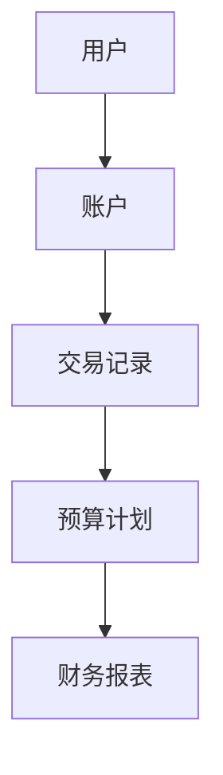
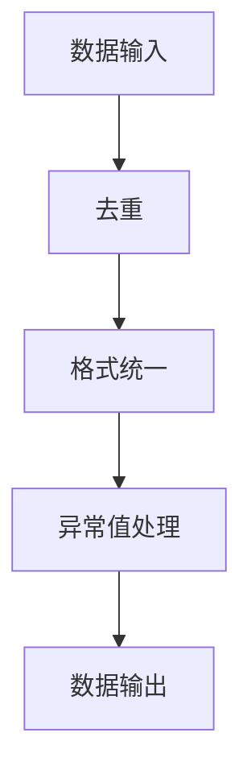
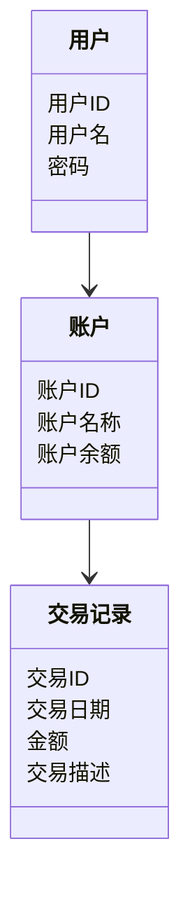
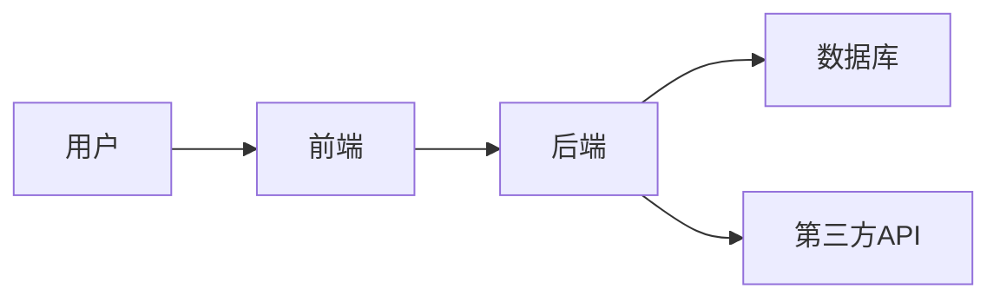
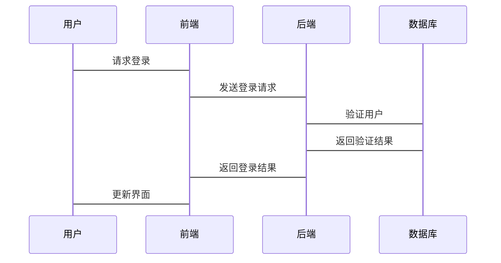

                 


# 个人财务管理工具集成

## 关键词：个人财务管理、工具集成、数据清洗、算法原理、系统架构

## 摘要：  
本文深入探讨了个人财务管理工具集成的核心概念、算法原理和系统架构。通过分析个人财务管理的重要性，详细阐述了工具集成的背景与核心概念，结合数据清洗算法和系统设计，为读者提供了从理论到实践的全面指导。

---

# 第1章: 个人财务管理工具集成的背景与问题

## 1.1 个人财务管理的重要性

### 1.1.1 个人财务管理的核心问题  
个人财务管理的核心问题在于如何高效地管理收支、预算、资产和负债，确保财务健康。传统方式依赖手工记录和Excel表格，效率低下且容易出错。

### 1.1.2 传统财务管理的局限性  
传统财务管理工具功能单一，难以满足多样化需求，数据分散，缺乏整合，难以生成全面的财务视图。

### 1.1.3 数字化财务管理的必要性  
随着技术的进步，数字化工具能够提供自动化记录、智能分析和实时监控，帮助个人更好地管理财务。

---

## 1.2 个人财务管理工具集成的背景

### 1.2.1 数字化工具的发展趋势  
数字化工具的普及使得个人可以更方便地管理财务数据，但工具的多样化也带来了集成的需求。

### 1.2.2 个人财务管理工具的多样化  
现有工具包括记账软件、预算工具、投资平台等，每种工具都有其独特功能，但缺乏统一的集成平台。

### 1.2.3 工具集成的需求与挑战  
用户希望在一个平台上整合多种工具的功能，但不同工具的数据格式和接口不统一，增加了集成的难度。

---

## 1.3 工具集成的核心概念

### 1.3.1 工具集成的定义  
工具集成是指将多种财务工具的功能和数据整合到一个统一的系统中，实现数据共享和功能协同。

### 1.3.2 工具集成的目标与范围  
目标是通过集成提高效率和准确性，范围包括数据集成、功能集成和用户体验集成。

### 1.3.3 工具集成的关键要素  
关键要素包括数据源、功能模块、用户交互和集成接口。

---

## 1.4 本章小结  
本章介绍了个人财务管理的重要性，分析了工具集成的背景，明确了核心概念和关键要素。

---

# 第2章: 个人财务管理工具集成的核心概念与联系

## 2.1 核心概念原理

### 2.1.1 数据集成原理  
数据集成是将不同来源的数据整合到一个系统中，确保数据的一致性和完整性。

### 2.1.2 功能集成原理  
功能集成是将多种工具的功能整合到一个平台中，实现统一的操作界面。

### 2.1.3 用户体验集成原理  
用户体验集成通过优化界面和交互流程，提升用户的使用体验。

---

## 2.2 核心概念属性对比表

| 概念       | 属性                     | 描述                                         |
|------------|--------------------------|----------------------------------------------|
| 数据集成   | 数据源                   | 来源、格式、结构                             |
| 功能集成   | 功能模块                 | 财务分析、预算管理、报表生成                 |
| 用户体验集成 | 操作流程                 | 界面设计、交互逻辑                         |

---

## 2.3 ER实体关系图



---

## 2.4 本章小结  
本章详细讲解了工具集成的核心概念，通过对比表和ER图展示了各概念之间的联系。

---

# 第3章: 个人财务管理工具集成的算法原理

## 3.1 数据清洗算法

### 3.1.1 数据清洗流程



---

## 3.2 数据清洗的Python实现

```python
import pandas as pd

def clean_data(df):
    # 去重
    df = df.drop_duplicates()
    # 格式统一
    df['amount'] = df['amount'].astype(float)
    # 异常值处理
    df = df[df['amount'] > 0]
    return df
```

---

## 3.3 数据清洗的数学模型

$$
\text{清洗后数据} = \text{清洗前数据} \setminus \text{重复数据} \setminus \text{异常值}
$$

---

## 3.4 本章小结  
本章通过流程图和Python代码详细讲解了数据清洗算法，并给出了数学模型。

---

# 第4章: 系统分析与架构设计

## 4.1 问题场景介绍

用户需要一个统一的平台，整合多个财务管理工具的功能，实现数据的统一管理和智能分析。

---

## 4.2 系统功能设计

### 4.2.1 领域模型



---

## 4.3 系统架构设计



---

## 4.4 系统接口设计

### 4.4.1 接口定义

| 接口名称 | 接口描述           |
|----------|-------------------|
| login    | 用户登录           |
| get_data | 获取财务数据       |

---

## 4.5 系统交互设计



---

## 4.6 本章小结  
本章通过系统分析与架构设计，展示了如何将工具集成应用于实际场景。

---

# 作者：AI天才研究院/AI Genius Institute & 禅与计算机程序设计艺术 /Zen And The Art of Computer Programming

