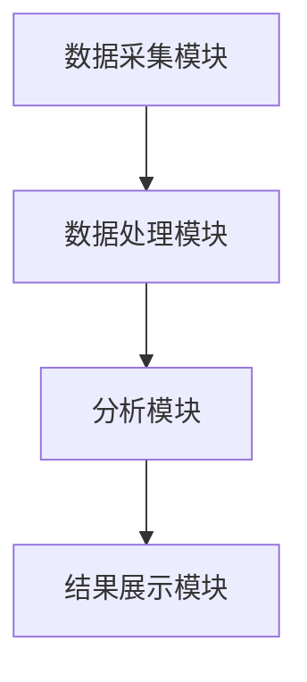

                 


# 个性化医疗的发展趋势与投资策略

## 关键词：个性化医疗、精准医学、人工智能、基因组学、生物标志物、投资策略

## 摘要：个性化医疗是一种基于患者个体特征（如基因、生活方式、环境因素）的定制化医疗方式，利用基因组学、人工智能和生物标志物等技术手段，实现精准诊断和治疗。本文将从个性化医疗的核心概念、技术原理、市场现状、投资机会与策略等方面进行深入分析，结合实际案例和系统设计，为投资者和医疗从业者提供有价值的参考。

---

# 第1章: 个性化医疗的定义与发展背景

## 1.1 个性化医疗的定义与核心要素

### 1.1.1 个性化医疗的定义
个性化医疗（Precision Medicine）是一种基于患者个体特征（如基因组信息、生活方式、环境因素）的定制化医疗方式，旨在通过精准的诊断和治疗，提高疗效并减少副作用。

### 1.1.2 核心概念
- **基因组学**：研究个体基因序列，用于疾病预测和治疗方案制定。
- **生物标志物**：用于诊断、监测疾病进展和治疗效果的分子标记。
- **精准治疗**：根据患者个体特征制定个性化治疗方案。

### 1.1.3 个性化医疗的边界与外延
个性化医疗不仅限于治疗，还包括预防、诊断和康复等全过程。

---

## 1.2 个性化医疗的发展背景

### 1.2.1 医疗技术的进步推动个性化医疗发展
- 基因测序技术的进步使个体化医疗成为可能。
- 人工智能技术的应用提升了数据分析和预测能力。

### 1.2.2 人口老龄化与慢性病的增加
- 人口老龄化导致慢性病患者增多，个性化医疗需求增加。
- 慢性病的治疗需要个性化的用药方案。

### 1.2.3 精准医学理念的兴起
- 精准医学理念推动医疗从“经验医学”向“数据驱动医学”转变。

---

## 1.3 个性化医疗的现状与挑战

### 1.3.1 当前个性化医疗的主要应用场景
- 癌症的精准治疗。
- 遗传病的早期筛查和诊断。

### 1.3.2 技术瓶颈与数据隐私问题
- 基因数据分析的复杂性。
- 数据隐私和安全问题。

### 1.3.3 医疗体系与政策的适应性
- 传统医疗体系的调整需求。
- 政策法规的完善需求。

---

## 1.4 本章小结
个性化医疗是医疗领域的重要发展趋势，基于基因组学、生物标志物和人工智能技术，正在改变传统的治疗方式。然而，技术、数据和政策等方面的挑战仍需解决。

---

# 第2章: 个性化医疗的核心概念与联系

## 2.1 核心概念原理

### 2.1.1 基因组学与个性化医疗的关系
- 基因组学为个性化医疗提供了遗传信息基础。
- 基因测序技术的进步推动了个性化医疗的发展。

### 2.1.2 生物标志物在诊断与治疗中的作用
- 生物标志物用于疾病诊断和治疗监测。
- 生物标志物的发现依赖于基因组学和蛋白质组学技术。

### 2.1.3 人工智能在个性化医疗中的应用
- AI技术用于基因数据的分析和疾病预测。
- AI辅助诊断和治疗方案的制定。

---

## 2.2 核心概念属性对比表

| 核心概念 | 属性 | 描述 |
|----------|------|------|
| 基因组学 | 数据来源 | 遗传信息 |
| 生物标志物 | 类型 | 蛋白质、基因表达、代谢产物 |
| 人工智能 | 应用场景 | 数据分析、预测模型 |

---

## 2.3 ER实体关系图

```mermaid
erd
  entity 基因组数据 {
    <属性> 基因序列
    <属性> 单核苷酸多态性
  }
  entity 生物标志物 {
    <属性> 蛋白质表达水平
    <属性> 代谢物浓度
  }
  entity 个性化治疗方案 {
    <属性> 治疗药物
    <属性> 剂量调整
  }
  基因组数据 --|> 个性化治疗方案
  生物标志物 --|> 个性化治疗方案
```

---

## 2.4 本章小结
通过分析基因组学、生物标志物和人工智能的核心概念及其关系，可以看出这些技术共同推动了个性化医疗的发展。下一章将深入探讨人工智能在个性化医疗中的具体应用。

---

# 第3章: 个性化医疗的投资策略与市场分析

## 3.1 个性化医疗的市场现状

### 3.1.1 全球个性化医疗市场规模
- 全球个性化医疗市场规模持续增长，预计年复合增长率超过10%。

### 3.1.2 区域市场分布与增长趋势
- 北美市场占主导地位，欧洲和亚洲市场增长迅速。

### 3.1.3 主要驱动力分析
- 技术进步推动市场需求。
- 慢性病患者数量增加。

---

## 3.2 个性化医疗的投资机会

### 3.2.1 精准诊断领域的投资热点
- 基因测序技术的创新。
- 生物标志物的开发。

### 3.2.2 个性化药物开发的市场潜力
- 精准药物研发的市场需求。
- 孤儿药市场的增长。

### 3.2.3 数字化医疗平台的投资价值
- 个性化医疗数据管理平台。
- 远程医疗和健康管理平台。

---

## 3.3 投资策略与风险评估

### 3.3.1 投资策略制定的关键因素
- 技术壁垒：关注具有核心技术优势的企业。
- 市场需求：选择具有广泛应用场景的领域。

### 3.3.2 市场风险与技术风险分析
- 市场风险：政策变化和技术替代风险。
- 技术风险：技术瓶颈和数据隐私问题。

### 3.3.3 投资组合优化
- 分散投资：结合不同领域的投资。
- 长期视角：关注技术进步和市场扩展。

---

## 3.4 本章小结
个性化医疗市场潜力巨大，投资者应关注技术创新和市场需求，制定合理投资策略，同时注意风险控制。

---

# 作者：AI天才研究院 & 禅与计算机程序设计艺术

---

# 附录：相关技术的数学公式与算法实现

## 附录A: 机器学习算法在个性化医疗中的应用

### A.1 逻辑回归模型

$$ P(y=1|x) = \frac{1}{1 + e^{-\beta x}} $$

其中，$\beta$ 是模型参数，$x$ 是输入特征。

### A.2 支持向量机（SVM）算法

$$ \text{目标函数} = \sum_{i=1}^n \xi_i + \frac{1}{2}\sum_{j=1}^m \gamma_j^2 $$

约束条件：

$$ y_i (w \cdot x_i + b) \geq 1 - \xi_i $$
$$ \xi_i \geq 0 $$

### A.3 算法实现代码示例

```python
import numpy as np
from sklearn.linear_model import LogisticRegression
from sklearn.svm import SVC

# 假设X为特征矩阵，y为标签
model_lr = LogisticRegression()
model_svm = SVC()

model_lr.fit(X, y)
model_svm.fit(X, y)
```

---

## 附录B: 系统架构设计

### B.1 系统功能设计

- 数据采集模块：收集患者的基因组数据、生活方式数据。
- 数据处理模块：清洗和预处理数据。
- 分析模块：基于机器学习模型进行疾病预测和治疗方案推荐。

### B.2 系统架构图



---

## 附录C: 项目实战

### C.1 环境安装

```bash
pip install numpy pandas scikit-learn
```

### C.2 核心实现代码

```python
import pandas as pd
from sklearn.model_selection import train_test_split
from sklearn.metrics import accuracy_score

# 加载数据
data = pd.read_csv('patient_data.csv')
X = data.drop('label', axis=1)
y = data['label']

# 划分训练集和测试集
X_train, X_test, y_train, y_test = train_test_split(X, y, test_size=0.2)

# 训练模型
model = LogisticRegression()
model.fit(X_train, y_train)

# 预测与评估
y_pred = model.predict(X_test)
print("准确率:", accuracy_score(y_test, y_pred))
```

---

## 附录D: 总结与建议

个性化医疗是未来医疗发展的主要方向，投资者应关注技术创新和市场需求，合理配置资源，注重数据隐私和伦理问题，制定长期投资策略。

---

# 结语

个性化医疗的发展离不开技术进步和市场推动，投资者需要深入了解技术和市场动态，抓住投资机会，同时注意风险控制。

