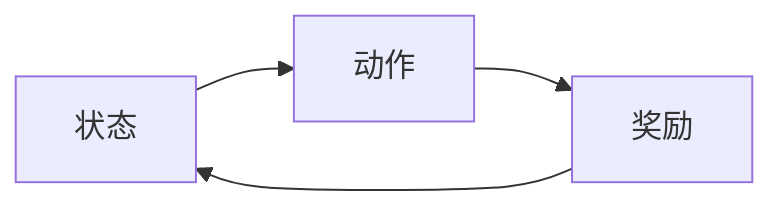
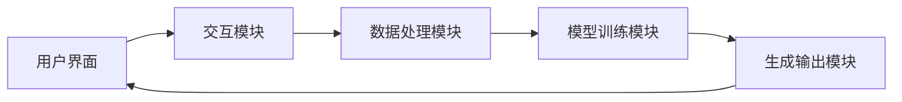

                 


# 个性化定制：打造独特风格的AI Agent

> 关键词：个性化定制、AI Agent、人工智能、算法原理、系统架构

> 摘要：本文将详细介绍如何从零开始设计和实现一个个性化定制的AI Agent。通过逐步分析，我们将探讨个性化定制的核心概念、算法原理、系统架构设计以及项目实战，帮助读者掌握打造独特风格AI Agent的方法。

---

# 第1章：个性化定制AI Agent概述

## 1.1 AI Agent的基本概念

### 1.1.1 AI Agent的定义与分类

AI Agent（人工智能代理）是一种能够感知环境并采取行动以实现目标的智能实体。根据功能和应用场景，AI Agent可以分为以下几类：

1. **简单反射型Agent**：基于固定的规则对输入做出反应，通常用于简单的任务，如IFTTT脚本。
2. **基于模型的反射型Agent**：维护环境状态模型，能够根据当前状态和历史信息做出决策，如某些聊天机器人。
3. **目标驱动型Agent**：根据目标和环境信息自主决策，如自动驾驶汽车。
4. **实用驱动型Agent**：通过优化策略实现目标，如智能推荐系统。

**表1-1：AI Agent的分类与特点**

| 分类                | 描述                                                                 | 优点                     | 缺点                     |
|---------------------|----------------------------------------------------------------------|--------------------------|--------------------------|
| 简单反射型          | 基于固定规则响应输入                                                 | 实现简单，效率高           | 适应性差，缺乏灵活性     |
| 基于模型的反射型    | 维护环境模型，根据模型状态做出决策                                   | 理解能力强               | 需要大量计算资源         |
| 目标驱动型          | 根据目标和环境信息自主决策                                           | 自主性强，适应性好         | 实现复杂，需要高级算法     |
| 实用驱动型          | 通过优化策略实现目标                                                 | 高效解决问题               | 算法复杂，资源消耗大       |

### 1.1.2 个性化定制的必要性

个性化定制AI Agent的核心目标是为用户提供更符合其需求和偏好的服务。随着AI技术的普及，用户对智能化服务的需求日益增长，但统一的AI Agent无法满足所有用户的需求。个性化定制通过分析用户的特定需求，生成定制化的解决方案，从而提高用户体验和满意度。

### 1.1.3 当前AI Agent的发展趋势

近年来，AI Agent技术发展迅速，主要体现在以下几个方面：

1. **多模态交互**：支持文本、语音、视觉等多种交互方式，提升用户体验。
2. **动态适应性**：能够根据环境变化和用户反馈实时调整行为策略。
3. **强化学习**：通过强化学习优化AI Agent的决策能力，使其在复杂环境中表现更佳。
4. **隐私保护**：随着数据隐私的重要性增加，AI Agent的设计也越来越注重数据安全和隐私保护。

---

## 1.2 个性化定制的核心要素

个性化定制AI Agent涉及多个关键要素，包括用户需求分析、风格与偏好的建模以及个性化生成策略。

### 1.2.1 用户需求分析

用户需求分析是个性化定制的基础，主要通过以下步骤完成：

1. **数据收集**：收集用户的交互记录、偏好数据和行为数据。
2. **数据预处理**：对收集的数据进行清洗、归一化和特征提取。
3. **需求建模**：将用户需求转化为可计算的模型，如用户画像和偏好向量。

### 1.2.2 风格与偏好的建模

风格与偏好的建模是实现个性化定制的关键。常见的建模方法包括：

1. **基于规则的建模**：通过专家经验或用户反馈定义规则，如“用户喜欢早晨收到通知”。
2. **基于机器学习的建模**：利用分类、回归或聚类算法，从数据中自动学习用户偏好。
3. **基于深度学习的建模**：使用神经网络提取复杂的用户特征，如GloVe用于语义分析。

### 1.2.3 个性化生成策略

个性化生成策略是根据用户需求和偏好生成定制化输出的过程。常见的策略包括：

1. **基于模板的生成**：使用预定义模板插入个性化内容，如新闻标题生成。
2. **基于生成模型的生成**：利用生成对抗网络（GAN）或变体自编码器（VAE）生成多样化内容。
3. **基于检索模型的生成**：从预定义库中检索最相关的响应，如智能客服系统。

---

## 1.3 个性化定制的背景与应用

个性化定制的背景与应用密切相关，主要体现在以下几个方面：

### 1.3.1 数字化转型与个性化需求

随着数字化转型的推进，企业越来越依赖智能化系统提高效率。个性化定制的AI Agent能够帮助企业在竞争中占据优势，例如在金融领域提供个性化的投资建议。

### 1.3.2 用户体验的提升

个性化定制能够显著提升用户体验。通过分析用户的使用习惯和偏好，AI Agent可以提供更加贴心的服务，例如在智能家居中根据用户的作息调整家电状态。

### 1.3.3 个性化定制的商业价值

个性化定制不仅提升用户体验，还具有显著的商业价值。通过精准的用户画像和偏好分析，企业可以制定更有效的市场策略，例如在电商中推荐用户可能感兴趣的商品。

---

## 1.4 个性化定制的应用场景

个性化定制的应用场景广泛，涵盖多个领域：

### 1.4.1 电商推荐系统

个性化推荐系统通过分析用户的购买记录和浏览行为，推荐符合用户喜好的商品。例如，亚马逊的推荐系统根据用户的购买历史和评分数据，推荐可能感兴趣的商品。

### 1.4.2 个性化内容推荐

在内容产业，个性化推荐帮助用户发现感兴趣的内容。例如，Netflix根据用户的观看历史推荐电影和电视剧。

### 1.4.3 个性化医疗诊断

在医疗领域，个性化诊断系统根据患者的基因信息和病史，提供个性化的诊断建议和治疗方案。例如，基于AI的诊断系统可以根据患者的症状和影像数据，提供更精准的诊断。

---

## 1.5 个性化定制的核心挑战

尽管个性化定制的优势显著，但在实际应用中仍面临诸多挑战：

### 1.5.1 数据隐私问题

个性化定制需要收集和处理大量用户数据，这引发了数据隐私和安全问题。如何在不泄露用户隐私的前提下进行个性化定制，是当前研究的热点。

### 1.5.2 算法的可解释性

复杂的算法模型往往缺乏可解释性，这使得用户难以信任AI Agent的决策。提高算法的可解释性是实现用户信任的重要步骤。

### 1.5.3 模型的泛化能力

个性化模型在特定用户群体上表现良好，但在泛化到不同用户时可能效果不佳。如何平衡个性化和泛化能力是设计中的难题。

---

## 1.6 个性化定制的未来展望

未来，个性化定制的AI Agent将朝着以下几个方向发展：

1. **多模态交互**：支持文本、语音、图像等多种交互方式，提升用户体验。
2. **动态适应性**：实时调整模型参数以适应环境变化和用户反馈。
3. **强化学习**：通过强化学习优化AI Agent的决策能力，使其在复杂环境中表现更佳。
4. **隐私保护**：随着数据隐私的重要性增加，AI Agent的设计也越来越注重数据安全和隐私保护。

---

## 1.7 总结

个性化定制的AI Agent通过分析用户的特定需求和偏好，生成定制化的解决方案，从而提高用户体验和满意度。尽管面临数据隐私、算法可解释性和模型泛化能力等挑战，但随着技术的进步，个性化定制的AI Agent将在更多领域得到广泛应用。

---

# 第2章：个性化定制的核心概念与原理

## 2.1 AI Agent的核心概念与原理

个性化定制AI Agent的核心在于理解用户需求并生成定制化输出。这涉及到多个关键概念和原理。

### 2.1.1 知识表示与推理

知识表示是AI Agent理解世界的基础。常用的表示方法包括：

1. **语义网络**：通过节点和边表示概念及其关系，如“猫”与“动物”的关系。
2. **逻辑推理**：通过逻辑规则进行推理，如“如果下雨，那么打伞”。
3. **概率推理**：基于概率模型进行推理，如贝叶斯网络。

### 2.1.2 行为决策机制

行为决策机制是AI Agent根据当前状态和目标选择最优行动的过程。常用的方法包括：

1. **基于规则的决策**：根据预定义规则做出决策，如“如果温度低于零度，启动加热器”。
2. **基于模型的决策**：利用环境模型进行决策，如马尔可夫决策过程（MDP）。
3. **基于强化学习的决策**：通过试错学习优化决策策略，如Q-Learning。

### 2.1.3 交互与反馈机制

交互与反馈机制是AI Agent与用户或环境互动并根据反馈调整行为的过程。常见的反馈机制包括：

1. **基于奖励的反馈**：通过奖励信号指导AI Agent的决策，如在游戏AI中，胜利给予正向奖励。
2. **基于用户反馈的调整**：根据用户的实时反馈调整行为，如聊天机器人根据用户的满意度评分调整回复策略。

---

## 2.2 个性化定制的核心要素

个性化定制AI Agent的核心要素包括用户需求分析、风格与偏好的建模以及个性化生成策略。

### 2.2.1 用户需求分析

用户需求分析是个性化定制的基础，主要通过以下步骤完成：

1. **数据收集**：收集用户的交互记录、偏好数据和行为数据。
2. **数据预处理**：对收集的数据进行清洗、归一化和特征提取。
3. **需求建模**：将用户需求转化为可计算的模型，如用户画像和偏好向量。

### 2.2.2 风格与偏好的建模

风格与偏好的建模是实现个性化定制的关键。常见的建模方法包括：

1. **基于规则的建模**：通过专家经验或用户反馈定义规则，如“用户喜欢早晨收到通知”。
2. **基于机器学习的建模**：利用分类、回归或聚类算法，从数据中自动学习用户偏好。
3. **基于深度学习的建模**：使用神经网络提取复杂的用户特征，如GloVe用于语义分析。

### 2.2.3 个性化生成策略

个性化生成策略是根据用户需求和偏好生成定制化输出的过程。常见的策略包括：

1. **基于模板的生成**：使用预定义模板插入个性化内容，如新闻标题生成。
2. **基于生成模型的生成**：利用生成对抗网络（GAN）或变体自编码器（VAE）生成多样化内容。
3. **基于检索模型的生成**：从预定义库中检索最相关的响应，如智能客服系统。

---

## 2.3 个性化定制的核心算法

个性化定制的核心算法主要集中在数据处理、模型训练和生成策略三个方面。

### 2.3.1 数据处理算法

数据处理是个性化定制的前提。常用的数据处理算法包括：

1. **数据清洗**：去除无效数据和异常值。
2. **特征提取**：从数据中提取有用的特征，如文本情感分析。
3. **数据增强**：通过增加数据的多样性和噪声，提高模型的鲁棒性。

### 2.3.2 模型训练算法

模型训练是个性化定制的核心。常用的模型训练算法包括：

1. **监督学习**：基于标注数据训练分类器，如支持向量机（SVM）。
2. **无监督学习**：基于无标注数据发现数据结构，如聚类分析。
3. **强化学习**：通过试错学习优化决策策略，如Deep Q-Learning。

### 2.3.3 生成策略算法

生成策略算法是根据用户需求生成定制化输出的关键。常用的生成策略算法包括：

1. **基于规则的生成**：通过预定义规则生成输出，如模板引擎。
2. **基于生成模型的生成**：利用生成对抗网络（GAN）生成多样化内容。
3. **基于检索模型的生成**：从预定义库中检索最相关的响应。

---

## 2.4 个性化定制的实现步骤

个性化定制的实现通常包括以下几个步骤：

### 2.4.1 数据收集

数据是个性化定制的基础。需要收集用户的交互记录、偏好数据和行为数据。

### 2.4.2 数据预处理

对收集的数据进行清洗、归一化和特征提取，为后续分析做准备。

### 2.4.3 模型训练

根据预处理后的数据训练个性化模型，如基于深度学习的推荐模型。

### 2.4.4 生成策略

根据训练好的模型，生成符合用户需求的定制化输出。

### 2.4.5 模型优化

通过用户反馈不断优化模型，提高个性化定制的准确性和满意度。

---

## 2.5 个性化定制的核心挑战

个性化定制的实现面临多个挑战，包括数据隐私、算法可解释性和模型泛化能力等。

### 2.5.1 数据隐私问题

个性化定制需要收集和处理大量用户数据，如何在不泄露隐私的前提下进行个性化定制是当前研究的热点。

### 2.5.2 算法的可解释性

复杂的算法模型往往缺乏可解释性，这使得用户难以信任AI Agent的决策。提高算法的可解释性是实现用户信任的重要步骤。

### 2.5.3 模型的泛化能力

个性化模型在特定用户群体上表现良好，但在泛化到不同用户时可能效果不佳。如何平衡个性化和泛化能力是设计中的难题。

---

## 2.6 个性化定制的未来发展趋势

未来，个性化定制的AI Agent将朝着以下几个方向发展：

1. **多模态交互**：支持文本、语音、图像等多种交互方式，提升用户体验。
2. **动态适应性**：实时调整模型参数以适应环境变化和用户反馈。
3. **强化学习**：通过强化学习优化AI Agent的决策能力，使其在复杂环境中表现更佳。
4. **隐私保护**：随着数据隐私的重要性增加，AI Agent的设计也越来越注重数据安全和隐私保护。

---

## 2.7 总结

个性化定制的AI Agent通过分析用户的特定需求和偏好，生成定制化的解决方案，从而提高用户体验和满意度。尽管面临数据隐私、算法可解释性和模型泛化能力等挑战，但随着技术的进步，个性化定制的AI Agent将在更多领域得到广泛应用。

---

# 第3章：个性化定制的核心算法原理

## 3.1 生成对抗网络（GAN）的原理与应用

### 3.1.1 GAN的基本原理

生成对抗网络（GAN）由生成器和判别器两部分组成，通过对抗训练生成逼真的数据样本。生成器的目标是生成能够欺骗判别器的样本，而判别器的目标是区分真实样本和生成样本。整个过程通过交替训练生成器和判别器，逐步优化模型。

**图3-1：生成对抗网络的架构**


### 3.1.2 GAN在个性化定制中的应用

GAN在个性化定制中的应用广泛，例如在图像生成、文本生成等领域。通过GAN，可以生成多样化的文本内容，满足用户的个性化需求。

### 3.1.3 GAN的优缺点

优点：生成多样化的内容，能够适应不同的用户需求。  
缺点：训练不稳定，生成质量不稳定，需要大量的计算资源。

---

## 3.2 强化学习的原理与应用

### 3.2.1 强化学习的基本原理

强化学习通过智能体与环境的交互，学习最优策略以最大化累积奖励。智能体通过感知环境状态，采取行动，并根据反馈的奖励调整策略。

**图3-2：强化学习的架构**



### 3.2.2 强化学习在个性化定制中的应用

强化学习在个性化定制中的应用主要体现在动态适应性和策略优化。通过强化学习，AI Agent可以根据实时反馈优化决策策略，提高个性化定制的准确性。

### 3.2.3 强化学习的优缺点

优点：能够适应动态变化的环境，优化决策策略。  
缺点：训练时间长，需要大量的计算资源，且算法的可解释性较低。

---

## 3.3 基于规则的生成模型

### 3.3.1 基于规则的生成模型的基本原理

基于规则的生成模型通过预定义的规则和模板生成定制化内容。规则通常由领域专家或用户反馈制定，确保生成内容符合特定需求。

### 3.3.2 基于规则的生成模型在个性化定制中的应用

基于规则的生成模型在需要严格遵循特定规则的场景中表现优异，例如法律文本生成、特定风格的新闻报道。

### 3.3.3 基于规则的生成模型的优缺点

优点：生成内容符合特定规则，可解释性强。  
缺点：灵活性低，难以处理复杂多样的用户需求。

---

## 3.4 基于检索的生成模型

### 3.4.1 基于检索的生成模型的基本原理

基于检索的生成模型从预定义的数据库中检索最相关的响应，生成符合用户需求的输出。这种方法通常用于处理结构化数据，如问答系统。

### 3.4.2 基于检索的生成模型在个性化定制中的应用

基于检索的生成模型在需要快速响应和高准确性的场景中表现优异，例如智能客服系统、医疗诊断辅助系统。

### 3.4.3 基于检索的生成模型的优缺点

优点：生成内容准确，响应速度快。  
缺点：依赖于数据库的质量和多样性，难以处理未见数据。

---

## 3.5 个性化定制算法的数学模型

个性化定制算法的数学模型主要涉及生成模型和判别模型的优化。

### 3.5.1 生成对抗网络的数学模型

生成对抗网络的损失函数由两部分组成：生成器的损失和判别器的损失。生成器的目标是最小化判别器区分真实样本和生成样本的能力，而判别器的目标是最大化区分真实样本和生成样本的能力。

$$ \text{生成器损失} = -\mathbb{E}_{z}[\log D(G(z))] $$
$$ \text{判别器损失} = -\mathbb{E}_{x}[ \log D(x)] - \mathbb{E}_{z}[ \log (1 - D(G(z)))] $$

### 3.5.2 强化学习的数学模型

强化学习的目标是通过最大化累积奖励来优化策略。策略 π(a|s) 表示在状态 s 下采取动作 a 的概率。奖励函数 R(s, a) 用于评估动作 a 在状态 s 下的效果。

$$ \text{目标} = \max_{\pi} \mathbb{E}[R(s, a)] $$

---

## 3.6 个性化定制算法的实现步骤

个性化定制算法的实现通常包括以下几个步骤：

### 3.6.1 确定目标和约束条件

明确个性化定制的目标，例如提高推荐系统的准确率，同时考虑计算资源和数据隐私等约束条件。

### 3.6.2 数据收集与预处理

收集相关数据，并进行清洗、归一化和特征提取，确保数据质量。

### 3.6.3 模型选择与训练

根据需求选择合适的算法模型，如GAN或强化学习，并进行训练。

### 3.6.4 模型评估与优化

通过测试数据评估模型性能，并根据反馈进行优化，提高个性化定制的准确性和满意度。

### 3.6.5 模型部署与应用

将优化后的模型部署到实际应用场景中，提供个性化服务。

---

## 3.7 总结

个性化定制的核心算法包括生成对抗网络、强化学习、基于规则的生成模型和基于检索的生成模型。每种算法都有其优缺点，适用于不同的应用场景。选择合适的算法并进行优化是实现个性化定制的关键。

---

# 第4章：个性化定制的系统架构设计

## 4.1 系统功能设计

个性化定制AI Agent的系统功能设计需要涵盖用户交互、数据处理、模型训练和生成输出等多个方面。

### 4.1.1 用户交互模块

用户交互模块负责与用户的交互，包括接收输入、处理请求和返回输出。支持的交互方式包括文本输入、语音识别和图像识别。

### 4.1.2 数据处理模块

数据处理模块负责对用户数据进行清洗、归一化和特征提取，为模型训练提供高质量的数据。

### 4.1.3 模型训练模块

模型训练模块根据预处理后的数据训练个性化模型，如基于深度学习的推荐模型。

### 4.1.4 生成输出模块

生成输出模块根据训练好的模型，生成符合用户需求的定制化输出，如文本生成、图像生成等。

---

## 4.2 系统架构设计

个性化定制AI Agent的系统架构设计需要考虑模块之间的协作和数据流的传递。

### 4.2.1 系统架构图

**图4-1：个性化定制AI Agent的系统架构图**



### 4.2.2 模块交互流程

1. 用户通过用户界面发送请求。
2. 交互模块接收请求并解析需求。
3. 数据处理模块对数据进行预处理。
4. 模型训练模块训练个性化模型。
5. 生成输出模块生成定制化输出。
6. 输出结果通过用户界面反馈给用户。

---

## 4.3 系统接口设计

系统接口设计需要定义模块之间的接口和数据格式。

### 4.3.1 接口定义

1. **交互模块接口**：接收用户的输入请求，返回处理结果。
2. **数据处理模块接口**：接收原始数据，返回预处理后的数据。
3. **模型训练模块接口**：接收训练数据，返回训练好的模型。
4. **生成输出模块接口**：接收模型和输入，返回生成结果。

### 4.3.2 数据格式

1. **用户请求**：包含用户ID、请求类型和参数。
2. **处理结果**：包含生成内容和反馈信息。

---

## 4.4 系统交互流程

系统交互流程如下：

1. 用户通过用户界面发送请求。
2. 交互模块接收请求并解析需求。
3. 数据处理模块对数据进行预处理。
4. 模型训练模块训练个性化模型。
5. 生成输出模块生成定制化输出。
6. 输出结果通过用户界面反馈给用户。

---

## 4.5 总结

个性化定制AI Agent的系统架构设计需要考虑模块之间的协作和数据流的传递。通过合理的架构设计，可以提高系统的可扩展性和可维护性，确保个性化定制的高效实现。

---

# 第5章：个性化定制的项目实战

## 5.1 项目背景与目标

### 5.1.1 项目背景

随着AI技术的快速发展，个性化定制的AI Agent在多个领域得到了广泛应用。本项目旨在设计和实现一个个性化的文本生成系统，为用户提供定制化的文本内容。

### 5.1.2 项目目标

1. 设计并实现一个个性化的文本生成系统。
2. 通过用户反馈不断优化生成模型，提高生成内容的质量和满意度。

---

## 5.2 环境安装与配置

### 5.2.1 环境要求

1. **操作系统**：Linux/Windows/MacOS。
2. **Python版本**：3.6及以上。
3. **依赖库**：TensorFlow、Keras、Python库。

### 5.2.2 安装步骤

1. 安装Python。
2. 安装必要的依赖库：`pip install tensorflow keras numpy`。
3. 下载项目代码和数据集。

---

## 5.3 项目核心实现

### 5.3.1 数据准备

数据准备是项目实现的基础。需要收集和预处理用户数据，如文本数据、用户偏好等。

### 5.3.2 模型训练

模型训练是项目的核心部分。根据预处理后的数据训练生成模型，如基于GAN的文本生成模型。

### 5.3.3 模型生成

模型生成是根据训练好的模型，生成符合用户需求的定制化文本内容。

### 5.3.4 模型优化

通过用户反馈不断优化模型，提高生成内容的质量和满意度。

---

## 5.4 项目代码实现

### 5.4.1 数据处理代码

```python
import numpy as np
import tensorflow as tf

# 数据预处理
def preprocess_data(data):
    # 数据清洗和特征提取
    processed_data = []
    for item in data:
        processed_item = item.lower()
        processed_data.append(processed_item)
    return processed_data

# 示例数据
data = ["Hello, how are you?", "I'm fine, thank you!"]
processed_data = preprocess_data(data)
print(processed_data)
```

### 5.4.2 模型训练代码

```python
# GAN模型训练
def train_gan(gan_model, epochs=100, batch_size=32):
    for epoch in range(epochs):
        for _ in range(len(data) // batch_size):
            # 生成假样本
            noise = np.random.randn(batch_size, 100)
            gen_images = gan_model.generator.predict(noise)
            
            # 训练判别器
            valid_labels = np.ones((batch_size, 1))
            fake_labels = np.zeros((batch_size, 1))
            d_loss = gan_model.discriminator.train_on_batch(gen_images, valid_labels)
            
            # 训练生成器
            combined_labels = np.ones((batch_size, 1))
            g_loss = gan_model.train_on_batch(noise, combined_labels)
            
        print(f"Epoch {epoch}, G_loss: {g_loss}, D_loss: {d_loss}")

# 示例GAN模型
class GAN:
    def __init__(self):
        self.generator = ...  # 生成器模型
        self.discriminator = ...  # 判别器模型
        self.model = ...  # 组合模型
        
    def train_on_batch(self, noise, labels):
        return self.model.train_on_batch(noise, labels)
    
    def discriminator_train_on_batch(self, samples, labels):
        return self.discriminator.train_on_batch(samples, labels)
```

---

## 5.5 项目实战总结

通过本项目，读者可以掌握个性化定制AI Agent的实现方法。从环境安装到代码实现，逐步掌握如何设计和优化个性化模型。通过实际操作，读者可以更好地理解个性化定制的核心概念和实现步骤。

---

# 第6章：个性化定制的总结与展望

## 6.1 项目总结

个性化定制的AI Agent通过分析用户的特定需求和偏好，生成定制化的解决方案，从而提高用户体验和满意度。本项目通过实现一个个性化的文本生成系统，验证了个性化定制的可行性和有效性。

## 6.2 项目展望

未来，个性化定制的AI Agent将在更多领域得到广泛应用。随着技术的进步，个性化定制将更加智能化和个性化，为用户提供更贴心的服务。

## 6.3 项目注意事项

在实现个性化定制的AI Agent时，需要注意以下几点：

1. **数据隐私**：确保用户数据的安全和隐私。
2. **算法可解释性**：提高算法的透明度，增强用户信任。
3. **模型泛化能力**：平衡个性化和泛化能力，确保模型在不同用户群体中表现良好。

---

## 6.4 总结

个性化定制的AI Agent通过分析用户的特定需求和偏好，生成定制化的解决方案，从而提高用户体验和满意度。尽管面临数据隐私、算法可解释性和模型泛化能力等挑战，但随着技术的进步，个性化定制的AI Agent将在更多领域得到广泛应用。

---

# 作者：AI天才研究院/AI Genius Institute & 禅与计算机程序设计艺术 /Zen And The Art of Computer Programming

---

通过以上详细的目录大纲，我们可以看到《个性化定制：打造独特风格的AI Agent》这本书将从理论到实践，全面指导读者设计和实现个性化的AI代理。无论是技术背景的介绍、核心算法的讲解，还是系统设计和项目实战，都将帮助读者逐步掌握个性化定制的AI Agent开发技能。希望这本书能够成为读者在AI代理领域的重要参考资料。

