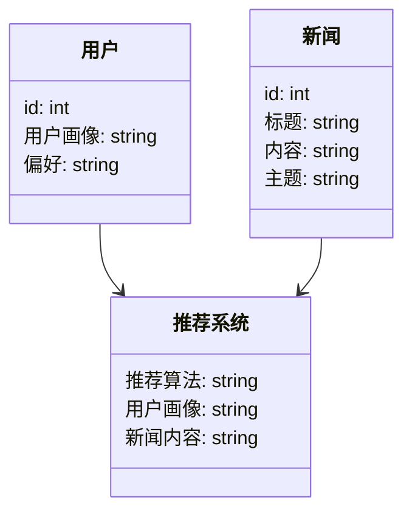
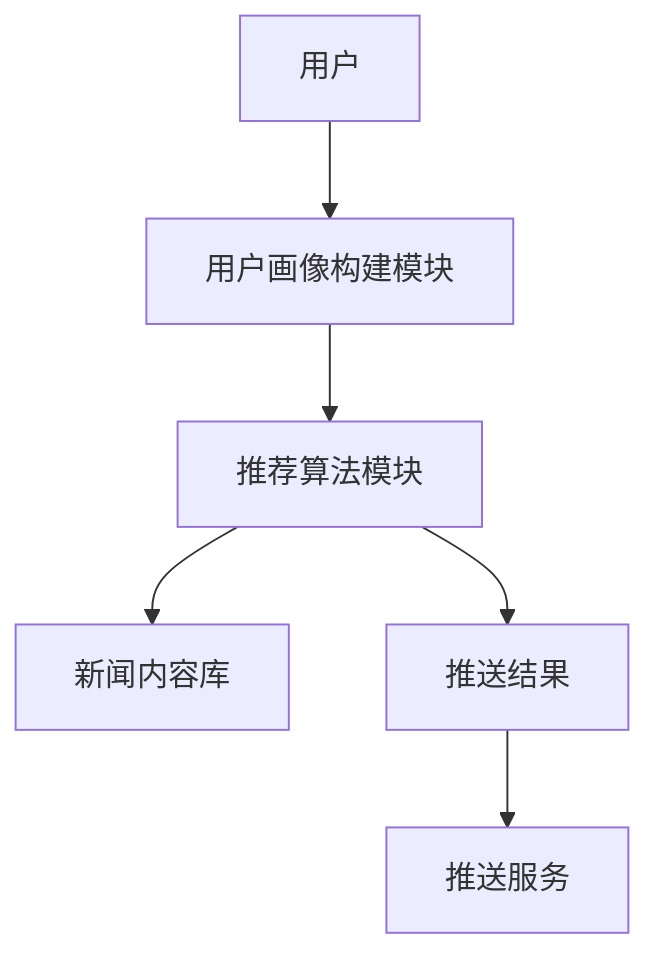
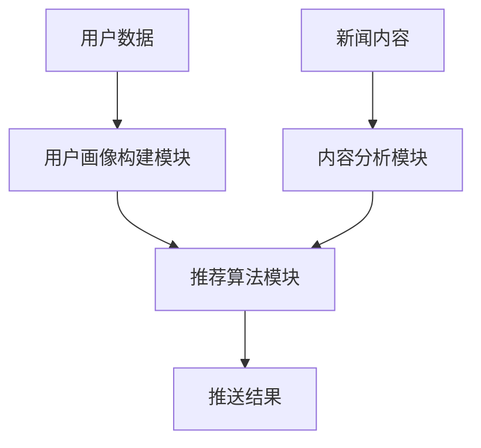

                 


# 个性化新闻推送：AI Agent的内容筛选

## 关键词：个性化推送、AI Agent、新闻筛选、用户画像、推荐算法、内容分析

## 摘要：个性化新闻推送利用AI代理筛选内容，通过用户画像和内容分析，结合推荐算法，实现精准内容推荐，解决信息过载问题，提升用户体验。

---

## 第一部分: 个性化新闻推送的背景与核心概念

---

## 第1章: 个性化新闻推送的背景与问题描述

### 1.1 个性化新闻推送的背景

#### 1.1.1 传统新闻推送的局限性
- **信息过载**：传统新闻推送无法有效筛选，导致用户接收大量无关信息。
- **用户需求多样性**：不同用户兴趣各异，通用推送难以满足个性化需求。
- **推送效果差**：低精准度导致用户流失，影响用户粘性和满意度。

#### 1.1.2 个性化推送的需求驱动
- **用户需求**：用户期望获取与自身兴趣相符的内容。
- **市场竞争**：个性化服务成为媒体差异化竞争的关键。
- **技术进步**：AI技术的发展为个性化推送提供了技术支持。

#### 1.1.3 AI技术在新闻推送中的应用潜力
- **自然语言处理**：用于内容理解和语义分析。
- **机器学习**：构建推荐模型，优化推送策略。
- **实时反馈机制**：根据用户行为动态调整推送内容。

### 1.2 问题背景与目标

#### 1.2.1 用户信息过载的问题
- **信息爆炸**：用户每天接触大量信息，难以筛选。
- **注意力分散**：用户难以集中注意力，影响信息接收效果。

#### 1.2.2 新闻内容的多样性与用户需求的匹配
- **内容多样性**：新闻涵盖多个领域，用户兴趣点分散。
- **精准匹配需求**：如何高效匹配用户需求与新闻内容。

#### 1.2.3 个性化推送的目标与核心价值
- **目标**：通过AI代理实现精准、实时的内容推荐。
- **核心价值**：提升用户体验，增加用户粘性，提高内容分发效率。

### 1.3 个性化新闻推送的核心要素

#### 1.3.1 用户画像的构建
- **用户画像**：基于用户行为、偏好和历史数据，构建用户特征模型。
- **构建方法**：通过收集用户行为数据、兴趣标签和互动数据，形成用户画像。

#### 1.3.2 新闻内容的特征提取
- **内容特征**：包括新闻主题、关键词、语义信息等。
- **提取方法**：使用NLP技术进行文本处理和主题分类。

#### 1.3.3 推送策略的优化目标
- **精准度**：提高推荐内容的相关性。
- **多样性**：推送多领域内容，避免用户兴趣单一化。
- **实时性**：根据用户实时行为调整推送策略。

### 1.4 本章小结
本章介绍了个性化新闻推送的背景，分析了传统推送的局限性，探讨了AI技术的应用潜力，并明确了个性化推送的目标与核心要素。

---

## 第二部分: 个性化新闻推送的核心概念与技术

---

## 第2章: 用户画像与内容分析

### 2.1 用户画像的构建

#### 2.1.1 用户画像的定义与作用
- **定义**：用户画像通过标签化数据描述用户特征。
- **作用**：帮助理解用户需求，优化推荐策略。

#### 2.1.2 用户画像的构建方法
- **数据收集**：收集用户行为、偏好和历史数据。
- **特征提取**：提取用户特征，如兴趣标签、行为模式。
- **模型构建**：使用机器学习模型预测用户画像。

#### 2.1.3 用户画像的更新与维护
- **实时更新**：根据用户最新行为调整画像。
- **动态优化**：通过反馈机制持续优化画像准确性。

### 2.2 新闻内容的特征提取

#### 2.2.1 新闻文本的预处理
- **文本清洗**：去除无关信息，如广告、停用词。
- **分词处理**：使用分词工具对文本进行分词。

#### 2.2.2 新闻主题的分类与标签化
- **主题分类**：将新闻分为多个主题类别。
- **标签化**：为每个新闻分配相关标签，便于推荐。

#### 2.2.3 新闻内容的语义分析
- **语义理解**：使用NLP技术理解新闻内容含义。
- **情感分析**：分析新闻情感倾向，辅助推荐。

### 2.3 用户行为与偏好分析

#### 2.3.1 用户行为数据的收集
- **点击率**：记录用户点击新闻的行为。
- **停留时间**：分析用户对新闻的阅读深度。
- **互动数据**：收集用户点赞、评论等互动行为。

#### 2.3.2 用户偏好的建模方法
- **协同过滤**：基于用户行为数据进行推荐。
- **基于内容的推荐**：分析用户偏好内容特征，进行推荐。

#### 2.3.3 用户行为与内容特征的关联分析
- **关联规则**：发现用户行为与内容特征之间的关联。
- **相似度计算**：计算用户行为与内容特征的相似度，辅助推荐。

### 2.4 核心概念对比分析

#### 2.4.1 用户画像与内容特征的对比
| 特征 | 用户画像 | 内容特征 |
|------|----------|----------|
| 数据来源 | 用户行为、偏好 | 新闻文本、主题 |
| 数据类型 | 标签化、结构化 | 文本、主题分类 |

#### 2.4.2 不同推荐算法的优缺点对比
| 算法 | 优点 | 缺点 |
|------|------|------|
| 协同过滤 | 简单易实现 | 对新用户冷启动问题 |
| 基于内容的推荐 | 内容特征明确 | 依赖内容质量 |
| 混合推荐 | 结合两者优点 | 复杂性较高 |

#### 2.4.3 系统架构的可扩展性分析
- **模块化设计**：各模块独立，便于扩展。
- **接口标准化**：统一接口设计，便于模块替换和升级。

### 2.5 本章小结
本章详细讲解了用户画像和内容分析的核心概念，包括构建方法、特征提取和关联分析，对比了不同推荐算法的优缺点，并分析了系统架构的可扩展性。

---

## 第三部分: 个性化新闻推送的算法原理

---

## 第3章: 协同过滤算法

### 3.1 协同过滤的定义与原理

#### 3.1.1 协同过滤的基本概念
- **协同过滤**：基于用户相似性推荐相关内容。
- **用户-用户协同过滤**：找到相似用户，推荐其喜欢的内容。
- **物品-物品协同过滤**：基于物品相似性推荐相关物品。

#### 3.1.2 基于用户的协同过滤
- **相似度计算**：使用余弦相似度或Jaccard系数计算用户相似度。
- **推荐生成**：根据相似用户的偏好推荐内容。

#### 3.1.3 基于物品的协同过滤
- **物品相似度计算**：计算新闻内容之间的相似度。
- **推荐生成**：根据用户已感兴趣的内容，推荐相似的新闻。

### 3.2 协同过滤的实现步骤

#### 3.2.1 数据预处理
- **数据清洗**：处理缺失值和异常值。
- **数据标准化**：统一数据格式，便于计算。

#### 3.2.2 相似度计算
- **余弦相似度公式**
$$ \text{similarity}(u_1, u_2) = \frac{\sum_{i} u_1[i] \cdot u_2[i]}{\sqrt{\sum_{i} u_1[i]^2} \cdot \sqrt{\sum_{i} u_2[i]^2}} $$

#### 3.2.3 推荐生成
- **基于用户的推荐**：找到与目标用户相似的用户，推荐其喜欢的内容。
- **基于物品的推荐**：找到与目标用户已感兴趣物品相似的物品，推荐给用户。

### 3.3 协同过滤的优缺点

#### 3.3.1 优点
- **简单易实现**：算法实现相对简单，易于理解。
- **数据稀疏性处理**：适用于数据稀疏场景。

#### 3.3.2 缺点
- **计算复杂度高**：大规模数据计算复杂。
- **冷启动问题**：新用户或新内容难以推荐。

### 3.4 本章小结
本章详细讲解了协同过滤算法的定义、原理和实现步骤，分析了其优缺点，为后续推荐算法的选择提供了参考。

---

## 第四部分: 系统架构与项目实战

---

## 第4章: 个性化新闻推送系统的架构设计

### 4.1 系统功能设计

#### 4.1.1 领域模型


#### 4.1.2 系统架构


#### 4.1.3 接口设计
- **输入接口**：接收用户行为数据和新闻内容数据。
- **输出接口**：输出推荐结果和反馈数据。

#### 4.1.4 数据流图


### 4.2 项目实战

#### 4.2.1 环境安装
```bash
pip install numpy
pip install scikit-learn
pip install jieba
```

#### 4.2.2 核心代码实现
```python
from sklearn.metrics.pairwise import cosine_similarity
import numpy as np

# 示例用户行为数据
user_profiles = {
    'user1': {'interests': ['technology', 'politics']},
    'user2': {'interests': ['sports', 'entertainment']}
}

# 示例新闻内容
news_contents = {
    'news1': {'title': 'AI技术发展', 'content': '人工智能技术的最新进展...'},
    'news2': {'title': '政府政策调整', 'content': '政府发布新政策...'}
}

# 用户画像构建
def build_user_profile(users):
    # 示例构建用户画像
    return {user: {'interests': users[user]['interests']} for user in users}

# 内容分析
def analyze_content(contents):
    from jieba import Tokenizer
    tokenizer = Tokenizer()
    content_features = {}
    for content in contents.values():
        words = tokenizer.lcut(content['content'])
        content_features[content['id']] = {'keywords': words}
    return content_features

# 协同过滤推荐
def collaborative_filtering(user_id, user_profiles, news_features):
    # 简单实现，返回相似用户的推荐
    similar_users = []
    for u in user_profiles:
        if u != user_id:
            similar_users.append(u)
    recommended_news = []
    for u in similar_users:
        for news in user_profiles[u]['interests']:
            recommended_news.append(news)
    return recommended_news

# 示例运行
user_id = 'user1'
user_profiles = build_user_profile(user_profiles)
news_features = analyze_content(news_contents)
recommendations = collaborative_filtering(user_id, user_profiles, news_features)
print(f"推荐新闻：{recommendations}")
```

#### 4.2.3 案例分析
- **案例背景**：假设用户A对科技和政治感兴趣。
- **推荐过程**：系统分析用户A的行为数据，构建用户画像，匹配新闻内容，推荐相关新闻。
- **推荐结果**：推荐科技类新闻1和政治类新闻2。

### 4.3 本章小结
本章详细讲解了个性化新闻推送系统的架构设计，包括领域模型、系统架构和数据流图，并通过代码实现和案例分析展示了系统的实际应用。

---

## 第五部分: 最佳实践与未来展望

---

## 第5章: 最佳实践与未来展望

### 5.1 最佳实践

#### 5.1.1 系统设计中的注意事项
- **数据隐私保护**：确保用户数据安全，遵守隐私保护法规。
- **模型优化**：定期更新模型，提升推荐精准度。
- **多模态数据融合**：结合文本、图像等多种数据源，提升推荐效果。

#### 5.1.2 开发中的注意事项
- **模块化开发**：便于维护和扩展。
- **性能优化**：优化算法复杂度，提升处理效率。
- **实时反馈机制**：根据用户反馈动态调整推荐策略。

### 5.2 小结与注意事项

#### 5.2.1 小结
- **个性化新闻推送**：通过AI代理实现精准推荐，提升用户体验。
- **技术要点**：用户画像、内容分析、推荐算法的优化。

#### 5.2.2 注意事项
- **数据质量**：确保数据准确性和完整性。
- **模型选择**：根据实际需求选择合适的推荐算法。
- **用户体验**：注重推荐结果的多样性和实时性。

### 5.3 未来展望

#### 5.3.1 推荐算法的优化
- **深度学习应用**：引入神经网络模型，提升推荐精准度。
- **强化学习探索**：通过强化学习优化推荐策略。

#### 5.3.2 多模态数据融合
- **图像与文本结合**：利用图像识别技术，丰富内容特征。
- **语音与文本结合**：结合语音识别技术，拓展内容分析维度。

#### 5.3.3 个性化推送的智能化
- **动态调整策略**：根据实时数据动态调整推荐策略。
- **用户个性化深度挖掘**：利用AI技术深入挖掘用户需求，提供更精准的推荐。

### 5.4 本章小结
本章总结了个性化新闻推送系统的最佳实践，分析了开发中的注意事项，并展望了未来的研究方向。

---

## 第六部分: 总结

---

## 第6章: 总结与展望

### 6.1 个性化新闻推送的核心总结
- **技术总结**：通过用户画像、内容分析和推荐算法实现精准推送。
- **实践总结**：结合实际案例，验证了技术的有效性。

### 6.2 未来展望
- **技术进步**：AI和大数据技术的进一步发展将推动个性化推送技术的优化。
- **应用场景扩展**：个性化推送技术将应用于更多领域，如教育、医疗等。

### 6.3 本章小结
总结了个性化新闻推送的核心内容，展望了未来的技术发展和应用前景。

---

## 参考文献

（此处列出相关的参考文献和资料）

---

## 作者信息

作者：AI天才研究院/AI Genius Institute & 禅与计算机程序设计艺术/Zen And The Art of Computer Programming

---

这篇文章通过详细讲解个性化新闻推送的背景、核心概念、算法原理、系统架构和项目实战，结合实际案例分析和最佳实践，为读者提供了一个全面的技术视角。

