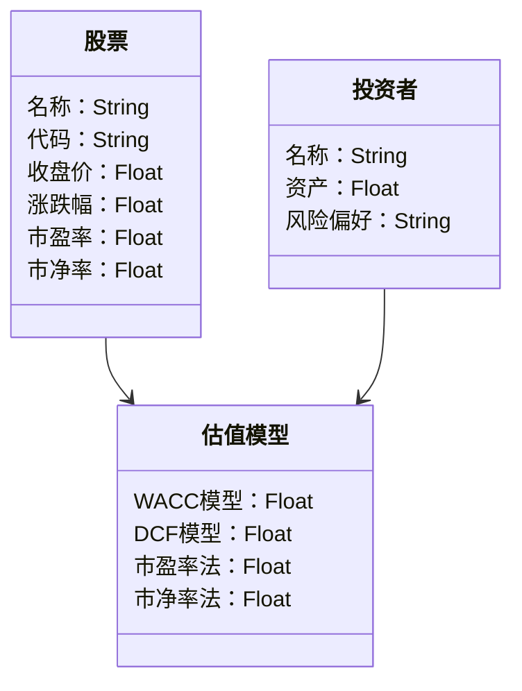
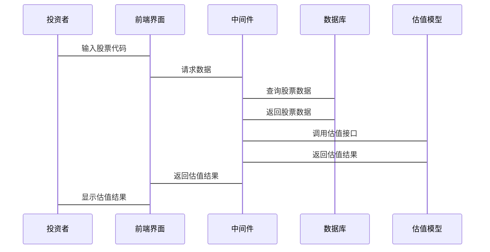

                 


# 中国香港股市估值:国际金融中心的市场特点

## 关键词

- 香港股市估值
- 国际金融中心
- 股票市场分析
- 估值方法
- 财务指标分析
- 股票投资策略
- 香港交易所

## 摘要

中国香港股市作为全球最重要的金融中心之一，其估值方法和市场特点具有独特性。本文从背景介绍、核心概念、算法原理、数学模型、系统分析、项目实战、最佳实践等多方面深入探讨香港股市估值的关键问题，结合实际案例和详细解读，为读者提供全面的视角和实用的指导。文章结构清晰，逻辑严谨，适合投资者、金融从业者和相关研究人员阅读。

---

# 第一部分: 背景与市场特点

## 第1章: 香港股市的背景与发展

### 1.1 香港股市的历史与发展

#### 1.1.1 香港股市的起源与演变

香港股市的历史可以追溯到19世纪末，早期的交易活动主要集中在金融街。1910年，香港证券交易所成立，标志着香港股市的正式诞生。随着香港回归中国，其国际化程度进一步提升，吸引了全球投资者的关注。近年来，香港股市在科技、金融、地产等领域的表现尤为突出。

#### 1.1.2 香港作为国际金融中心的核心地位

香港是全球三大金融中心之一，其地位得益于其独特的地理位置、开放的市场环境和健全的法律体系。香港股市不仅是全球投资者的重要投资场所，也是中国企业“走出去”的重要平台。

#### 1.1.3 香港股市的国际化与多元化特点

香港股市的国际化体现在其投资者构成的多样性，包括大量海外机构投资者和个人投资者。此外，香港股市的上市公司涵盖多个行业，尤其是金融、科技和地产行业，具有高度的多元化特征。

### 1.2 香港股市的市场结构与参与者

#### 1.2.1 香港交易所的基本架构

香港交易所（HKEx）是全球最大的股票交易市场之一，其基本架构包括主板、创业板和新三板。主板主要面向大型企业和成熟企业，创业板则主要面向中小企业。

#### 1.2.2 主要市场参与者（投资者、机构、监管机构）

香港股市的主要参与者包括个人投资者、机构投资者（如基金、保险公司、券商）、上市公司和监管机构。香港证监会（SFC）是主要的监管机构，负责市场的监管和规范。

#### 1.2.3 香港股市的国际化特征

香港股市的国际化特征体现在其开放的市场环境、多元化的投资者结构以及与国际市场的紧密联系。香港股市与全球主要市场指数的相关性较高，尤其是在全球经济波动时，香港股市往往成为投资者避险的重要选择。

## 第2章: 香港股市估值的核心概念与背景

### 2.1 股市估值的基本原理

#### 2.1.1 估值的定义与作用

股市估值是指对股票内在价值的评估，目的是为投资者提供参考，帮助其做出投资决策。估值不仅仅是对股票价格的预测，更是对上市公司未来盈利能力的分析。

#### 2.1.2 股票价值的决定因素

股票价值的决定因素包括宏观经济环境、行业竞争格局、公司财务状况、管理团队能力等。其中，财务指标是最重要的参考因素之一。

#### 2.1.3 市场价格与内在价值的关系

市场价格受到市场情绪、市场流动性等多种因素的影响，可能偏离内在价值。因此，投资者需要结合市场价格和内在价值进行综合分析。

### 2.2 香港股市估值的独特性

#### 2.2.1 香港市场的国际化与开放性

香港市场的国际化特征使得其估值方法与内地市场有所不同。例如，香港市场的估值更多受到国际资本流动的影响。

#### 2.2.2 中资企业对香港股市的影响

中资企业占据了香港股市的重要地位，尤其是在金融、地产等行业。中资企业的估值受到国内外政策的影响较大。

#### 2.2.3 香港股市的波动性与风险

香港股市的波动性较高，尤其是在全球经济波动时，市场容易受到外部冲击。因此，投资者在进行估值时需要特别关注市场风险。

## 第3章: 香港股市估值的理论基础

### 3.1 常用估值方法概述

#### 3.1.1 市盈率（P/E）法

市盈率是股票价格与每股收益的比值，反映了投资者对公司未来盈利能力的预期。市盈率法适用于盈利稳定的公司。

#### 3.1.2 市净率（P/B）法

市净率是股票价格与每股净资产的比值，适用于重资产行业，如银行、地产等。

#### 3.1.3 现金流折现法（DCF）

现金流折现法是通过预测公司未来现金流，将其折现为当前价值的一种方法。这种方法适用于高成长性公司。

### 3.2 股票估值的核心模型

#### 3.2.1 WACC模型

加权平均资本成本模型（WACC）是通过将债务和股权的资本成本加权平均，得出公司的加权平均资本成本，作为折现率。

#### 3.2.2 股权自由现金流模型

股权自由现金流模型是通过预测公司未来股权自由现金流，将其折现为当前价值。

#### 3.2.3 相对估值法

相对估值法是通过比较同类公司的估值指标，如市盈率、市净率等，来确定目标公司的合理估值。

### 3.3 香港股市估值的特殊考虑

#### 3.3.1 中英文双语环境下的信息处理

香港市场的信息往往涉及中英文双语，投资者需要特别注意信息的准确性和及时性。

#### 3.3.2 香港市场的政策敏感性

香港市场的政策敏感性较高，尤其是在中美关系紧张时，市场容易受到政策变动的影响。

#### 3.3.3 跨境投资的流动性风险

跨境投资的流动性风险是指投资者在需要资金时，可能无法及时将股票变现的风险。

---

# 第二部分: 香港股市估值的实践与方法

## 第4章: 香港股市估值的关键指标与分析

### 4.1 财务指标分析

#### 4.1.1 收益能力分析（净利润率、ROE）

净利润率是净利润与营业收入的比值，反映公司的盈利能力。ROE是净资产收益率，反映公司使用股东资金的效率。

#### 4.1.2 资产质量分析（资产负债率、周转率）

资产负债率是负债与资产的比值，反映公司的财务杠杆风险。周转率是资产周转速度的指标，反映公司资产管理效率。

#### 4.1.3 偿债能力分析（流动比率、速动比率）

流动比率是流动资产与流动负债的比值，反映公司短期偿债能力。速动比率是扣除存货后的流动资产与流动负债的比值。

### 4.2 行业估值分析

#### 4.2.1 香港金融行业的估值特点

金融行业的估值通常采用市盈率和市净率的双重标准。由于金融行业受政策影响较大，投资者需要特别关注政策风险。

#### 4.2.2 地产行业的估值逻辑

地产行业的估值主要关注土地储备、销售面积、毛利率等指标。香港地产行业的估值还受到城市化进程和房地产政策的影响。

#### 4.2.3 新兴行业（科技、互联网）的估值挑战

新兴行业的估值通常采用DCF模型，但由于未来现金流的不确定性较大，投资者需要特别关注公司的成长性和竞争优势。

## 第5章: 香港股市估值的实战技巧

### 5.1 股票筛选策略

#### 5.1.1 基于基本面的选股策略

基本面选股策略注重公司的财务状况、盈利能力和发展前景。投资者需要结合财务指标和行业趋势进行综合分析。

#### 5.1.2 行业比较法

行业比较法是通过比较同类公司的估值指标，找出估值相对较低的公司。这种方法适用于行业内的横向比较。

#### 5.1.3 技术分析法

技术分析法是通过分析股票价格和成交量的变化，预测未来的价格走势。技术分析法适用于短期交易策略。

### 5.2 股票估值的数学模型

#### 5.2.1 WACC模型的数学表达

WACC模型的数学表达如下：

$$ WACC = \left( \frac{D}{D+E} \right) \times R_d \times (1-T) + \left( \frac{E}{D+E} \right) \times R_e $$

其中：
- $D$ 是债务资本
- $E$ 是股权资本
- $R_d$ 是债务资本成本
- $R_e$ 是股权资本成本
- $T$ 是税率

#### 5.2.2 DCF模型的数学表达

DCF模型的数学表达如下：

$$ V = \sum_{t=1}^{n} \frac{CF_t}{(1 + WACC)^t} + \frac{TV}{(1 + WACC)^n} $$

其中：
- $CF_t$ 是第$t$年的自由现金流
- $n$ 是预测期
- $TV$ 是终值

---

## 第6章: 香港股市估值的系统分析与架构设计

### 6.1 问题场景介绍

香港股市的估值问题涉及多个方面，包括市场数据的获取、财务指标的分析、估值模型的构建和结果的可视化。

### 6.2 系统功能设计

#### 6.2.1 领域模型设计（mermaid 类图）



#### 6.2.2 系统架构设计（mermaid 架构图）


### 6.3 系统接口设计

#### 6.3.1 数据接口

投资者需要通过数据接口获取股票的实时数据，包括价格、成交量、财务指标等。

#### 6.3.2 模型接口

估值模型需要通过接口与前端界面和后端系统进行交互，实现数据的输入和输出。

### 6.4 系统交互设计（mermaid 序列图）



---

## 第7章: 项目实战与案例分析

### 7.1 环境安装

投资者需要安装股票分析软件，如Excel、Python（Pandas、NumPy）、Matplotlib等。

### 7.2 系统核心实现源代码

#### 7.2.1 WACC模型的实现

```python
def calculate_wacc(market_value_debt, market_value_equity, cost_debt, cost_equity, tax_rate):
    wacc = (market_value_debt / (market_value_debt + market_value_equity)) * cost_debt * (1 - tax_rate) + \
           (market_value_equity / (market_value_debt + market_value_equity)) * cost_equity
    return wacc
```

#### 7.2.2 DCF模型的实现

```python
def calculate_dcf(cash_flows, wacc, terminal_value):
    n = len(cash_flows)
    dcf_value = sum(cash_flows[i] / (1 + wacc) ** (i + 1) for i in range(n)) + terminal_value / (1 + wacc) ** n
    return dcf_value
```

### 7.3 代码应用解读与分析

#### 7.3.1 WACC模型的代码解读

上述代码实现了一个简单的WACC模型，输入参数包括债务的市场价值、股权的市场价值、债务成本、股权成本和税率。函数返回计算出的WACC值。

#### 7.3.2 DCF模型的代码解读

上述代码实现了一个简单的DCF模型，输入参数包括未来现金流、WACC和终值。函数返回DCF模型的估值结果。

### 7.4 实际案例分析

#### 7.4.1 某香港上市公司的估值案例

假设我们选择一家香港上市公司，如中国平安，进行估值分析。

1. 收集数据：包括公司财务数据、行业数据和市场数据。
2. 计算WACC：使用WACC模型计算加权平均资本成本。
3. 计算DCF：使用DCF模型预测未来现金流并折现。
4. 得出估值结果：比较市场价格与内在价值，得出投资建议。

---

## 第8章: 最佳实践与注意事项

### 8.1 最佳实践

1. **数据准确性**：确保使用的数据准确无误，尤其是财务数据和市场数据。
2. **模型适用性**：选择适合目标公司的估值模型，避免生搬硬套。
3. **风险控制**：在实际投资中，要注意分散投资风险，避免过度集中。
4. **持续学习**：股市环境复杂多变，投资者需要持续学习和更新知识。

### 8.2 注意事项

1. **市场波动**：香港股市波动性较高，投资者需要特别关注市场风险。
2. **政策影响**：香港市场的政策敏感性较高，投资者需要关注政策变化。
3. **信息处理**：中英文双语信息处理需要特别注意信息的准确性和完整性。

### 8.3 拓展阅读

1. **书籍推荐**：《投资学》、《价值投资》等。
2. **网站推荐**：雪球、东方财富网、香港交易所官网等。

---

## 作者：AI天才研究院/AI Genius Institute & 禅与计算机程序设计艺术 /Zen And The Art of Computer Programming

---

以上是关于《中国香港股市估值:国际金融中心的市场特点》的技术博客文章的完整目录和内容框架。

