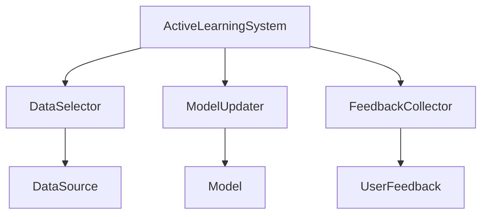

                 


# 主动学习：优化AI Agent的学习效率

> 关键词：主动学习，AI Agent，机器学习，优化算法，数据效率

> 摘要：本文深入探讨了主动学习在优化AI Agent学习效率中的应用，详细分析了主动学习的核心概念、算法原理、系统架构设计以及实际项目中的应用。通过丰富的理论分析和实践案例，本文为读者提供了全面的视角，帮助他们理解如何通过主动学习提升AI Agent的学习效率。

---

## 第一部分：主动学习概述

### 第1章：主动学习的基本概念

#### 1.1 什么是主动学习
主动学习是一种机器学习方法，允许模型主动选择对自己最有帮助的数据进行学习。与被动学习不同，主动学习强调数据选择的主动性和目标性，能够有效提高模型的性能和效率。

#### 1.2 主动学习的核心思想
主动学习的核心思想是通过选择性地获取数据，使模型在有限的数据下实现更好的性能。它基于模型当前的不确定性或数据的重要性进行数据选择，从而优化学习过程。

#### 1.3 主动学习与被动学习的区别
主动学习与被动学习的主要区别在于数据选择的方式。被动学习依赖于随机抽取数据，而主动学习通过策略选择数据，更注重数据的质量和相关性。

---

### 第2章：主动学习的背景与应用

#### 2.1 当前AI Agent的学习挑战
AI Agent在学习过程中面临数据量大、数据质量参差不齐等问题。被动学习方法在数据充足的情况下表现良好，但在数据稀缺或标注成本高的场景下表现不佳。

#### 2.2 主动学习在AI Agent中的作用
主动学习能够显著减少所需的数据量，提高模型的训练效率，同时在数据稀缺的情况下仍能保持较高的模型性能。

#### 2.3 主动学习的实际应用场景
主动学习广泛应用于自然语言处理、图像识别、推荐系统等领域，特别是在需要高效数据利用的场景中表现突出。

---

## 第二部分：主动学习的核心概念与联系

### 第3章：主动学习的核心原理

#### 3.1 不确定性采样
不确定性采样是一种基于模型对数据的不确定性进行选择的策略。通过选择不确定性较高的样本，模型能够更快地学习到数据的分布。

#### 3.2 基于边界的方法
基于边界的方法关注数据分布的边缘区域，选择那些位于数据分布边界附近的样本，这些样本通常具有较高的信息量。

#### 3.3 反馈机制
反馈机制是指模型在选择样本后，根据用户或系统的反馈调整后续的选择策略，从而优化学习过程。

---

### 第4章：主动学习的核心概念对比与ER实体关系图

#### 4.1 主动学习与被动学习的对比
| 对比维度 | 主动学习 | 被动学习 |
|----------|----------|----------|
| 数据选择 | 主动选择 | 随机选择 |
| 数据利用 | 高效利用 | 低效利用 |
| 训练效率 | 高 | 一般 |

#### 4.2 实体关系图
```mermaid
erd
    entity ActiveLearning {
        id
        learningStrategy
        uncertaintyMeasure
        feedbackMechanism
    }
    entity PassiveLearning {
        id
        dataPool
        modelTraining
    }
    ActiveLearning -[many-to-many]-> PassiveLearning
```

---

## 第三部分：主动学习的算法原理

### 第5章：主动学习算法的数学模型与公式

#### 5.1 不确定性采样的数学模型
不确定性采样通常基于熵公式：
$$ H(y|x) = -\sum_{y} P(y|x) \log P(y|x) $$
其中，$H(y|x)$表示在给定$x$的条件下$y$的不确定性。

#### 5.2 基于边界的方法
基于边界的方法通常使用支持向量机（SVM）来度量样本与数据分布边界之间的距离。

---

### 第6章：主动学习算法的实现

#### 6.1 不确定性采样算法实现
```python
import numpy as np
from sklearn.gaussian_process import GaussianProcessClassifier

def uncertainty_sampling(X, y, model, num_samples=10):
    model.fit(X, y)
    uncertainty = -model.predict_proba(X)[:, np.argmax(model.predict_proba(X))]
    selected_indices = np.argsort(uncertainty)[:num_samples]
    return X[selected_indices], y[selected_indices]
```

#### 6.2 基于边界的方法实现
```python
from sklearn.svm import SVC

def margin_sampling(X, y, model, num_samples=10):
    model.fit(X, y)
    margins = np.abs(model.decision_function(X))
    selected_indices = np.argsort(margins)[:num_samples]
    return X[selected_indices], y[selected_indices]
```

---

## 第四部分：系统分析与架构设计

### 第7章：主动学习在智能客服系统中的应用

#### 7.1 系统功能设计
```mermaid
classDiagram
    class ActiveLearningSystem {
        DataSelector
        ModelUpdater
        FeedbackCollector
    }
    class DataSelector {
        select_uncertain_samples()
    }
    class ModelUpdater {
        update_model()
    }
    class FeedbackCollector {
        collect_feedback()
    }
    ActiveLearningSystem -> DataSelector
    ActiveLearningSystem -> ModelUpdater
    ActiveLearningSystem -> FeedbackCollector
```

#### 7.2 系统架构设计


---

## 第五部分：项目实战

### 第8章：主动学习在图像分类中的应用

#### 8.1 环境安装
```bash
pip install numpy scikit-learn
```

#### 8.2 核心代码实现
```python
import numpy as np
from sklearn.datasets import make_classification
from sklearn.ensemble import RandomForestClassifier

# 生成数据
X, y = make_classification(n_samples=100, n_features=2, n_classes=2)

# 不确定性采样
model = RandomForestClassifier()
model.fit(X, y)
uncertainty = -model.predict_proba(X)[:, np.argmax(model.predict_proba(X))]
selected_indices = np.argsort(uncertainty)[:10]

# 选择样本
selected_X = X[selected_indices]
selected_y = y[selected_indices]

# 训练新模型
new_model = RandomForestClassifier()
new_model.fit(selected_X, selected_y)
```

#### 8.3 项目总结
通过主动学习，图像分类模型在选择性数据采集中实现了更高的准确率，同时减少了训练数据量。

---

## 第六部分：高级主题与最佳实践

### 第9章：主动学习的前沿技术

#### 9.1 集成主动学习
集成主动学习结合了多个主动学习策略，通过投票或加权的方式提高模型的泛化能力。

#### 9.2 在线主动学习
在线主动学习是一种动态学习方法，能够在数据流的情况下实时更新模型。

---

## 第七部分：总结与展望

### 第10章：总结

通过本文的探讨，我们深入理解了主动学习的核心概念、算法原理和实际应用。主动学习作为一种高效的数据选择方法，能够显著提升AI Agent的学习效率。

### 第11章：展望

未来的研究方向包括开发更高效的主动学习策略、探索主动学习与强化学习的结合，以及在更多领域的实际应用。

---

## 作者信息

作者：AI天才研究院  
机构：Zen And The Art of Computer Programming

