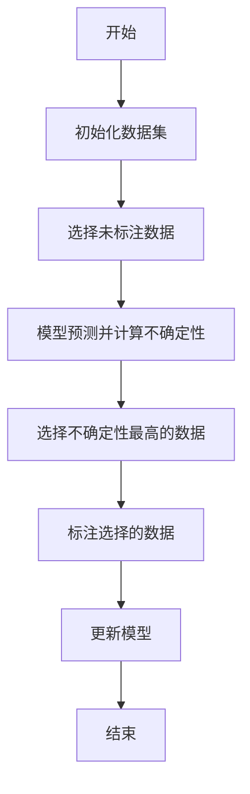
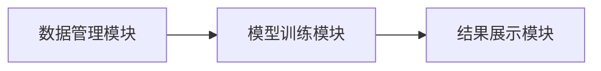
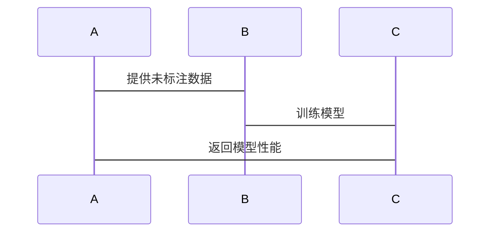

                 


# 主动学习：优化AI Agent的学习效率

## 关键词：
主动学习, AI Agent, 数据效率, 模型优化, 机器学习算法, 自适应学习

## 摘要：
本文深入探讨了主动学习在优化AI Agent学习效率中的应用。通过分析主动学习的核心机制、算法原理和系统架构，结合实际案例，展示了如何通过主动学习提升AI Agent的学习效率。文章还提供了详细的代码实现和系统设计，帮助读者更好地理解和应用主动学习技术。

---

# 第一部分: 主动学习与AI Agent概述

## 第1章: 主动学习的基本概念

### 1.1 问题背景与描述
主动学习是一种机器学习技术，旨在通过选择性地学习最具信息量的数据来优化模型性能。与传统监督学习不同，主动学习允许模型主动选择需要标注的数据，从而减少标注成本并提高学习效率。

#### 1.1.1 AI Agent学习效率的瓶颈
AI Agent通常需要处理大量数据，但标注数据的成本高昂。传统监督学习需要大量标注数据，而主动学习通过选择性标注，显著降低了成本。

#### 1.1.2 主动学习的定义与目标
主动学习是一种半监督学习技术，目标是通过选择最具代表性的数据点来提高模型性能。

#### 1.1.3 主动学习与监督学习的区别
主动学习允许模型主动选择数据，而监督学习需要所有数据预先标注。

### 1.2 主动学习的核心要素
主动学习的核心包括数据选择策略、模型更新机制和学习效率的度量。

#### 1.2.1 数据选择策略
数据选择策略决定了哪些数据点被选择进行标注。

#### 1.2.2 模型更新机制
模型更新机制确保每次选择新数据后，模型能够有效更新。

#### 1.2.3 学习效率的度量
学习效率通过模型性能和标注数据数量的比值来衡量。

### 1.3 AI Agent中的主动学习
AI Agent通过主动学习可以更高效地学习和适应环境。

#### 1.3.1 AI Agent的基本结构
AI Agent通常包括感知层、决策层和执行层。

#### 1.3.2 主动学习在AI Agent中的作用
主动学习帮助AI Agent更高效地学习新知识。

#### 1.3.3 主动学习的应用场景
主动学习适用于数据稀缺或标注成本高的场景。

### 1.4 本章小结
本章介绍了主动学习的基本概念及其在AI Agent中的应用。

---

# 第二部分: 主动学习的核心机制

## 第2章: 主动学习的策略与方法

### 2.1 不确定性采样
不确定性采样通过选择模型最不确定的数据点来优化学习。

#### 2.1.1 不确定性度量的定义
不确定性度量通常基于模型的置信度或概率分布。

#### 2.1.2 基于概率的不确定性采样
选择概率分布最分散的数据点。

#### 2.1.3 基于模型的不确定性采样
通过模型预测的置信度来选择数据点。

### 2.2 多样性采样
多样性采样确保选择的数据点覆盖不同的区域。

#### 2.2.1 多样性采样的目标
确保数据点的多样性，避免模型过拟合某一区域。

#### 2.2.2 基于聚类的多样性采样
将数据聚类后选择每个聚类中的代表点。

#### 2.2.3 基于分布的多样性采样
根据数据分布选择具有代表性的点。

### 2.3 结合策略
结合策略通过同时考虑不确定性和多样性来优化选择。

#### 2.3.1 不确定性与多样性的结合
综合考虑不确定性和多样性，选择最优数据点。

#### 2.3.2 增量式采样策略
逐步选择数据点，并动态更新选择策略。

#### 2.3.3 自适应采样策略
根据模型性能动态调整采样策略。

### 2.4 本章小结
本章详细介绍了主动学习的主要策略和方法。

---

# 第三部分: 主动学习的算法原理

## 第3章: 主动学习算法的原理与实现

### 3.1 算法概述
主动学习算法的基本流程包括初始化、数据选择、模型更新等步骤。

#### 3.1.1 算法的基本流程
1. 初始化未标注数据集。
2. 选择最具信息量的数据点。
3. 标注选择的数据点。
4. 更新模型。

#### 3.1.2 核心步骤：数据选择与模型更新
数据选择通过策略选择数据点，模型更新基于新数据进行训练。

#### 3.1.3 算法的收敛性分析
分析算法是否收敛以及收敛速度。

### 3.2 算法实现
实现主动学习算法需要选择合适的数据选择策略和模型更新机制。

#### 3.2.1 数据选择策略的实现
实现不确定性采样或多样性采样策略。

#### 3.2.2 模型更新机制的实现
基于新数据更新模型参数。

#### 3.2.3 算法的优化与加速
通过优化数据选择策略和并行计算加速算法。

### 3.3 算法流程图（Mermaid）


### 3.4 算法实现代码（Python）
```python
import numpy as np
from sklearn.svm import SVC

def uncertainty_sampling(X, model, n_samples=10):
    # 计算模型对每个样本的不确定性
    probs = model.predict_proba(X)
    uncertainties = np.max(probs, axis=1)
    # 选择不确定性最高的样本
    selected_indices = np.argsort(-uncertainties)[:n_samples]
    return selected_indices

# 初始化数据集
X = np.random.rand(100, 2)
y = np.random.randint(0, 2, 100)

# 训练初始模型
model = SVC()
model.fit(X[:80], y[:80])

# 主动学习循环
for _ in range(5):
    selected_indices = uncertainty_sampling(X[80:])
    new_X = X[selected_indices]
    new_y = y[selected_indices]
    model.fit(np.concatenate([X[:80], new_X]), np.concatenate([y[:80], new_y]))
```

### 3.5 数学公式
主动学习中，模型的更新通常基于最大-margin原则，公式如下：
$$
\arg\max_{\theta} \sum_{i=1}^n \log p(y_i|x_i,\theta)
$$

### 3.6 本章小结
本章详细讲解了主动学习算法的实现过程，并给出了代码示例。

---

# 第四部分: 系统架构与实现

## 第4章: 系统架构与实现方案

### 4.1 问题场景介绍
本文将设计一个基于主动学习的AI Agent系统，用于分类任务。

### 4.2 系统功能设计
系统功能包括数据管理、模型训练和结果展示。

#### 4.2.1 数据管理模块
负责数据的存储和管理。

#### 4.2.2 模型训练模块
基于主动学习算法训练模型。

#### 4.2.3 结果展示模块
展示模型性能和选择的数据点。

### 4.3 系统架构设计（Mermaid）


### 4.4 系统接口设计
系统接口包括数据输入接口、模型训练接口和结果展示接口。

### 4.5 系统交互流程（Mermaid）


### 4.6 本章小结
本章设计了一个基于主动学习的AI Agent系统架构。

---

# 第五部分: 项目实战

## 第5章: 项目实战与案例分析

### 5.1 环境安装
需要安装Python、scikit-learn和Mermaid工具。

### 5.2 核心实现代码
实现主动学习算法并集成到AI Agent系统中。

#### 5.2.1 数据选择模块
实现不确定性采样策略。

#### 5.2.2 模型更新模块
基于选择的数据更新模型。

#### 5.2.3 系统集成
将主动学习模块集成到AI Agent系统中。

### 5.3 代码实现与解读
详细解读代码实现，包括数据预处理、模型训练和结果展示。

### 5.4 案例分析
分析主动学习在实际项目中的效果。

### 5.5 本章小结
本章通过实际案例展示了主动学习的应用。

---

# 第六部分: 最佳实践与总结

## 第6章: 最佳实践与总结

### 6.1 最佳实践
1. 选择合适的数据选择策略。
2. 定期评估模型性能。
3. 动态调整采样策略。

### 6.2 小结
本文详细介绍了主动学习在优化AI Agent学习效率中的应用。

### 6.3 注意事项
避免过度依赖单一策略，结合多种策略提高效果。

### 6.4 拓展阅读
推荐相关书籍和论文。

---

# 结语

通过本文的学习，读者可以深入理解主动学习在优化AI Agent学习效率中的作用，并掌握其实现方法。

---

# 作者

作者：AI天才研究院/AI Genius Institute & 禅与计算机程序设计艺术 /Zen And The Art of Computer Programming

