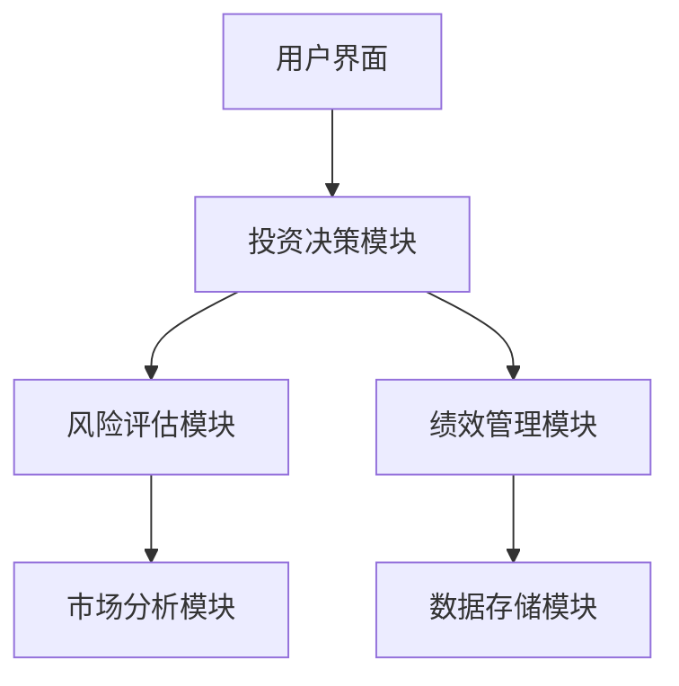
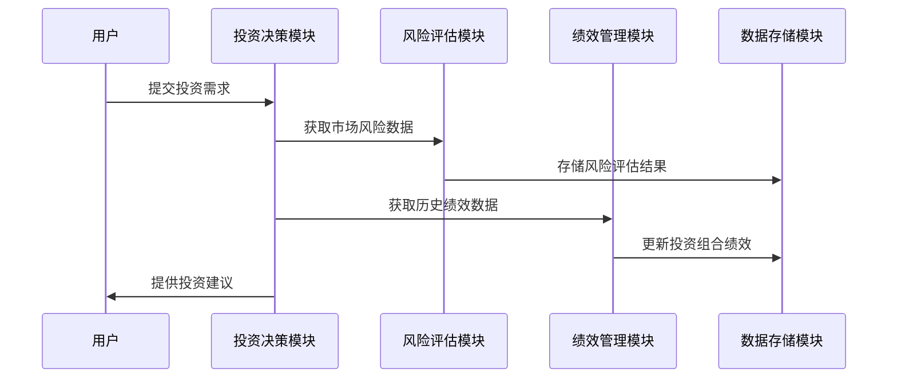

                 


# 主权财富基金策略：国家层面的长期投资视角

## 关键词：主权财富基金、长期投资、风险管理、资产配置、经济战略

## 摘要：主权财富基金是国家层面重要的长期投资工具，本文从背景、核心概念、策略与实践、系统架构、项目实战等多角度分析主权财富基金的运作机制与未来趋势，探讨其在国家经济发展中的战略意义。

---

# 第一部分: 背景介绍

## 第1章: 主权财富基金的起源与定义

### 1.1 主权财富基金的起源

#### 1.1.1 国际货币体系的演变
国际货币体系的演变是主权财富基金（SWF）兴起的背景之一。20世纪70年代布雷顿森林体系崩溃后，浮动汇率制度的实施使得各国央行持有的外汇储备大幅增加。然而，随着石油价格波动和其他地缘政治风险的加剧，单纯持有美元资产的风险逐渐显现，促使一些国家开始探索更稳健的财富管理方式。

#### 1.1.2 主权财富基金的定义与特征
主权财富基金是指由主权国家政府设立，旨在实现国家财富保值和增值的大型投资基金。其主要特征包括：
- **资金来源**：通常来源于石油资源出口收入、外汇储备盈余或其他财政盈余。
- **投资目标**：以长期投资为主，注重资产的保值和增值。
- **独立性**：通常由专门的机构管理，与央行资产分开，确保投资的独立性。

#### 1.1.3 主权财富基金的兴起背景
20世纪70年代的石油危机促使产油国将石油收入转化为主权财富基金，以避免汇率波动和经济风险。随后，非产油国也通过外汇储备的积累，逐步建立主权财富基金，以实现财富的长期保值和国家经济的可持续发展。

### 1.2 主权财富基金的目标与功能

#### 1.2.1 财富保值与增值目标
主权财富基金的核心目标是通过长期投资，实现国家财富的保值和增值，避免短期经济波动对国家财政的影响。

#### 1.2.2 国际储备管理的职能
主权财富基金可以作为国家外汇储备的补充，分散投资风险，避免单一资产的投资风险。

#### 1.2.3 经济发展的长期投资需求
主权财富基金通过投资于长期资产（如基础设施、房地产、股票等），支持国家经济发展，改善国家资产负债表，增强国家经济实力。

### 1.3 主要主权财富基金的现状

#### 1.3.1 全球主要主权财富基金介绍
- **阿布扎比主权财富基金（ADIA）**：全球最大的主权财富基金之一，主要投资于房地产、股票和私募股权。
- **新加坡主权财富基金（GIC）**：新加坡政府投资公司，以长期稳健的投资风格著称。
- **挪威政府养老基金（GPFG）**：全球最大的主权财富基金，投资于股票、债券和房地产等多种资产。

#### 1.3.2 主权财富基金的规模与分布
主权财富基金的规模因国家经济实力而异，主要分布在中东、北欧和亚洲地区。根据最新数据，全球主权财富基金的总规模已超过10万亿美元。

#### 1.3.3 主权财富基金的监管框架
主权财富基金通常由国家财政部或央行监管，遵循透明和稳健的投资原则。一些国家还建立了独立的监管机构，确保主权财富基金的合规性和透明性。

---

# 第二部分: 主权财富基金的核心概念与运作机制

## 第2章: 主权财富基金的资金来源与分配

### 2.1 主权财富基金的资金来源

#### 2.1.1 外汇储备转化
许多国家通过将外汇储备转化为主权财富基金，以避免单一资产的风险。例如，中东国家通过石油美元积累外汇储备，并将其转化为主权财富基金。

#### 2.1.2 石油美元与资源收益
石油出口国通过将石油收入转化为主权财富基金，实现财富的长期保值和增值。例如，挪威的GPFG通过石油收入建立，并投资于全球资产。

#### 2.1.3 其他财政盈余资金
一些非产油国通过财政盈余积累主权财富基金。例如，新加坡政府通过税收和财政盈余积累资金，并通过GIC进行长期投资。

### 2.2 主权财富基金的投资策略

#### 2.2.1 长期投资与短期投资的平衡
主权财富基金通常以长期投资为主，但也需要在必要时进行短期投资，以应对市场波动和流动性需求。

#### 2.2.2 资产配置的多元化策略
主权财富基金通常采用多元化的资产配置策略，包括股票、债券、房地产、私募股权等多种资产类别。例如，挪威GPFG的投资组合中，股票占60%，债券占30%，房地产占5%，其他资产占5%。

#### 2.2.3 风险管理与收益优化
主权财富基金通过严格的风险管理，确保投资组合的稳健性。例如，通过分散投资、风险对冲和定期再平衡，优化收益与风险的平衡。

### 2.3 主权财富基金的运作机制

#### 2.3.1 投资决策流程
主权财富基金的投资决策通常由专业的投资委员会负责，包括市场分析、资产配置、风险评估等步骤。

#### 2.3.2 投资组合管理
主权财富基金通过定期评估投资组合的绩效和市场环境，进行动态调整，确保投资目标的实现。

#### 2.3.3 风险控制与绩效评估
主权财富基金通过建立完善的风险管理系统，定期评估投资组合的绩效，并根据市场变化进行调整。

---

# 第三部分: 主权财富基金的策略与实践

## 第3章: 主权财富基金的全球投资布局

### 3.1 全球主要投资领域分析

#### 3.1.1 公司股权与债券投资
主权财富基金通常投资于全球领先的企业股权和债券，以实现较高的收益。例如，ADIA投资于苹果、微软等科技巨头。

#### 3.1.2 房地产与基础设施投资
主权财富基金通过投资于房地产和基础设施，实现稳定的现金流和长期增值。例如，新加坡GIC投资于全球多个城市的房地产项目。

#### 3.1.3 私募股权与风险投资
主权财富基金通过私募股权和风险投资，支持创新型企业和新兴行业的发展。例如，GPFG通过私募股权基金投资于科技初创企业。

### 3.2 区域性投资策略

#### 3.2.1 新兴市场投资机会
新兴市场经济增长潜力大，主权财富基金通过投资于新兴市场的股票和债券，实现较高的收益。例如，中国主权财富基金投资于印度和东南亚市场。

#### 3.2.2 发达国家市场的配置
发达市场具有较高的透明度和流动性，主权财富基金通过投资于美国、欧洲等市场的债券和股票，实现稳健的收益。

#### 3.2.3 金砖国家的投资动态
金砖国家（中国、印度、巴西、俄罗斯、南非）经济增长迅速，主权财富基金通过投资于这些国家的资产，实现多元化配置。

### 3.3 主权财富基金的协同效应

#### 3.3.1 跨国合作与信息共享
主权财富基金通过跨国合作和信息共享，降低投资风险，提高投资效率。例如，主权财富基金之间的合作可以实现资产互补和风险分散。

#### 3.3.2 全球资产配置的优化
主权财富基金通过全球资产配置，优化收益与风险的平衡。例如，通过投资于不同地区的资产，分散市场风险。

#### 3.3.3 区域性经济发展的推动
主权财富基金通过投资于特定地区的基础设施和企业，推动区域经济发展，提升国家的经济实力。

## 第4章: 主权财富基金的风险管理与挑战

### 4.1 主权财富基金面临的主要风险

#### 4.1.1 市场风险
市场波动、经济衰退等市场风险可能对主权财富基金的投资组合造成重大影响。

#### 4.1.2 汇率风险
汇率波动可能影响主权财富基金的收益，尤其是在投资于外币资产时。

#### 4.1.3 政治风险
地缘政治冲突、政策变化等政治风险可能影响主权财富基金的投资回报。

### 4.2 风险管理策略

#### 4.2.1 多元化投资
通过多元化投资，分散市场、行业和资产类别的风险。

#### 4.2.2 风险对冲
通过金融衍生工具（如期权、期货）进行风险对冲，降低投资组合的波动性。

#### 4.2.3 宏观经济监控
定期监控宏观经济指标（如GDP增长率、通胀率、利率等），评估投资环境的变化。

### 4.3 具体案例分析

#### 4.3.1 挪威GPFG的风险管理
挪威政府养老基金（GPFG）通过严格的资产配置和风险管理系统，实现了长期稳健的投资回报。例如，通过分散投资于不同资产类别，降低市场波动的影响。

#### 4.3.2 新加坡GIC的风险管理
新加坡GIC通过多元化投资和风险对冲策略，实现投资组合的稳健性。例如，通过投资于不同地区的资产，分散市场风险。

---

# 第四部分: 主权财富基金的系统分析与架构设计

## 第5章: 主权财富基金的管理系统

### 5.1 系统功能设计

#### 5.1.1 风险评估模块
通过分析市场、行业和资产类别的风险，评估投资组合的整体风险。

#### 5.1.2 投资决策模块
基于风险评估和市场分析，制定投资策略和资产配置方案。

#### 5.1.3 绩效管理模块
定期评估投资组合的绩效，分析收益与风险的匹配性。

### 5.2 系统架构设计

#### 5.2.1 系统架构图


#### 5.2.2 系统交互流程


---

# 第五部分: 主权财富基金的项目实战

## 第6章: 项目实战分析

### 6.1 环境安装

#### 6.1.1 数据收集
收集全球主要主权财富基金的投资数据和市场数据。

#### 6.1.2 工具安装
安装Python、Pandas、Matplotlib等数据分析工具。

### 6.2 系统核心实现

#### 6.2.1 投资组合优化
使用Python优化投资组合的资产配置，实现风险与收益的平衡。

```python
import pandas as pd
import numpy as np
from scipy.optimize import minimize

# 示例数据：资产收益和协方差矩阵
returns = np.array([0.05, 0.07, 0.03])
cov_matrix = np.array([
    [0.02, 0.01, 0.005],
    [0.01, 0.03, 0.01],
    [0.005, 0.01, 0.02]
])

# 定义优化目标函数
def portfolio_variance(weights, returns, cov_matrix):
    return np.dot(weights.T, np.dot(cov_matrix, weights)) * 252

# 约束条件
def constraint(weights):
    return np.sum(weights) - 1

# 初始权重
initial_weights = np.array([1/3, 1/3, 1/3])

# 优化
result = minimize(portfolio_variance, initial_weights, args=(returns, cov_matrix), method='SLSQP', constraints={'type': 'eq', 'fun': constraint})

# 最优权重
optimal_weights = result.x
print("最优权重:", optimal_weights)
print("最小方差:", result.fun)
```

#### 6.2.2 风险评估与对冲
使用蒙特卡洛模拟评估投资组合的风险，并通过期权对冲进行风险对冲。

### 6.3 实际案例分析

#### 6.3.1 挪威GPFG的投资策略
分析挪威GPFG的投资组合配置和风险管理策略，评估其在市场波动中的表现。

#### 6.3.2 新加坡GIC的资产配置
分析新加坡GIC的资产配置策略，评估其在新兴市场中的投资表现。

### 6.4 项目小结

#### 6.4.1 项目总结
总结主权财富基金的投资策略和风险管理经验，提出优化建议。

#### 6.4.2 项目意义
通过项目实战，深入理解主权财富基金的运作机制和实际应用。

---

# 第六部分: 总结与展望

## 第7章: 总结与展望

### 7.1 总结

#### 7.1.1 主要结论
主权财富基金是国家层面重要的长期投资工具，通过多元化的资产配置和严格的风险管理，实现财富的保值和增值。

#### 7.1.2 核心观点
主权财富基金的运作机制和投资策略对国家经济发展具有重要意义，其成功离不开多元化投资和风险管理的结合。

### 7.2 展望

#### 7.2.1 未来趋势
随着全球化的深入和技术的进步，主权财富基金的投资策略将更加多元化，技术驱动的投资和ESG投资将更加重要。

#### 7.2.2 挑战与机遇
主权财富基金将面临更多市场风险和地缘政治风险，同时也将抓住新兴市场和技术投资的机遇。

---

# 作者：AI天才研究院/AI Genius Institute & 禅与计算机程序设计艺术 /Zen And The Art of Computer Programming

