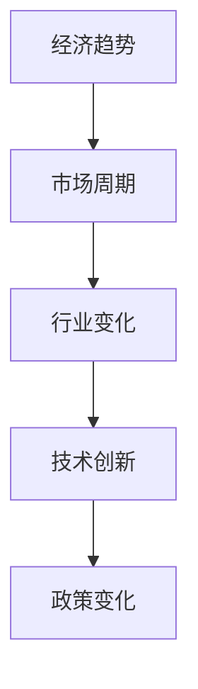
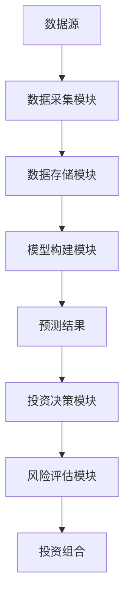

                 


# 主题投资：识别并投资长期经济趋势

## 关键词：主题投资、长期经济趋势、量化分析、系统架构、项目实战

## 摘要：主题投资是一种通过识别和投资于长期经济趋势来实现财富增长的投资策略。本文将从背景与概念、趋势识别、量化分析、系统架构到项目实战，全面解析如何在复杂多变的经济环境中，捕捉并投资于具有长期增长潜力的主题。

---

## 第一部分：主题投资的背景与概念

## 第1章：主题投资的定义与重要性

### 1.1 主题投资的定义
- **1.1.1 什么是主题投资**  
  主题投资是一种专注于投资于具有长期增长潜力的主题或行业的策略。与传统的选股或选市投资不同，主题投资更注重挖掘驱动经济长期增长的核心因素。

- **1.1.2 主题投资的特点**  
  - **长期性**：主题投资关注的是未来数年甚至数十年的趋势，而非短期波动。  
  - **聚焦性**：专注于特定的主题，如科技、医疗、绿色能源等，这些行业通常具有较高的增长潜力。  
  - **分散性**：通过投资多个相关主题，降低单一主题的风险。

- **1.1.3 主题投资与其他投资方式的对比**  
  主题投资与传统投资的主要区别在于其聚焦性和前瞻性。传统投资更关注个股的基本面，而主题投资则更关注行业或主题的长期发展趋势。

---

### 1.2 长期经济趋势的识别
- **1.2.1 经济周期与趋势分析**  
  经济周期分为衰退、复苏、繁荣和衰退四个阶段。识别经济周期的变化可以帮助投资者更好地把握长期趋势。

- **1.2.2 技术进步对经济趋势的影响**  
  技术创新是推动经济增长的核心动力。例如，人工智能、区块链、5G等技术的普及将对相关行业产生深远影响。

- **1.2.3 政策变化对经济趋势的影响**  
  政府政策（如财政政策、货币政策、行业监管）对经济趋势有重要影响。例如，环保政策的加强可能会推动绿色能源行业的发展。

---

### 1.3 主题投资的重要性
- **1.3.1 主题投资在资产配置中的作用**  
  主题投资可以帮助投资者在资产配置中分散风险，同时抓住长期增长的机会。

- **1.3.2 主题投资在风险控制中的作用**  
  通过投资于具有长期增长潜力的主题，投资者可以减少对短期市场波动的依赖，从而降低投资风险。

- **1.3.3 主题投资在长期财富增长中的作用**  
  长期来看，主题投资能够帮助投资者抓住经济增长的核心驱动力，实现财富的长期增长。

---

## 第2章：长期经济趋势的识别方法

### 2.1 宏观经济分析
- **2.1.1 GDP增长与经济趋势**  
  GDP是衡量经济整体表现的重要指标。通过分析GDP的增长趋势，可以判断经济的健康状况。

- **2.1.2 就业数据与经济趋势**  
  就业数据反映了经济的活力。高失业率可能预示着经济衰退，而低失业率则可能意味着经济繁荣。

- **2.1.3 消费者价格指数（CPI）与经济趋势**  
  CPI是衡量通货膨胀的重要指标。高通胀可能对经济增长产生负面影响，而低通胀则可能意味着经济疲软。

---

### 2.2 行业分析
- **2.2.1 行业生命周期与经济趋势**  
  行业生命周期分为导入期、成长期、成熟期和衰退期。投资时应选择处于成长期的行业。

- **2.2.2 行业竞争结构与经济趋势**  
  行业的竞争结构（如寡头垄断、完全竞争）会影响行业的长期增长潜力。

- **2.2.3 行业政策与经济趋势**  
  政府政策对行业的影响至关重要。例如，环保政策的变化可能会影响传统能源行业的前景。

---

### 2.3 技术进步与创新
- **2.3.1 新兴技术对经济趋势的影响**  
  新兴技术（如人工智能、5G、区块链）的出现可能会改变行业的游戏规则，创造新的增长点。

- **2.3.2 数字经济与经济趋势**  
  数字经济的崛起正在改变全球经济的格局。投资于数字经济相关的行业可能具有较大的增长潜力。

- **2.3.3 绿色经济与经济趋势**  
  随着环保意识的增强，绿色经济（如可再生能源、电动汽车）正在成为新的增长引擎。

---

## 第3章：主题投资的核心概念与联系

### 3.1 长期经济趋势识别的原理
- **3.1.1 经济趋势的驱动因素**  
  经济趋势的驱动因素包括技术进步、政策变化、人口结构变化等。

- **3.1.2 经济趋势的预测方法**  
  常见的预测方法包括时间序列分析、回归分析、机器学习模型等。

- **3.1.3 经济趋势的量化分析**  
  通过量化分析，可以更准确地识别经济趋势，为投资决策提供支持。

---

### 3.2 核心概念的属性特征对比
表3-1：经济趋势与市场周期的对比分析

| 属性        | 经济趋势              | 市场周期              |
|-------------|----------------------|----------------------|
| 时间跨度    | 长期（数年甚至数十年）| 短期（数月或数年）    |
| 影响因素    | 技术、政策、人口等    | 市场情绪、短期经济指标|
| 预测难度    | 较高                 | 较低                 |
| 投资策略    | 长期持有              | 短期交易              |

---

### 3.3 ER实体关系图架构


---

## 第4章：量化分析与算法原理

### 4.1 经济趋势的量化分析方法

#### 4.1.1 时间序列分析
- 时间序列分析是一种通过分析历史数据来预测未来趋势的方法。
- 常用模型包括ARIMA（Auto-Regressive Integrated Moving Average）和GARCH（Generalized Autoregressive Conditional Heteroskedasticity）。

#### 4.1.2 机器学习模型的应用
- 机器学习模型（如随机森林、支持向量机、神经网络）可以通过历史数据学习经济趋势的模式。
- 例如，使用LSTM（长短期记忆网络）进行时间序列预测。

#### 4.1.3 统计套利与经济趋势
- 统计套利是一种通过发现资产价格的短期偏离来获利的方法。
- 在经济趋势分析中，统计套利可以帮助投资者发现市场中的套利机会。

---

### 4.2 经济趋势预测的数学模型

#### 4.2.1 ARIMA模型
ARIMA模型用于时间序列分析，其公式如下：
$$ ARIMA(p, d, q) $$
其中，$p$ 是自回归阶数，$d$ 是差分阶数，$q$ 是移动平均阶数。

#### 4.2.2 线性回归模型
线性回归模型用于分析变量之间的关系，其公式如下：
$$ y = \beta_0 + \beta_1x_1 + \beta_2x_2 + \cdots + \beta_nx_n + \epsilon $$
其中，$\beta$ 是回归系数，$\epsilon$ 是误差项。

---

### 4.3 代码实现与应用解读

#### 4.3.1 时间序列分析代码示例
```python
from statsmodels.tsa.arima.model import ARIMA
import pandas as pd

# 加载数据
data = pd.read_csv('economic_trend.csv')

# 拆分数据集
train_data = data['value'][:80]
test_data = data['value'][80:]

# 训练ARIMA模型
model = ARIMA(train_data, order=(5, 1, 0))
model_fit = model.fit()

# 预测未来值
forecast = model_fit.forecast(steps=20)
```

#### 4.3.2 机器学习模型代码示例
```python
from sklearn.ensemble import RandomForestRegressor
import pandas as pd

# 加载数据
data = pd.read_csv('economic_trend.csv')

# 特征工程
features = data.drop(columns=['value'])
labels = data['value']

# 训练随机森林模型
model = RandomForestRegressor(n_estimators=100)
model.fit(features, labels)

# 预测未来值
importances = list(zip(features.columns, model.feature_importances_))
print("特征重要性:", importances)
```

---

## 第5章：系统分析与架构设计方案

### 5.1 系统功能设计
- **数据采集模块**：从多个来源（如政府报告、公司财报、市场数据）收集经济数据。
- **模型构建模块**：使用量化分析工具（如Python、R）构建预测模型。
- **风险评估模块**：评估投资组合的风险，并制定风险管理策略。
- **投资决策模块**：基于模型预测结果，制定投资策略。

---

### 5.2 系统架构设计


---

## 第6章：项目实战

### 6.1 环境安装与配置
- **工具安装**：安装Python、Pandas、NumPy、Scikit-learn等工具。
- **数据源获取**：从可靠的数据源（如世界银行、国际货币基金组织）获取经济数据。

### 6.2 核心实现代码
```python
import pandas as pd
from sklearn.ensemble import RandomForestRegressor

# 加载数据
data = pd.read_csv('economic_trend.csv')

# 特征工程
features = data.drop(columns=['value'])
labels = data['value']

# 训练随机森林模型
model = RandomForestRegressor(n_estimators=100)
model.fit(features, labels)

# 预测未来值
forecast = model.predict(new_features)
```

---

### 6.3 实际案例分析
- **案例背景**：假设我们要投资于人工智能行业，预测未来5年的增长趋势。
- **数据准备**：收集人工智能行业的历史数据和相关经济指标。
- **模型训练**：使用随机森林模型进行预测。
- **投资决策**：基于模型预测结果，制定投资策略。

---

## 第7章：最佳实践与注意事项

### 7.1 最佳实践
- **持续学习**：经济趋势是动态变化的，投资者需要不断学习和更新知识。
- **分散投资**：不要将所有资金投入到单一主题中，应分散投资以降低风险。
- **长期持有**：主题投资需要耐心，长期持有才能获得稳定的收益。

### 7.2 小结
- 主题投资是一种有效的投资策略，但需要投资者具备较高的分析能力和长期的耐心。
- 通过量化分析和系统架构设计，可以更准确地识别经济趋势，制定投资策略。

### 7.3 注意事项
- **风险控制**：在投资过程中，需时刻关注市场风险，及时调整投资组合。
- **数据质量**：数据是模型预测的基础，需确保数据的准确性和完整性。
- **政策变化**：政策的变化可能对经济趋势产生重大影响，需密切关注相关政策。

---

## 第8章：拓展阅读与学习资源

### 8.1 拓展阅读
- **书籍推荐**：
  - 《投资学基础》
  - 《时间序列分析与应用建模》
- **在线课程**：
  - Coursera：《量化投资入门》
  - edX：《经济趋势分析与预测》

### 8.2 学习资源
- **工具与平台**：
  - Python：用于数据分析和建模。
  - Pandas：用于数据处理。
  - NumPy：用于数值计算。
  - Scikit-learn：用于机器学习。

---

## 结语
主题投资是一种前瞻性的投资策略，通过识别和投资于长期经济趋势，可以帮助投资者实现财富的长期增长。然而，这需要投资者具备扎实的分析能力和长期的耐心。通过量化分析、系统架构设计和实际案例分析，投资者可以更好地把握经济趋势，制定有效的投资策略。

---

## 作者：AI天才研究院 & 禅与计算机程序设计艺术

