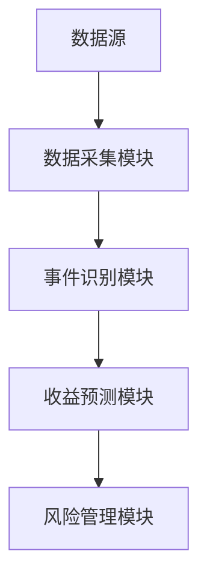
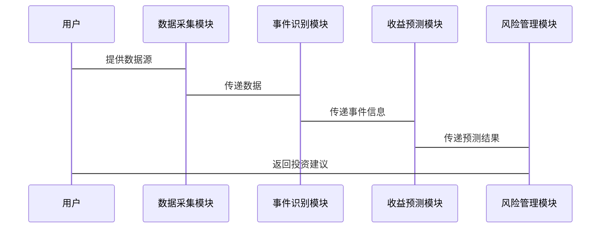

                 


# 事件驱动投资：从公司行为中获取超额收益

## 关键词：事件驱动投资, 公司行为, 超额收益, 投资策略, 事件分析

## 摘要：  
事件驱动投资是一种基于公司特定事件（如并购、重组、诉讼等）进行投资决策的策略。通过分析这些事件对公司价值的影响，投资者可以在市场中获取超额收益。本文将从事件驱动投资的基本概念、算法原理、系统设计到实际案例，全面解析如何通过公司行为捕捉投资机会。

---

# 第1章：事件驱动投资的背景与概述

## 1.1 事件驱动投资的定义与背景

### 1.1.1 投资学的基本概念  
投资学是研究资金分配、资产定价和投资决策的科学。传统投资策略包括价值投资、成长投资和趋势投资等，但这些方法往往依赖于市场整体表现或公司基本面分析。  

### 1.1.2 事件驱动投资的起源  
事件驱动投资起源于20世纪60年代，随着并购活动的增多，投资者开始关注公司重大事件对公司价值的影响。  

### 1.1.3 事件驱动投资的现状  
目前，事件驱动投资已成为机构投资者的重要策略之一，尤其是在并购、重组等事件频发的市场环境下，该策略表现出显著优势。

## 1.2 事件驱动投资的核心理念  

### 1.2.1 什么是事件驱动投资  
事件驱动投资是通过分析公司特定事件（如并购、重组、诉讼等）对公司价值的影响，寻找短期超额收益的投资策略。  

### 1.2.2 事件驱动投资的特征  
- 短期性：事件驱动投资通常关注短期市场反应。  
- 事件驱动：投资决策基于公司发生的特定事件。  
- 高收益：通过捕捉市场未充分反映的事件信息，获取超额收益。  

---

# 第2章：事件驱动投资的核心概念

## 2.1 事件驱动投资的核心要素  

### 2.1.1 投资标的的选择  
事件驱动投资通常选择那些发生重大事件的公司作为投资标的。例如，正在进行并购的公司或面临诉讼的公司。  

### 2.1.2 事件类型与影响机制  
- **并购事件**：并购通常会带来协同效应，提升公司价值。  
- **重组事件**：重组可能优化公司结构，提高效率。  
- **诉讼事件**：诉讼可能对公司的财务状况和股价产生重大影响。  

## 2.2 事件驱动投资的理论基础  

### 2.2.1 事件驱动投资的理论框架  
事件驱动投资的理论基础包括：  
- **有效市场假说（EMH）**：市场在短期内的反应可能不充分，为事件驱动投资提供了机会。  
- **套利定价理论（APT）**：事件驱动投资通过套利机会获取超额收益。  

## 2.3 事件驱动投资的数学模型  

### 2.3.1 事件强度模型  
事件强度模型用于量化事件对公司价值的影响。  
$$ \text{事件强度} = \frac{\text{事件影响}}{\text{市场反应}} $$  

### 2.3.2 事件驱动收益模型  
$$ R_i = \alpha + \beta R_m + \gamma E_i $$  
其中，$R_i$ 为投资收益，$R_m$ 为市场收益，$E_i$ 为事件影响。

---

# 第3章：事件驱动投资的算法原理

## 3.1 数据预处理与特征工程  

### 3.1.1 数据来源  
- 公司公告：并购、重组等事件的公告。  
- 财务数据：公司财务报表数据。  
- 市场数据：股价、成交量等。  

### 3.1.2 特征提取  
- 事件类型：并购、重组、诉讼等。  
- 事件时间：事件发生的时间点。  
- 市场反应：事件发生前后的股价变化。  

## 3.2 事件驱动投资算法  

### 3.2.1 算法流程  
1. 数据采集：获取公司事件数据和市场数据。  
2. 特征提取：提取事件类型、事件时间等特征。  
3. 模型训练：使用机器学习算法（如逻辑回归、支持向量机）训练模型。  
4. 预测与评估：预测事件对公司价值的影响，并评估模型性能。  

### 3.2.2 事件强度模型实现  
```python
def calculate_event_intensity(events, market_response):
    return events / market_response
```

---

# 第4章：事件驱动投资的系统设计

## 4.1 系统架构设计  

### 4.1.1 数据采集模块  
负责采集公司事件数据和市场数据。  

### 4.1.2 事件识别模块  
通过自然语言处理技术识别公司公告中的事件类型。  

### 4.1.3 收益预测模块  
基于事件强度模型预测事件对公司收益的影响。  

### 4.1.4 风险管理模块  
对投资组合进行风险控制，避免过度集中风险。  

## 4.2 系统实现  

### 4.2.1 系统架构图  


### 4.2.2 系统交互流程  


---

# 第5章：事件驱动投资的项目实战

## 5.1 环境安装与数据准备  

### 5.1.1 环境安装  
安装Python、Pandas、Scikit-learn等工具。  

### 5.1.2 数据准备  
从公开数据源获取公司事件数据和市场数据。  

## 5.2 事件驱动投资系统的实现  

### 5.2.1 数据预处理  
```python
import pandas as pd

data = pd.read_csv('events.csv')
data.dropna(inplace=True)
```

### 5.2.2 模型训练  
```python
from sklearn.linear_model import LogisticRegression

model = LogisticRegression()
model.fit(X, y)
```

### 5.2.3 模型评估  
```python
from sklearn.metrics import accuracy_score

print(accuracy_score(y_true, y_pred))
```

## 5.3 实际案例分析  

### 5.3.1 案例背景  
以某公司并购事件为例，分析事件对公司股价的影响。  

### 5.3.2 数据分析  
- 事件发生前股价稳定。  
- 事件公告后股价上涨。  

### 5.3.3 结果分析  
并购事件带来了显著的超额收益。  

---

# 第6章：事件驱动投资的最佳实践

## 6.1 投资策略的注意事项  

### 6.1.1 风险控制  
避免过度集中投资，分散投资风险。  

### 6.1.2 事件选择  
优先选择高概率、高影响的事件。  

### 6.1.3 市场环境  
关注市场环境对事件驱动投资的影响。  

## 6.2 小结与展望  

### 6.2.1 事件驱动投资的核心思想  
通过分析公司事件，捕捉短期超额收益。  

### 6.2.2 未来展望  
随着人工智能和大数据技术的发展，事件驱动投资将更加精准和高效。  

---

# 作者：AI天才研究院/AI Genius Institute & 禅与计算机程序设计艺术 /Zen And The Art of Computer Programming

