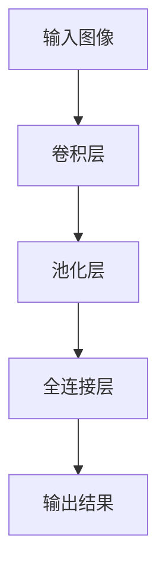
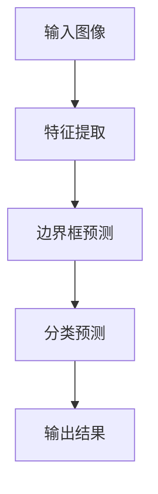

                 


# 云端 vs 边缘计算：AI Agent的最佳运行环境

> 关键词：云端计算、边缘计算、AI Agent、分布式系统、算法实现、系统架构

> 摘要：本文深入探讨了云端和边缘计算环境下AI Agent的运行环境，分析了两者的优缺点，并通过对比和实际案例，给出了AI Agent的最佳运行环境选择建议。文章从背景介绍、核心概念、算法原理、系统架构到项目实战，层层递进，帮助读者全面理解AI Agent在云端和边缘计算中的运行机制和实际应用。

---

# 第一部分: 云端与边缘计算的背景与概念

## 第1章: 云端与边缘计算的概述

### 1.1 云端计算的核心概念

#### 1.1.1 云端计算的定义与特点
云端计算是一种基于互联网的计算模式，通过远程服务器和数据中心提供计算资源。其特点包括：
- **弹性扩展**：按需分配计算资源。
- **高可用性**：通过分布式架构保证服务的可靠性。
- **按需付费**：用户只需支付使用的资源。

#### 1.1.2 云端计算的核心优势
- **资源利用率高**：用户按需使用资源，避免了传统计算模式下的资源浪费。
- **易于管理**：通过云服务提供商统一管理，用户无需维护底层硬件。
- **全球可达**：云端资源可以通过互联网在全球范围内访问。

#### 1.1.3 云端计算的应用场景
- **大数据处理**：如数据分析、机器学习模型训练。
- **弹性Web服务**：应对流量高峰时的动态扩展。
- **全球分布式应用**：如跨国公司的统一计算平台。

### 1.2 边缘计算的核心概念

#### 1.2.1 边缘计算的定义与特点
边缘计算是在靠近数据源的设备端进行计算和数据处理，其特点包括：
- **低延迟**：数据在本地处理，减少网络传输延迟。
- **高实时性**：适用于需要实时响应的场景。
- **数据隐私**：在边缘设备处理数据，减少数据外传的风险。

#### 1.2.2 边缘计算的核心优势
- **实时性**：边缘计算能够快速响应数据变化，适用于实时监控和控制。
- **数据隐私**：在边缘设备处理数据，减少了数据传输到云端的风险。
- **网络依赖低**：边缘计算可以在断网情况下仍能运行。

#### 1.2.3 边缘计算的应用场景
- **智能物联网**：如智能摄像头、智能家居设备。
- **工业自动化**：工厂中的实时监控和设备控制。
- **边缘AI推理**：在边缘设备上部署轻量级AI模型进行推理。

### 1.3 云端与边缘计算的对比分析

#### 1.3.1 云端与边缘计算的主要区别
| 特性            | 云端计算                     | 边缘计算                     |
|-----------------|-----------------------------|-----------------------------|
| 数据存储         | 数据集中存储在云端           | 数据分散存储在边缘设备       |
| 计算能力         | 强大的计算资源               | 较弱的计算能力，但延迟低     |
| 网络依赖         | 高依赖，需要稳定的网络连接   | 低依赖，可以在断网情况下运行 |
| 数据传输         | 数据频繁传输到云端           | 数据处理在边缘，传输量小     |

#### 1.3.2 云端与边缘计算的优劣势对比
- **云端计算的优势**：
  - 资源丰富，适合大规模数据处理。
  - 高可用性和可靠性。
  - 维护和管理简单。
- **边缘计算的优势**：
  - 低延迟，实时性好。
  - 数据隐私性高。
  - 网络依赖低。

- **云端计算的劣势**：
  - 网络延迟高，不适合实时性要求高的场景。
  - 数据传输成本高，且存在数据泄露风险。
- **边缘计算的劣势**：
  - 计算资源有限，不适合复杂的模型训练。
  - 边缘设备维护成本高。

#### 1.3.3 云端与边缘计算的协同工作模式
云端和边缘计算并不是互斥的，而是可以通过协同工作来发挥各自的优势。例如，边缘设备可以进行初步的数据处理和轻量级推理，然后将需要进一步处理的数据上传到云端，云端进行深度学习和复杂推理后再将结果返回给边缘设备。这种协同模式可以同时满足实时性和数据处理的需求。

---

# 第二部分: AI Agent的核心原理与应用场景

## 第2章: AI Agent的基本原理

### 2.1 AI Agent的定义与特点

#### 2.1.1 AI Agent的定义
AI Agent（人工智能代理）是一种能够感知环境、自主决策并执行任务的智能实体。它可以是一个软件程序，也可以是一个物理设备。

#### 2.1.2 AI Agent的核心特点
- **自主性**：能够在没有外部干预的情况下自主决策。
- **反应性**：能够实时感知环境并做出反应。
- **社交能力**：能够与其他Agent或人类进行交互和协作。

#### 2.1.3 AI Agent与传统Agent的区别
| 特性         | 传统Agent                   | AI Agent                   |
|--------------|----------------------------|----------------------------|
| 感知能力       | 无感知或低感知               | 高感知能力，能够理解环境     |
| 决策能力       | 预先编程的规则               | 基于机器学习的动态决策       |
| 学习能力       | 无学习能力                   | 具备学习能力，能够优化决策     |

### 2.2 AI Agent的工作原理

#### 2.2.1 AI Agent的感知与决策过程
AI Agent的工作流程可以分为以下步骤：
1. **感知环境**：通过传感器或API获取环境中的数据。
2. **数据处理**：对获取的数据进行清洗、特征提取和预处理。
3. **决策推理**：基于处理后的数据，使用机器学习模型进行推理和决策。
4. **执行任务**：根据决策结果执行相应的操作，如发送指令或触发动作。

#### 2.2.2 AI Agent的推理机制
AI Agent的推理机制可以分为基于规则的推理和基于机器学习的推理。基于规则的推理是通过预定义的规则进行判断，而基于机器学习的推理则是通过训练好的模型进行预测。

#### 2.2.3 AI Agent的学习与优化
AI Agent可以通过监督学习、强化学习和无监督学习等方法进行模型训练和优化。例如，强化学习可以通过奖励机制来优化AI Agent的决策策略。

### 2.3 AI Agent的应用场景

#### 2.3.1 智能客服
AI Agent可以用于智能客服系统中，通过自然语言处理技术理解用户的问题，并提供相应的解答。

#### 2.3.2 智能推荐
AI Agent可以根据用户的偏好和行为数据，推荐相关的产品或内容。

#### 2.3.3 智能监控
AI Agent可以用于智能监控系统中，实时分析视频流数据，检测异常行为并发出警报。

---

## 第3章: 云端环境下的AI Agent运行

### 3.1 云端环境的特点与优势

#### 3.1.1 云端环境的计算能力
云端环境通常拥有强大的计算能力，可以支持大规模的数据处理和复杂的算法训练。

#### 3.1.2 云端环境的数据存储
云端环境提供高效的存储解决方案，可以存储海量的数据，并支持快速的数据检索和处理。

#### 3.1.3 云端环境的网络传输
云端环境依赖于高速的网络传输，可以实现实时的数据同步和交互。

### 3.2 云端环境下AI Agent的实现

#### 3.2.1 云端AI Agent的架构设计
云端AI Agent的架构通常包括以下组件：
- **数据采集层**：负责采集环境中的数据。
- **数据处理层**：对数据进行清洗、特征提取和预处理。
- **模型训练层**：使用机器学习算法对模型进行训练。
- **推理层**：使用训练好的模型进行推理和决策。
- **执行层**：根据推理结果执行相应的操作。

#### 3.2.2 云端AI Agent的数据处理流程
1. **数据采集**：通过传感器或API获取数据。
2. **数据清洗**：去除噪声数据，确保数据的准确性。
3. **特征提取**：提取数据中的关键特征，为模型训练提供输入。
4. **模型训练**：使用机器学习算法对模型进行训练。
5. **模型推理**：使用训练好的模型对新的数据进行推理和决策。

#### 3.2.3 云端AI Agent的算法实现
例如，使用深度学习算法中的卷积神经网络（CNN）进行图像识别任务。以下是CNN的简要流程图：



### 3.3 云端环境下AI Agent的应用案例

#### 3.3.1 智能语音助手
云端AI Agent可以用于智能语音助手，如Siri、Alexa等。用户通过语音指令与AI Agent交互，AI Agent通过云端的自然语言处理技术理解和执行指令。

#### 3.3.2 智能图像识别
云端AI Agent可以用于智能图像识别系统中，例如通过摄像头实时监控并识别图像中的物体或人物。

---

## 第4章: 边缘计算环境下的AI Agent运行

### 4.1 边缘计算环境的特点与优势

#### 4.1.1 边缘计算环境的计算能力
边缘设备的计算能力有限，但可以通过分布式计算和边缘计算技术弥补这一不足。

#### 4.1.2 边缘计算环境的数据存储
边缘设备通常存储本地数据，数据隐私性高，但存储空间有限。

#### 4.1.3 边缘计算环境的网络传输
边缘计算依赖于低延迟的本地网络，可以在断网情况下仍能运行。

### 4.2 边缘计算环境下AI Agent的实现

#### 4.2.1 边缘AI Agent的架构设计
边缘AI Agent的架构通常包括以下组件：
- **数据采集层**：负责采集环境中的数据。
- **数据处理层**：对数据进行清洗、特征提取和预处理。
- **模型推理层**：使用轻量级的机器学习模型进行推理和决策。
- **本地执行层**：根据推理结果执行相应的操作。

#### 4.2.2 边缘AI Agent的数据处理流程
1. **数据采集**：通过传感器或API获取数据。
2. **数据清洗**：去除噪声数据，确保数据的准确性。
3. **特征提取**：提取数据中的关键特征，为模型推理提供输入。
4. **模型推理**：使用轻量级的模型进行推理和决策。
5. **本地执行**：根据推理结果执行相应的操作。

#### 4.2.3 边缘AI Agent的算法实现
例如，使用轻量级的YOLO算法进行目标检测任务。以下是YOLO的简要流程图：



### 4.3 边缘计算环境下AI Agent的应用案例

#### 4.3.1 智能摄像头
边缘AI Agent可以用于智能摄像头，实时监控并识别视频流中的异常行为。

#### 4.3.2 智能工厂
边缘AI Agent可以用于智能工厂中的设备监控和故障预测，通过实时分析设备数据，提前发现潜在问题。

---

## 第5章: AI Agent在云端与边缘计算中的协同工作

### 5.1 云端与边缘计算的协同模式

#### 5.1.1 数据协同
- **数据采集**：边缘设备采集数据并上传到云端。
- **数据处理**：云端对数据进行深度处理和分析。
- **数据反馈**：云端将处理结果反馈给边缘设备。

#### 5.1.2 计算协同
- **边缘推理**：边缘设备进行初步推理，减少云端计算压力。
- **云端训练**：云端进行模型训练，优化AI Agent的决策能力。

#### 5.1.3 服务协同
- **边缘执行**：边缘设备执行本地任务。
- **云端协调**：云端协调多个边缘设备的任务执行。

### 5.2 云端与边缘计算的协同优势

#### 5.2.1 提高实时性
通过边缘计算的低延迟，可以快速响应实时需求，同时利用云端的计算能力进行复杂推理。

#### 5.2.2 降低数据传输成本
通过边缘设备进行初步处理，可以减少需要上传到云端的数据量，降低网络传输成本。

#### 5.2.3 提高数据隐私性
通过在边缘设备处理数据，可以减少数据在传输过程中被截获的风险，提高数据隐私性。

---

## 第6章: AI Agent的最佳运行环境选择

### 6.1 选择云端还是边缘计算？

#### 6.1.1 基于计算能力的需求
- 如果需要进行大规模数据处理和复杂模型训练，选择云端。
- 如果只需要进行简单的推理和实时响应，选择边缘计算。

#### 6.1.2 基于数据隐私的需求
- 如果对数据隐私要求高，选择边缘计算。
- 如果对数据隐私要求不高，选择云端。

#### 6.1.3 基于实时性的需求
- 如果需要实时响应，选择边缘计算。
- 如果对实时性要求不高，选择云端。

### 6.2 综合考虑的选择建议

#### 6.2.1 独立运行环境的选择
- 对于简单的AI Agent任务，可以选择单独使用云端或边缘计算。
- 对于复杂的AI Agent任务，可以选择两者结合使用。

#### 6.2.2 协同运行环境的选择
- 对于需要实时响应和复杂推理的AI Agent任务，可以选择云端与边缘计算协同工作。

---

## 第7章: 项目实战

### 7.1 项目介绍
本项目旨在通过实际案例，展示AI Agent在云端和边缘计算环境中的运行和协同工作。我们将分别在云端和边缘设备上部署AI Agent，并通过实际案例展示两者的优缺点。

### 7.2 环境安装
#### 7.2.1 云端环境的安装
- 操作系统：Ubuntu 20.04 LTS
- 云服务提供商：AWS
- 开发工具：Jupyter Notebook
- 依赖库：TensorFlow、Keras、OpenCV

#### 7.2.2 边缘设备的安装
- 操作系统：Raspberry Pi OS
- 开发工具：Python 3.9
- 依赖库：TensorFlow Lite、OpenCV

### 7.3 核心实现

#### 7.3.1 云端环境的核心实现
1. **数据采集**：通过摄像头采集图像数据。
2. **数据处理**：使用OpenCV进行图像预处理。
3. **模型训练**：使用TensorFlow训练目标检测模型。
4. **模型推理**：使用训练好的模型进行图像识别。
5. **结果输出**：将识别结果返回给用户。

#### 7.3.2 边缘设备的核心实现
1. **数据采集**：通过摄像头采集图像数据。
2. **数据处理**：使用OpenCV进行图像预处理。
3. **模型推理**：使用TensorFlow Lite进行目标检测。
4. **本地执行**：根据推理结果执行相应的操作，如发出警报。

### 7.4 代码实现

#### 7.4.1 云端环境的代码实现
```python
import tensorflow as tf
from tensorflow.keras import layers

# 数据预处理
def preprocess_image(image):
    # 将图像缩放到224x224
    image = tf.image.resize(image, (224, 224))
    # 标准化
    image = tf.keras.applications.mobilenet_v2.preprocess_input(image)
    return image

# 模型训练
def train_model():
    model = tf.keras.Sequential([
        layers.Conv2D(32, (3,3), activation='relu', input_shape=(224, 224, 3)),
        layers.MaxPooling2D((2,2)),
        layers.Conv2D(64, (3,3), activation='relu'),
        layers.MaxPooling2D((2,2)),
        layers.Flatten(),
        layers.Dense(128, activation='relu'),
        layers.Dense(10, activation='softmax')
    ])
    model.compile(optimizer='adam', loss='sparse_categorical_crossentropy', metrics=['accuracy'])
    return model

# 模型训练
model = train_model()
model.fit(x_train, y_train, epochs=10, batch_size=32)
```

#### 7.4.2 边缘设备的代码实现
```python
import cv2
import tensorflow as tf

# 加载预训练模型
interpreter = tf.lite.Interpreter(model_path="model.tflite")
interpreter.allocate_tensors()

# 数据预处理
def preprocess_image(image):
    image = cv2.resize(image, (224, 224))
    image = image.astype('float32') / 255.0
    return image

# 模型推理
def predict(image):
    input_tensor = interpreter.get_input_details()[0]['index']
    output_tensor = interpreter.get_output_details()[0]['index']
    interpreter.set_tensor(input_tensor, image)
    interpreter.invoke()
    output = interpreter.get_tensor(output_tensor)
    return output

# 执行推理
image = cv2.imread('test.jpg')
preprocessed_image = preprocess_image(image)
result = predict(preprocessed_image)
print(result)
```

### 7.5 项目小结
通过本项目的实际案例，我们可以看到AI Agent在云端和边缘计算环境中的运行方式和实际效果。云端环境适合复杂的数据处理和模型训练，而边缘计算环境适合实时响应和本地推理。两者的协同工作可以充分发挥各自的优点，为AI Agent提供更好的运行环境。

---

## 第8章: 最佳实践与注意事项

### 8.1 最佳实践

#### 8.1.1 环境选择
- 根据任务需求选择合适的运行环境。
- 对于需要实时响应的任务，选择边缘计算。
- 对于需要复杂推理的任务，选择云端。

#### 8.1.2 数据管理
- 在边缘计算中，注意数据的本地存储和管理，避免数据溢出。
- 在云端，注意数据的加密和隐私保护。

#### 8.1.3 系统优化
- 在边缘计算中，优化模型的轻量化设计，减少计算资源消耗。
- 在云端，优化数据的分布式存储和并行处理。

### 8.2 小结
AI Agent的最佳运行环境取决于具体的应用场景和需求。云端和边缘计算各有优劣，可以根据任务需求选择单独使用或协同工作。通过合理设计和优化，可以充分发挥AI Agent的潜力。

---

## 第9章: 拓展阅读与未来展望

### 9.1 拓展阅读
- 《深度学习实战》
- 《边缘计算入门与实践》
- 《AI Agent的设计与实现》

### 9.2 未来展望
随着AI技术的不断发展，AI Agent在云端和边缘计算中的应用将更加广泛。未来的AI Agent将更加智能化、自动化，并能够在复杂的环境中自主决策和协同工作。

---

# 结语

云端和边缘计算为AI Agent提供了两种不同的运行环境，各有优劣。选择合适的运行环境需要根据具体的应用场景和需求进行综合考虑。通过合理设计和优化，可以充分发挥AI Agent的潜力，为用户提供更好的服务和体验。

---

# 作者

作者：AI天才研究院/AI Genius Institute & 禅与计算机程序设计艺术/Zen And The Art of Computer Programming

