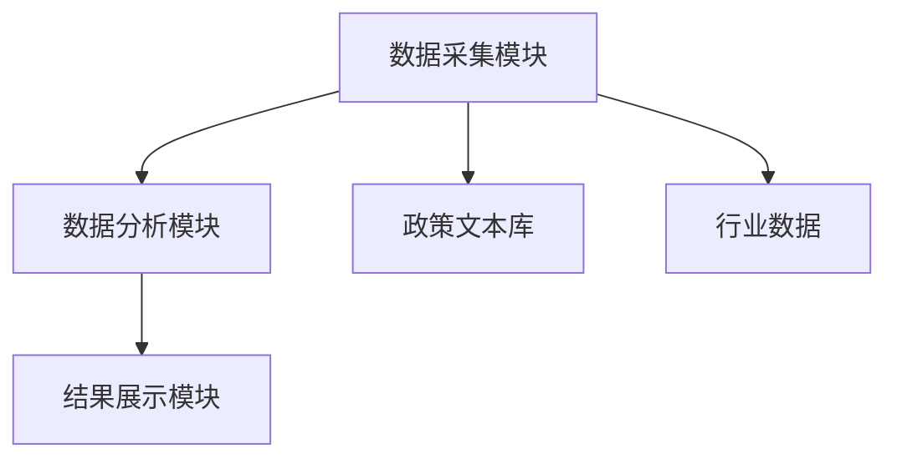

                 


# 《产业政策导向下的投资主题挖掘》

> **关键词**：产业政策，投资主题，政策导向，主题挖掘，投资分析

> **摘要**：本文探讨了在产业政策指导下如何挖掘投资主题，分析了产业政策对投资方向的影响，提出了基于政策信号的投资主题识别方法，并结合实际案例展示了如何利用这些主题进行投资决策。文章还详细介绍了数学模型和算法在投资主题挖掘中的应用，以及系统架构设计和项目实战。

---

## 第1章: 产业政策与投资主题的概述

### 1.1 产业政策的基本概念

#### 1.1.1 产业政策的定义与内涵
产业政策是指政府为了引导和规范产业发展，通过制定和实施相关政策来促进产业结构优化、技术创新和经济发展的行为。产业政策的核心在于通过政策工具（如税收优惠、补贴、行业准入限制等）引导资源流向特定领域，从而实现经济目标。

#### 1.1.2 产业政策的分类与特征
产业政策可以分为结构调整型政策、市场准入型政策、技术创新型政策等。其主要特征包括政策的导向性、干预性和动态性。

#### 1.1.3 产业政策与投资主题的关系
产业政策直接影响投资主题的选择。例如，政府对新能源行业的支持政策会引导投资者关注新能源领域的投资机会。

### 1.2 投资主题的定义与特点

#### 1.2.1 投资主题的定义
投资主题是指在特定时期内，由于市场环境、政策导向或技术进步等因素驱动，投资者集中关注的行业或领域。

#### 1.2.2 投资主题的核心要素
- **行业潜力**：行业的增长空间和盈利能力。
- **政策支持**：政府政策的扶持力度。
- **市场热度**：市场对行业的关注度和资金流向。

#### 1.2.3 投资主题的分类与发展趋势
投资主题可以分为周期性主题（如经济周期波动中的行业）和结构性主题（如技术创新驱动的行业）。近年来，科技、绿色能源等领域成为投资主题的热点。

### 1.3 产业政策对投资主题的影响

#### 1.3.1 产业政策如何引导投资方向
政府通过发布行业规划、提供税收优惠等措施，明确投资方向，吸引资金流入特定领域。

#### 1.3.2 产业政策对行业周期的影响
产业政策可以加速行业的成长周期，例如，政府对半导体行业的扶持政策可以缩短行业从起步到成熟的时间。

#### 1.3.3 产业政策与投资风险的关联
政策的不确定性可能增加投资风险，但合理的政策导向可以降低市场波动。

---

## 第2章: 产业政策的框架与机制

### 2.1 产业政策的制定过程

#### 2.1.1 政策制定的主体与流程
产业政策的制定通常由政府部门主导，经过问题识别、政策设计、意见征集和最终审议等步骤。

#### 2.1.2 政策目标的设定与优先级
政策目标包括促进经济增长、优化产业结构等。优先级取决于国家的长期发展战略。

#### 2.1.3 政策工具的选择与应用
常用的政策工具包括财政补贴、税收优惠、行业准入限制等。

### 2.2 产业政策的传导机制

#### 2.2.1 政策传导的路径分析
政策通过影响企业行为、市场需求和资本流动最终作用于投资主题。

#### 2.2.2 政策效果的评估方法
包括定量分析（如GDP增长）、定性分析（如行业结构优化）等。

#### 2.2.3 政策执行中的常见问题
政策执行可能面临政策滞后、政策执行力度不足等问题。

### 2.3 产业政策与市场机制的结合

#### 2.3.1 市场机制在政策实施中的作用
市场机制通过价格信号和竞争机制辅助政策实施，提高资源配置效率。

#### 2.3.2 政策如何调节市场失灵
通过弥补市场失灵，如外部性、公共物品供给不足等问题。

#### 2.3.3 政策与市场的协同效应
政策引导市场方向，市场反馈政策效果，形成良性互动。

---

## 第3章: 投资主题的识别与分析

### 3.1 投资主题的识别方法

#### 3.1.1 宏观经济指标分析
通过分析GDP增长率、就业数据等宏观经济指标，识别经济热点领域。

#### 3.1.2 产业政策信号解读
解读政府发布的行业规划、税收政策等，判断政策对行业的影响。

#### 3.1.3 市场趋势与行业动态
关注行业报告、市场调研等，了解市场发展趋势。

### 3.2 投资主题的分析框架

#### 3.2.1 SWOT分析法
- **优势（Strengths）**：行业内部优势。
- **劣势（Weaknesses）**：行业内部劣势。
- **机会（Opportunities）**：外部环境的机会。
- **威胁（Threats）**：外部环境的威胁。

#### 3.2.2 PEST分析法
- **政治因素（Political）**：政策法规的变化。
- **经济因素（Economic）**：经济周期和通货膨胀。
- **社会因素（Social）**：社会需求和人口结构。
- **技术因素（Technological）**：技术创新和行业变革。

#### 3.2.3 投资主题的生命周期模型
投资主题通常经历导入期、成长期、成熟期和衰退期，投资者需关注不同阶段的投资机会。

### 3.3 投资主题的评估与筛选

#### 3.3.1 投资主题的可行性分析
评估行业的市场容量、竞争格局和进入壁垒。

#### 3.3.2 投资主题的风险评估
分析政策风险、市场风险和财务风险。

#### 3.3.3 投资主题的筛选标准
包括政策支持力度、行业成长空间、企业盈利能力和市场热度等。

---

## 第4章: 数学模型与算法在投资主题挖掘中的应用

### 4.1 投资主题挖掘的数学模型

#### 4.1.1 线性回归模型
用于分析政策变量与投资主题的相关性。例如，使用线性回归模型分析税收优惠政策对行业投资的影响。

#### 4.1.2 聚类分析
将相似的投资主题归类，例如使用K-means算法将不同行业的投资主题进行聚类。

#### 4.1.3 时间序列分析
分析历史数据，预测未来投资主题的变化趋势。

### 4.2 算法实现

#### 4.2.1 基于政策信号的主题挖掘算法
使用自然语言处理技术，从政策文本中提取关键词，识别投资主题。

#### 4.2.2 投资主题的权重计算
通过层次分析法（AHP）计算不同因素的权重，确定投资主题的重要性。

### 4.3 算法实现代码示例

```python
import pandas as pd
from sklearn.cluster import KMeans

# 示例数据：政策关键词与行业数据
data = pd.DataFrame({
    'Industry': ['Technology', 'Healthcare', 'Energy'],
    'Policy_Score': [0.8, 0.6, 0.7]
})

# 使用K-means进行聚类分析
kmeans = KMeans(n_clusters=2)
clusters = kmeans.fit_predict(data[['Policy_Score']])

print(clusters)
```

---

## 第5章: 系统架构与投资主题挖掘的实现

### 5.1 系统架构设计

#### 5.1.1 系统功能模块
- 数据采集模块：收集政策文本、行业数据等。
- 数据分析模块：应用算法进行主题挖掘。
- 结果展示模块：可视化投资主题和分析结果。

#### 5.1.2 系统架构图（使用Mermaid）


### 5.2 系统实现

#### 5.2.1 数据采集与预处理
从政府网站和行业报告中收集政策文本和行业数据。

#### 5.2.2 数据分析与挖掘
使用自然语言处理技术提取政策关键词，结合行业数据进行主题挖掘。

#### 5.2.3 系统接口设计
定义API接口，供外部系统调用投资主题分析结果。

---

## 第6章: 项目实战

### 6.1 环境安装与配置

#### 6.1.1 安装必要的Python库
```bash
pip install numpy pandas scikit-learn
```

### 6.2 核心实现

#### 6.2.1 数据采集代码
```python
import requests
from bs4 import BeautifulSoup

# 示例代码：从政府网站采集政策文本
url = "https://www.example.gov"
response = requests.get(url)
soup = BeautifulSoup(response.text, 'html.parser')
policy_text = soup.find('div', class_='policy-content').text
```

#### 6.2.2 数据分析代码
```python
from sklearn.feature_extraction.text import TfidfVectorizer

vectorizer = TfidfVectorizer()
tfidf_matrix = vectorizer.fit_transform([policy_text])
```

### 6.3 实际案例分析

#### 6.3.1 案例背景
假设政府出台政策支持人工智能行业，我们需要识别与此相关的投资主题。

#### 6.3.2 分析过程
通过关键词提取和主题聚类，识别出“人工智能”、“大数据”、“云计算”等投资主题。

#### 6.3.3 结果展示
生成可视化报告，展示投资主题的分布和潜力。

---

## 第7章: 总结与展望

### 7.1 本章小结
本文系统地探讨了产业政策对投资主题的影响，提出了基于政策信号的投资主题识别方法，并通过数学模型和系统架构设计展示了如何实现投资主题的挖掘。

### 7.2 未来研究方向
- 结合更多数据源，提高主题挖掘的准确性。
- 研究政策变化对投资主题的动态影响。
- 探讨人工智能技术在投资主题挖掘中的应用。

---

**作者：AI天才研究院/AI Genius Institute & 禅与计算机程序设计艺术 /Zen And The Art of Computer Programming**

---

**备注**：如需进一步了解或扩展某个部分的内容，请随时告知！

