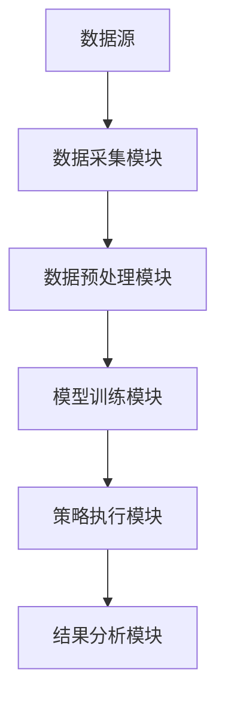

                 


# 人工智能在另类数据分析和投资中的应用

> 关键词：人工智能、另类数据、投资策略、机器学习、数据分析

> 摘要：随着数据科学和人工智能技术的快速发展，另类数据在投资领域中的应用日益广泛。本文将深入探讨人工智能如何在另类数据分析中发挥作用，以及如何通过这些数据构建有效的投资策略。文章内容涵盖另类数据的分类与获取、人工智能算法的原理与实现、投资策略的设计与优化，以及实际项目案例的分析与解读。通过本文的分析，读者将能够全面了解人工智能在另类数据分析和投资中的应用价值与实践方法。

---

# 第1章: 人工智能与另类数据分析的背景

## 1.1 另类数据的定义与特点

### 1.1.1 另类数据的定义
另类数据（Alternative Data）是指那些传统金融市场分析中不常用的数据类型，包括文本数据（如新闻、社交媒体评论）、图像数据（如卫星图像）、音频数据（如电话录音）以及传感器数据等。这些数据通常不直接反映市场交易信息，但可以通过分析挖掘出潜在的投资信号。

### 1.1.2 另类数据的核心特点
1. **非结构化**：另类数据通常是非结构化的，需要经过处理才能转化为可分析的格式。
2. **实时性**：许多另类数据具有较强的实时性，能够捕捉市场动态的变化。
3. **多样性**：另类数据来源广泛，涵盖文本、图像、音频等多种形式。
4. **复杂性**：由于数据类型多样且来源复杂，分析难度较高。

### 1.1.3 另类数据在投资中的作用
1. **捕捉市场情绪**：通过社交媒体和新闻数据，分析市场参与者的情绪变化。
2. **预测市场趋势**：利用卫星图像分析零售业的销售情况，进而预测经济走势。
3. **发现投资机会**：通过分析企业财报以外的数据，挖掘潜在的投资标的。

---

## 1.2 人工智能在投资中的应用背景

### 1.2.1 投资领域的数据挑战
1. **数据量大**：金融市场数据量庞大，且不断增长。
2. **数据异构性**：数据来源多样化，格式复杂。
3. **数据实时性要求高**：需要快速处理和分析实时数据。

### 1.2.2 人工智能技术的发展与投资结合的必然性
1. **计算能力的提升**：人工智能技术的进步使得复杂数据的处理成为可能。
2. **算法的改进**：深度学习、自然语言处理等技术的发展为数据分析提供了新的工具。
3. **数据驱动决策的需求**：投资机构 increasingly rely on 数据驱动的决策-making。

### 1.2.3 当前市场中的应用现状与趋势
1. **现状**：越来越多的投资机构开始利用另类数据进行辅助决策。
2. **趋势**：人工智能技术在另类数据中的应用将更加普及，数据来源和分析方法将更加多样化。

---

## 1.3 本章小结
本章主要介绍了另类数据的定义、特点及其在投资中的作用，并探讨了人工智能在投资中的应用背景。通过这些内容，读者可以初步了解人工智能与另类数据分析的结合在投资领域中的重要性。

---

# 第2章: 另类数据的分类与处理

## 2.1 另类数据的分类

### 2.1.1 文本数据
文本数据是常见的另类数据类型，包括新闻文章、社交媒体评论、公司财报等。通过自然语言处理（NLP）技术，可以从文本中提取情感、关键词等信息。

### 2.1.2 图像与视频数据
图像数据包括卫星图像、公司Logo等，可以通过计算机视觉技术进行分析。视频数据则可以用于监控市场动态。

### 2.1.3 音频数据
音频数据包括电话录音、播客等，可以通过语音识别技术转化为文本数据，并进行进一步分析。

### 2.1.4 社交媒体数据
社交媒体数据包括用户评论、点赞、转发等，可以用来分析市场情绪和用户行为。

### 2.1.5 传感器数据
传感器数据包括温度、湿度、设备使用情况等，可以用于工业生产和供应链管理相关的投资决策。

---

## 2.2 另类数据的获取渠道

### 2.2.1 公开数据源
1. **免费数据源**：例如，Twitter API、Google News API等。
2. **开放数据平台**：例如，Kaggle、Data.gov等。

### 2.2.2 付费数据源
1. **专业数据供应商**：例如，Refinitiv、 Bloomberg等提供另类数据服务的机构。
2. **定制化数据服务**：可以根据具体需求定制数据采集服务。

### 2.2.3 自动化数据采集工具
1. **爬虫工具**：例如，Scrapy、BeautifulSoup等。
2. **API接口**：通过API获取实时数据。

---

## 2.3 数据预处理与清洗

### 2.3.1 数据清洗的基本步骤
1. **去重**：去除重复数据。
2. **去噪**：去除噪声数据，例如错误的格式或无效的信息。
3. **标准化**：统一数据格式，例如将日期格式统一化。

### 2.3.2 数据标准化与归一化
1. **标准化**：将数据按比例缩放到同一范围内，例如使用Z-score标准化。
2. **归一化**：将数据缩放到[0,1]范围内。

### 2.3.3 数据增强技术
1. **文本数据增强**：例如，同义词替换、句式变换。
2. **图像数据增强**：例如，旋转、翻转、裁剪等操作。

---

## 2.4 本章小结
本章主要介绍了另类数据的分类与获取渠道，并详细讲解了数据预处理与清洗的基本方法。这些内容为后续的分析奠定了基础。

---

# 第3章: 人工智能算法与模型构建

## 3.1 常见的人工智能算法及其在投资中的应用

### 3.1.1 监督学习算法
1. **线性回归**：用于预测连续型变量，例如股票价格预测。
2. **支持向量机（SVM）**：用于分类问题，例如市场趋势分类。
3. **决策树与随机森林**：用于分类和回归问题，例如客户 churn 预测。
4. **神经网络**：用于复杂非线性关系的建模，例如时间序列预测。

### 3.1.2 无监督学习算法
1. **K-means聚类**：用于客户分群、市场分割。
2. **层次聚类**：用于发现数据中的层次结构。
3. **主成分分析（PCA）**：用于降维和特征提取。

### 3.1.3 强化学习算法
1. **Q-learning**：用于策略优化，例如交易策略的选择。
2. **Deep Q-Networks（DQN）**：用于复杂的策略优化问题。

---

## 3.2 算法在投资中的应用案例

### 3.2.1 股票价格预测
通过 LSTM（长短期记忆网络）模型预测股票价格走势。

### 3.2.2 风险评估与管理
利用聚类分析识别风险较高的投资组合。

### 3.2.3 市场情绪分析
使用自然语言处理技术分析社交媒体数据，评估市场情绪。

---

## 3.3 本章小结
本章主要介绍了常见的人工智能算法及其在投资中的应用，展示了如何利用这些算法进行市场预测和风险评估。

---

# 第4章: 投资策略与系统架构

## 4.1 人工智能驱动的投资策略设计

### 4.1.1 策略目标的设定
1. **收益目标**：追求超额收益。
2. **风险控制**：控制回撤幅度。
3. **交易频率**：高频交易或低频交易。

### 4.1.2 数据驱动的策略构建
1. **因子构建**：基于另类数据构建因子，例如情绪因子、动量因子。
2. **策略回测**：通过回测验证策略的有效性。
3. **策略优化**：通过参数优化提升策略表现。

---

## 4.2 系统架构设计

### 4.2.1 系统功能模块划分
1. **数据采集模块**：负责数据的采集和预处理。
2. **模型训练模块**：负责模型的训练与优化。
3. **策略执行模块**：负责策略的执行与监控。
4. **结果分析模块**：负责结果的分析与可视化。

### 4.2.2 系统架构图


---

## 4.3 本章小结
本章主要介绍了人工智能驱动的投资策略设计，并展示了系统的整体架构设计。这些内容为后续的系统实现提供了指导。

---

# 第5章: 项目实战

## 5.1 项目背景与目标

### 5.1.1 项目背景
本项目旨在利用另类数据构建一个股票价格预测模型。

### 5.1.2 项目目标
1. **数据采集**：获取社交媒体数据和股票价格数据。
2. **模型训练**：训练一个LSTM模型预测股票价格。
3. **策略制定**：基于模型预测结果制定交易策略。

---

## 5.2 环境安装与数据采集

### 5.2.1 环境安装
1. **安装Python**：推荐使用Anaconda分布。
2. **安装依赖库**：包括Pandas、NumPy、TensorFlow、Keras等。

### 5.2.2 数据采集
1. **社交媒体数据采集**：使用Twitter API获取推文数据。
2. **股票价格数据采集**：使用Yahoo Finance API获取历史数据。

---

## 5.3 模型实现与代码解读

### 5.3.1 数据预处理
```python
import pandas as pd
import numpy as np

# 读取数据
tweets = pd.read_csv('tweets.csv')
prices = pd.read_csv('prices.csv')

# 合并数据
merged_data = pd.merge(tweets, prices, on='date')
```

### 5.3.2 模型训练
```python
from tensorflow.keras.models import Sequential
from tensorflow.keras.layers import LSTM, Dense

# 构建模型
model = Sequential()
model.add(LSTM(64, input_shape=(sequence_length, 1)))
model.add(Dense(1))
model.compile(loss='mean_squared_error', optimizer='adam')
```

### 5.3.3 模型预测与策略制定
```python
# 预测价格
predicted_prices = model.predict(x_test)

# 制定交易策略
threshold = 0.1
signal = predicted_prices > threshold
```

---

## 5.4 实际案例分析

### 5.4.1 数据分析与可视化
```python
import matplotlib.pyplot as plt

plt.plot(prices['close'], label='实际价格')
plt.plot(predicted_prices, label='预测价格')
plt.legend()
plt.show()
```

### 5.4.2 策略回测与优化
1. **回测结果**：计算策略的收益和回撤。
2. **参数优化**：调整模型参数以提升预测精度。

---

## 5.5 本章小结
本章通过一个实际项目展示了如何利用人工智能技术进行股票价格预测，并制定了相应的交易策略。通过项目实战，读者可以更好地理解理论知识的应用。

---

# 第6章: 最佳实践与总结

## 6.1 最佳实践 tips

### 6.1.1 数据处理
1. **数据清洗**：确保数据质量。
2. **特征工程**：提取有用的特征。

### 6.1.2 模型选择
1. **模型评估**：使用交叉验证评估模型性能。
2. **模型调优**：调整超参数提升性能。

### 6.1.3 系统设计
1. **模块化设计**：便于维护和扩展。
2. **接口设计**：确保模块之间的良好交互。

---

## 6.2 小结
人工智能技术在另类数据分析和投资中的应用具有广阔的前景。通过本文的介绍，读者可以了解如何利用人工智能技术进行数据处理、模型构建和策略制定。同时，也需要注意数据隐私和模型风险，确保系统的稳健性。

---

# 作者信息

作者：AI天才研究院/AI Genius Institute  
& 禅与计算机程序设计艺术 /Zen And The Art of Computer Programming

