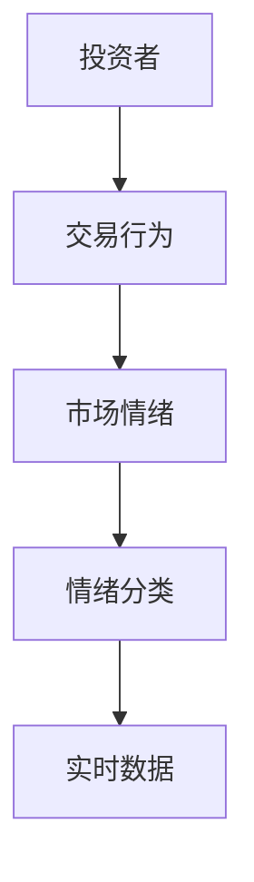
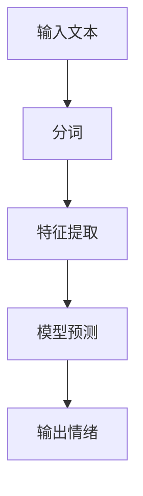
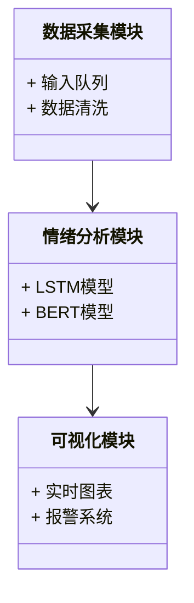

                 


# 人工智能在实时市场情绪分析中的应用

**关键词**：人工智能，实时市场情绪分析，自然语言处理，深度学习，LSTM，BERT，金融数据分析

**摘要**：  
本文探讨了人工智能在实时市场情绪分析中的应用，分析了市场情绪分析的重要性及其对投资决策的影响。通过详细阐述核心概念、算法原理、系统架构设计和项目实战，本文为读者提供了一个从理论到实践的完整指南。文章还介绍了基于LSTM和BERT的深度学习模型，展示了它们在实时数据处理中的优势，并通过具体的代码实现和案例分析，帮助读者更好地理解如何在实际场景中应用这些技术。

---

## 第1章：实时市场情绪分析的背景与意义

### 1.1 问题背景

#### 1.1.1 金融市场中的情绪分析需求  
在金融市场中，投资者的情绪波动对市场走势有着重要影响。通过分析新闻、社交媒体、论坛等渠道的文本数据，可以提取市场参与者的集体情绪，进而预测市场趋势。这种分析不仅有助于机构投资者做出更明智的投资决策，还能为普通投资者提供参考。

#### 1.1.2 情绪分析在投资决策中的作用  
情绪分析可以帮助投资者识别市场情绪的过度波动，从而避免盲目跟风或错失良机。例如，当市场情绪过于乐观时，可能存在回调风险；而当情绪极度悲观时，可能是买入的好机会。通过实时监控市场情绪，投资者可以及时调整策略，提高决策的科学性。

#### 1.1.3 实时分析的必要性与挑战  
实时市场情绪分析需要快速处理大量数据，并在短时间内给出分析结果。这对算法的效率和准确性提出了更高的要求。此外，数据来源的多样性和复杂性也增加了分析的难度。因此，如何设计高效的算法和优化数据处理流程成为关键。

---

### 1.2 问题描述

#### 1.2.1 市场情绪的定义与分类  
市场情绪是指市场参与者（如投资者、交易员等）对市场走势的心理预期。通常可以将情绪分为以下几个类别：  
- **乐观**：市场参与者预期价格上涨，交易活跃。  
- **悲观**：市场参与者预期价格下跌，交易量减少。  
- **中性**：市场情绪平稳，无明显趋势。

#### 1.2.2 情绪分析的核心目标  
情绪分析的核心目标是通过文本数据，识别市场参与者的集体情绪，并将其量化为可分析的指标。这些指标可以用于预测市场走势、评估投资风险等。

#### 1.2.3 实时分析的边界与外延  
实时分析的边界包括数据采集的实时性、分析的实时性以及结果的实时反馈。其外延则包括对情绪指标的深度分析、与其他市场数据的结合应用等。

---

### 1.3 问题解决

#### 1.3.1 传统情绪分析方法的局限性  
传统的基于规则的情绪分析方法依赖于预定义的关键词和规则，难以应对复杂多变的市场环境。此外，这些方法通常不具备实时处理能力，无法满足金融市场对快速决策的需求。

#### 1.3.2 人工智能在情绪分析中的优势  
人工智能技术，尤其是深度学习，能够从海量数据中提取复杂的特征，并通过模型训练实现高精度的情绪分类。此外，深度学习模型可以实时处理数据，满足金融市场对实时分析的需求。

#### 1.3.3 实时分析的技术实现路径  
实时分析的技术实现路径包括：  
1. 数据采集：从新闻网站、社交媒体等渠道实时采集文本数据。  
2. 数据预处理：清洗数据，提取关键词和情感特征。  
3. 模型训练：使用深度学习模型（如LSTM、BERT）进行训练，得到情绪分类模型。  
4. 实时分析：将实时数据输入模型，输出市场情绪指标。  
5. 结果应用：将情绪指标用于投资决策或风险预警。

---

## 第2章：人工智能与情绪分析的核心概念

### 2.1 核心概念原理

#### 2.1.1 自然语言处理（NLP）在情绪分析中的应用  
NLP技术用于从文本中提取情感特征。常见的NLP技术包括分词、实体识别、情感分析等。这些技术可以帮助模型更好地理解文本内容，提取有用的信息。

#### 2.1.2 深度学习模型在实时分析中的优势  
深度学习模型（如LSTM、BERT）具有强大的特征提取能力，能够处理序列数据和上下文信息。这些模型在实时数据处理中表现出色，适用于金融市场的情绪分析。

#### 2.1.3 情感分类与实时数据处理的结合  
情感分类模型可以将文本数据分类为不同的情绪类别（如乐观、悲观、中性）。结合实时数据处理技术，可以实现对市场情绪的实时监控和分析。

---

### 2.2 核心概念属性对比表

| 概念         | 属性             | 描述                                   |
|--------------|------------------|----------------------------------------|
| 情绪分析     | 数据来源         | 文本数据（新闻、社交媒体等）           |
|              | 分析目标         | 投资者情绪、市场趋势                   |
|              | 分析粒度         | 实时、周期性                           |

---

### 2.3 ER实体关系图



---

## 第3章：实时市场情绪分析的算法原理

### 3.1 算法原理概述

#### 3.1.1 基于LSTM的序列模型  
LSTM（长短期记忆网络）是一种处理序列数据的深度学习模型。它通过记忆单元（Memory Cell）和门控机制（Gate）来捕捉长期依赖关系，适合处理金融市场中的时间序列数据。

#### 3.1.2 基于BERT的情感分类模型  
BERT（双向Transformer）是一种基于预训练的语言模型，具有强大的文本表示能力。它可以用于情感分类任务，帮助模型更好地理解文本的语义信息。

#### 3.1.3 混合模型的优势  
混合模型结合了LSTM和BERT的优势，能够同时处理时间序列数据和文本语义信息。这种模型在复杂金融市场中表现更为出色。

---

### 3.2 算法流程图



---

### 3.3 数学模型与公式

#### 3.3.1 LSTM模型  
$$
f(t) = \text{LSTM}(x_t, f(t-1))
$$

#### 3.3.2 BERT模型  
$$
\text{CLS} = \text{BERT}(x_1, x_2)
$$

---

## 第4章：系统分析与架构设计

### 4.1 问题场景介绍

#### 4.1.1 实时数据采集  
通过API接口或网络爬虫从新闻网站、社交媒体等渠道实时采集市场相关文本数据。

#### 4.1.2 情绪分析模块  
使用LSTM和BERT模型对采集到的文本数据进行情绪分类，输出市场情绪指标。

#### 4.1.3 结果可视化  
将分析结果可视化，提供实时图表和报警系统，帮助用户快速了解市场情绪。

---

### 4.2 系统功能设计



---

## 第5章：项目实战

### 5.1 环境安装

#### 5.1.1 Python环境配置  
安装Python 3.8及以上版本，并配置虚拟环境。

#### 5.1.2 深度学习框架安装  
安装TensorFlow或Keras框架，用于模型训练和部署。

---

### 5.2 系统核心实现源代码

#### 5.2.1 数据预处理代码  
```python
import pandas as pd
import numpy as np

def preprocess_data(data):
    # 分词处理
    from word_tokenize import word_tokenize
    data['tokens'] = data['text'].apply(word_tokenize)
    # 转换为数值型特征
    from sklearn.feature_extraction.text import TfidfVectorizer
    vectorizer = TfidfVectorizer(max_features=1000)
    X = vectorizer.fit_transform(data['text'])
    return X
```

#### 5.2.2 情绪分类模型代码  
```python
from tensorflow.keras.models import Sequential
from tensorflow.keras.layers import LSTM, Dense, Dropout

def build_lstm_model(input_shape):
    model = Sequential()
    model.add(LSTM(128, return_sequences=True, input_shape=input_shape))
    model.add(Dropout(0.5))
    model.add(LSTM(64, return_sequences=False))
    model.add(Dense(3, activation='softmax'))  # 3情绪类别：乐观、悲观、中性
    model.compile(loss='sparse_categorical_crossentropy', optimizer='adam', metrics=['accuracy'])
    return model
```

---

### 5.3 实际案例分析

#### 5.3.1 数据来源  
假设我们从社交媒体平台获取了以下文本数据：

| 时间       | 文本内容                          |
|------------|----------------------------------|
| 2023-10-01 | "股市今天大涨，真是个好日子！" |
| 2023-10-02 | "我对未来非常担忧，建议大家谨慎操作。" |

#### 5.3.2 情绪分类结果  
经过模型训练和预测，得到以下结果：

| 时间       | 情绪分类  |
|------------|-----------|
| 2023-10-01 | 乐观      |
| 2023-10-02 | 悲观      |

#### 5.3.3 结果可视化  
在可视化模块中，我们可以将情绪分类结果绘制为柱状图或折线图，帮助用户直观了解市场情绪的变化趋势。

---

## 第6章：系统架构设计

### 6.1 系统架构设计


---

## 第7章：最佳实践与小结

### 7.1 最佳实践

#### 7.1.1 数据质量控制  
确保数据来源的多样性和准确性，避免因数据质量问题影响分析结果。

#### 7.1.2 模型优化  
定期更新模型，引入新的数据和特征，保持模型的高精度和适应性。

#### 7.1.3 结果验证  
通过回测和实际案例分析，验证模型的有效性和可靠性。

---

### 7.2 小结

本文详细介绍了人工智能在实时市场情绪分析中的应用，从背景、核心概念到算法原理和系统架构设计，为读者提供了全面的理论和实践指导。通过具体的代码实现和案例分析，帮助读者更好地理解和应用相关技术。

---

### 7.3 注意事项

- 数据隐私问题：在处理用户数据时，需遵守相关法律法规，保护用户隐私。  
- 模型更新频率：根据市场变化和数据更新情况，定期更新模型，保持其准确性。  
- 结果解释性：确保分析结果的可解释性，避免因模型“黑箱”特性影响用户信任。

---

### 7.4 拓展阅读

- 《深度学习实战：自然语言处理的应用》  
- 《实时数据分析与可视化》  
- 《金融市场中的情绪分析与投资策略》  

---

**作者：AI天才研究院/AI Genius Institute & 禅与计算机程序设计艺术 /Zen And The Art of Computer Programming**

