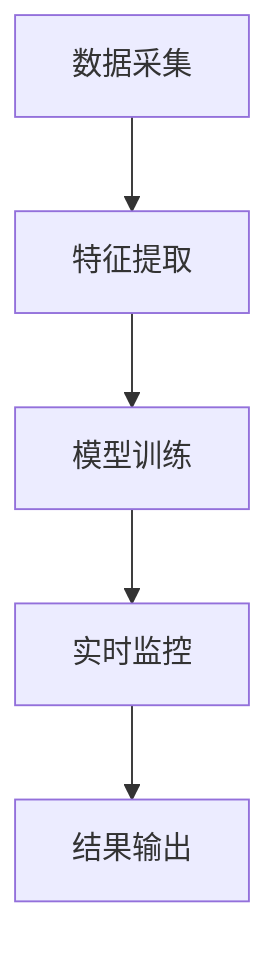

                 


# 人工智能在市场微结构变化检测中的应用

> 关键词：人工智能、市场微结构、变化检测、时间序列分析、深度学习、自然语言处理、金融风险管理

> 摘要：本文详细探讨了人工智能技术在市场微结构变化检测中的应用，通过分析市场微结构的核心概念、异常检测算法、时间序列分析模型、系统架构设计以及项目实战案例，展示了如何利用AI技术提高金融市场的风险管理和交易效率。文章内容涵盖从基础理论到实际应用的全链条，旨在为金融从业者和技术研究人员提供有价值的参考。

---

## 第一章: 市场微结构变化检测的背景介绍

### 1.1 问题背景

#### 1.1.1 市场微结构的定义
市场微结构是指金融市场的微观层面，包括交易主体、交易行为、价格形成机制等要素。这些要素的动态变化反映了市场的波动性和复杂性。

#### 1.1.2 市场微结构变化的定义
市场微结构变化指的是在市场中，由于参与者行为、市场规则或外部因素的变化，导致市场微观结构发生显著变化的过程。这种变化可能影响市场的流动性和价格形成机制。

#### 1.1.3 市场微结构变化检测的重要性
市场微结构变化检测对于金融风险管理和交易策略优化具有重要意义。通过及时发现和分析这些变化，可以提前预警潜在风险，优化交易决策。

### 1.2 问题描述

#### 1.2.1 市场微结构变化的表现形式
市场微结构变化可以通过多种形式表现，如订单簿的异常波动、交易量突变、价格跳动等。这些变化通常隐藏在大量噪声数据中，难以通过传统方法检测。

#### 1.2.2 市场参与者行为对微结构的影响
市场参与者的行为，如高频交易、算法交易和投资者情绪变化，都会对市场微结构产生显著影响。这些行为的复杂性增加了变化检测的难度。

#### 1.2.3 微结构变化对市场整体的影响
微结构变化往往会导致市场价格波动加剧、流动性下降，甚至引发系统性风险。因此，及时检测和分析这些变化对金融市场稳定具有重要意义。

### 1.3 问题解决

#### 1.3.1 传统方法的局限性
传统方法主要依赖统计分析和规则-based系统，难以应对复杂多变的市场环境。这些方法在处理高维数据和非线性关系时表现不佳。

#### 1.3.2 人工智能在微结构变化检测中的优势
人工智能技术，特别是机器学习和深度学习，具有强大的特征提取和模式识别能力。这些技术可以处理复杂的数据关系，发现传统方法难以捕捉的模式。

#### 1.3.3 基于AI的解决方案框架
基于AI的解决方案通常包括数据采集、特征提取、模型训练和实时监控四个阶段。通过构建高效的AI模型，可以实现对市场微结构变化的实时检测和预警。

### 1.4 边界与外延

#### 1.4.1 市场微结构变化检测的边界
市场微结构变化检测的边界主要集中在微观层面，不涉及市场宏观波动分析。然而，微观变化和宏观波动之间存在复杂的关系，需要综合考虑。

#### 1.4.2 相关概念的对比与区分
市场微结构变化检测与市场波动分析、异常交易检测等概念密切相关。本文通过对比分析，明确了这些概念的异同点。

#### 1.4.3 微观与宏观视角的结合
尽管市场微结构变化检测主要关注微观层面，但与宏观市场波动分析结合可以提供更全面的市场洞察。这种结合可以通过多维度的数据分析实现。

### 1.5 核心概念与联系

#### 1.5.1 核心概念原理
市场微结构变化检测的核心在于识别市场数据中的异常模式。通过分析订单簿、交易量和价格数据，可以发现潜在的变化信号。

#### 1.5.2 核心概念属性特征对比
以下是市场微结构变化检测中几个核心概念的属性特征对比：

| 概念               | 属性特征                   |
|--------------------|----------------------------|
| 市场微结构         | 数据维度、时间序列、交易行为 |
| 异常检测           | 统计显著性、模式识别         |
| 时间序列分析       | 趋势、周期性、突变点         |

#### 1.5.3 ER实体关系图架构的 Mermaid 流程图
```mermaid
erDiagram
    participant A "市场参与者" {
        attribute 账户余额、交易历史
    }
    participant B "订单簿" {
        attribute 买价、卖价、订单数量
    }
    participant C "交易系统" {
        attribute 时间戳、交易量、价格
    }
    participant D "市场监控系统" {
        attribute 异常标志、变化趋势
    }
    A --> B : 下单
    B --> C : 记录交易
    C --> D : 分析变化
    D --> A : 提供反馈
```

---

## 第二章: 人工智能技术基础

### 2.1 机器学习基础

#### 2.1.1 监督学习
监督学习是一种基于标签数据的机器学习方法。通过训练模型识别输入数据的标签，可以实现分类和回归任务。

#### 2.1.2 无监督学习
无监督学习适用于无标签数据的分析。通过聚类和降维等技术，可以发现数据中的潜在结构。

#### 2.1.3 半监督学习
半监督学习结合了监督学习和无监督学习的优势，适用于标签数据有限的情况。这种方法可以利用未标记数据提高模型性能。

### 2.2 深度学习基础

#### 2.2.1 神经网络基础
神经网络是一种受生物神经元启发的计算模型。通过多层神经元的组合，可以实现复杂的特征提取和模式识别。

#### 2.2.2 卷积神经网络（CNN）
CNN主要用于图像识别任务，但在金融时间序列数据处理中也有广泛应用。其卷积操作可以有效提取局部特征。

#### 2.2.3 循环神经网络（RNN）
RNN适用于时间序列数据的处理。通过循环结构，可以捕捉数据的时间依赖性。

### 2.3 特征工程与模型评估

#### 2.3.1 特征提取方法
特征工程是机器学习的核心环节。通过选择和构建有效的特征，可以提高模型的性能和解释性。

#### 2.3.2 模型评估指标
常用的模型评估指标包括准确率、召回率、F1分数等。这些指标可以帮助选择最优模型和调优参数。

#### 2.3.3 超参数调优
超参数调优是通过网格搜索或随机搜索等方法，找到最优的模型参数组合。这可以显著提高模型性能。

---

## 第三章: 异常检测算法

### 3.1 基于统计的异常检测

#### 3.1.1 基于均值和标准差的异常检测
该方法通过计算数据的均值和标准差，识别偏离均值超过一定倍数标准差的异常点。

#### 3.1.2 程度检验方法
程度检验方法适用于检验数据是否符合某种分布。通过比较观测值与期望值的差异，可以发现异常。

#### 3.1.3 程度检验方法的优缺点
程度检验方法的优点是简单易懂，缺点是假设数据服从特定分布，且难以处理多维数据。

### 3.2 基于机器学习的异常检测

#### 3.2.1 基于聚类的异常检测
聚类方法通过将数据分成簇，识别远离簇中心的异常点。该方法适用于无监督场景。

#### 3.2.2 基于分类的异常检测
分类方法通过训练模型识别正常和异常样本。该方法需要有标签数据。

#### 3.2.3 基于深度学习的异常检测
深度学习方法通过构建自动编码器等模型，学习数据的正常表示，识别异常点。

### 3.3 时间序列分析

#### 3.3.1 时间序列的分解方法
时间序列可以分解为趋势、周期性和随机成分。分解方法有助于识别异常变化。

#### 3.3.2 基于ARIMA模型的时间序列预测
ARIMA模型是一种经典的统计模型，适用于线性时间序列预测。其公式为：
$$ ARIMA(p, d, q) $$
其中，$p$ 是自回归阶数，$d$ 是差分阶数，$q$ 是移动平均阶数。

#### 3.3.3 基于LSTM的时间序列预测
LSTM是一种特殊的RNN，适用于非线性时间序列预测。其结构包括输入门、遗忘门和输出门。

---

## 第四章: 自然语言处理在金融中的应用

### 4.1 基于NLP的情感分析

#### 4.1.1 情感分析的定义
情感分析用于判断文本中的情感倾向，通常分为正面、负面和中性。

#### 4.1.2 基于词袋模型的情感分析
词袋模型将文本表示为单词的集合，忽略单词顺序。通过训练分类器，可以实现情感分类。

#### 4.1.3 基于深度学习的情感分
深度学习模型，如词嵌入和CNN，可以更准确地捕捉文本情感。

### 4.2 基于关键词提取的新闻分析

#### 4.2.1 关键词提取方法
关键词提取方法包括TF-IDF和主题模型。这些方法可以帮助识别新闻中的重要信息。

#### 4.2.2 事件驱动的市场变化
通过分析新闻中的关键词和事件，可以预测市场情绪和价格变化。

### 4.3 基于NLP的市场情绪监控

#### 4.3.1 市场情绪监控系统架构
市场情绪监控系统通常包括数据采集、文本预处理、情感分析和结果可视化等模块。

#### 4.3.2 情绪监控与市场变化的关系
市场情绪可以通过社交媒体和新闻数据进行监控，为市场微结构变化检测提供辅助信息。

---

## 第五章: 系统架构与实现

### 5.1 系统设计

#### 5.1.1 系统模块划分
市场微结构变化检测系统通常包括数据采集、特征提取、模型训练和实时监控四个模块。

#### 5.1.2 系统架构图


#### 5.1.3 系统接口设计
系统接口包括数据输入接口、模型训练接口和结果输出接口。这些接口需要标准化，方便数据流和模块交互。

### 5.2 系统实现

#### 5.2.1 数据采集
数据采集模块负责收集市场数据，包括订单簿、交易量和价格等。常用的数据源包括交易所API和市场数据供应商。

#### 5.2.2 特征提取
特征提取模块通过统计和机器学习方法，从原始数据中提取特征。这些特征可以用于后续的模型训练。

#### 5.2.3 模型训练
模型训练模块通过训练机器学习和深度学习模型，生成用于变化检测的预测模型。

#### 5.2.4 实时监控
实时监控模块负责接收市场数据，利用训练好的模型，实时检测市场微结构变化。

---

## 第六章: 项目实战

### 6.1 项目介绍

#### 6.1.1 项目背景
本项目旨在开发一个基于AI的市场微结构变化检测系统，帮助金融机构实时监控市场变化，优化交易策略。

#### 6.1.2 数据集介绍
数据集包括历史订单簿数据、交易量和价格数据。数据预处理步骤包括清洗、特征提取和标准化。

### 6.2 核心实现

#### 6.2.1 环境安装
项目需要安装以下依赖：
```bash
pip install numpy pandas scikit-learn tensorflow
```

#### 6.2.2 数据预处理代码
```python
import pandas as pd
import numpy as np

# 数据加载
data = pd.read_csv('market_data.csv')

# 数据清洗
data.dropna(inplace=True)

# 特征提取
features = data[['bid_price', 'ask_price', 'volume']]
```

#### 6.2.3 模型训练代码
```python
from sklearn.ensemble import IsolationForest
from tensorflow.keras.models import Sequential
from tensorflow.keras.layers import LSTM, Dense

# 异常检测模型训练
model_isolation = IsolationForest(n_estimators=100, random_state=42)
model_isolation.fit(features)

# LSTM模型训练
model_lstm = Sequential()
model_lstm.add(LSTM(64, input_shape=(timesteps, features)))
model_lstm.add(Dense(1, activation='sigmoid'))
model_lstm.compile(loss='binary_crossentropy', optimizer='adam')
model_lstm.fit(X_train, y_train, epochs=10, batch_size=32)
```

### 6.3 案例分析

#### 6.3.1 数据分析与建模
通过对历史数据的分析，识别出某些特定模式，如订单簿的异常波动，作为变化检测的特征。

#### 6.3.2 模型训练与验证
通过交叉验证和回测，评估模型的性能和准确性。调整模型参数，优化检测效果。

#### 6.3.3 实际案例
以某次市场波动为例，展示模型如何检测出微结构变化，并提供实时预警。

### 6.4 项目小结

#### 6.4.1 项目总结
本项目成功实现了基于AI的市场微结构变化检测系统，验证了AI技术在金融领域的应用潜力。

#### 6.4.2 项目意义
通过本项目，可以提高金融市场的风险预警能力，优化交易策略，提升机构的市场竞争力。

---

## 第七章: 总结与展望

### 7.1 总结

#### 7.1.1 核心内容回顾
本文详细介绍了人工智能在市场微结构变化检测中的应用，包括核心概念、算法原理和系统实现。

#### 7.1.2 技术优势
人工智能技术在处理复杂数据和非线性关系方面具有显著优势，能够有效提升市场变化检测的准确性和实时性。

### 7.2 未来展望

#### 7.2.1 技术发展
随着AI技术的不断进步，市场微结构变化检测将更加智能化和自动化。深度学习和强化学习将在这一领域发挥更大作用。

#### 7.2.2 应用拓展
未来，市场微结构变化检测将与更多金融应用场景结合，如智能投顾、风险管理等。

---

## 作者

作者：AI天才研究院/AI Genius Institute & 禅与计算机程序设计艺术/Zen And The Art of Computer Programming

---

以上是《人工智能在市场微结构变化检测中的应用》的完整目录大纲和部分正文内容。

