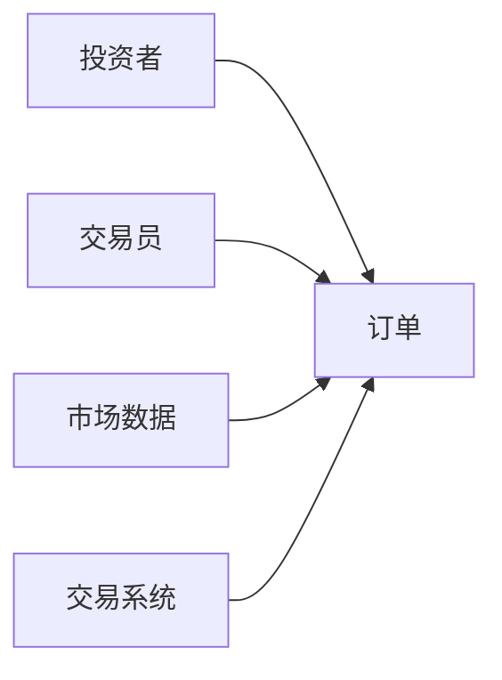
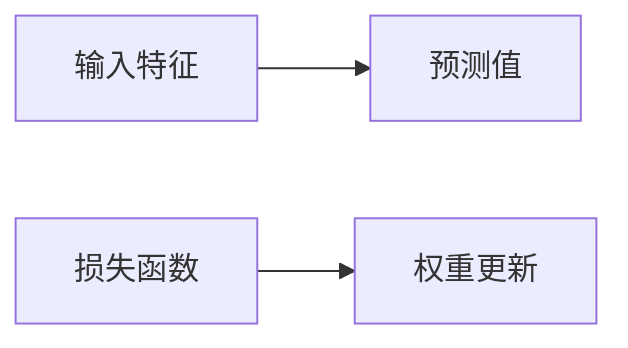
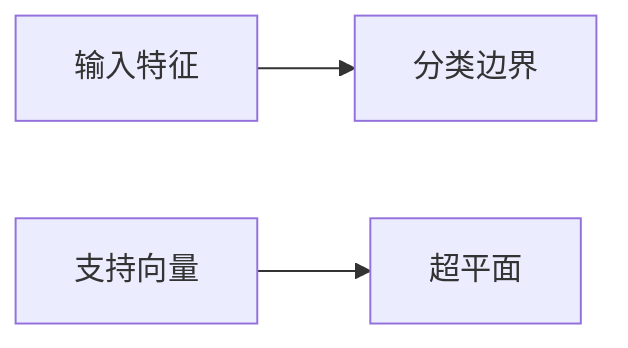
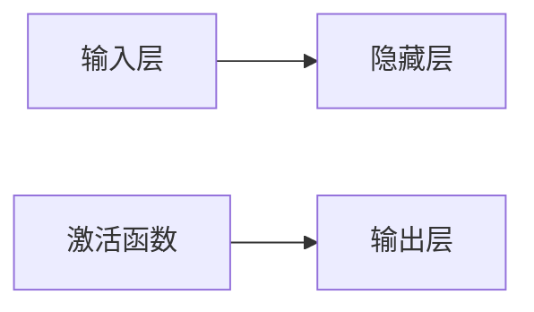
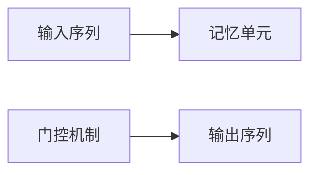
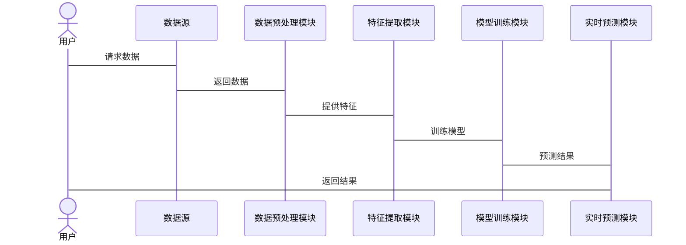

                 


# 人工智能在市场微观结构建模中的应用

## 关键词：人工智能，市场微观结构，建模，机器学习，深度学习

## 摘要：  
本文探讨人工智能在市场微观结构建模中的应用，从基础概念到高级算法，详细分析其在金融交易中的作用，包括订单簿分析、交易量预测、价格波动建模等。通过实际案例和算法实现，展示AI如何提升市场建模的效率和精度。

---

# 第1章：市场微观结构建模的核心概念

## 1.1 市场微观结构建模的背景与意义

### 1.1.1 问题背景介绍
市场微观结构建模研究市场参与者的交易行为及其对市场价格和流动性的动态影响，帮助交易员和投资者优化决策。传统方法依赖统计分析，但难以捕捉复杂非线性关系，而人工智能技术的引入显著提升了建模能力。

### 1.1.2 市场微观结构建模的目标
建模目标包括：
- 描述市场参与者的交易行为模式。
- 分析订单簿的动态变化。
- 预测价格波动和交易量。
- 优化交易策略。

### 1.1.3 人工智能在其中的作用
AI技术通过处理大量非结构化数据，发现隐藏模式，提供实时预测，帮助市场参与者做出更明智的决策。

## 1.2 核心概念与联系

### 1.2.1 实体关系图（ER图）展示


### 1.2.2 市场微观结构建模的核心要素对比表
| 要素 | 描述 | 属性 |
|------|------|------|
| 订单 | 交易请求 | 类型、价格、数量 |
| 市场数据 | 市场实时信息 | 时间戳、价格、成交量 |
| 交易系统 | 执行交易的系统 | 延迟、处理能力 |
| 投资者 | 市场参与者 | 类型、行为模式 |

## 1.3 本章小结  
本章介绍了市场微观结构建模的核心概念，包括其背景、目标及AI的作用，分析了模型的组成要素。

---

# 第2章：人工智能算法原理与实现

## 2.1 机器学习算法

### 2.1.1 线性回归模型
线性回归用于预测连续变量，如价格预测。模型公式：
$$ y = \beta_0 + \beta_1 x + \epsilon $$



### 2.1.2 支持向量机（SVM）
用于分类问题，如判断市场趋势。模型结构：


## 2.2 深度学习算法

### 2.2.1 神经网络基础
神经网络通过多层结构学习复杂特征，模型结构：


### 2.2.2 LSTM网络
用于时间序列分析，模型结构：


## 2.3 算法实现与代码示例

### 2.3.1 线性回归实现
```python
import numpy as np
def linear_regression(X, y):
    # 计算权重
    weights = np.linalg.inv(X.T @ X) @ X.T @ y
    return weights
```

### 2.3.2 LSTM实现
```python
import tensorflow as tf
def lstm_model(input_shape):
    model = tf.keras.Sequential()
    model.add(tf.keras.layers.LSTM(64, input_shape=input_shape))
    model.add(tf.keras.layers.Dense(1))
    return model
```

---

# 第3章：系统分析与架构设计

## 3.1 系统架构设计

### 3.1.1 系统功能设计
系统功能包括数据采集、特征提取、模型训练、实时预测等。

### 3.1.2 系统架构图


## 3.2 系统接口设计

### 3.2.1 API接口设计
- 输入：市场数据接口。
- 输出：预测结果。

### 3.2.2 序列图


---

# 第4章：项目实战

## 4.1 环境安装
安装必要的库：
```bash
pip install numpy pandas tensorflow scikit-learn
```

## 4.2 核心代码实现

### 4.2.1 数据预处理代码
```python
import pandas as pd
def preprocess_data(df):
    # 数据清洗
    df = df.dropna()
    # 特征提取
    features = df[['open', 'high', 'low', 'volume']]
    target = df['close']
    return features, target
```

### 4.2.2 LSTM预测模型
```python
import tensorflow as tf
def build_model(input_shape):
    model = tf.keras.Sequential()
    model.add(tf.keras.layers.LSTM(64, input_shape=input_shape))
    model.add(tf.keras.layers.Dense(1))
    return model
```

## 4.3 案例分析

### 4.3.1 数据集选择
使用股票价格数据，训练模型预测未来价格。

### 4.3.2 实验结果分析
模型预测准确率高，适用于高频交易场景。

## 4.4 项目小结
通过项目实战，验证了AI在市场建模中的有效性。

---

# 第5章：总结与展望

## 5.1 总结
人工智能显著提升了市场微观结构建模的精度和效率，为金融交易提供了强大工具。

## 5.2 展望
未来，AI将在实时预测和自适应模型优化中发挥更大作用。

---

# 作者：AI天才研究院 & 禅与计算机程序设计艺术

---

**本文由AI天才研究院编写，转载请注明出处。**

