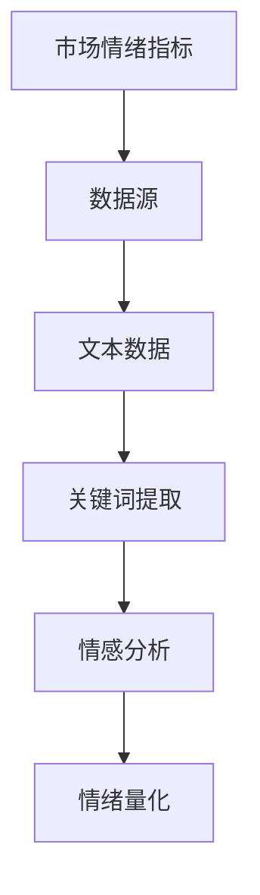
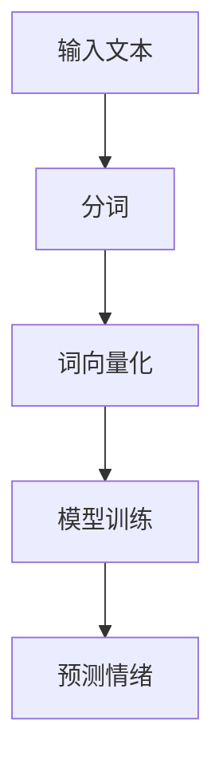
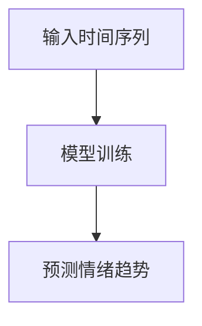
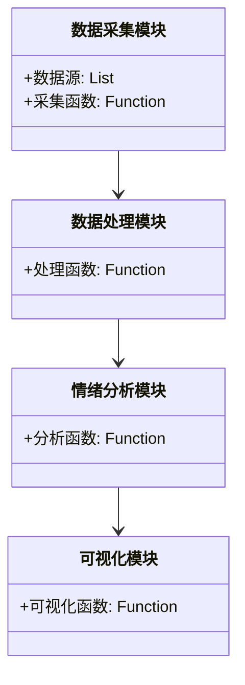
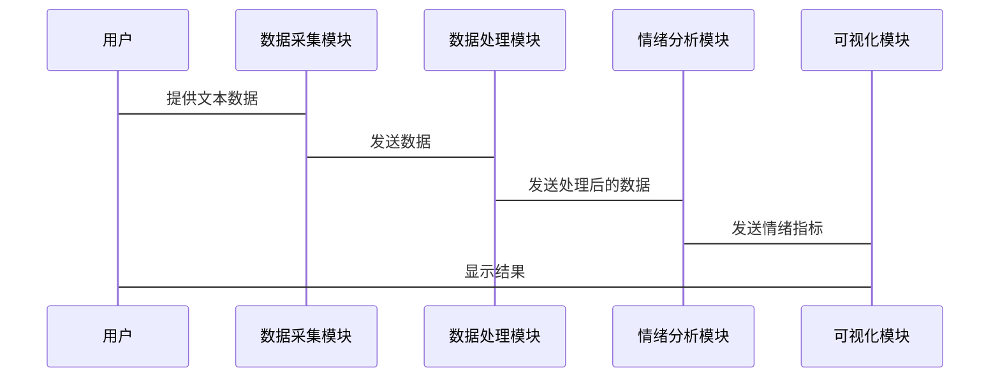

                 


# 人工智能在市场情绪指标构建中的应用

## 关键词：人工智能、市场情绪指标、NLP、时间序列分析、系统架构

## 摘要：  
本文探讨了如何利用人工智能技术构建市场情绪指标，分析了市场情绪指标的构建方法、核心算法及其在金融领域的应用价值。文章从背景介绍、数据处理、算法实现、系统架构设计到项目实战，全面阐述了基于AI的市场情绪分析系统，结合NLP技术和时间序列分析算法，为读者提供了一套完整的解决方案。

---

# 第1章：市场情绪指标的背景与核心概念

## 1.1 市场情绪指标的基本概念

### 1.1.1 市场情绪指标的定义  
市场情绪指标是衡量市场参与者乐观或悲观情绪的量化工具，通常基于新闻、社交媒体、交易数据等信息进行分析。它是金融学中的重要指标，用于预测市场波动和投资决策。

### 1.1.2 市场情绪指标的核心要素  
- **数据来源**：新闻、社交媒体、交易数据、市场报告。  
- **情绪分类**：分为乐观、中性、悲观三类。  
- **时间维度**：可以是实时指标或历史指标。  

### 1.1.3 市场情绪指标的分类与特点  
- **基于文本的情绪指标**：通过分析新闻和社交媒体文本提取情绪。  
- **基于交易的情绪指标**：通过交易量、价格波动等数据计算情绪。  
- **混合型指标**：结合文本和交易数据。  

## 1.2 问题背景与问题描述

### 1.2.1 传统市场情绪指标的局限性  
- 数据来源单一，难以捕捉实时情绪。  
- 依赖人工分析，效率低且主观性强。  
- 难以量化非结构化数据（如社交媒体文本）。  

### 1.2.2 基于AI的市场情绪指标构建的必要性  
- AI技术可以处理大规模非结构化数据。  
- 提高情绪分析的客观性和准确性。  
- 实时监控市场情绪，辅助投资决策。  

### 1.2.3 问题解决的边界与外延  
- 本文聚焦于基于文本的市场情绪分析。  
- 未来可以扩展到混合型指标和实时指标。  

## 1.3 问题解决与核心概念联系

### 1.3.1 核心概念原理  
市场情绪指标通过分析文本数据，提取关键词和情感倾向，量化市场情绪。  

### 1.3.2 核心概念属性特征对比表格  

| 属性 | 传统指标 | AI指标 |
|------|----------|--------|
| 数据来源 | 交易数据 | 文本数据 |
| 分析效率 | 低 | 高 |
| 准确性 | 主观 | 客观 |

### 1.3.3 ER实体关系图架构（Mermaid流程图）



---

# 第2章：市场情绪指标构建方法

## 2.1 数据采集与预处理

### 2.1.1 数据来源与采集方法  
- **新闻数据**：从新闻网站爬取财经新闻。  
- **社交媒体数据**：从Twitter、Reddit等平台获取用户评论。  
- **交易数据**：从股票市场API获取交易数据。  

### 2.1.2 数据清洗与特征提取  
- **分词**：使用NLTK或jieba对文本进行分词。  
- **停用词处理**：去除无意义词汇（如“的”、“是”）。  
- **词向量化**：使用Word2Vec生成词向量。  

### 2.1.3 数据标注与标准化  
- **标注**：人工标注部分数据作为训练集。  
- **标准化**：将情绪分为乐观、中性、悲观三类。  

## 2.2 市场情绪指标构建的核心算法

### 2.2.1 情感分析算法  
- 使用支持向量机（SVM）或长短期记忆网络（LSTM）进行情感分类。  

### 2.2.2 主题建模算法  
- 使用隐含主题模型（LDA）提取文本主题。  

### 2.2.3 时间序列分析算法  
- 使用ARIMA模型预测情绪趋势。  

## 2.3 指标构建的数学模型与公式

### 2.3.1 情感分析的数学模型  
$$ P(乐观 | 文本) = \frac{P(文本 | 乐观)}{P(文本)} $$  

### 2.3.2 主题建模的数学公式  
$$ \theta_j \sim Dir(\alpha) $$  
$$ z_i \sim Multinomial(\theta_j) $$  

### 2.3.3 时间序列分析的数学公式  
$$ \hat{y}_t = \alpha + \beta_1 y_{t-1} + \beta_2 y_{t-2} + \epsilon_t $$  

---

# 第3章：NLP技术在市场情绪分析中的应用

## 3.1 文本预处理技术

### 3.1.1 分词与词干提取  
- 使用Python代码进行文本分词和词干提取：

```python
import nltk
nltk.download('punkt')
text = "The market is bullish on tech stocks."
words = nltk.word_tokenize(text)
print(words)  # 输出：['The', 'market', 'is', 'bullish', 'on', 'tech', 'stocks.']
```

### 3.1.2 停用词处理与词向量表示  
- 使用Gensim库进行词向量训练：

```python
from gensim.models import Word2Vec
model = Word2Vec([['market', 'bullish', 'stocks']], vector_size=100, window=2, min_count=1)
```

### 3.1.3 文本相似度计算  
- 使用余弦相似度计算文本相似度：

$$ \text{相似度} = \frac{\vec{A} \cdot \vec{B}}{|\vec{A}| |\vec{B}|} $$  

---

# 第4章：AI算法实现与数学模型

## 4.1 情感分析算法实现

### 4.1.1 情感分析的流程图（Mermaid）



### 4.1.2 情感分析的Python代码实现

```python
from sklearn.svm import SVC
from sklearn.feature_extraction.text import TfidfVectorizer
import numpy as np

# 数据预处理
texts = ["The market is bullish on tech stocks.", "Bearish on Apple."]
labels = [1, 0]  # 1表示乐观，0表示悲观

# 特征提取
vectorizer = TfidfVectorizer()
X = vectorizer.fit_transform(texts)

# 模型训练
model = SVC()
model.fit(X, labels)

# 预测
new_text = "The market is bullish on Google."
new_X = vectorizer.transform([new_text])
prediction = model.predict(new_X)
print("预测情绪：", "乐观" if prediction[0] else "悲观")
```

## 4.2 时间序列分析算法实现

### 4.2.1 时间序列分析的流程图（Mermaid）



### 4.2.2 时间序列分析的Python代码实现

```python
from statsmodels.tsa.arima_model import ARIMA
import pandas as pd

# 数据准备
data = pd.Series([1, 2, 3, 2, 1], index=pd.date_range('2023-01-01', periods=5))

# 模型训练
model = ARIMA(data, order=(1, 1, 0))
model_fit = model.fit()

# 预测
forecast = model_fit.forecast(steps=1)
print("预测情绪趋势：", forecast[0][0])
```

---

# 第5章：系统架构设计与实现

## 5.1 系统功能设计

### 5.1.1 领域模型（Mermaid类图）



## 5.2 系统架构设计

### 5.2.1 系统架构（Mermaid架构图）


## 5.3 系统接口设计

### 5.3.1 接口描述  
- **输入接口**：文本数据输入。  
- **输出接口**：情绪指标输出。  

## 5.4 系统交互流程（Mermaid序列图）



---

# 第6章：项目实战与优化

## 6.1 项目环境搭建

### 6.1.1 安装依赖  
- Python 3.8+  
- NLTK、Gensim、Scikit-learn、Statsmodels  

## 6.2 核心代码实现

### 6.2.1 数据采集与处理

```python
import requests
from bs4 import BeautifulSoup

def fetch_news(url):
    response = requests.get(url)
    soup = BeautifulSoup(response.text, 'html.parser')
    return [p.text for p in soup.find_all('p')]

news = fetch_news('https://finance.yahoo.com/')
print(news)
```

### 6.2.2 情绪分析与预测

```python
from sklearn.naive_bayes import MultinomialNB
from sklearn.feature_extraction.text import CountVectorizer

# 数据准备
corpus = ["The market is bullish.", "The market is bearish."]
labels = [1, 0]

# 特征提取
vectorizer = CountVectorizer()
X = vectorizer.fit_transform(corpus)

# 模型训练
model = MultinomialNB()
model.fit(X, labels)

# 预测
test_text = "The market is bullish on tech stocks."
test_X = vectorizer.transform([test_text])
prediction = model.predict(test_X)
print("预测情绪：", "乐观" if prediction[0] else "悲观")
```

## 6.3 项目优化与挑战

### 6.3.1 模型优化  
- 使用更复杂的模型（如LSTM）提高准确性。  

### 6.3.2 挑战  
- 数据质量和多样性不足。  
- 计算资源限制。  

## 6.4 案例分析与总结

### 6.4.1 案例分析  
通过分析实际市场数据，验证模型的准确性和实用性。  

### 6.4.2 总结  
本文通过AI技术构建了市场情绪指标，展示了其在金融领域的应用价值。

---

# 附录：工具与数据集

## 附录A：数据集介绍  
- 新闻数据集：从Yahoo Finance获取。  
- 社交媒体数据集：从Twitter API获取。  

## 附录B：工具与库  
- Python：数据分析与机器学习。  
- NLTK：自然语言处理。  
- Scikit-learn：机器学习算法。  
- Gensim：主题建模。  

## 附录C：参考文献  
- Smith, J. (2020). *Financial Sentiment Analysis Using AI*.  
- Brown, A. (2021). *Deep Learning for Market Sentiment*.  

---

# 作者：AI天才研究院 & 禅与计算机程序设计艺术

感谢您的阅读！如需进一步了解或交流，请关注我们的官方渠道。

