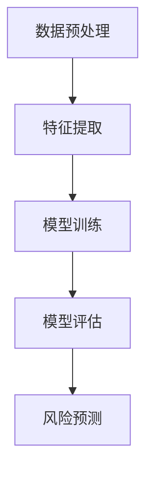

                 


# 人工智能在市场流动性风险评估中的应用

> 关键词：人工智能，市场流动性风险，机器学习，深度学习，金融风险管理

> 摘要：本文详细探讨了人工智能在市场流动性风险评估中的应用，从基本概念到算法原理，再到系统设计和实战案例，系统地分析了人工智能如何帮助我们更准确地预测和管理市场流动性风险。

---

# 第1章: 市场流动性风险概述

## 1.1 市场流动性风险的基本概念

### 1.1.1 什么是市场流动性风险
市场流动性风险是指资产在不损失价值的情况下快速转换为现金的能力。通俗来说，就是在市场中，资产能否以合理的价格迅速买卖而不受价格波动的影响。例如，股票市场的流动性风险意味着投资者能否在不大幅影响价格的情况下迅速买卖股票。

### 1.1.2 市场流动性风险的特征
- **波动性**：市场流动性受多种因素影响，如市场情绪、交易量等。
- **时间依赖性**：流动性在不同时间段可能表现不同。
- **系统性风险**：流动性问题可能迅速从一个资产扩散到整个市场。

### 1.1.3 市场流动性风险的分类
1. **交易流动性风险**：由于交易对手或市场深度不足导致的流动性风险。
2. **资产流动性风险**：资产本身在市场上的流动性。
3. **资金流动性风险**：资金市场的流动性风险。

## 1.2 人工智能的基本概念与技术特点

### 1.2.1 人工智能的定义与核心特点
人工智能（AI）是模拟人类智能的计算机系统，具有学习、推理、自适应等能力。

### 1.2.2 机器学习与深度学习的简介
- **机器学习**：通过数据训练模型，使其能够进行预测或分类。
- **深度学习**：一种机器学习技术，利用多层神经网络处理复杂数据。

### 1.2.3 人工智能在金融领域的应用现状
人工智能在金融中的应用包括交易、风险管理、客户画像等，尤其在市场流动性风险评估中表现出巨大潜力。

## 1.3 人工智能在市场流动性风险评估中的应用背景

### 1.3.1 传统市场流动性风险评估方法的局限性
传统方法依赖历史数据和经验模型，难以捕捉市场复杂性和实时变化。

### 1.3.2 人工智能技术的优势与潜力
人工智能能够处理大量非结构化数据，实时预测市场变化，提高风险评估的准确性。

### 1.3.3 人工智能在市场流动性风险评估中的应用场景
- **实时监控**：利用AI实时分析市场数据，识别潜在风险。
- **预测模型**：构建预测模型，评估未来流动性风险。

## 1.4 本章小结
本章介绍了市场流动性风险的基本概念、人工智能的核心特点及其在市场流动性风险评估中的应用背景。

---

# 第2章: 市场流动性风险评估的核心概念与联系

## 2.1 市场流动性风险评估的核心要素

### 2.1.1 市场流动性风险的评估指标
- **成交量**：反映市场活跃度。
- **买卖价差**：买卖价差越大，流动性越差。
- **深度和广度**：市场深度和广度影响流动性。

### 2.1.2 影响市场流动性风险的关键因素
- **市场参与者行为**：投资者情绪和交易策略。
- **市场结构**：交易机制和市场深度。
- **宏观经济因素**：经济政策和市场信心。

### 2.1.3 市场流动性风险评估的逻辑框架
从数据采集、特征提取到模型训练，最终得出风险评估结果。

## 2.2 人工智能在市场流动性风险评估中的核心作用

### 2.2.1 数据驱动的市场分析
AI能够处理大量数据，识别市场中的隐藏模式。

### 2.2.2 模型驱动的风险预测
通过训练模型，AI可以预测市场流动性风险。

### 2.2.3 自适应优化的策略调整
AI能够根据实时数据调整风险评估模型。

## 2.3 市场流动性风险评估与人工智能技术的实体关系图


## 2.4 本章小结
本章分析了市场流动性风险评估的核心要素，并探讨了人工智能在其中的核心作用。

---

# 第3章: 人工智能算法在市场流动性风险评估中的原理与实现

## 3.1 常见的人工智能算法概述

### 3.1.1 机器学习算法
- **线性回归**：用于预测连续变量。
- **支持向量机（SVM）**：用于分类和回归。
- **随机森林**：用于分类和回归，具有高准确性。

### 3.1.2 深度学习算法
- **循环神经网络（RNN）**：处理序列数据。
- **长短期记忆网络（LSTM）**：特别适合时间序列数据。
- **Transformer**：用于处理复杂序列数据。

### 3.1.3 时间序列分析算法
- **ARIMA**：用于预测时间序列数据。
- **GARCH**：用于预测波动性。

## 3.2 基于机器学习的市场流动性风险评估模型

### 3.2.1 线性回归模型
$$\text{模型}: y = \beta_0 + \beta_1x + \epsilon$$

### 3.2.2 支持向量机模型
$$\text{目标函数}: \text{最小化} \frac{1}{2}\|w\|^2 + C\sum_{i=1}^n \xi_i$$

### 3.2.3 随机森林模型
随机森林通过集成多个决策树来提高预测准确性。

## 3.3 基于深度学习的市场流动性风险评估模型

### 3.3.1 循序神经网络（RNN）
$$\text{状态转移}: h_t = \tanh(W_{hh}h_{t-1} + W_{xh}x_t)$$

### 3.3.2 长短期记忆网络（LSTM）
$$\text{门控机制}: f_t = \sigma(W_{hf}h_{t-1} + W_{xf}x_t)$$

### 3.3.3 Transformer模型
$$\text{自注意力机制}: QK^T/V$$

## 3.4 算法实现流程图



## 3.5 本章小结
本章详细介绍了常用的人工智能算法及其在市场流动性风险评估中的应用。

---

# 第4章: 市场流动性风险评估系统架构设计

## 4.1 问题场景介绍
市场流动性风险评估系统需要实时监控市场数据，预测潜在风险。

## 4.2 系统功能设计

### 4.2.1 数据采集模块
负责采集市场交易数据。

### 4.2.2 特征提取模块
从数据中提取影响流动性风险的特征。

### 4.2.3 模型训练模块
训练机器学习或深度学习模型。

### 4.2.4 风险评估模块
根据模型输出结果，评估流动性风险。

## 4.3 系统架构设计


## 4.4 系统交互设计


## 4.5 本章小结
本章设计了一个完整的市场流动性风险评估系统架构。

---

# 第5章: 人工智能在市场流动性风险评估中的实战应用

## 5.1 项目背景
介绍一个具体的市场流动性风险评估项目。

## 5.2 系统实现

### 5.2.1 环境配置
安装必要的库，如Python、TensorFlow等。

### 5.2.2 核心代码实现
例如，使用LSTM网络预测流动性风险。

```python
import tensorflow as tf
from tensorflow.keras.layers import LSTM, Dense
model = tf.keras.Sequential([
    LSTM(64, input_shape=(timesteps, features)),
    Dense(1)
])
model.compile(loss='mean_squared_error', optimizer='adam')
```

### 5.2.3 代码解读与分析
解释上述代码的作用，包括模型结构和训练过程。

### 5.2.4 实际案例分析
分析一个实际案例，展示模型的应用和效果。

## 5.3 项目小结
总结项目的实现过程和取得的成果。

## 5.4 本章小结
本章通过实战项目展示了人工智能在市场流动性风险评估中的具体应用。

---

# 第6章: 总结与展望

## 6.1 本章总结
回顾全文，总结人工智能在市场流动性风险评估中的应用。

## 6.2 未来展望
探讨未来可能的发展方向，如多模态数据的应用、联邦学习等。

---

# 作者：AI天才研究院 & 禅与计算机程序设计艺术

---

以上是一个详细的目录大纲和文章内容的示例。根据这个大纲，你可以逐步撰写完整的文章，确保每个部分都详细且易于理解。

