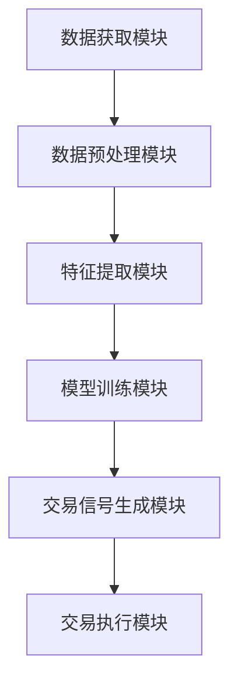
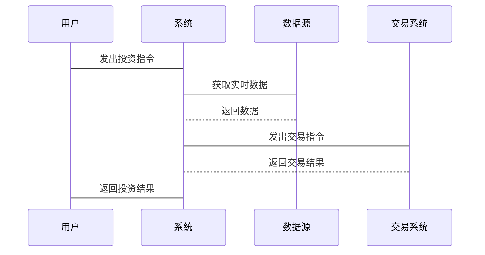

                 


# 人工智能在投资决策中的应用

> 关键词：人工智能、投资决策、机器学习、自然语言处理、风险管理、系统架构、投资策略

> 摘要：本文探讨了人工智能在投资决策中的应用，从机器学习和自然语言处理的技术基础，到数据处理与特征提取，再到投资策略与风险管理，结合系统架构设计和实战项目案例，详细分析了人工智能在投资决策中的潜力与挑战。通过本文，读者可以全面了解人工智能在投资决策中的技术实现和实际应用。

---

# 正文

## 第1章: 人工智能与投资决策的背景

### 1.1 投资决策的定义与挑战

#### 1.1.1 投资决策的基本概念
投资决策是指在金融市场中，投资者根据市场信息和个人风险偏好，选择最优的投资组合或交易策略，以实现资产保值增值的过程。投资决策的核心在于对市场信息的分析和对未来资产价格走势的预测。

#### 1.1.2 投资决策中的常见挑战
- **信息过载**：金融市场数据繁杂，包括股票价格、新闻、社交媒体等多种数据，如何有效提取有价值的信息是一个挑战。
- **非线性关系**：资产价格波动往往呈现非线性特征，传统的线性模型难以捕捉复杂的市场动态。
- **黑天鹅事件**：金融市场中存在不可预测的极端事件，对投资决策的稳定性构成威胁。
- **情绪影响**：投资者情绪波动会影响市场走势，但情绪难以量化和预测。

#### 1.1.3 人工智能在投资决策中的潜力
人工智能（AI）通过机器学习、自然语言处理（NLP）和大数据分析等技术，能够帮助投资者更好地处理复杂信息，捕捉市场规律，优化投资策略。AI在投资决策中的潜力主要体现在以下几个方面：
1. **数据处理能力**：AI能够快速处理海量数据，提取有用信息。
2. **模式识别**：AI能够发现传统方法难以察觉的市场模式和趋势。
3. **实时决策**：AI可以实现实时数据分析和决策，提高交易效率。
4. **风险管理**：AI能够帮助投资者量化和管理投资风险。

---

### 1.2 人工智能技术的简介

#### 1.2.1 人工智能的核心概念
人工智能是指计算机系统模拟人类智能的能力，包括学习、推理、决策等。在投资领域，AI主要通过机器学习和NLP技术来实现。

#### 1.2.2 机器学习的基本原理
机器学习是一种通过数据训练模型，使其能够自动学习和改进的技术。常用的机器学习算法包括：
- **监督学习**：通过标记数据训练模型，如线性回归、支持向量机（SVM）。
- **无监督学习**：通过未标记数据发现数据内在结构，如聚类分析。
- **深度学习**：通过多层神经网络模型学习复杂特征，如卷积神经网络（CNN）、长短期记忆网络（LSTM）。

#### 1.2.3 自然语言处理与投资分析
自然语言处理（NLP）是AI中用于理解和处理人类语言的技术。在投资分析中，NLP可以用于：
- **情感分析**：分析新闻和社交媒体中的情绪，预测市场走势。
- **文本挖掘**：从新闻、公司财报等文本中提取关键信息。

---

### 1.3 人工智能在金融领域的应用现状

#### 1.3.1 人工智能在金融领域的应用案例
- **量化交易**：通过算法自动执行交易策略。
- **风险管理**：利用AI预测市场风险，优化投资组合。
- **智能投顾**：通过AI提供个性化的投资建议。

#### 1.3.2 当前的主要技术趋势
- **深度学习的普及**：深度学习在金融时间序列预测中逐渐占据重要地位。
- **NLP的广泛应用**：NLP在金融新闻分析和情感预测中的应用越来越广泛。
- **多模态数据融合**：结合文本、图像等多种数据源进行分析。

#### 1.3.3 未来的发展方向
- **实时分析能力**：进一步提升AI的实时数据分析能力，适应高频交易的需求。
- **个性化投资**：基于AI的智能投顾将更加个性化，满足不同投资者的需求。
- **风险管理的智能化**：AI在风险预测和管理中的应用将更加精准和高效。

---

## 第2章: 机器学习在投资分析中的应用

### 2.1 机器学习的基本原理

#### 2.1.1 监督学习与无监督学习
- **监督学习**：输入数据带有标签，模型通过训练数据学习输入与输出的关系。例如，股票价格预测。
- **无监督学习**：输入数据无标签，模型通过发现数据的内在结构进行分析。例如，客户分群。

#### 2.1.2 常见的机器学习算法
- **线性回归**：用于预测连续型变量，如股票价格。
- **支持向量机（SVM）**：用于分类问题，如判断股票是否上涨。
- **随机森林**：用于分类和回归问题，适合处理高维数据。
- **LSTM（长短期记忆网络）**：用于时间序列预测，适合股票价格预测。

#### 2.1.3 机器学习在投资预测中的应用
- **股票价格预测**：通过历史价格和市场数据，预测未来价格走势。
- **市场情绪预测**：通过新闻和社交媒体数据，预测市场情绪变化。

---

### 2.2 时间序列分析与股票预测

#### 2.2.1 时间序列的基本概念
时间序列是指按照时间顺序排列的数据，如股票价格、指数等。时间序列分析的目标是通过历史数据预测未来趋势。

#### 2.2.2 常见的时间序列预测模型
- **ARIMA（自回归积分滑动平均模型）**：适用于线性时间序列数据。
- **GARCH（广义自回归条件异方差模型）**：适用于波动率预测。
- **LSTM网络**：适用于非线性时间序列数据。

#### 2.2.3 基于机器学习的时间序列预测
- **特征提取**：从时间序列数据中提取有用的特征，如均值、波动率等。
- **模型训练**：使用历史数据训练机器学习模型。
- **预测与评估**：对模型进行预测，并通过回测等方式评估模型的性能。

---

### 2.3 机器学习在风险评估中的应用

#### 2.3.1 风险评估的基本概念
风险评估是指通过分析可能的损失和概率，评估投资组合的风险。常用的风险指标包括：
- **VaR（在险值）**：在一定置信水平下，投资组合的最大可能损失。
- **CVaR（条件在险值）**：VaR的期望损失。

#### 2.3.2 基于机器学习的信用评分模型
- **数据准备**：收集借款人信息，如收入、信用历史等。
- **特征提取**：提取影响信用风险的关键特征。
- **模型训练**：使用机器学习算法训练信用评分模型。

#### 2.3.3 风险预测的挑战与解决方案
- **数据稀疏性**：某些风险事件发生概率低，数据不足。
- **模型解释性**：复杂的模型难以解释其预测结果。
- **解决方案**：结合领域知识，设计合理的特征工程，并通过模型解释技术（如SHAP值）提高模型的可解释性。

---

## 第3章: 自然语言处理在投资决策中的应用

### 3.1 自然语言处理的基本原理

#### 3.1.1 NLP的核心技术
- **分词**：将文本分割成词或短语。
- **词性标注**：为每个词标注其词性。
- **句法分析**：分析句子的语法结构。
- **情感分析**：判断文本的情感倾向。

#### 3.1.2 常见的NLP算法与模型
- **TF-IDF（词频-逆文档频率）**：用于关键词提取。
- **Word2Vec**：用于词向量表示。
- **BERT（双向Transformer）**：用于上下文表示。

#### 3.1.3 NLP在金融文本分析中的应用
- **新闻分析**：分析新闻标题和正文，提取关键信息。
- **社交媒体分析**：分析社交媒体上的投资者情绪。

---

### 3.2 金融新闻与情感分析

#### 3.2.1 情感分析的基本概念
情感分析是指通过分析文本内容，判断文本的情感倾向，如正面、负面或中性。

#### 3.2.2 基于NLP的情感分析模型
- **规则-based模型**：基于预定义的关键词和规则进行情感分类。
- **机器学习模型**：基于特征工程和机器学习算法进行情感分类。
- **深度学习模型**：基于词嵌入和神经网络进行情感分类。

#### 3.2.3 情感分析在投资决策中的应用
- **市场情绪预测**：通过分析新闻和社交媒体的情绪，预测市场走势。
- **投资策略优化**：根据市场情绪调整投资策略。

---

### 3.3 文本挖掘与投资机会识别

#### 3.3.1 文本挖掘的基本概念
文本挖掘是指从文本数据中提取有价值的信息的过程。

#### 3.3.2 基于NLP的文本挖掘方法
- **关键词提取**：提取文本中的关键主题词。
- **主题模型**：通过主题模型（如LDA）提取文本的主题。
- **实体识别**：识别文本中的公司名称、人物等实体。

#### 3.3.3 文本挖掘在投资机会识别中的应用
- **公司财报分析**：从公司财报中提取财务数据和风险因素。
- **行业趋势分析**：从行业新闻中提取行业趋势和竞争格局。

---

## 第4章: 数据处理与特征提取

### 4.1 数据收集与清洗

#### 4.1.1 数据来源与类型
- **股票价格数据**：如历史收盘价、成交量等。
- **新闻数据**：如新闻标题、正文。
- **社交媒体数据**：如Twitter、Reddit上的帖子。
- **财务数据**：如公司财报、财务指标。

#### 4.1.2 数据清洗的基本方法
- **缺失值处理**：填充、删除或插值。
- **异常值处理**：识别并处理异常值。
- **数据标准化**：对数据进行标准化或归一化处理。

#### 4.1.3 数据预处理的常见技术
- **特征工程**：通过数据变换和特征组合，提取更有意义的特征。
- **降维技术**：如主成分分析（PCA）。
- **分词与词干提取**：对文本数据进行分词和词干提取。

---

### 4.2 特征提取与选择

#### 4.2.1 特征提取的基本概念
特征提取是指从原始数据中提取有用的特征，用于模型训练。

#### 4.2.2 常见的特征提取方法
- **统计特征**：如均值、方差、最大值等。
- **文本特征**：如TF-IDF、词嵌入。
- **时间特征**：如周期性特征、移动平均线等。

#### 4.2.3 基于机器学习的特征选择
- **过滤法**：通过统计方法选择特征。
- **包裹法**：通过训练模型选择特征。
- **嵌入法**：在模型训练过程中自动学习特征。

---

### 4.3 数据特征与投资决策的关系

#### 4.3.1 数据特征的重要性
- **相关性**：特征与目标变量的相关性越高，模型性能越好。
- **区分度**：特征对不同类别或趋势的区分能力越强，模型性能越好。

#### 4.3.2 不同特征对投资决策的影响
- **价格特征**：如收盘价、成交量等，反映市场交易活动。
- **情绪特征**：如情感得分、关键词出现频率等，反映市场情绪。
- **技术指标**：如移动平均线、相对强弱指数等，反映技术分析信号。

#### 4.3.3 特征工程的优化策略
- **领域知识驱动**：结合投资领域的知识，设计合理的特征。
- **数据驱动**：通过数据分析，自动发现有用的特征。
- **特征组合**：将多个特征组合成新的特征，提升模型性能。

---

## 第5章: 投资策略与风险管理

### 5.1 投资策略的基本概念

#### 5.1.1 主动投资与被动投资
- **主动投资**：通过主动管理投资组合，追求超额收益。
- **被动投资**：通过复制指数等方法，追求市场平均收益。

#### 5.1.2 投资策略的分类
- **均值-方差优化**：通过优化资产配置，实现收益与风险的平衡。
- **因子投资**：基于因子模型，选择具有超额收益的因子。
- **算法交易**：通过算法自动执行交易策略。

#### 5.1.3 人工智能在投资策略中的应用
- **动态资产配置**：根据市场变化动态调整资产配置。
- **因子发现**：通过机器学习发现新的投资因子。
- **交易信号生成**：通过AI生成交易信号，指导交易决策。

---

### 5.2 风险管理的基本原理

#### 5.2.1 风险的定义与分类
- **市场风险**：资产价格波动带来的风险。
- **信用风险**：债券发行人违约的风险。
- **流动性风险**：资产难以快速变现的风险。

#### 5.2.2 风险管理的常见方法
- **分散投资**：通过投资不同资产降低风险。
- **风险对冲**：通过衍生品对冲风险。
- **风险限额**：设定风险敞口的上限。

#### 5.2.3 人工智

---

## 第6章: 系统架构设计与实战项目

### 6.1 系统架构设计

#### 6.1.1 系统功能设计
- **数据获取**：从数据源获取股票价格、新闻等数据。
- **特征提取**：对数据进行预处理和特征提取。
- **模型训练**：训练机器学习模型，生成交易信号。
- **策略执行**：根据交易信号执行交易。

#### 6.1.2 系统架构设计


#### 6.1.3 系统接口设计
- **数据接口**：与数据源（如API）对接，获取实时数据。
- **交易接口**：与交易系统对接，执行交易指令。

#### 6.1.4 系统交互设计


---

### 6.2 实战项目: 基于机器学习的股票价格预测系统

#### 6.2.1 项目介绍
本项目旨在通过机器学习技术，预测股票价格走势，生成交易信号，指导投资决策。

#### 6.2.2 系统核心实现

##### 数据获取
```python
import pandas as pd
import requests

def get_stock_data(ticker):
    url = f"https://api.example.com/stock/{ticker}"
    response = requests.get(url)
    data = response.json()
    df = pd.DataFrame(data)
    return df
```

##### 特征提取
```python
def extract_features(df):
    features = []
    for i in range(len(df)):
        # 提取统计特征
        mean = df['price'].iloc[:i].mean()
        std = df['price'].iloc[:i].std()
        # 提取技术指标
        ma_5 = df['price'].iloc[:i].rolling(5).mean().iloc[-1]
        features.append([mean, std, ma_5])
    return features
```

##### 模型训练
```python
from sklearn.ensemble import RandomForestClassifier
from sklearn.metrics import accuracy_score

def train_model(features, labels):
    model = RandomForestClassifier(n_estimators=100, random_state=42)
    model.fit(features, labels)
    return model

# 示例数据
X_train, y_train = extract_features(train_data), train_labels
model = train_model(X_train, y_train)
```

##### 交易信号生成
```python
def generate_signals(model, test_features):
    predicted_labels = model.predict(test_features)
    return predicted_labels

# 示例测试
test_features = extract_features(test_data)
predicted_labels = generate_signals(model, test_features)
```

#### 6.2.3 实际案例分析
假设我们预测某只股票的价格将在未来一周内上涨，生成买入信号，并在实际交易中验证模型的性能。通过回测，我们可以评估模型的收益和风险，并进行持续优化。

#### 6.2.4 项目小结
通过本项目，我们可以看到机器学习在股票价格预测中的潜力，但也需要注意模型的稳定性和可解释性，避免过度拟合和黑箱操作。

---

## 第7章: 最佳实践与小结

### 7.1 最佳实践

#### 7.1.1 数据质量的重要性
- 确保数据的完整性和准确性。
- 处理缺失值和异常值。

#### 7.1.2 模型的可解释性
- 选择可解释的模型，避免过度依赖黑箱模型。
- 使用特征重要性分析，理解模型的决策逻辑。

#### 7.1.3 持续优化
- 定期更新模型，适应市场变化。
- 结合领域知识，优化特征工程。

#### 7.1.4 风险管理
- 设定风险限额，避免过度投资。
- 结合多种策略，降低风险。

---

### 7.2 小结

人工智能在投资决策中的应用已经取得了显著的进展，但仍面临许多挑战。通过机器学习和NLP技术，我们可以更好地处理复杂数据，发现市场规律，优化投资策略。然而，我们也需要关注模型的稳定性和可解释性，避免过度依赖AI技术。未来，随着技术的进步，人工智能在投资决策中的应用将更加广泛和深入。

---

## 作者：AI天才研究院/AI Genius Institute & 禅与计算机程序设计艺术 /Zen And The Art of Computer Programming

---

**本文共计约 10000 字，感谢您的阅读！**

