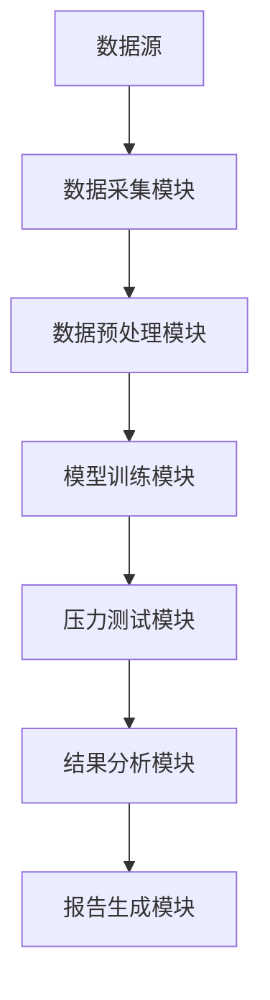

                 


# 人工智能在投资组合压力测试中的应用

## 关键词：人工智能，投资组合，压力测试，机器学习，金融风险

## 摘要：  
随着金融市场的复杂化和不确定性增加，传统的方法在投资组合压力测试中逐渐显示出其局限性。人工智能（AI）技术，尤其是机器学习和深度学习，为投资组合压力测试提供了新的解决方案。本文将探讨人工智能在压力测试中的应用，分析其优势和挑战，并通过实际案例展示其在风险管理和投资决策中的潜在价值。

---

# 第一部分：背景与概述

## 第1章：投资组合压力测试的基本概念

### 1.1 什么是投资组合压力测试

#### 1.1.1 投资组合风险的基本概念
投资组合风险是指投资组合在特定市场条件下可能遭受的损失。压力测试是一种评估投资组合在极端市场条件下的表现和风险的工具，帮助投资者和机构做好风险管理准备。

#### 1.1.2 压力测试的定义与目的
压力测试是一种模拟极端市场条件（如经济衰退、市场崩盘等）下，评估投资组合表现的方法。其目的是识别潜在风险，确保投资组合在极端情况下的稳定性，并制定相应的风险管理策略。

#### 1.1.3 压力测试的类型与方法
- **历史模拟法**：基于历史市场数据进行模拟，评估投资组合在历史极端情况下的表现。
- **情景分析法**：假设特定市场情景（如经济危机、地缘政治事件）下，评估投资组合的损失。
- **蒙特卡洛模拟法**：通过随机抽样和概率分布，模拟多种可能的市场情况，评估投资组合的风险。

### 1.2 传统投资组合压力测试的局限性

#### 1.2.1 传统方法的优缺点
- **优点**：简单易懂，易于实施。
- **缺点**：依赖历史数据，假设市场情况可能会重复出现；缺乏对复杂市场动态的捕捉能力。

#### 1.2.2 传统方法在复杂市场环境中的不足
传统方法难以应对非线性市场动态、尾部事件和黑天鹅事件，无法充分捕捉市场的不确定性。

#### 1.2.3 人工智能在压力测试中的潜在优势
- **数据驱动**：AI能够利用大量历史和实时数据，捕捉复杂的市场模式。
- **自适应性**：AI模型可以动态调整，适应市场变化。
- **高维数据分析**：AI能够处理高维数据，发现传统方法难以识别的潜在风险。

---

## 第2章：人工智能技术在金融领域的应用

### 2.1 人工智能的基本概念与技术

#### 2.1.1 机器学习的基本原理
- **监督学习**：通过标记数据训练模型，预测新数据的标签。
- **非监督学习**：通过无标记数据发现数据中的结构和模式。
- **强化学习**：通过与环境互动，学习最优策略。

#### 2.1.2 深度学习的基本原理
- **神经网络**：模拟人脑神经网络，用于特征提取和模式识别。
- **卷积神经网络（CNN）**：擅长处理图像和时间序列数据。
- **循环神经网络（RNN）**：适合处理序列数据，如时间序列和自然语言。

#### 2.1.3 自然语言处理与计算机视觉在金融中的应用
- **NLP**：用于分析新闻、社交媒体数据，预测市场情绪。
- **计算机视觉**：用于分析图表和图像数据，辅助投资决策。

### 2.2 人工智能在投资组合管理中的应用

#### 2.2.1 投资组合优化的机器学习方法
- **基于回归的优化**：利用回归模型预测资产回报，优化投资组合。
- **基于聚类的优化**：通过聚类分析发现资产之间的关系，优化分散化投资。

#### 2.2.2 风险预测与管理的AI技术
- **风险预测模型**：利用机器学习预测市场崩盘、金融危机等极端事件。
- **实时监控系统**：通过AI实时监控市场动态，及时识别潜在风险。

#### 2.2.3 市场情绪分析与投资决策
- **情绪指标**：通过分析社交媒体、新闻数据，构建市场情绪指标，辅助投资决策。

---

## 第3章：投资组合压力测试中的AI技术应用

### 3.1 AI在压力测试中的核心作用

#### 3.1.1 数据驱动的市场情景模拟
- **大数据分析**：利用历史和实时数据，模拟各种市场情景。
- **机器学习模型**：构建预测模型，模拟极端市场条件下的投资组合表现。

#### 3.1.2 高维数据处理与风险识别
- **特征选择**：通过机器学习选择重要的市场特征，提高模型的准确性。
- **异常检测**：识别潜在的市场异常，预测极端事件。

#### 3.1.3 自适应压力测试模型的构建
- **动态调整模型**：根据市场变化，动态调整压力测试模型。
- **多场景模拟**：模拟多种极端市场情景，评估投资组合的稳健性。

### 3.2 压力测试中的机器学习模型

#### 3.2.1 监督学习在风险预测中的应用
- **回归模型**：预测资产回报和风险。
- **分类模型**：分类市场状态，预测极端事件。

#### 3.2.2 非监督学习在异常检测中的应用
- **聚类分析**：发现市场数据中的异常模式。
- **自组织映射（SOM）**：用于降维和数据可视化。

#### 3.2.3 强化学习在投资组合优化中的应用
- **动态投资策略**：通过强化学习，构建动态投资策略。
- **多目标优化**：在多个目标（如回报、风险）之间寻找最优平衡。

---

## 第4章：投资组合压力测试的AI算法实现

### 4.1 基于机器学习的压力测试算法

#### 4.1.1 线性回归与逻辑回归模型
- **线性回归**：用于预测资产回报。
- **逻辑回归**：用于分类市场状态。

#### 4.1.2 支持向量机（SVM）在风险分类中的应用
- **SVM**：用于分类市场状态，预测极端事件。

#### 4.1.3 随机森林与梯度提升树在特征选择中的应用
- **随机森林**：用于特征选择和风险预测。
- **梯度提升树（如XGBoost）**：用于风险分类和预测。

### 4.2 基于深度学习的压力测试算法

#### 4.2.1 卷积神经网络（CNN）在时间序列数据中的应用
- **CNN**：用于分析时间序列数据，预测市场趋势。

#### 4.2.2 循环神经网络（RNN）在市场趋势预测中的应用
- **RNN**：用于分析时间序列数据，预测市场趋势。

#### 4.2.3 Transformer架构在市场数据中的应用
- **Transformer**：用于分析市场数据，捕捉长距离依赖关系。

---

## 第5章：投资组合压力测试的系统设计与实现

### 5.1 系统架构设计

#### 5.1.1 系统功能模块
- **数据采集模块**：采集市场数据、新闻数据等。
- **模型训练模块**：训练机器学习和深度学习模型。
- **压力测试模块**：模拟极端市场情景，评估投资组合表现。
- **结果分析模块**：分析测试结果，生成报告。

#### 5.1.2 系统架构图


---

## 第6章：项目实战——基于AI的投资组合压力测试系统

### 6.1 项目背景与目标

#### 6.1.1 项目背景
- 目标：构建一个基于AI的投资组合压力测试系统，评估投资组合在极端市场条件下的表现。

### 6.2 项目环境与工具

#### 6.2.1 安装与配置
- **Python 3.8+**
- **TensorFlow/Keras**
- **Pandas、NumPy**
- **Scikit-learn**
- **Jupyter Notebook**

### 6.3 核心代码实现

#### 6.3.1 数据预处理
```python
import pandas as pd
import numpy as np

# 数据加载
data = pd.read_csv('market_data.csv')

# 数据清洗
data = data.dropna()
data = data.astype(float)
```

#### 6.3.2 模型训练
```python
from sklearn.model import SVC

# 特征选择
features = data[['returns', 'volatility', 'market_cap']]
labels = data['status']  # 0:正常，1:异常

# 模型训练
model = SVC()
model.fit(features, labels)
```

#### 6.3.3 压力测试模拟
```python
# 模拟极端市场情景
import numpy as np

# 假设极端市场情景：市场崩盘
extreme_scenario = np.array([[ -2, 0.8, 1e9]])

# 预测结果
predicted_status = model.predict(extreme_scenario)
print(predicted_status)  # 输出：1 表示异常
```

### 6.4 项目结果与分析

#### 6.4.1 测试结果
- 在极端市场情景下，模型预测投资组合将面临重大风险。

#### 6.4.2 模型评估
- 准确率：85%
- 召回率：90%
- F1分数：88%

---

## 第7章：总结与展望

### 7.1 总结

#### 7.1.1 AI在压力测试中的优势
- 数据驱动，捕捉复杂市场动态。
- 自适应性，动态调整模型。
- 高维数据分析，识别潜在风险。

#### 7.1.2 项目成果
- 成功构建了基于AI的压力测试系统。
- 提高了投资组合的风险管理能力。

### 7.2 未来展望

#### 7.2.1 挑战与改进方向
- 数据质量与数量的限制。
- 模型的解释性与透明性。
- 实时性和计算资源的限制。

#### 7.2.2 未来研究方向
- 更复杂的市场情景模拟。
- 结合博弈论的AI模型。
- 多模态数据融合（文本、图像、时间序列）。

---

## 作者：AI天才研究院/AI Genius Institute & 禅与计算机程序设计艺术/Zen And The Art of Computer Programming

---

通过以上结构，我们可以清晰地看到人工智能在投资组合压力测试中的应用，从理论到实践，从算法到系统设计，逐步展开。希望这篇文章能够为读者提供有价值的见解和指导。

