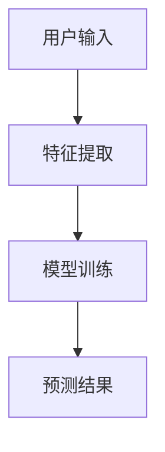

                 


# 人工智能驱动的个性化投资顾问服务

## 关键词
人工智能, 投资顾问, 自然语言处理, 个性化服务, 机器学习

## 摘要
人工智能技术在金融领域的应用正在改变传统的投资顾问服务模式。通过机器学习和自然语言处理，个性化投资顾问服务能够更精准地满足投资者的需求，提高投资效率和收益。本文将从背景、核心概念、算法原理、系统架构到项目实战，全面解析人工智能在个性化投资顾问服务中的应用。

---

# 第一部分: 人工智能驱动的个性化投资顾问服务概述

## 第1章: 问题背景与目标

### 1.1 问题背景
#### 1.1.1 传统投资顾问服务的局限性
传统的投资顾问服务依赖于人工分析和经验判断，存在效率低下、覆盖面有限、难以满足个性化需求等问题。

#### 1.1.2 人工智能技术的发展与应用
人工智能技术的快速发展为金融领域的智能化服务提供了新的可能性，尤其是在数据处理、模式识别和决策优化方面。

#### 1.1.3 个性化投资顾问服务的需求与痛点
投资者的需求多样化，对投资顾问服务的个性化、实时性和准确性要求越来越高。

### 1.2 问题描述
#### 1.2.1 投资者的多样化需求
投资者在风险承受能力、投资目标和时间跨度上存在显著差异。

#### 1.2.2 数据驱动的个性化投资决策
通过分析海量数据，AI能够为投资者提供个性化的投资建议，提高决策的科学性。

#### 1.2.3 传统投资顾问服务的标准化与效率问题
传统服务难以高效满足大规模投资者的需求，且存在信息不对称的问题。

### 1.3 问题解决
#### 1.3.1 人工智能如何赋能投资顾问服务
AI技术通过数据处理和模型训练，为投资顾问提供支持，实现个性化服务。

#### 1.3.2 数据分析与预测在个性化投资中的应用
通过机器学习模型预测市场趋势，优化投资组合，满足个性化需求。

#### 1.3.3 自然语言处理在客户交互中的作用
NLP技术帮助投资顾问更好地理解客户需求，提供更精准的服务。

### 1.4 边界与外延
#### 1.4.1 个性化投资顾问服务的边界
明确AI在投资顾问服务中的应用范围，避免越界。

#### 1.4.2 与传统投资顾问服务的区别
AI驱动的服务更加高效、精准，但需要结合人类经验。

#### 1.4.3 与自动化投资工具的区分
AI顾问服务更注重个性化和交互性，而自动化工具更注重执行效率。

### 1.5 概念结构与核心要素
#### 1.5.1 核心概念组成
包括AI技术、数据处理、个性化模型和客户交互。

#### 1.5.2 关键技术要素
机器学习、NLP、大数据分析和实时计算。

#### 1.5.3 相关概念对比
通过表格和ER图展示概念之间的关系，帮助读者理解。

---

## 第2章: 核心概念与联系

### 2.1 核心概念原理
#### 2.1.1 人工智能在投资顾问中的应用原理
AI通过数据处理和模型训练，生成个性化投资建议。

#### 2.1.2 数据驱动的个性化决策模型
基于海量数据，构建动态调整的投资模型。

#### 2.1.3 自然语言处理在客户交互中的作用
NLP技术帮助解析客户需求，提供精准服务。

### 2.2 概念属性特征对比表
| 概念       | 属性特征               |
|------------|------------------------|
| 人工智能    | 数据驱动、自适应学习   |
| 自然语言处理| 文本理解、情感分析     |
| 个性化投资 | 客户需求驱动、动态调整 |

### 2.3 ER实体关系图
```mermaid
er
    投资者
    ----> (投资)
    投资产品
    ----> (风险评估)
    人工智能模型
    ----> (数据处理)
    个性化建议
```

---

## 第3章: 算法原理讲解

### 3.1 机器学习算法
#### 3.1.1 线性回归模型

#### 3.1.2 聚类分析
```python
import numpy as n

---

# 总结

通过以上目录，我们可以看到，文章从背景、核心概念、算法原理到系统设计和项目实战，全面解析了人工智能在个性化投资顾问服务中的应用。接下来，我将按照这个目录逐步展开，撰写完整的文章内容，确保每一部分都详细且具有实际指导意义。

