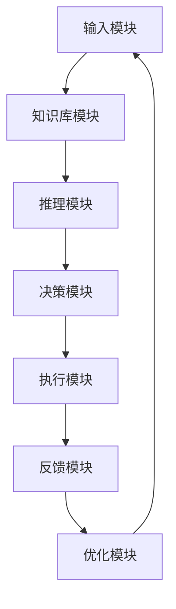

                 


# 从GPT到AI Agent：技术演进与应用变革

---

## 关键词

- GPT
- AI Agent
- 人工智能
- 技术演进
- 应用变革

---

## 摘要

从GPT到AI Agent的技术演进代表了人工智能领域的一次重大变革。GPT系列模型作为大语言模型的代表，以其强大的自然语言处理能力重新定义了人机交互的方式。而AI Agent作为一种更高级的人工智能形式，结合了大语言模型的能力与自主决策的特性，正在开启一个全新的应用时代。本文将从GPT的技术背景出发，深入探讨AI Agent的核心概念、技术原理、系统架构以及实际应用案例，分析从GPT到AI Agent的技术演进与应用变革。

---

## 第一部分：从GPT到AI Agent的技术背景

### 第1章：GPT系列模型的发展历程

#### 1.1 GPT系列模型的演进

- **1.1.1 GPT-1到GPT-4的发展历程**
  - **GPT-1**：2018年，由OpenAI发布的GPT-1是一个基于Transformer架构的开源模型，主要用于文本生成。它引入了自注意力机制，能够捕捉上下文信息，但参数量较少，性能有限。
  - **GPT-2**：2019年，GPT-2通过增加模型参数量和改进训练方法，显著提升了文本生成能力，能够生成更长、更连贯的文本。
  - **GPT-3**：2020年，GPT-3以1750亿个参数量成为当时最大的语言模型，具备了处理多种任务的能力，如文本生成、问答系统和代码生成。
  - **GPT-4**：2023年，GPT-4不仅在参数量上更进一步，还引入了多模态能力，能够处理图像和文本等多种输入形式，应用场景更加广泛。

- **1.1.2 GPT系列模型的技术特点**
  - **模型规模的不断扩大**：从GPT-1到GPT-4，模型参数量呈指数级增长，计算能力大幅提升。
  - **参数量的指数级增长**：参数量的增加使得模型能够捕捉更复杂的语言模式，提升生成能力。
  - **训练数据的多样化**：GPT系列模型的训练数据从最初的书籍文本扩展到互联网规模的数据，模型的泛化能力显著增强。
  - **模型能力的不断增强**：从最初的文本生成到多任务处理，GPT系列模型的能力逐步扩展，应用场景更加多样化。

- **1.1.3 GPT系列模型的应用领域**
  - **自然语言处理**：文本生成、问答系统、机器翻译等。
  - **对话系统**：智能客服、聊天机器人等。
  - **代码生成**：自动编写代码片段，辅助编程。
  - **内容创作**：生成文章、新闻稿等。

### 第2章：AI Agent的定义与特点

#### 2.1 AI Agent的基本概念

- **2.1.1 AI Agent的定义**
  - AI Agent是一种能够感知环境、自主决策、执行任务的智能实体，具备学习和适应能力。
  - AI Agent的核心功能包括感知、推理、决策和执行，能够与人类或其他系统进行交互。

- **2.1.2 AI Agent的特点**
  - **智能性**：AI Agent能够理解和处理复杂的信息，做出合理的决策。
  - **自适应性**：AI Agent能够根据环境变化调整自己的行为和策略。
  - **学习能力**：AI Agent通过与环境的交互，不断优化自身的知识库和决策模型。
  - **交互性**：AI Agent能够通过多种渠道与人类或其他系统进行交互，提供服务。

#### 2.2 AI Agent的分类

- **2.2.1 基于任务的AI Agent**
  - **任务驱动型AI Agent**：这类AI Agent专注于完成特定任务，如智能助手、任务调度器等。
  - **特点**：目标明确，效率高，适合处理结构化的任务。
  - **应用场景**：自动化办公、任务管理等。

- **2.2.2 基于知识的AI Agent**
  - **知识驱动型AI Agent**：这类AI Agent依赖于丰富的知识库，能够进行复杂的推理和决策。
  - **特点**：知识丰富，推理能力强，适合处理非结构化的任务。
  - **应用场景**：智能客服、医疗诊断辅助等。

### 第3章：从GPT到AI Agent的技术演进

#### 3.1 GPT系列模型的技术基础

- **3.1.1 Transformer模型的结构**
  - Transformer模型由编码器和解码器组成，编码器负责将输入序列编码为上下文向量，解码器负责根据编码结果生成输出序列。
  - 自注意力机制：通过计算输入序列中每个位置与其他位置的相关性，生成注意力权重，从而捕捉长距离依赖关系。
  - 前馈网络：每个编码器和解码器块都包含多层感知机（MLP）和跳跃连接，用于特征提取和非线性变换。

- **3.1.2 GPT系列模型的训练方法**
  - 预训练：使用大规模的文本数据进行无监督训练，目标是预测句子中的下一个词。
  - 微调：在特定任务上进行有监督微调，提升模型在特定领域的性能。

#### 3.2 AI Agent的核心技术

- **3.2.1 AI Agent的感知能力**
  - 多模态感知：AI Agent能够通过多种感官（如视觉、听觉、触觉）感知环境信息。
  - 知识图谱：构建领域知识图谱，帮助AI Agent理解和推理复杂信息。
  - 实时数据处理：AI Agent能够实时处理流数据，做出快速决策。

- **3.2.2 AI Agent的决策能力**
  - 基于强化学习的策略网络：通过强化学习训练策略网络，使得AI Agent能够在复杂环境中做出最优决策。
  - 基于知识图谱的推理模型：通过知识图谱推理，生成合理的决策方案。
  - 多目标优化：在多个目标之间进行权衡，找到最优解。

---

## 第二部分：AI Agent的核心概念与技术原理

### 第4章：AI Agent的核心概念

#### 4.1 AI Agent的感知与决策

- **4.1.1 感知层**
  - **输入处理**：AI Agent通过多种输入方式（如文本、语音、图像）感知环境信息。
  - **特征提取**：通过特征提取器将输入信息转换为模型能够处理的特征向量。
  - **状态表示**：将输入信息转换为状态表示，用于后续的推理和决策。

- **4.1.2 决策层**
  - **推理与规划**：AI Agent基于当前状态和知识库，进行推理和规划，生成可能的决策方案。
  - **决策优化**：通过优化算法（如强化学习、遗传算法）选择最优决策方案。
  - **执行反馈**：根据执行结果调整决策策略，实现自适应优化。

#### 4.2 AI Agent的知识表示

- **4.2.1 知识图谱**
  - 知识图谱是一种结构化的知识表示方式，由节点和边组成，节点代表实体或概念，边代表它们之间的关系。
  - 通过知识图谱，AI Agent能够进行推理和关联分析，提升决策的准确性。

- **4.2.2 知识库的构建与管理**
  - 知识库的构建：通过爬取、爬虫、API调用等多种方式获取知识，并进行清洗、整理和存储。
  - 知识库的管理：通过版本控制、更新机制等方法，确保知识库的准确性和及时性。

### 第5章：AI Agent的技术原理

#### 5.1 AI Agent的算法原理

- **5.1.1 基于强化学习的策略网络**
  - 策略网络通过强化学习训练，能够在复杂环境中做出最优决策。
  - 算法流程：
    1. 环境提供状态s。
    2. 策略网络根据状态s输出动作a。
    3. 执行动作a，获得奖励r和新状态s'。
    4. 根据奖励r更新策略网络的参数，以最大化期望奖励。

- **5.1.2 基于知识图谱的推理模型**
  - 推理模型通过知识图谱进行关联推理，生成合理的决策方案。
  - 算法流程：
    1. 输入查询或问题。
    2. 在知识图谱中进行路径搜索，找到相关实体和关系。
    3. 根据推理结果生成答案或决策方案。

#### 5.2 AI Agent的系统架构

- **5.2.1 系统架构设计**
  - **输入层**：接收来自外部环境的输入信息。
  - **处理层**：对输入信息进行特征提取、状态表示和知识推理。
  - **决策层**：基于推理结果生成决策方案。
  - **执行层**：将决策方案转化为具体操作，并反馈执行结果。

- **5.2.2 系统交互流程**
  - **用户输入**：用户通过自然语言或图形界面与AI Agent交互。
  - **信息处理**：AI Agent对输入信息进行解析和处理，生成相应的响应。
  - **决策与执行**：AI Agent根据处理结果做出决策，并执行相应的操作。
  - **反馈与优化**：根据执行结果优化决策策略，提升系统性能。

---

## 第三部分：AI Agent的系统架构与设计

### 第6章：AI Agent的系统架构设计

#### 6.1 系统功能设计

- **6.1.1 功能模块划分**
  - **输入模块**：接收用户输入，解析需求。
  - **知识库模块**：存储和管理AI Agent的知识库，支持快速查询和推理。
  - **推理模块**：基于知识库进行推理，生成决策方案。
  - **决策模块**：根据推理结果做出最终决策。
  - **执行模块**：将决策方案转化为具体操作，并反馈执行结果。

- **6.1.2 系统功能流程**
  - 用户输入需求。
  - 输入模块解析需求，触发知识库查询。
  - 知识库模块返回相关知识，推理模块进行推理和关联分析。
  - 决策模块根据推理结果生成决策方案。
  - 执行模块执行决策，并反馈执行结果。
  - 根据反馈结果优化决策策略，提升系统性能。

#### 6.2 系统架构图



---

## 第四部分：AI Agent的项目实战与应用案例

### 第7章：AI Agent的项目实战

#### 7.1 项目背景与需求分析

- **项目背景**：设计一个智能助手AI Agent，能够与用户进行自然语言对话，提供信息查询、任务调度等服务。
- **需求分析**：
  - 提供自然语言交互界面。
  - 具备信息查询能力，能够回答用户的问题。
  - 支持任务调度，能够根据用户需求安排任务。
  - 具备学习能力，能够通过与用户的交互优化自身的响应速度和服务质量。

#### 7.2 系统设计与实现

- **7.2.1 系统设计**
  - **输入模块**：接收用户的自然语言输入，解析需求。
  - **知识库模块**：存储常见问题答案、任务调度规则等知识。
  - **推理模块**：根据输入解析结果，查询知识库，生成响应。
  - **决策模块**：根据推理结果生成最终响应。
  - **执行模块**：将响应返回给用户，执行任务调度。

- **7.2.2 核心代码实现**
  ```python
  # 知识库模块
  class KnowledgeBase:
      def __init__(self):
          self.knowledge = {}

      def add_knowledge(self, key, value):
          self.knowledge[key] = value

      def get_knowledge(self, key):
          return self.knowledge.get(key, None)

  # 推理模块
  class ReasoningModule:
      def __init__(self, knowledge_base):
          self.knowledge_base = knowledge_base

      def infer(self, input):
          key = self.extract_key(input)
          return self.knowledge_base.get_knowledge(key)

      def extract_key(self, input):
          # 简单的关键词提取方法
          return input.split()[0].lower()

  # 决策模块
  class DecisionModule:
      def decide(self, inference_result):
          if inference_result:
              return "Answer: " + inference_result
          else:
              return "I'm sorry, I don't know the answer."
  ```

#### 7.3 应用案例分析

- **案例1：信息查询**
  - 用户输入：“今天北京的天气如何？”
  - AI Agent解析需求，查询天气知识库，返回天气信息。
- **案例2：任务调度**
  - 用户输入：“帮我安排明天的会议。”
  - AI Agent解析需求，查询日历知识库，安排会议。

---

## 第五部分：AI Agent的未来展望与挑战

### 第8章：AI Agent的未来发展趋势

#### 8.1 未来发展趋势

- **多模态AI Agent**：结合视觉、听觉等多种感知方式，提升AI Agent的感知能力。
- **增强学习能力**：通过强化学习和自监督学习，提升AI Agent的自适应能力和决策能力。
- **人机协作**：AI Agent与人类协同工作，提升工作效率和生活质量。
- **边缘计算与实时性**：AI Agent在边缘计算环境下运行，提升实时性和响应速度。

#### 8.2 技术挑战

- **计算资源限制**：AI Agent的运行需要大量计算资源，如何在资源受限的环境下运行是未来的一个重要挑战。
- **知识更新与维护**：知识库的更新和维护需要高效的方法和机制。
- **安全与伦理问题**：AI Agent的安全性、隐私保护和伦理问题需要得到重视和解决。
- **多语言与跨文化适应**：AI Agent需要具备多语言处理能力和跨文化适应能力，以满足全球用户的需求。

---

## 结语

从GPT到AI Agent的技术演进，不仅代表了人工智能技术的进步，也预示着人工智能应用的新时代。AI Agent作为更高级的人工智能形式，结合了大语言模型的能力与自主决策的特性，正在推动人工智能技术向更广泛的应用领域发展。未来，随着技术的不断进步，AI Agent将在更多领域发挥重要作用，为人类社会带来更多的便利和可能性。

---

## 作者

作者：AI天才研究院/AI Genius Institute & 禅与计算机程序设计艺术 /Zen And The Art of Computer Programming

